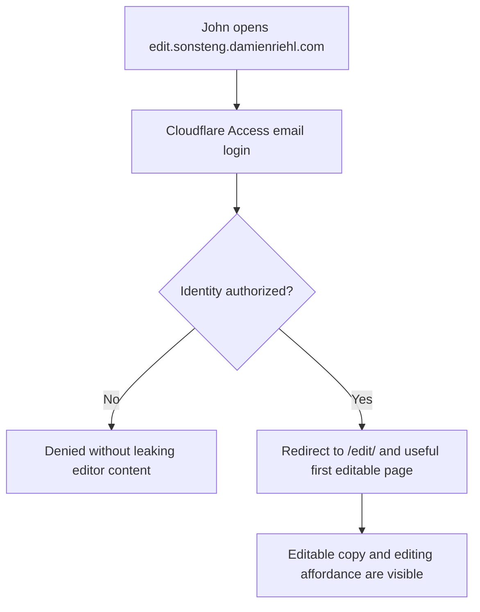
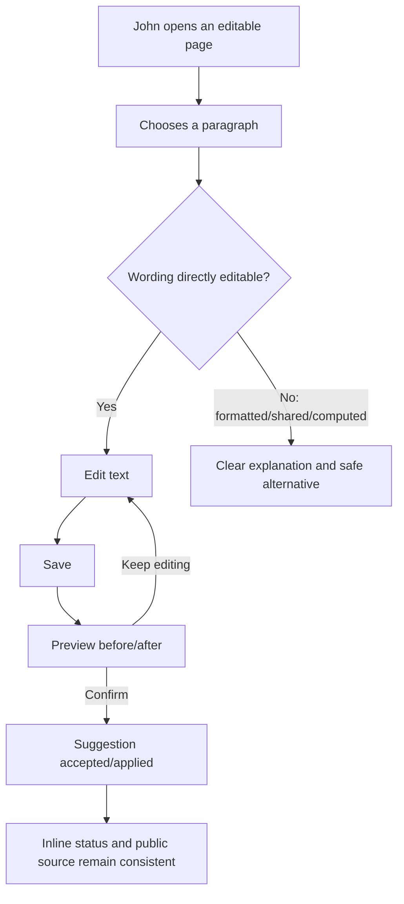
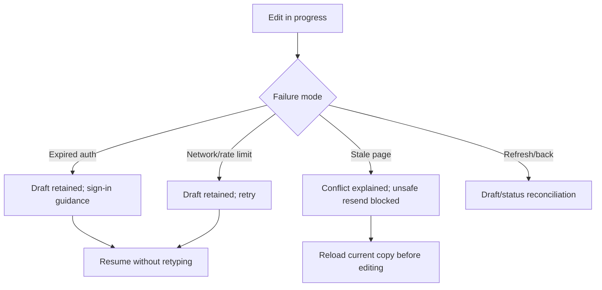
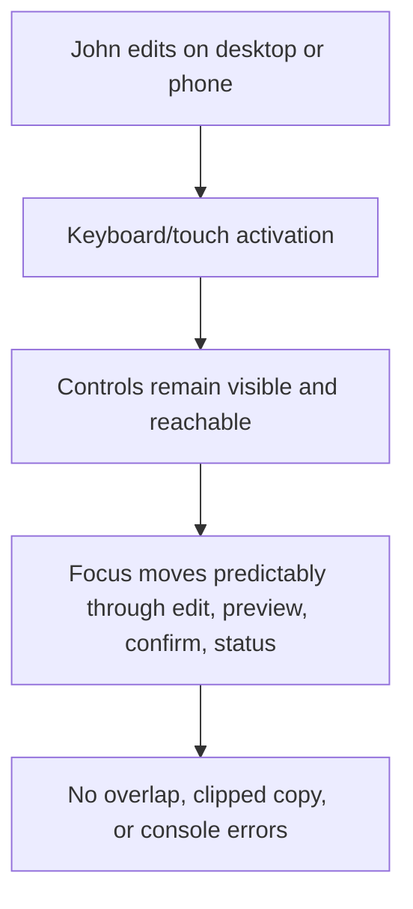

# Dogfood Report — fix/editor-uat

> Production-oriented browser UAT of John Sonsteng's editing journey, based on `main` at `a869c61`. Generated by `ce-dogfood` on 2026-08-07.

## Diff Summary

- This branch begins at the production release; the UAT scope is the existing `/edit` experience rather than a pre-existing branch diff.
- Primary focus: John entering the editor, identifying editable copy, editing and saving wording, understanding propagation/status, and recovering from failures.
- Adjacent production surfaces are included where they are the source pages the editor proxies: homepage, matter library, matter pages, modules, templates, and skills.

## Personas

- **John Sonsteng, author/editor** — wants to correct teaching copy directly, without needing to understand source files, Git, generated text, or deployment mechanics. Inferred from the Aug. 6 meeting outcomes and editor attribution model.
- **Damien Riehl, publisher/administrator** — needs edits to preserve source truth, permissions, auditability, and safe production promotion.
- **Learner/faculty visitor** — needs the public material to remain readable, accurate, downloadable, and free of editor-only content.

## Flows Tested

## Test Matrix & Results

| # | Flow | Journey / Scenario | Status | Issue | Fix | Commit |
|---|------|--------------------|--------|-------|-----|--------|
| 1 | Entry | Anonymous production Worker entry gives a useful recovery path | Pass | | | |
| 2 | Entry | Custom editor door reaches Cloudflare Access and preserves destination | Pass | | | |
| 3 | Entry | Authorized email/OTP completes and lands on the correct editable page | Blocked (human verify) | A clean browser reached the correct Access form; completing John's email-code login requires his identity. | None—this is identity verification, not a product defect. | |
| 4 | Edit | Editable copy and Edit affordance are discoverable on first landing | Pass | | | |
| 5 | Edit | Plain paragraph edit → Save → preview → confirm → status | Pass | | | |
| 6 | Edit | Keep editing from preview preserves the draft and focus | Pass | | | |
| 7 | Edit | Cancel restores original copy without a mutation | Fixed | Cancel flattened inline formatting. | Restore the captured original DOM safely. | `6048ae5` |
| 8 | Constraints | Formatted and scalar authored copy remains editable; genuine computed copy explains the boundary | Pass | | | |
| 9 | Constraints | Computed/read-only material cannot be accidentally edited | Pass | | | |
| 10 | Propagation | Shared copy communicates where a change will appear | Pass | | | |
| 11 | Recovery | Expired auth preserves draft and stable request identity | Pass | | | |
| 12 | Recovery | Network failure and rate limit preserve retryable work | Pass | | | |
| 13 | Recovery | Stale page fails closed with actionable recovery | Fixed | Rejected wording remained visible and looked saved. | Restore the last authoritative baseline, including formatting. | `6048ae5` |
| 14 | Re-entry | Refresh/back reconciles draft and server status without duplicate mutation | Fixed | A valid unsent draft survived in storage but was not restored visibly; a closed tab lost the session copy; older pending history could overwrite the restored-draft warning. | Rehydrate valid drafts, fall back to the durable local mirror with the same idempotency ID, and keep the unsent warning authoritative over older pending history. | `6048ae5`, `7cf97ab` |
| 15 | Responsive | Desktop, 390px phone, large type, keyboard focus, and contrast remain usable | Fixed | Pending status contrast, one action target, and editor type-size preference integration failed the expanded audit. | Corrected tokens/target sizing, unified the preference key, and added the editor to the audit matrix. | `5706ae5` |
| 16 | Public | Homepage, catalog, print-all, filters/history, and representative content are sound | Pass | | | |
| 17 | Security | Editor-only markers, instructor content, and auth details do not leak publicly | Pass | | | |

## What Was Fixed

- Restored unsent drafts visibly after refresh or tab loss, retaining the same idempotency ID.
- Kept the restored-draft warning authoritative when an older server-side suggestion also exists.
- Reverted stale-page rejections to the last authoritative copy instead of leaving rejected wording on screen.
- Preserved inline markup when an edit is cancelled or rejected.
- Corrected review-mode copy so it says changes go to Damien, not directly live.
- Fixed editor contrast, minimum target sizing, and the shared large-type preference.
- Added the real editor harness to the repository accessibility gate.
- Updated John's guide to describe the actual Edit, autosave, Done, draft-recovery, and DEV-versus-production behavior.

## Paper Cuts (by persona)

- **John:** the guide referred to a nonexistent “Save my change” action and blurred the editing site with public production; fixed.
- **John:** skill taxonomy names remain read-only while their task names and descriptions are editable; decision recorded separately.
- **Damien:** the authoring door and direct-apply daemon intentionally stop short of public production; publishing cadence remains a product choice.
- **Harness only:** compact diagnostic controls remain below the project's aspirational 44px AAA target, but meet the 24px WCAG 2.5.8 minimum. Product editing actions retain larger targets.

## Console Errors

None observed on the production public pages or editor harness during the UAT journeys.

## Human Verifications

- John's real email/OTP authentication and a durable production edit are pending unless an already-authorized browser session is available. No credential or token file will be read for UAT.

## Decisions for a Human

See `docs/decisions/2026-08-07-editor-uat-decision-sheet.md`:

1. Whether skill taxonomy names should stay canonical/read-only or gain separate editable display labels.
2. Whether public production publishing should remain a distinct release step or move to an automated cadence.

## Learnings

- Live browser gates again found defects that source-level and unit assertions missed: invisible draft recovery, stale rejected wording, and contrast/target failures.
- A draft record is not recovery unless the user can see and resume it.
- Rollback state must advance whenever the accepted editing baseline advances; keeping only the first-render HTML creates a stale rollback.
- Editor accessibility belongs in the standing audit corpus, not a one-off manual check.

## Final Status

**Ready after one human verification:** all automatable journeys pass and all discovered mechanical defects are fixed. The only blocked scenario is John's real email/OTP login, which correctly requires his identity. Verification evidence: editor harness 86/86; Python 458 tests plus 18,993 subtests; Worker 362/362; accessibility 0 failures across 22 cases; responsive corpus 282/282; interview/critique 28/28; catalog, print, leak, and rail gates pass.
