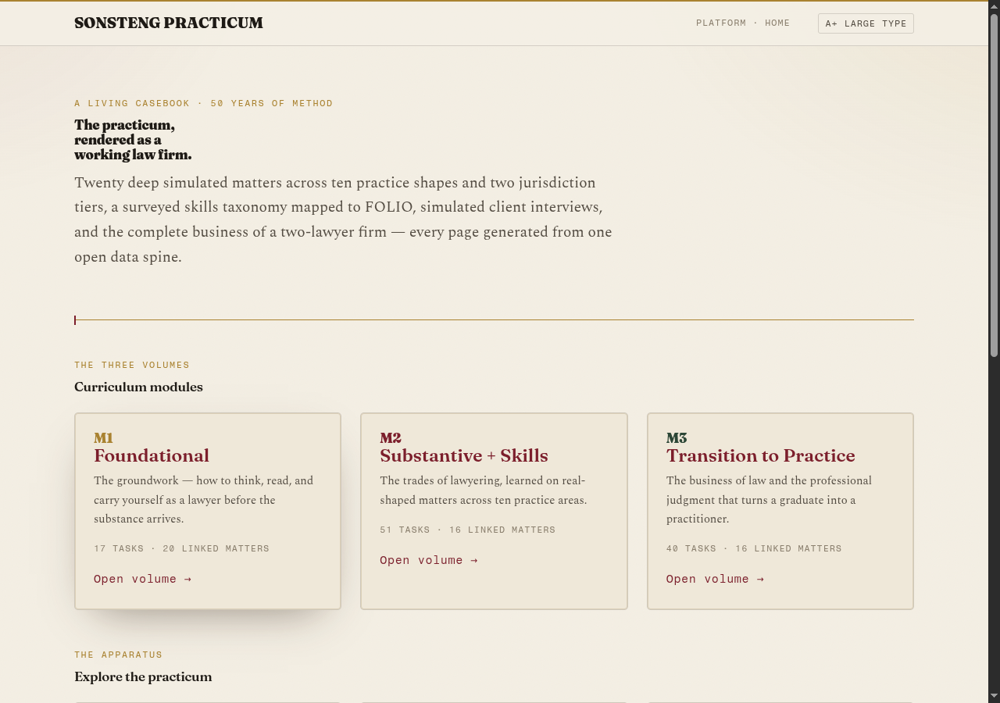
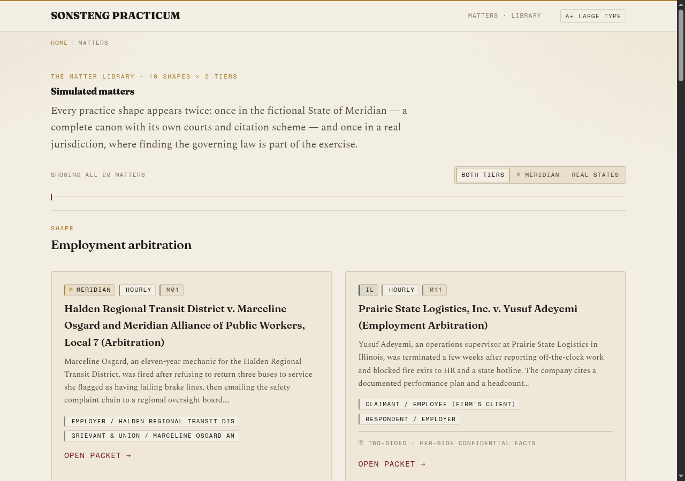
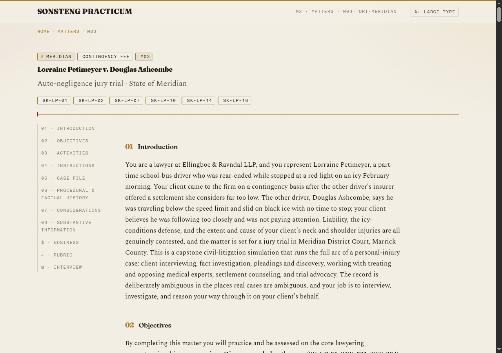
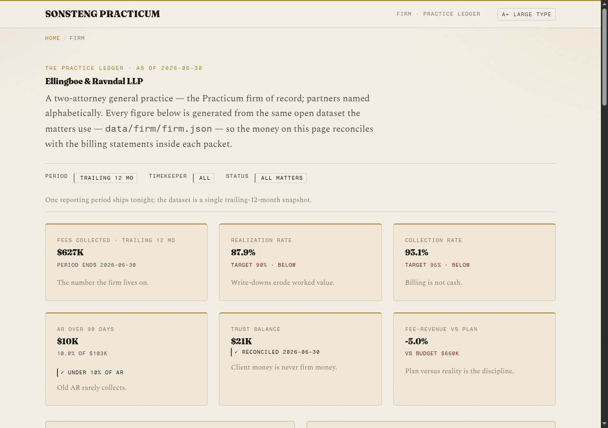
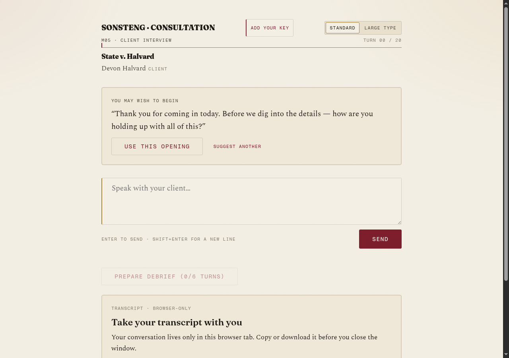

# Evidence Pack — EP-2026-07-17 — Curriculum Build-Out Ship

**Branch:** `feat/curriculum-buildout` · **Plan:** `docs/plans/2026-07-17-001-feat-curriculum-buildout-plan.md` · **Live:** [DEV platform](https://sonsteng-dev.damienriehl.com/platform/) · **API:** https://sonsteng-chat.damienriehl.workers.dev

## What shipped

- **Data spine:** 10 JSON Schemas + spine manifest; taxonomy (26 surveyed skills + 5 AI-era extensions, 108 tasks / 232 subtasks, FOLIO crosswalk live-verified: 6 exact / 89 near / 10 parent / 34 honest no-equivalent); State of Meridian canon + 6 real-state files; **20 deep matters** (407 files, ~2.6MB: anchored facts, ≥3 witness statements + ≥5 case-file docs each, 56 personas with 5-tier disclosure rules + 475 curated leak-safe topic labels, point-exact rubrics, full business layers); Ellingboe & Ravndal LLP firm dataset (funnel/utilization/AR/trust all internally exact and matter-reconciled).
- **Validator:** `tools/validate_spine.py` — 29 checks; final full-spine run: **PASS, 0 ERROR** (7 documented-benign WARNs: cleared manual defamation reviews, caption false-positives, closed-matter AR tail).
- **Worker:** live at workers.dev — server-side persona injection, HMAC sessions, turn caps + turn_id dedupe in a SQLite Durable Object, mint throttling, CORS-on-every-response, **provider-agnostic BYOK** (Anthropic/Gemini/OpenAI adapters; keys never stored/logged — source-scan-tested), hosted pool dormant (no key set; typed `no_hosted_key`). **56/56 unit tests** incl. golden-file byte-identity of the persona prompt (≥4096-token cacheable prefix).
- **Chat + critique UI:** race-proofed state machine (double-submit, retry-idempotency, bfcache, storage-fallback all mock-verified), BYOK key drawer, two-axis debrief view, galley critique view.
- **Platform site:** 30 generated pages + catalog `data/index.json`; link-check clean; instructor-leak sweep clean; all pages ≤136KB.

## Verification runs

| Gate | Result |
|---|---|
| Full-spine validator | PASS — 0 ERROR / 7 benign WARN (20 matters + 4 modules) |
| Per-matter self-gates (fleet) | 20/20 green, both lenient + strict |
| Worker unit tests | 56/56 (incl. golden-file, DO logic vs real SQLite, key-logging source scan) |
| Wrangler dry-run + live deploy | Clean — 114KB gzip; deployed `sonsteng-chat` |
| Live API smoke | `/v1/session` mints ✓ · no key → `no_hosted_key` ✓ · fake BYOK → provider 401 surfaced as `validation_error` ✓ |
| Site link/leak check | 30 pages, all internal links resolve, zero external requests, zero instructor content |
| UI race harness (mock) | Double-submit blocked · retry same-turn_id · cap/turn banners · no_hosted_key auto-drawer — all pass |
| DEV deploy | All routes 200 (pitch, platform, matters, skills, firm, chat, catalog) |

## Screenshots (live DEV, 2026-07-17)

| | |
|---|---|
|  |  |
|  |  |
|  | |

## Deferred (pending an API key — one command each)

- **Live red-team gate (D3/D4):** `WORKER_URL=… PROVIDER=… API_KEY=… node app/worker/test/redteam.mjs` — concealed-leak, fact-fidelity + verification-pressure, sycophancy, debrief-oracle probes.
- **Live E2E rehearsal (D7):** the literal John & Roger walkthrough with a real model behind the persona.
- **Hosted demo pool:** `wrangler secret put ANTHROPIC_API_KEY` whenever a house key is wanted ($10/day cap already enforced server-side).
- Demo bypass token: generated + stored at `~/.secrets/sonsteng-demo-bypass` (never committed).
