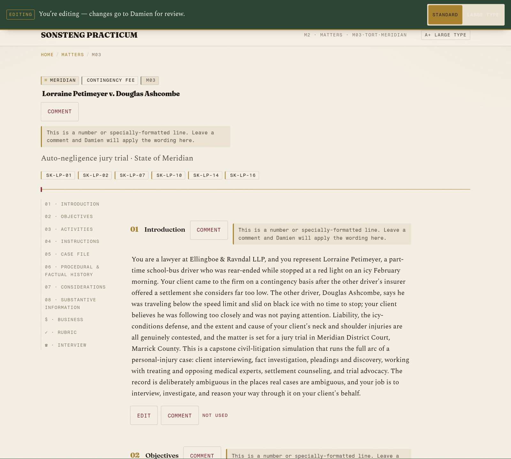
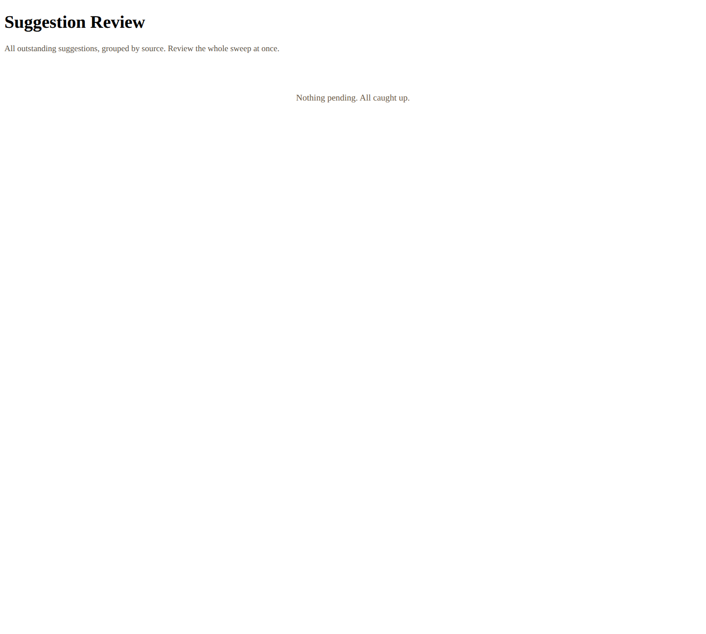

# Evidence Pack — EP-2026-07-18 — Editor Experience Ship

**Branch:** `feat/editor-experience` (unmerged) · **Plan:** `docs/plans/2026-07-18-001-feat-editor-experience-plan.md` · **Live:** DEV only — [proxy-injector](https://sonsteng-chat.damienriehl.workers.dev) · **Scope:** DEV editor; PROD injector wiring deferred.

## What shipped

- **Worker-injected `/edit` proxy editor:** the Worker fetches the real static page from the DEV origin and injects editor CSS/JS, per-page block anchors, and John's pending items at serve time. Students' origins are untouched — zero editor bytes and zero source-path leakage in the public build.
- **Two-scope tokens, one bookmark:** `edit` scope (prose suggestions) and `instructor` scope (back-of-house) are distinct server-side scope records under one opaque token; instructor routes enforce the stricter gate (tighter limits, independent rotation, uniform-404). A leaked edit capability alone cannot dump answer keys.
- **EditorStore Durable Object (SQLite):** second DO class, `migrations` v2 append (v1 chat DO never renamed/removed). Suggestions `{id, editor, kind, source_ref, json_path?, page, original_hash, new_text|comment, context, status, timestamps, decision_note}`; statuses `pending / superseded / accepted / accepted_blocked / declined / drift / needs_human / applied`.
- **Suggest / review / decide endpoints** under `/edit/v1/*` (cookie `Path=/edit` reaches them): 16KB size cap with graceful 413, per-token rate limit + pending ceiling, `timingSafeEqual` token checks, CORS on every response, text-node-only rendering of every echoed suggestion.
- **Apply engine** (`tools/apply_suggestions.py`): git-worktree transaction (canonical tree never dirty mid-apply; rollback = discard worktree), exact-match → context-anchor → JSON-path write, **value-sync** proposer (companion edits for money/date/party tokens), full `validate_spine.py` **parity gate** (RED → `accepted_blocked` + rollback, never ships), `build_site.py --check`, worker-bundle rebuild, deploy, then `applied`. `in_flight` lease + `apply_batches` phase journal + startup reconciliation give crash recovery with no limbo states.
- **AI-rewrite queue:** accepting a conceptual comment spawns a human-gated, never-editor-triggerable agent rewrite that lands as a new `pending` suggestion attributed "AI (from JOS comment)" — same accept gate, same text-node rendering. No API key required.
- **Instructor view:** `/edit/instructor/<matter>/<doc>` serves pre-rendered instructor HTML from a server-only `instructor-bundle.generated.json` — never in the persona/chat bundle, never in the static build. Public leak-sweep guarantee unchanged.
- **Review page:** token-gated `/edit/review` — grouped by `source_ref` (accepting one sibling auto-declines the rest), word-level diffs, drift re-anchor/decline/ask-John actions, bulk accept, plain-language throughout. This page IS the cumulative digest.
- **Editor client** (`app/editor/editor.js`, served only by the injector) with the proven race rules: blur = draft-only (draft/commit/discard, one event each); Comment captures the stored Range on mouseup with `mousedown`-`preventDefault`, tremor-debounced to last stable selection; `suggestion_id` minted once per edit-session, Save disabled synchronously pre-await; same-origin links rewritten into `/edit/` space with capture-phase interception + a banner on every page; 401-on-save preserves draft + id through friendly re-auth; drafts keyed to `(source_ref, original_hash)`, discarded gently on hash drift, purged on applied; origin-page handlers neutralized in edit regions; per-tab active buffer (sessionStorage), localStorage recovery-only, `visibilitychange`/`pageshow` re-poll.

## Verification runs

| Gate | Result |
|---|---|
| Worker unit tests | **119/119** (auth, injector, editor-map, norm-parity, store, system-suggest, security) |
| Apply-engine tests | **14/14** (`tools/tests/test_apply_suggestions.py` — worktree isolation, drift/formatting gates, value-sync, parity gate, crash recovery; canonical tree untouched on every failure path) |
| Editor-client assertions | **22/22** (`app/editor/verify-editor.js`) |
| Validator / `--check` / leak-sweep | Green — extended leak-sweep proves instructor-bundle content never appears in static output or persona bundle |
| Chat / critique | Untouched — prior 62/62 suite unaffected |

## Live browser UAT — assertion table (DEV, 2026-07-18)

| Assertion | Result |
|---|---|
| Styled packet loads editable under `/edit` | PASS |
| Editable blocks present | PASS — **64 editable blocks** anchored |
| Edit + comment both post to the DO | PASS |
| Instructor view renders back-of-house | PASS |
| Content-Security-Policy errors | **0 CSP errors** |

## Screenshots (live DEV, refreshed 2026-07-18 during the WP9 walkthrough rehearsal)

Captured headful against the live Worker injector (John token for the edit page, admin token for review; tokens never appear in-frame). Shots live in [`EP-2026-07-18-walkthrough/`](EP-2026-07-18-walkthrough/).

| | |
|---|---|
|  |  |

The review page renders **JOS** (John) / **RSH** (Roger) attribution on live suggestions; the queue is empty in this shot (expected pre-editing), so attribution is proven by the `editor-roger.test.js` unit test rather than a live row.

## End-to-end apply proof (A/B/C/D)

- **A** — suggest: John's edit + comment round-trip into the EditorStore DO.
- **B** — review: `/edit/review` groups by `source_ref`, word-diffs, Accept.
- **C** — apply: worktree transaction patches the source, value-sync proposes companions, full validator PASS, build `--check` green, **deploy DEV then revert — canonical byte-identical** (the deploy batch `d1f36a5` and its revert `c7abfab` net to an empty diff over `data/` + `site/platform/`; confirmed).
- **D** — status closure: suggestion moves to `applied`; inline status shows in edit mode.

## Five integration bugs live UAT caught that unit tests missed

These are the value of integration UAT — every one passed the unit suite and only surfaced against real browsers + real Cloudflare:

1. **Dual-scope routing to the wrong map** — a dual-scope editor's suggest was routed to the instructor index instead of the map that actually holds the `source_ref`. Fixed by resolving suggest scope by which granted map contains the ref (`3c60514`).
2. **Cloudflare 1010 UA ban on the apply engine** — Cloudflare banned the default `python-urllib` User-Agent; the apply-engine HTTP client now sends a normal UA (`173462a`).
3. **Bearer service-auth path + cookie-shadows-Bearer** — the apply engine's admin RPCs needed CSRF-safe `Authorization: Bearer` service auth (`8442ad0`); a stale/absent cookie was shadowing the Bearer path, so `resolveAuth` now falls through to Bearer on absent-OR-invalid cookie and the client drops the shadowing raw-cookie header (`18a98b9`).
4. **`SameSite=Strict` broke the bookmark → redirect flow** — John's `?t=` → cookie-exchange 302 dropped auth in real browsers under Strict; relaxed to `Lax` (mutation CSRF still guarded by the custom header + Origin/Sec-Fetch checks) (`8037d2f`).
5. **CSP / asset seam vs wrapped pages** — wrapped student pages failed to render+edit under the injector until the CSP/asset seam was fixed (`a8a3ff8`).
- **Bonus (companion-id ceiling):** value-sync had never actually landed because the companion id exceeded the Worker uuid ceiling; bounding it to the ceiling made value-sync work (`84f235f`).

## Security posture

- **Map as the universal allowlist** — `editor-map.generated.json` validates the proxy path, every `source_ref`, and every `json_path` server-side at **both suggest and apply time**, closing SSRF, arbitrary-file-write, and anchor forgery in one invariant.
- **Escaped JSON islands** — pending items injected as an escaped JSON island, never interpolated into HTML.
- **Text-node rendering** — every echoed suggestion (review page, inline pending, AI-rewrite echoes, decline notes, diffs) rendered as text nodes only.
- **SSRF guard** — clean upstream subrequests: no cookie forwarding, upstream `Set-Cookie` stripped, `redirect: manual`.
- **Uniform-404 instructor routes** — constant-time + uniform-404 so instructor route existence can't be probed; independent rotation.
- **No secret in logs** — tokens scrubbed from all logs (mirrors the `?bypass=` pattern).
- **Retention / PII** — retention purge, PII warning in John's guide, global caps, admin-only digest.

## Deferred

- **PROD wiring of the injector** — DEV only for now; PROD needs only pointing `EDIT_UPSTREAM` at Pages.
- **Roger as a second editor** — token model ready; one more scope mapping.
- **Automated digest push** — the review page is the digest today; automated push only if a sweep is ever missed.
- **Value-sync formatting-preserving serializer** — v1 value-sync is exact-literal structurally-scoped; the formatting-preserving span-splice serializer is a labeled fast-follow.

## Handing John his link

The tokens live in `~/.secrets/sonsteng-editor-tokens` (never printed, never committed). Load them into the shell, then build John's URL:

```
set -a; source ~/.secrets/sonsteng-editor-tokens; set +a
```

- **John's edit link:** `https://sonsteng-chat.damienriehl.workers.dev/edit/<page-path>/?t=$EDIT_TOKEN_JOHN`
- **Admin review page:** `https://sonsteng-chat.damienriehl.workers.dev/edit/review?t=$EDIT_TOKEN_ADMIN`

Send John the fully-resolved edit URL and tell him to bookmark it. The live editor queue is expected **empty** — no pending suggestions until John (or Roger) starts editing.

## Corpus cleanliness

`data/` and `site/platform/` carry no committed test content: the only branch-range changes to those trees are the P1 generator's `<meta name="spine-build">` parity stamps, and the C-step deploy batch was reverted byte-identical (net-zero diff). Working tree is clean.
