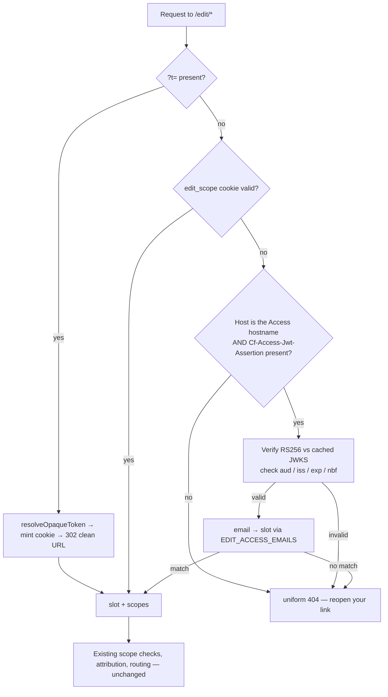

# feat: Cloudflare Access door for the practicum editor

**Target repo:** sonsteng-magnum-opus

---

## Goal Capsule

Give John, Roger and Damien a short, memorable address — `edit.sonsteng.damienriehl.com` —
that signs them in through Cloudflare Access instead of carrying a secret in the URL, and put
a tokenless admin page behind it. The existing `?t=` links keep working throughout; retiring
them is a later decision, not a consequence of this one.

---

## Problem Frame

The editor lives on a `workers.dev` hostname. Cloudflare Access can only gate hostnames in a
zone you control, so the Worker authenticates people itself: a long opaque token in the URL is
exchanged for an HttpOnly cookie and stripped from the address bar.

Three defects Damien hit on 2026-07-27 all trace to that one design choice:

1. **The links are unusable as links.** ~90 characters of base64, impossible to read aloud or
   retype, and alarming to a non-technical recipient.
2. **The address bar lies after arrival.** The `?t=` is stripped by design, so a bookmark taken
   at the natural moment — once the page is open — silently lacks the credential. It works
   until the 14-day cookie lapses, then fails permanently.
3. **A lapsed cookie was a dead end.** Now softened to a "reopen your editing link" page, but
   the recovery still depends on the person having kept the original message.

There is no admin surface reachable without pasting an admin token into a URL.

**Why now:** the walkthrough moved to the week of Aug 3, so this can land before John and Roger
ever see a token URL — they would only ever learn the good door.

---

## Product Contract

### Requirements

- **R1.** A person on the allowlist can reach the editor by typing/bookmarking
  `edit.sonsteng.damienriehl.com` with no secret in the URL.
- **R2.** Signing in uses Cloudflare Access one-time PIN by email — no account creation, any
  address on the policy — with a 30-day session, matching the Cockpit's posture.
- **R3.** A verified Access identity resolves to the same editor slot the token model already
  uses, so attribution (JOS / RSH / DR) and every scope grant are unchanged.
- **R4.** Existing `?t=` links keep working unchanged for the life of this plan. Both doors are
  live; neither is disabled as a side effect.
- **R5.** An admin landing page at the new hostname presents the review queue, revert requests,
  the history index and editorial flags, reachable with no token anywhere.
- **R6.** The uniform-404 no-oracle property survives: an unknown path, a known path without
  scope, and a hostile path remain byte-identical responses.
- **R7.** PROD (`sonsteng.damienriehl.com`) is untouched and stays pitch-only.

### Key Decisions

- **KD1. All three people get Access; the token links stay as a fallback.**
  *(session-settled: user-directed — chosen over "Damien only, others keep bookmarks" and
  "everyone on Access, tokens retired": Damien asked whether all three could have Access with
  bookmarks retained as fallbacks, which is exactly the both-doors option.)*
  Governs R1, R3, R4.
  **Carried caveat:** retaining the links retains the forwarded-link risk. Any token rotates in
  seconds, and retirement becomes a cheap decision once John has signed in through Access once.
- **KD2. Hostname is `edit.sonsteng.damienriehl.com`.**
  *(session-settled: user-directed — chosen over `sonsteng-admin.…` and `admin.sonsteng.…`:
  it names the thing the reviewers do, and the admin page is simply its front page.)*
  Governs R1, R5.
- **KD3. Login method is one-time PIN by email.**
  *(session-settled: user-directed — chosen over Google sign-in and offering both: no account
  required, works with whatever address John and Roger already read.)* Governs R2.
- **KD4. The admin page ships in this build, not as a follow-on.**
  *(session-settled: user-directed.)* Governs R5.

### Scope Boundaries

**In scope:** the new hostname and Worker route, the Access application and policy, JWT
verification in the Worker, email→slot mapping, the admin landing page, and the docs that tell
John what to do.

**Deferred to follow-up work:**
- Retiring the `?t=` tokens (a decision, once Access is proven in John's hands).
- Applying the same door to PROD, which stays pitch-only until Damien flips it.
- Service-token access for the apply daemon — it authenticates with its own admin token today
  and is unaffected.

**Outside this product's identity:** self-service account creation, roles beyond the existing
slot model, and any change to how edits are applied, reverted or attributed.

---

## Planning Contract

### Assumptions

- **A1.** The `damienriehl.com` zone is on the same Cloudflare account as the Worker, so a
  custom domain can be attached without a zone transfer. *(Verify in U1 before proceeding.)*
- **A2.** Damien's Access team `young-unit-68fd` can host a second application; the Cockpit's
  existing app is not disturbed.
- **A3.** John's and Roger's email addresses are known to Damien at build time. The policy needs
  them; nothing else does.

### Key Technical Decisions

- **KTD1. Verify the Access JWT with WebCrypto, not a library.** Cloudflare's own examples use
  `jose`, but the Worker already does HMAC via `crypto.subtle` and adding an npm dependency to
  this project requires Damien's sign-off. RS256 verification against a JWKS is ~60 lines with
  `crypto.subtle.importKey('jwk', …)` + `verify`. Rationale: no new dependency, no supply-chain
  surface on the auth path, and the existing constant-time/crypto idioms carry over.
- **KTD2. Access identity is a SECOND identity source inside `resolveAuth`, not a replacement.**
  The function already resolves a cookie to `{slot, scopes}`. Access adds one more way to
  arrive at a slot; everything downstream — scope checks, attribution, the store — is untouched.
  This is what makes R4 true by construction rather than by discipline. Governs R3, R4.
- **KTD3. Trust the `Cf-Access-Jwt-Assertion` header only, and only when the request arrived on
  the Access-gated hostname.** The `workers.dev` origin is reachable directly and can carry a
  forged header, so header presence alone must never grant access. Bind verification to the
  expected hostname and the app's AUD tag. Governs R1, R6.
- **KTD4. Cache the JWKS in memory with a TTL and re-fetch on unknown `kid`.** Access rotates
  signing keys roughly every 6 weeks; a fetch per request is both slow and a failure mode.
- **KTD5. The admin page is a route on the new hostname gated by `admin` scope, reusing the
  existing review/history renderers.** It is a composition of surfaces that already exist, not
  a new information architecture.
- **KTD6. `EDIT_ORIGIN` must become the new hostname** wherever the browser will be served from.
  It is the SOLE `/edit` CORS allowlist — if it does not equal the browser's origin, every
  `/edit/v1/*` XHR fails and the editor looks broken while every page still loads. This is the
  single most likely way to break this build.

---

## High-Level Technical Design

Identity resolution after this change — one new branch, everything else unchanged:

The token path (B→C) and cookie path (D) are byte-for-byte what they are today. The new branch
is E→G→H, and it terminates in the same `{slot, scopes}` shape, which is why nothing downstream
needs to know Access exists.

---

## Implementation Units

### U1. Attach the hostname to the Worker

- **Goal:** `edit.sonsteng.damienriehl.com` resolves to the Worker.
- **Requirements:** R1
- **Dependencies:** none
- **Files:** `app/worker/wrangler.jsonc`
- **Approach:**
  1. Confirm A1 — the zone and the Worker are on one account (`wrangler whoami`, zone list).
  2. Add a `routes` entry with `custom_domain: true` for the new hostname on the default env.
  3. Deploy; Cloudflare provisions the DNS record and certificate.
- **Patterns to follow:** the `env.production` block already documents the intended route shape.
- **Test scenarios:**
  - The hostname serves the Worker (any `/edit/*` path returns the uniform 404, not an nginx or
    Cloudflare error page) before Access is attached.
  - `sonsteng-chat.damienriehl.workers.dev` still serves identically — the route is additive.
  - TLS resolves with a valid certificate.
- **Verification:** both origins answer; no change in behaviour on the old one.

### U2. Create the Access application and policy

- **Goal:** the new hostname is gated; the three known addresses can sign in by one-time PIN.
- **Requirements:** R1, R2
- **Dependencies:** U1
- **Files:** none in-repo (Cloudflare account state) — record the AUD tag in
  `docs/prod-enable.md` alongside the existing runbook material.
- **Approach:**
  1. Create an Access application for the hostname on team `young-unit-68fd`.
  2. Policy: allow the three email addresses; include one-time PIN as an identity method.
  3. Session duration 30 days, matching the Cockpit.
  4. Capture the application's **AUD tag** — U3 needs it as the expected `aud`.
  - Cloudflare shipped a one-click "Access for Workers" flow in Oct 2025; if it is available on
    this account it may create the application directly from the Worker. Prefer it if present,
    but the AUD tag is still required.
- **Execution note:** this is credentialed account work. Do it before writing U3 so the AUD tag
  is a known value rather than a placeholder.
- **Test scenarios:**
  - An un-authenticated request to the hostname redirects to the Access login screen.
  - An allowed address receives a PIN and lands on the app.
  - A non-allowed address is refused.
  - The Cockpit application still gates `dashboard.damienriehl.com` unchanged.
- **Verification:** the login screen appears; one real sign-in completes.

### U3. Verify the Access JWT in the Worker

- **Goal:** the Worker can prove a request carries a genuine, current Access identity.
- **Requirements:** R1, R6
- **Dependencies:** U2 (needs the AUD tag)
- **Files:** `app/worker/src/access-jwt.js` (new),
  `app/worker/test/access-jwt.test.js` (new)
- **Approach:**
  1. Read `Cf-Access-Jwt-Assertion`; absent → null, never an error that distinguishes cases.
  2. Parse the JWS header for `kid`; fetch JWKS from
     `https://<team>.cloudflareaccess.com/cdn-cgi/access/certs` with an in-memory cache
     (TTL plus force-refresh on unknown `kid`, per KTD4).
  3. Verify RS256 via `crypto.subtle.importKey('jwk', …)` and `crypto.subtle.verify`.
  4. Check `aud` contains the app's AUD tag, `iss` equals the team domain, and `exp`/`nbf`
     against now with a small skew allowance.
  5. Return `{ email }` on success, `null` on every failure — no partial trust, no error detail
     that could distinguish "bad signature" from "wrong audience".
- **Patterns to follow:** `editor-auth.js` for the crypto idiom and the never-log-the-credential
  discipline; its `constantTimeEqualStr` for any string comparison on secret-adjacent values.
- **Test scenarios:**
  - A token signed by the expected key with correct `aud`/`iss`/`exp` verifies and yields the email.
  - A token with a valid signature but the wrong `aud` is rejected.
  - A token with the wrong `iss` is rejected.
  - An expired token is rejected; a not-yet-valid (`nbf` in future) token is rejected.
  - A token whose signature does not match the key is rejected.
  - A token with an unknown `kid` triggers exactly one JWKS re-fetch, then rejects if still unknown.
  - A malformed/garbage header value is rejected without throwing.
  - The JWKS cache is reused within the TTL (one fetch across several verifications).
- **Verification:** unit tests cover every rejection path; no code path returns an identity on
  a failed check.

### U4. Resolve an Access identity to an editor slot

- **Goal:** a verified email becomes the same `{slot, scopes}` the token path produces.
- **Requirements:** R3, R4, R6
- **Dependencies:** U3
- **Files:** `app/worker/src/editor-auth.js`, `app/worker/wrangler.jsonc`,
  `app/worker/test/editor-auth.test.js`
- **Approach:**
  1. New var `EDIT_ACCESS_EMAILS` — JSON mapping lowercased email → slot name. It is *not* a
     secret (addresses, not credentials) so it lives in `wrangler.jsonc` beside
     `EDIT_TOKEN_SCOPES`, and the same slot names feed the existing scope config.
  2. In `resolveAuth`, after the cookie check fails, try Access: gate on the request host
     matching the configured Access hostname (KTD3), verify, map, and return the slot's scopes
     from the existing `EDIT_TOKEN_SCOPES` record.
  3. An email that verifies but maps to no slot resolves to no scopes — indistinguishable from
     any other unauthorized request.
- **Execution note:** add a characterization test for the existing token+cookie path *first*, so
  the additive claim (R4) is proven rather than asserted.
- **Test scenarios:**
  - Existing `?t=` exchange and cookie resolution behave identically with the branch present.
  - A verified `john@…` resolves to slot `john` with `edit`+`instructor` and attribution JOS.
  - A verified address resolving to `damien` yields DR; to `admin` yields admin scope.
  - A verified email absent from the map yields no scopes.
  - A valid assertion presented on the `workers.dev` host is ignored (KTD3).
  - Cookie identity wins when both a cookie and an assertion are present (no ambiguity).
  - Attribution labels are unchanged for every slot.
- **Verification:** worker suite green; attribution assertions unchanged from their current values.

### U5. Point CORS and the injector at the new origin

- **Goal:** the editor works end-to-end on the new hostname, not just its pages.
- **Requirements:** R1, R6
- **Dependencies:** U1
- **Files:** `app/worker/wrangler.jsonc`, `app/worker/test/cors.test.js`
- **Approach:** set `EDIT_ORIGIN` to `https://edit.sonsteng.damienriehl.com` on the envs that
  serve that host, leaving `EDIT_UPSTREAM` (the DEV static origin) alone. Confirm the injector's
  same-origin asset and `/edit/v1` paths resolve under the new host.
- **Approach note:** this is KTD6 — the highest-likelihood breakage in the plan. Pages will load
  while every save silently fails if it is wrong.
- **Test scenarios:**
  - A `/edit/v1/suggest` XHR from the new origin passes the CORS allowlist.
  - The same XHR from any other origin is refused.
  - `/edit/assets/*` and `/edit/site-assets/*` load under the new host.
  - Saving an edit on the new host reaches the store (the round trip, not just the header).
- **Verification:** an edit saved from the new hostname appears in the review/pending data.

### U6. Admin landing page

- **Goal:** one tokenless page that opens on the review queue, revert requests, history and
  editorial flags.
- **Requirements:** R5
- **Dependencies:** U4
- **Files:** `app/worker/src/editor-admin.js` (new), `app/worker/src/editor.js`,
  `app/worker/test/editor-admin.test.js` (new)
- **Approach:** a route (e.g. the host root or `/edit/admin`) requiring `admin` scope, composing
  the existing `renderReviewPage`, revert-request listing and `renderHistoryIndex` output rather
  than inventing new views. Links out to each surface. Under-scoped requests take the uniform 404.
- **Test scenarios:**
  - With admin scope, the page renders and links to review, history and revert requests.
  - With `edit` scope only (John), the page is the uniform 404 — identical bytes to an unknown path.
  - With no identity, the uniform 404.
  - An empty queue renders as an honest empty state, not an error.
  - No token value appears anywhere in the rendered HTML.
- **Verification:** the page is reachable by Damien through Access with no URL secret; John cannot
  reach it and cannot tell it exists.

### U7. Tell John what to do, and record the topology

- **Goal:** the human-facing story matches the system.
- **Requirements:** R1, R2, R4
- **Dependencies:** U1–U6
- **Files:** `docs/editor-guide-for-john.md`, `docs/demo-runbook-2026-07-18.md`,
  `docs/prod-enable.md`, `RESUME.md`
- **Approach:** rewrite "Getting in" around the new address and the emailed code; keep one line
  saying the old link still works. Record the AUD tag, hostname, policy and the both-doors
  posture in the runbook, and add the topology to the RESUME state line.
- **Test scenarios:** `Test expectation: none — documentation.` Verified by reading: no sentence
  survives that describes a token-only entrance.
- **Verification:** a reader following only the guide can sign in without prior context.

---

## Verification Contract

- `bash tools/preflight.sh` — all eight gates, including the headful editor client (43
  assertions) and the a11y audit at 0 FAIL.
- Live, after deploy: an allowed address completes a PIN sign-in and can edit; an edit saved from
  the new hostname appears in the store; the admin page renders for admin scope and 404s for
  `edit` scope; an existing `?t=` link still works unchanged; PROD still returns the pitch page.
- Both trees clean; merge to `main` from `~/.local/share/sonsteng-daemon/checkout` under
  `flock .locks/daemon.lock`.
- **Do not forget:** the editor client is bundled into the Worker —
  `node app/worker/scripts/bundle-editor-data.mjs` then deploy, or the change silently does not
  ship.

## Definition of Done

R1–R7 hold; preflight is green; the live checks above pass; John's guide describes the new door;
the old links still work; and the AUD tag, hostname and policy are recorded in the runbook.

---

## System-Wide Impact

- **The apply daemon and the digest timer are unaffected, and it is worth saying why rather
  than assuming it.** Both call `/edit/v1/*` server-side with a Bearer service token and send no
  `Origin` header, so the CORS allowlist (KTD6) never applies to them — a browser-origin change
  cannot break the every-2-minute apply loop or the 4×/day digest. Their admin-scope token path
  is the one U4 leaves byte-for-byte unchanged.
- **The history browser, review page and instructor docs** are reached through the same
  `resolveAuth` result, so they gain the Access door for free and need no per-surface work.
- **PROD is untouched.** No route, var or secret in `env.production` changes; it continues to
  serve the pitch page only.

---

## Risks & Dependencies

- **CORS misconfiguration (KTD6).** Highest-likelihood failure: pages load, saves die silently.
  Mitigated by U5's round-trip test rather than a header assertion.
- **Forged assertion on the `workers.dev` origin.** Mitigated by KTD3's host binding; covered by
  a dedicated test in U4.
- **Key rotation.** Access rotates signing keys ~6-weekly; a static key would fail silently weeks
  later. Mitigated by KTD4's cache-with-refresh and its unknown-`kid` test.
- **Retained token links (KD1).** A forwarded link still grants access. Accepted deliberately;
  rotation is instant and retirement is a later, cheap decision.
- **Credentialed account work (U2).** Requires Damien's Cloudflare account. If the one-click
  Workers flow is unavailable, the application is created by hand and the AUD tag copied out.

## Open Questions

- **OQ1.** John's and Roger's exact email addresses (A3) — needed for the U2 policy, nothing else.
- **OQ2.** Should the admin page live at the host root or at `/edit/admin`? Root is friendlier to
  type; `/edit/admin` keeps every authenticated surface under one prefix. Decide in U6; it is
  cheap to change before the link is shared.

## Sources & Research

- Cloudflare: [Validate JWTs](https://developers.cloudflare.com/cloudflare-one/access-controls/applications/http-apps/authorization-cookie/validating-json/)
  — `Cf-Access-Jwt-Assertion` is the recommended surface over the `CF_Authorization` cookie;
  JWKS at `https://<team>.cloudflareaccess.com/cdn-cgi/access/certs`; verify `aud` against the
  application's AUD tag; keys rotate roughly every 6 weeks.
- Cloudflare: [One-click Access for Workers](https://developers.cloudflare.com/changelog/post/2025-10-03-one-click-access-for-workers/)
  — possible shortcut for U2.
- Repo, read this session: `app/worker/src/editor-auth.js` (slot/scope model, cookie mint,
  `attributionLabel`), `app/worker/src/editor.js` (route table, `?t=` exchange),
  `app/worker/src/editor-http.js` (uniform 404, CORS, CSP), `app/worker/wrangler.jsonc`
  (three env blocks, `EDIT_ORIGIN` as sole CORS allowlist).
- Origin decisions: cockpit ask `sonsteng-2026-07-27-access-door` (q1 answered; q2/q3 answered
  in-session and recorded as KD1–KD4).
