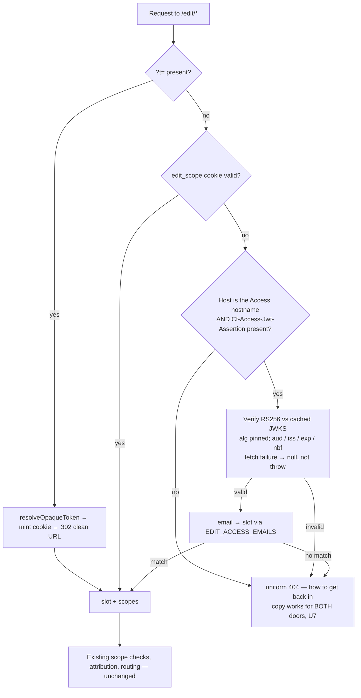

# feat: Cloudflare Access door for the practicum editor

**Target repo:** sonsteng-magnum-opus

---

## Goal Capsule

Give John, Roger and Damien a short, memorable address — `edit.sonsteng.damienriehl.com` —
that signs them in through Cloudflare Access instead of carrying a secret in the URL, and put
a tokenless admin page behind it. The existing `?t=` links keep working throughout; retiring
them is a later decision, not a consequence of this one.

---

## Problem Frame

The editor lives on a `workers.dev` hostname. Cloudflare Access can only gate hostnames in a
zone you control, so the Worker authenticates people itself: a long opaque token in the URL is
exchanged for an HttpOnly cookie and stripped from the address bar.

Three defects Damien hit on 2026-07-27 all trace to that one design choice:

1. **The links are unusable as links.** ~90 characters of base64, impossible to read aloud or
   retype, and alarming to a non-technical recipient.
2. **The address bar lies after arrival.** The `?t=` is stripped by design, so a bookmark taken
   at the natural moment — once the page is open — silently lacks the credential. It works
   until the 14-day cookie lapses, then fails permanently.
3. **A lapsed cookie was a dead end.** Now softened to a "reopen your editing link" page, but
   the recovery still depends on the person having kept the original message.

There is no admin surface reachable without pasting an admin token into a URL.

**Why now:** the walkthrough moved to the week of Aug 3, so this can land before John and Roger
ever see a token URL — they would only ever learn the good door.

---

## Product Contract

### Requirements

- **R1.** A person on the allowlist can reach the editor by typing/bookmarking
  `edit.sonsteng.damienriehl.com` with no secret in the URL.
- **R2.** Signing in uses Cloudflare Access one-time PIN by email — no account creation, any
  address on the policy — with a 30-day session, matching the Cockpit's posture.
- **R3.** A verified Access identity resolves to the same editor slot the token model already
  uses, so attribution (JOS / RSH / DR) and every scope grant are unchanged.
- **R4.** Existing `?t=` links keep working unchanged for the life of this plan. Both doors are
  live; neither is disabled as a side effect.
- **R5.** An admin landing page at `edit.sonsteng.damienriehl.com/edit/admin` presents the review
  queue, revert requests, the history index and **editorial flags**, reachable with no token
  anywhere.
  - **"Editorial flags" means: each editor can see what the other editors have changed since they
    last looked.** *(session-settled: user-directed, 2026-07-27 — chosen over "a marker Damien sets
    on a document to flag it for attention" and over dropping the element entirely. Damien: "Does
    editorial flags mean something akin to John and/or Roger needing to know about the edits that
    one or the other made?", confirmed after the review verified it describes a real gap.)*
    Concretely: a per-editor list of edits made by
    *other* editors since that editor's last visit, each showing the attribution label (JOS / RSH /
    DR), the document path and the timestamp, linking into the history entry.
  - This is a **new surface, not a composition.** Every existing "who changed what" view is
    admin-scoped: `renderReviewPage` stamps attribution but lives behind `admin`, and the ntfy
    digest is explicitly "a nudge with a count and a link" to Damien alone, never a second inbox.
    So John and Roger have no way to see each other's work today, and R5's fourth element is the
    only requirement here that adds an editor-facing capability rather than a door.
- **R6.** The uniform-404 no-oracle property survives **wherever the Worker is the thing
  answering**: on the `workers.dev` origin, and for any request on the new hostname that has
  already passed Access, an unknown path, a known path without scope, and a hostile path remain
  byte-identical responses. *(session-settled: user-directed, 2026-07-27 — scoped over leaving the
  claim unqualified.)* Cloudflare's login redirect is the expected edge response for an
  unauthenticated request to the new hostname and is **not** a violation: Access answers before the
  Worker sees the request, so there is no oracle for the Worker to leak. Stating the boundary is
  what makes R6 checkable — unscoped, whoever verified the Definition of Done against the new door
  would find it false and be unable to sign off.
- **R7.** PROD (`sonsteng.damienriehl.com`) is untouched and stays pitch-only.
- **R8.** The admin page offers a **student view** — a one-click way to see the practicum exactly
  as a student sees it, with no editing chrome and no instructor material. *(Damien, 2026-07-27:
  "So long as we also have a 'student view' to test things.")*

### Key Decisions

- **KD1. All three get Access; each person's token link stays as a fallback *through their own
  first proof*, then retires.** *(session-settled: user-directed, refined 2026-07-27 — chosen over "Damien only,
  others keep bookmarks" and over retiring the tokens on day one.)* Governs R1, R3, R4.

  Damien's follow-up — *"Cloudflare Access (no token) might be the most elegant method, right?"* —
  is correct, and the plan agrees with it. Access-only is the better end state: one door, nothing
  secret in any URL, central revocation, and no forwarded-link risk. Keeping both doors is not a
  compromise on that; it is **staging**, because Access is unproven in John's hands until John
  himself has actually signed in once. Retiring a working door before the replacement has carried
  a real user is how you discover the replacement's flaw at the worst moment.

  **Retirement trigger (concrete, and per person):** remove a collaborator's `EDIT_TOKEN_*` secret
  once *that person* has completed one Access sign-in and saved one edit through the new door.
  John's proof retires John's token; Roger's retires Roger's. Damien's stays as a break-glass.
  The staging argument above — never retire a working door before the replacement has carried a
  real user — is an argument about each user individually; retiring Roger's token on John's proof
  would discover a mistyped policy entry or an undelivered PIN only after Roger's working door was
  already gone, days before the walkthrough. Tracked as the first item in Deferred to Follow-Up
  Work, not as an open-ended intention.
- **KD2. Hostname is `edit.sonsteng.damienriehl.com`.**
  *(session-settled: user-directed — chosen over `sonsteng-admin.…` and `admin.sonsteng.…`:
  it names the thing the reviewers do, and the admin page is simply its front page.)*
  Governs R1, R5.
- **KD3. Login method is one-time PIN by email.**
  *(session-settled: user-directed — chosen over Google sign-in and offering both: no account
  required, works with whatever address John and Roger already read.)* Governs R2.
- **KD4. The admin page ships in this build, not as a follow-on.**
  *(session-settled: user-directed.)* Governs R5.

### Scope Boundaries

**In scope:** the new hostname and Worker route, the Access application and policy, JWT
verification in the Worker, email→slot mapping, the admin landing page, and the docs that tell
John what to do.

**Deferred to follow-up work:**
- **Retire the `?t=` tokens, per person,** as each of john/roger completes an Access sign-in and
  saves one edit (KD1's named trigger). Keep Damien's as break-glass. The same deploy drops that
  person's origin from the `EDIT_ORIGIN` list once no token remains that needs it (KTD6), and
  removes the "the old link still works" line from `docs/editor-guide-for-john.md` — otherwise the
  one document John keeps points at a door that no longer exists. This is a scheduled step, not an
  open-ended intention.
- Applying the same door to PROD, which stays pitch-only until Damien flips it.
- Service-token access for the apply daemon — it authenticates with its own admin token today
  and is unaffected.

**Outside this product's identity:** self-service account creation, roles beyond the existing
slot model, and any change to how edits are applied, reverted or attributed.

---

## Planning Contract

### Assumptions

- **A1.** The `damienriehl.com` zone is on the same Cloudflare account as the Worker, so a
  custom domain can be attached without a zone transfer. *(Verify in U1 before proceeding.)*
- **A2.** Damien's Access team `young-unit-68fd` can host a second application; the Cockpit's
  existing app is not disturbed.
- **A3.** John's and Roger's addresses were supplied on 2026-07-27 and are **deliberately not
  recorded in this repo.** This repository is private today but the README pitches it to
  open-source adopters, so it is headed public — and git history is permanent. A collaborator's
  personal address committed now would ship with the first public release. The two addresses live
  in the private cockpit (`briefs/qa/sonsteng-2026-07-27-access-door-answers.json`) and are typed
  straight into the Access policy at U2. Nothing in the codebase needs them: `EDIT_ACCESS_EMAILS`
  maps addresses to slots and is itself config, so it is set as a **secret**, not a var.

### Key Technical Decisions

- **KTD1. Verify the Access JWT with WebCrypto, not a library.** Cloudflare's own examples use
  `jose`, but the Worker already does HMAC via `crypto.subtle` and adding an npm dependency to
  this project requires Damien's sign-off. RS256 verification against a JWKS is ~60 lines with
  `crypto.subtle.importKey('jwk', …)` + `verify`. Rationale: no new dependency, no supply-chain
  surface on the auth path.
  **What hand-rolling costs, stated plainly:** a JWT library pins the algorithm for you. This one
  must pin it explicitly (U3 step 3) — a verifier that takes `alg` from the token header is the
  classic JWT-confusion bug, and the caller who supplies that header can be the forged-header
  vector on the still-reachable `workers.dev` origin KTD3 names. Do not lean on "the existing
  crypto idioms carry over": `editor-auth.js` only ever does fixed-algorithm HMAC via
  `importKey('raw', …, {name:'HMAC'})` and has no algorithm-negotiation surface to inherit.
- **KTD2. Access identity is a SECOND identity source inside `resolveAuth`, not a replacement.**
  The function already resolves a cookie to `{slot, scopes}`. Access adds one more way to
  arrive at a slot; everything downstream — scope checks, attribution, the store — is untouched.
  This is what makes R4 true by construction rather than by discipline. Governs R3, R4.
- **KTD3. Trust the `Cf-Access-Jwt-Assertion` header only, and only when the request arrived on
  the Access-gated hostname.** The `workers.dev` origin is reachable directly and can carry a
  forged header, so header presence alone must never grant access. Bind verification to the
  expected hostname and the app's AUD tag. Governs R1, R6.
- **KTD4. Cache the JWKS in memory with a TTL and re-fetch on unknown `kid`.** Access rotates
  signing keys roughly every 6 weeks; a fetch per request is both slow and a failure mode.
- **KTD5. The admin page is `/edit/admin` on the new hostname, gated by `admin` scope, reusing
  the existing review/history renderers.** *(Resolves OQ2 in favour of the prefix over the host
  root.)* It is a composition of surfaces that already exist, not a new information architecture.
  The prefix is load-bearing, not cosmetic: `index.js` delegates to `editorFetch` only for `/edit`
  and `/edit/*`, so `/edit/admin` inherits the existing router, the `withEditHeaders` wrapper
  (CSP, `no-store`, `X-Frame-Options`), the uniform 404 and the `Path=/edit` cookie scope for
  free. Serving the same page at the bare root would have required all four to be rebuilt in
  `index.js`, and an under-scoped root returning uniform-404 HTML next to a root-level unknown
  path returning the chat router's JSON envelope is precisely the oracle R6 forbids.
- **KTD6. `EDIT_ORIGIN` becomes a LIST, not a swapped single value.** It is the SOLE `/edit`
  origin allowlist, and it is enforced twice: `editCorsHeaders` withholds CORS headers from a
  non-matching origin, and — the one that actually bites — `csrfOk` rejects any request whose
  `Origin` header differs from it. One env now serves two browser origins (the new hostname and
  the `workers.dev` fallback), so a single value cannot satisfy both: swapping it would leave
  every `?t=` bookmark loading pages normally while every save returns `403 csrf_failed`, making
  R4 false by construction during exactly the window KD1 exists to protect. Parse it as a
  comma-separated list in `editOrigin`, `editCorsHeaders` and `csrfOk`, mirroring
  `parseAllowedOrigins`/`matchOrigin` in `cors.js`, and echo the matched origin. Collapse back to
  one value at KD1's retirement. **This is still the single most likely way to break this build**,
  and note that the unit tests set `EDIT_ORIGIN` to whatever origin they simulate — the suite goes
  green whether or not this is right, so the round-trip test in U5 is the only real guard.
- **KTD7. The bare hostname redirects into the editor; it does not serve a page.** Typing
  `edit.sonsteng.damienriehl.com` must land somewhere useful (R1) even though the admin page moved
  to `/edit/admin`. `/` on the Access hostname 302s to `/edit/`, and the editor's own landing is
  scope-aware from there — `admin` continues to `/edit/admin`, `edit`/`instructor` lands on the
  practicum. This is the minimum `index.js` change that satisfies R1 without recreating the edit
  surface's security posture outside the `/edit` prefix. Governs R1, R5, R6.
- **KTD8. The three Access verification inputs are declared config, never derived from the
  token.** `EDIT_ACCESS_AUD`, `EDIT_ACCESS_TEAM_DOMAIN` and `EDIT_ACCESS_HOST` are `vars` in
  `wrangler.jsonc`, declared in BOTH the top-level and `env.dev` blocks (vars are non-inheritable)
  and deliberately absent from `env.production`. The team domain in particular must come from
  config and never from the token's own `iss`, or an attacker-supplied token would select its own
  signing keys. The Access branch returns null whenever any of the three is unset — so the PROD
  Worker, which has none of them, fails closed rather than open. Governs R1, R6, R7.

---

## High-Level Technical Design

Identity resolution after this change — one new branch, everything else unchanged:

The token path (B→C) and cookie path (D) are byte-for-byte what they are today. The new branch
is E→G→H, and it terminates in the same `{slot, scopes}` shape, which is why nothing downstream
needs to know Access exists.

---

## Implementation Units

### U1. Attach the hostname to the Worker

- **Goal:** `edit.sonsteng.damienriehl.com` resolves to the Worker.
- **Requirements:** R1
- **Dependencies:** none
- **Files:** `app/worker/wrangler.jsonc`
- **Approach:**
  1. Confirm A1 — the zone and the Worker are on one account (`wrangler whoami`, zone list).
  2. Add a `routes` entry with `custom_domain: true` for the new hostname on the default env.
  3. **In the same edit, add an explicit `"routes": []` to the `env.production` block.**
     `routes` is an *inheritable* key in wrangler config (the non-inheritable list is bindings —
     `vars`, `durable_objects`, `kv_namespaces` — and Cloudflare's own example shows an env-level
     route *overriding* a top-level one). `env.production` declares no routes today, so without
     this the documented `npx wrangler@4 deploy --env production` in `docs/prod-enable.md` would
     try to bind `edit.sonsteng.damienriehl.com` to `sonsteng-chat-production` — failing the
     deploy, or stealing the hostname from DEV. R7 is true of the file text without this step and
     false of the effective config.
  4. Deploy; Cloudflare provisions the DNS record and certificate.
- **Patterns to follow:** no `routes` block exists anywhere in `wrangler.jsonc` yet — the ⚠ DAMIEN
  DECISION comment in `env.production` and step (b) of `docs/prod-enable.md` are the closest
  precedent for the `custom_domain: true` shape.
- **Test scenarios:**
  - The hostname serves the Worker (any `/edit/*` path returns the uniform 404, not an nginx or
    Cloudflare error page) before Access is attached.
  - `sonsteng-chat.damienriehl.workers.dev` still serves identically — the route is additive.
  - `npx wrangler@4 deploy --env production --dry-run` reports **no** route for the new hostname.
  - TLS resolves with a valid certificate.
- **Verification:** both origins answer; no change in behaviour on the old one; the PROD dry-run is
  clean of the new hostname.

### U2. Create the Access application and policy

- **Goal:** the new hostname is gated; the three known addresses can sign in by one-time PIN.
- **Requirements:** R1, R2
- **Dependencies:** U1
- **Files:** none in-repo (Cloudflare account state) — record the AUD tag, the team domain and the
  hostname in `docs/prod-enable.md` alongside the existing runbook material. All three are config
  U3 and U4 read (KTD8), not just the AUD tag.
- **Approach:**
  1. Create an Access application for the hostname on team `young-unit-68fd`, as an ordinary
     **self-hosted** application.
  2. Policy: allow the three email addresses; include one-time PIN as an identity method.
  3. Session duration 30 days, matching the Cockpit.
  4. Capture the application's **AUD tag** and the **team domain** — U3 needs the first as the
     expected `aud` and the second for `iss` and the JWKS URL.
  - ⚠ **Do NOT use the one-click "Access for Workers" flow.** Cloudflare's Oct 2025 changelog
    scopes that button to *`workers.dev` and Preview URLs only*. Enabling it here would gate
    `sonsteng-chat.damienriehl.workers.dev` — the fallback door — putting a login screen in front
    of John's existing `?t=` link while the new custom domain stayed ungated, collapsing the whole
    staged rollout KD1 exists to protect. A Workers Custom Domain needs the ordinary self-hosted
    application that steps 1–4 describe.
- **Execution note:** this is credentialed account work. Do it before writing U3 so the AUD tag
  is a known value rather than a placeholder.
- **Test scenarios:**
  - An un-authenticated request to the hostname redirects to the Access login screen.
  - An allowed address receives a PIN and lands on the app.
  - A non-allowed address is refused.
  - The Cockpit application still gates `dashboard.damienriehl.com` unchanged.
  - **`sonsteng-chat.damienriehl.workers.dev` is NOT gated** — an existing `?t=` link reaches the
    editor with no login screen in front of it.
- **Verification:** the login screen appears on the new hostname and nowhere else; one real
  sign-in completes.

### U3. Verify the Access JWT in the Worker

- **Goal:** the Worker can prove a request carries a genuine, current Access identity.
- **Requirements:** R1, R6
- **Dependencies:** U2 (needs the AUD tag)
- **Files:** `app/worker/src/access-jwt.js` (new),
  `app/worker/test/access-jwt.test.js` (new), `app/worker/wrangler.jsonc`
- **Approach:**
  0. Declare the three config vars from KTD8 — `EDIT_ACCESS_AUD`, `EDIT_ACCESS_TEAM_DOMAIN`,
     `EDIT_ACCESS_HOST` — in both the top-level and `env.dev` `vars` blocks, absent from
     `env.production`. If any is unset, every function in this module returns `null` before doing
     any work: unset config fails closed, never open.
  1. Read `Cf-Access-Jwt-Assertion`; absent → null, never an error that distinguishes cases.
  2. Parse the JWS header for `kid`; fetch JWKS from
     `https://<EDIT_ACCESS_TEAM_DOMAIN>/cdn-cgi/access/certs` — the team domain comes from config,
     **never** from the token's own `iss`, or an attacker-supplied token would nominate its own
     signing keys. In-memory cache (TTL plus force-refresh on unknown `kid`, per KTD4).
  3. **Pin the algorithm.** Ignore the JWS header's `alg` entirely; import only JWKS entries whose
     `kty`/`alg` are RSA/RS256 and verify with those parameters via
     `crypto.subtle.importKey('jwk', …)` and `crypto.subtle.verify`. A verifier that derives its
     algorithm from the token header is the classic JWT-confusion bug (KTD1).
  4. Check `aud` contains `EDIT_ACCESS_AUD`, `iss` equals `EDIT_ACCESS_TEAM_DOMAIN`, and
     `exp`/`nbf` against now with a **60-second** skew allowance.
  5. Return `{ email }` on success, `null` on every failure — no partial trust, no error detail
     that could distinguish "bad signature" from "wrong audience".
  6. **Transport failures are failures, not exceptions.** A JWKS fetch that throws, times out or
     returns non-200 is caught inside this module and returns `null`, so the request takes the
     uniform 404. Give the fetch a bounded timeout — it runs inline on the request path in
     `resolveAuth`, so a hung fetch would stall an authenticated request rather than fail closed.
     On a failed *refresh*, keep serving the last cached key set until its TTL expires. Without
     this, an uncaught rejection propagates to the catch in `index.js`, which returns a 500 with
     the plain-text body "Not found." — neither the uniform 404 nor byte-identical to it, breaking
     R6 and handing signed-in users a hard error instead of the recovery page.
- **Patterns to follow:** `editor-auth.js` for the crypto idiom and the never-log-the-credential
  discipline; its `constantTimeEqualStr` for any string comparison on secret-adjacent values.
- **Test scenarios:**
  - A token signed by the expected key with correct `aud`/`iss`/`exp` verifies and yields the email.
  - A token with a valid signature but the wrong `aud` is rejected.
  - A token with the wrong `iss` is rejected.
  - An expired token is rejected; a token expired by 5 minutes is rejected (the 60s skew window is
    a bound, not a loophole); a not-yet-valid (`nbf` in future) token is rejected.
  - A token whose signature does not match the key is rejected.
  - **A token whose header claims `alg: none` is rejected.**
  - **An HS256 token signed with the RSA public key as its HMAC secret is rejected** (algorithm
    confusion).
  - A token with an unknown `kid` triggers exactly one JWKS re-fetch, then rejects if still unknown.
  - A malformed/garbage header value is rejected without throwing.
  - The JWKS cache is reused within the TTL (one fetch across several verifications).
  - **A JWKS fetch that rejects, times out, or returns 500 yields `null` — not a thrown error** —
    and a failed refresh keeps serving the cached key set until TTL.
  - **With any of the three KTD8 vars unset, verification returns `null`** without attempting a
    fetch (fail-closed, which is what keeps PROD safe under R7).
- **Verification:** unit tests cover every rejection path; no code path returns an identity on
  a failed check; no code path throws out of this module.

### U4. Resolve an Access identity to an editor slot

- **Goal:** a verified email becomes the same `{slot, scopes}` the token path produces.
- **Requirements:** R3, R4, R6
- **Dependencies:** U3, **U5** — KTD3's host gate compares against `EDIT_ACCESS_HOST`, and U5 is
  where the new hostname's configuration lands. Shipping U4 before U5 leaves the gate comparing
  against a value that does not yet name the Access hostname, so every sign-in silently fails to
  validate.
- **Files:** `app/worker/src/editor-auth.js`, `app/worker/wrangler.jsonc`,
  `app/worker/test/editor-auth.test.js`
- **Approach:**
  1. New **secret** `EDIT_ACCESS_EMAILS` — JSON mapping lowercased email → slot name, set with
     `wrangler secret put`, never in `wrangler.jsonc`. These are not credentials, but they are
     collaborators' personal addresses in a repo headed for public release (A3), and a secret is
     the mechanism this project already has for "must not be committed". Lowercase the JWT's
     `email` claim before lookup, so a mixed-case claim is a match rather than a lockout.
  2. **Add a `damienadmin` slot** to `EDIT_TOKEN_SCOPES` carrying
     `{"edit":1,"instructor":1,"admin":1}`, and give it the attribution label `DR`. Damien's
     address maps to it. This is necessary because no existing slot can satisfy both halves of
     U6's verification: `damien` grants `{edit, instructor}` and `admin` grants `{admin}` only,
     and Access resolves one address to exactly one slot — so the existing model forces a choice
     between reaching the admin page and keeping DR attribution. (It also matters that an
     `admin`-only session cannot open `/edit/history`, which requires edit or instructor scope —
     so the admin page would link to surfaces its own identity could not follow.)
     **Set no `EDIT_TOKEN_DAMIENADMIN` secret.** The combined-scope slot is reachable only through
     Access, which preserves the invariant `editor-auth.js` documents — *"admin is NEVER reachable
     from an edit/instructor token (separate secret, separate record)"* — for the token path
     exactly as written, rather than silently widening it.
  3. In `resolveAuth`, after the cookie check fails, try Access: gate on the request host equalling
     `EDIT_ACCESS_HOST` (KTD3), verify, map, and return the slot's scopes from the existing
     `EDIT_TOKEN_SCOPES` record. Insert this branch *after* the existing Bearer service-token check
     as well as the cookie check, so the apply daemon's path is untouched.
  4. An email that verifies but maps to no slot resolves to no scopes — indistinguishable from
     any other unauthorized request.
  5. **No cookie is minted on the Access path.** Identity is re-verified per request. That is what
     makes `EDIT_ACCESS_EMAILS` an instant revocation lever (U7's runbook depends on it) and it
     keeps the 14-day cookie and the 30-day Access session from ever interacting. Do not add a
     mint for symmetry with the token path.
- **Execution note:** add a characterization test for the existing token+cookie path *first*, so
  the additive claim (R4) is proven rather than asserted.
- **Test scenarios:**
  - Existing `?t=` exchange and cookie resolution behave identically with the branch present.
  - A verified `john@…` resolves to slot `john` with `edit`+`instructor` and attribution JOS.
  - A verified `roger@…` resolves to slot `roger` with `edit`+`instructor` and attribution RSH.
  - **A verified `damien@…` resolves to slot `damienadmin` with `edit`+`instructor`+`admin` and
    attribution DR** — both halves at once, which is the whole point of the new slot.
  - **No `EDIT_TOKEN_DAMIENADMIN` secret exists**, so the combined slot cannot be reached by any
    `?t=` token — the token path's admin isolation is intact.
  - A verified email absent from the map yields no scopes.
  - A mixed-case `email` claim resolves to the same slot as its lowercase form.
  - A valid assertion presented on the `workers.dev` host is ignored (KTD3).
  - Cookie identity wins when both a cookie and an assertion are present (no ambiguity).
  - The apply daemon's Bearer service-token path resolves exactly as it does today.
  - Attribution labels are unchanged for every pre-existing slot.
- **Verification:** worker suite green; attribution assertions unchanged from their current values
  for john/roger/damien/admin.

### U5. Make the edit-origin allowlist multi-valued and add the new origin

- **Goal:** the editor works end-to-end on the new hostname **without breaking the old one**.
- **Requirements:** R1, R4, R6
- **Dependencies:** U1
- **Files:** `app/worker/src/editor-http.js`, `app/worker/wrangler.jsonc`,
  `app/worker/test/editor-security.test.js`
- **Approach:**
  1. Change `editOrigin`, `editCorsHeaders` and `csrfOk` in `editor-http.js` to parse
     `EDIT_ORIGIN` as a **comma-separated list**, match the request's `Origin` against the set,
     and echo the *matched* origin in `Access-Control-Allow-Origin` (never the whole list, never a
     wildcard — the endpoint sends credentials). Mirror the existing
     `parseAllowedOrigins`/`matchOrigin` pattern in `cors.js` rather than inventing a second idiom.
  2. Set `EDIT_ORIGIN` to
     `https://edit.sonsteng.damienriehl.com,https://sonsteng-chat.damienriehl.workers.dev` in
     **both** the top-level and `env.dev` `vars` blocks — `vars` are non-inheritable, so setting
     only one leaves the other serving the old single value. Leave `EDIT_UPSTREAM` (the DEV static
     origin) and `env.production` alone.
  3. Confirm the injector's same-origin asset and `/edit/v1` paths resolve under the new host.
- **Approach note:** this is KTD6 — the highest-likelihood breakage in the plan, and the reason
  the allowlist becomes a list rather than a swapped value. `csrfOk` rejects any request whose
  `Origin` differs from the allowlist, and all eleven mutation endpoints call it, so a single
  swapped value leaves every `?t=` bookmark loading pages normally while every save returns
  `403 csrf_failed`. **The unit tests set `EDIT_ORIGIN` to whatever origin they simulate, so the
  suite stays green either way** — only the round-trip scenarios below actually catch this.
- **Test scenarios:**
  - A `/edit/v1/suggest` XHR from the new origin passes CORS **and** `csrfOk`.
  - A `/edit/v1/suggest` XHR from the `workers.dev` origin passes CORS **and** `csrfOk`.
  - The same XHR from a third origin is refused by both.
  - The echoed `Access-Control-Allow-Origin` is the single matched origin, not the list.
  - `/edit/assets/*` and `/edit/site-assets/*` load under the new host.
  - **Saving an edit from the new host reaches the store** (round trip, not a header assertion).
  - **Saving an edit from an existing `?t=` link on `workers.dev` still reaches the store** — this
    is the R4 regression guard.
- **Verification:** an edit saved from *each* origin appears in the review/pending data.

### U6. Admin landing page

- **Goal:** one tokenless page at `/edit/admin` that opens on the review queue, revert requests and
  the history index, plus a bare-hostname redirect so typing the address lands somewhere useful.
- **Requirements:** R1, R5, R8
- **Dependencies:** U4
- **Files:** `app/worker/src/editor-admin.js` (new), `app/worker/src/editor.js`,
  `app/worker/src/index.js`, `app/worker/test/editor-admin.test.js` (new)
- **Approach:** **`/edit/admin`** requiring `admin` scope (KTD5), composing the existing
  `renderReviewPage` and `renderHistoryIndex` output rather than inventing new views. Links out to
  each surface. Under-scoped requests take the uniform 404. Note `renderReviewPage(items, reverts)`
  already renders the revert requests alongside the queue — that is one surface, not two.
  - **Why the prefix and not the root:** `index.js` delegates to `editorFetch` only for `/edit` and
    `/edit/*`, so `/edit/admin` inherits the router, `withEditHeaders` (CSP, `no-store`,
    `X-Frame-Options`, `Referrer-Policy`), the uniform 404 and the `Path=/edit` cookie scope with
    no new code. Serving the page at the bare root would have meant rebuilding all four outside
    the prefix, and an under-scoped root returning uniform-404 HTML beside a root-level unknown
    path returning the chat router's JSON envelope is exactly the oracle R6 forbids.
  - **Bare-hostname redirect (R1, KTD7):** the one change in `index.js` — when the request host is
    `EDIT_ACCESS_HOST` and the path is `/`, 302 to `/edit/`. The editor's landing is then
    scope-aware: `admin` continues to `/edit/admin`, `edit`/`instructor` lands on the practicum.
    Without this the bare address falls through to the chat router's JSON 404 for *everyone*,
    including John and Roger, who would complete a PIN sign-in only to be told "Not found" —
    reproducing the dead end this plan exists to remove.
  - **Student view (R8):** the public practicum (`sonsteng-dev.damienriehl.com/platform/`) already
    *is* the student view — a different origin, unauthenticated, with the editing layer absent and
    instructor material reachable only through `/edit`. Two placements, because the value is
    checking a change you just made:
    1. a **path-mapped link in the editor chrome on every `/edit` page**, mapping the current
       `/edit/<path>` to the same `<path>` on the public site, so the check lands on the page the
       edit was made on rather than the site root;
    2. a link to the practicum root from `/edit/admin`, as the general entry point.
  - **Editorial flags (R5):** see the definition in R5 — a per-editor "what changed since you last
    looked" list. This is the one genuinely new rendering in the unit; everything else composes.
- **Test scenarios:**
  - With admin scope, `/edit/admin` renders and links to review, history and revert requests.
  - With `edit` scope only (John), `/edit/admin` is the uniform 404 — identical bytes to an
    unknown `/edit/*` path.
  - With no identity, the uniform 404.
  - **`/` on the Access hostname 302s to `/edit/`; an admin identity ends at `/edit/admin`, an
    edit/instructor identity ends on the practicum.**
  - **`/` on the `workers.dev` host is unchanged** — the redirect is bound to `EDIT_ACCESS_HOST`.
  - An empty queue renders as an honest empty state, not an error.
  - No token value appears anywhere in the rendered HTML.
  - The student-view link on an `/edit/<path>` page points at the same `<path>` on the public site.
  - The student-view target carries no editing chrome and no instructor content (verifies the view
    is genuinely a student's, not a stripped admin one).
  - The editorial-flags list shows only edits by *other* editors since the viewer's last visit, and
    is empty (not an error) on a first visit.
- **Verification:** `/edit/admin` is reachable by Damien through Access with no URL secret; John
  cannot reach it and cannot tell it exists; typing the bare hostname lands every identity
  somewhere useful.

### U7. Tell John what to do, and record the topology

- **Goal:** the human-facing story matches the system.
- **Requirements:** R1, R2, R4
- **Dependencies:** U1–U6
- **Files:** `docs/editor-guide-for-john.md`, `docs/demo-runbook-2026-07-18.md`,
  `docs/prod-enable.md`, `RESUME.md`, **`app/worker/src/editor-http.js`**
- **Approach:** rewrite "Getting in" around the new address and the emailed code; keep one line
  saying the old link still works. Record the AUD tag, team domain, hostname, policy and the
  both-doors posture in the runbook, and add the topology to the RESUME state line.
  - **The most-read token-only sentence is not in any of the markdown files.** It is
    `NOT_FOUND_HTML` in `editor-http.js`, which tells every failed request to reopen "the personal
    link Damien sent you". Someone who arrives through Access and is denied — both new failure
    branches in the flowchart land here — reads recovery instructions for a link they never had,
    and after retirement it will name a door that no longer exists. Rewrite that copy so it names
    `edit.sonsteng.damienriehl.com` as the way back in, **keeping the body byte-identical across
    unknown, under-scoped and hostile paths** (R6 forbids differentiating per failure path).
  - **Revocation runbook entry** — record the order explicitly, because the obvious lever is the
    slow one: to cut someone off immediately, remove their address from the `EDIT_ACCESS_EMAILS`
    secret and redeploy, *then* remove them from the Access policy. Access re-evaluates policy at
    session establishment, so with R2's 30-day session a policy edit alone leaves an already
    authenticated browser working for up to a month. `EDIT_ACCESS_EMAILS` is consulted on every
    request (U4 mints no cookie), which is what makes it instant.
- **Test scenarios:**
  - Documentation is verified by reading: no sentence survives that describes a token-only
    entrance — in the guide, the runbook, **or the rendered 404 page**.
  - The rewritten `NOT_FOUND_HTML` is byte-identical for an unknown path, a known path without
    scope, and a hostile path (assert in `editor-security.test.js`, which already covers
    `uniform404`).
- **Verification:** a reader following only the guide can sign in without prior context; someone
  denied at the new door reads instructions that work.

---

## Verification Contract

- `bash tools/preflight.sh` — all eight gates, including the headful editor client (43
  assertions) and the a11y audit at 0 FAIL.
- Live, after deploy: an allowed address completes a PIN sign-in and can edit; an edit saved from
  the new hostname appears in the store; **an edit saved from an existing `?t=` link on
  `workers.dev` also still appears in the store** (the R4 guard — this is the one that would fail
  silently); `/edit/admin` renders for admin scope and 404s for `edit` scope; typing the bare
  hostname lands each identity somewhere useful; **the student-view link on an `/edit` page opens
  the matching public page with no editing chrome and no instructor content**; PROD still returns
  the pitch page.
- Both trees clean; merge to `main` from `~/.local/share/sonsteng-daemon/checkout` under
  `flock .locks/daemon.lock`.
- **Do not forget — and it is not the bundler.** `wrangler.jsonc` wires
  `node scripts/bundle-editor-data.mjs` as `build.command`, so it runs automatically before every
  deploy and dry-run; that step cannot be forgotten. The step that *can* is regenerating its
  sources: the script only copies `build/*.generated.json`, which the Python generators produce.
  Run `python3 tools/build_site.py --check && python3 tools/build_instructor_bundle.py` before
  deploying, or the deploy ships a stale editor bundle.

## Definition of Done

R1–R8 hold as written — R6 including its stated scope; preflight is green; the live checks above
pass; John's guide describes the new door; the old links still work **and can still save**; and the
AUD tag, team domain, hostname, policy and the revocation order are recorded in the runbook.

---

## System-Wide Impact

- **The apply daemon and the digest timer are unaffected, and it is worth saying why rather
  than assuming it.** Both call `/edit/v1/*` server-side with a Bearer service token and send no
  `Origin` header, so neither the allowlist nor `csrfOk`'s Origin check (KTD6) applies to them — a
  browser-origin change cannot break the every-2-minute apply loop or the 4×/day digest. Their
  admin-scope token path is the one U4 leaves byte-for-byte unchanged, and U4's Access branch is
  inserted after the Bearer check specifically so that stays true.
- **The history browser, review page and instructor docs** are reached through the same
  `resolveAuth` result, so they gain the Access door for free and need no per-surface work.
- **PROD is untouched.** No route, var or secret in `env.production` changes; it continues to
  serve the pitch page only.

---

## Risks & Dependencies

- **Edit-origin allowlist (KTD6).** Highest-likelihood failure, and the review caught it as a
  live defect rather than a hypothetical: swapping `EDIT_ORIGIN` to the new hostname makes every
  save from an existing `?t=` link return `403 csrf_failed` while pages keep loading normally —
  R4 false by construction. Mitigated by making the allowlist multi-valued (U5) and by round-trip
  save tests from *both* origins rather than header assertions. Note the unit suite cannot catch a
  regression here on its own: tests set `EDIT_ORIGIN` to whatever origin they simulate.
- **Gating the wrong hostname (U2).** Cloudflare's one-click "Access for Workers" flow covers
  `workers.dev` and Preview URLs only. Using it would put a login screen in front of the fallback
  door and leave the new custom domain ungated — the exact inverse of the intent. Mitigated by
  striking the shortcut from U2 and by U2's test that `workers.dev` is *not* gated.
- **Route inheritance into PROD (U1).** `routes` is inheritable and `env.production` declares
  none, so a top-level custom-domain route would follow `--env production`. Mitigated by adding an
  explicit `"routes": []` there in the same edit, with a dry-run assertion.
- **Forged assertion on the `workers.dev` origin.** Mitigated by KTD3's host binding; covered by
  a dedicated test in U4.
- **Key rotation.** Access rotates signing keys ~6-weekly; a static key would fail silently weeks
  later. Mitigated by KTD4's cache-with-refresh and its unknown-`kid` test.
- **Retained token links (KD1).** A forwarded link still grants access. Accepted deliberately;
  rotation is instant and retirement is a later, cheap decision.
- **Credentialed account work (U2).** Requires Damien's Cloudflare account. If the one-click
  Workers flow is unavailable, the application is created by hand and the AUD tag copied out.

## Open Questions

- **OQ1.** ~~John's and Roger's exact email addresses~~ — **closed.** A3 records that both were
  supplied on 2026-07-27 and live in the private cockpit answers file; they are typed straight into
  the Access policy at U2 and deliberately never committed here. Nothing is outstanding.
- **OQ2.** ~~Host root or `/edit/admin`?~~ — **closed 2026-07-27 in favour of `/edit/admin`**
  (KTD5). The review surfaced a cost the original framing did not know about: `index.js` routes
  only `/edit` and `/edit/*` to the editor, so root placement would have pulled the router, the
  security-header wrapper, the uniform-404 byte shape and the cookie scope into U6. The bare
  hostname still works — it redirects (KTD7).
- **OQ3.** ~~Is the editorial-flags definition in R5 right?~~ — **closed 2026-07-27, confirmed as
  written.** Editorial flags are cross-editor awareness: each editor sees what the others changed
  since they last looked. Damien confirmed his own reading after the review verified it describes a
  real gap — every who-changed-what surface is admin-scoped today, so John and Roger genuinely
  cannot see each other's work. It remains the only element of this plan that adds an editor-facing
  capability rather than a door, and the only genuinely new rendering in U6; everything else
  composes surfaces that already exist.
- **OQ4.** ~~R6 is not literally true at the Access edge~~ — **closed 2026-07-27 by scoping R6**
  to the `workers.dev` origin and to any request that has already passed Access. Access answers
  before the Worker sees an unauthenticated request, so its login redirect leaks nothing the Worker
  could have hidden. See R6 and the Definition of Done.

*No open questions remain.*

## Sources & Research

- Cloudflare: [Validate JWTs](https://developers.cloudflare.com/cloudflare-one/access-controls/applications/http-apps/authorization-cookie/validating-json/)
  — `Cf-Access-Jwt-Assertion` is the recommended surface over the `CF_Authorization` cookie;
  JWKS at `https://<team>.cloudflareaccess.com/cdn-cgi/access/certs`; verify `aud` against the
  application's AUD tag; keys rotate roughly every 6 weeks.
- Cloudflare: [One-click Access for Workers](https://developers.cloudflare.com/changelog/post/2025-10-03-one-click-access-for-workers/)
  — possible shortcut for U2.
- Repo, read this session: `app/worker/src/editor-auth.js` (slot/scope model, cookie mint,
  `attributionLabel`), `app/worker/src/editor.js` (route table, `?t=` exchange),
  `app/worker/src/editor-http.js` (uniform 404, CORS, CSP), `app/worker/wrangler.jsonc`
  (three env blocks, `EDIT_ORIGIN` as sole CORS allowlist).
- Origin decisions: cockpit ask `sonsteng-2026-07-27-access-door` (q1 answered; q2/q3 answered
  in-session and recorded as KD1–KD4).

---

## Implementation record — 2026-07-27

**Built: U3, U4, U5, U6, U7 and U1's config.** Not built: the two credentialed
account steps (see below). All eight preflight gates pass, including the headful
editor client (43/43) and the a11y audit at 0 FAIL. Worker suite **306 tests**
(was 224); python **193**.

### As-built notes where the code differs from, or sharpens, the plan

- **`EDIT_ORIGIN` is parsed to a `Set`** in `editor-http.js` (`editOrigin` now
  returns the set; `matchEditOrigin` is its `matchOrigin` counterpart). The CSRF
  guard was the real hazard, not CORS: `csrfOk` rejects any request whose
  `Origin` is not on the list, and all eleven mutation endpoints call it. The new
  tests were mutation-checked — reverting `csrfOk` to the old single-value
  compare fails two of them, so the suite genuinely catches KTD6 rather than
  going green either way.
- **The admin page is `/edit/admin`; the bare host 302s to `/edit/`** (KTD5,
  KTD7). `/edit/` resolves to no page key of its own, so the landing is a new
  scope-aware branch: `admin` → `/edit/admin`, `edit`/`instructor` →
  `/edit/index.html`, nothing → uniform 404. The doorway decision lives in
  `editor.js` as the exported `accessDoorwayRedirect`, **not** inline in
  `index.js`, because `index.js` imports `cloudflare:workers` and therefore
  cannot be loaded by `node --test` — anything left inline there is untestable by
  construction.
- **Editorial-flags "last seen" is a cookie** (`edit_seen`, `Path=/edit/admin`,
  HttpOnly), not store state. `EditorStore` has no generic key/value surface and
  its Durable Object migrations are append-only, so persisting a per-editor
  bookmark server-side would mean a schema migration — the riskiest change
  available — to remember a timestamp. The tradeoff is that "since you last
  looked" means *on this device*; a first visit on a new device shows an empty
  list, which is also exactly the first-visit behaviour R5 specifies.
- **`damienadmin` carries the `DR` attribution label**, deliberately sharing it
  with `damien`: same human, different door, and R3 requires an edit to read as
  DR either way.
- **The Access branch runs LAST** in `resolveAuth` — after the cookie *and*
  after the apply daemon's Bearer check — so neither pre-existing door can be
  shadowed. A test asserts the daemon's path resolves exactly as before.

### Two fixes outside the plan's scope, found while building

- **`access-jwt.js` was outside the never-log-the-credential source scan.** That
  scan globs `/editor|text-norm/`, so the newest auth path was the only one it
  could not see — and the Access assertion is a bearer credential exactly like a
  `?t=` token. Glob widened.
- **`tools/digest_push.py` builds the ntfy click-through as
  `EDIT_ORIGIN + "/edit/review"`.** With a comma-separated value that silently
  yields a URL that 404s — the nudge still fires and still looks right, and the
  tap lands nowhere. It reads a *process* env var rather than the Worker's, so
  nothing is broken today, but the names are identical and copying one into the
  other is the obvious mistake. Hardened to take the first entry, +4 tests.

### What is deliberately NOT done — U1's deploy and U2

Both are credentialed account work on Damien's Cloudflare account, and U2's
policy needs John's and Roger's personal addresses, which A3 keeps out of this
repo on purpose. The config is staged and inert:

- `wrangler.jsonc` carries the `custom_domain` route and `"routes": []` on
  `env.production`. **Verified empirically:** the Access hostname appears 0 times
  in `wrangler deploy --env production --dry-run` and twice in the DEV dry-run,
  so the inheritance hazard KTD8/U1 names is actually blocked.
- **`EDIT_ACCESS_AUD` is intentionally empty**, so `access-jwt.js` fails closed
  and the Access door is inert. Only the `?t=` door works until it is filled.
  That is the correct intermediate state — nothing is half-live.
- Remaining steps, in order, are in the new Access-door runbook appended to
  `docs/prod-enable.md`: deploy → create the Access application → capture the AUD
  tag → `wrangler secret put EDIT_ACCESS_EMAILS` → redeploy.

### Still unverifiable until the hostname exists

The live checks in the Verification Contract that require a real sign-in, and
preflight's `rail placement` gate, which needs `TARGET_URL` set to an `/edit` URL
with `?t=` and is skipped in every run above.
