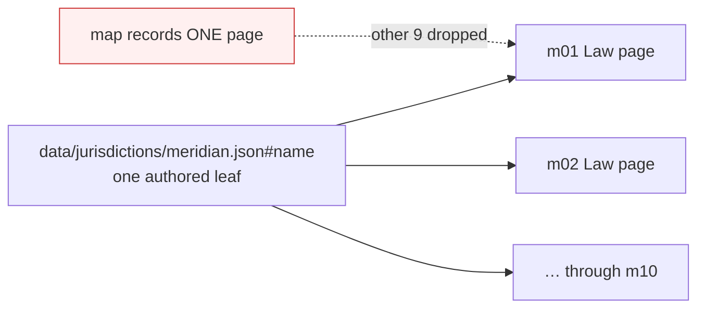

# Shared and Computed Text - Plan

## Goal Capsule

**Objective.** Let one piece of authored text be registered everywhere it renders,
and let an authored fragment inside a part-computed sentence be edited on its own —
so an edit states its true reach before John commits it.

**Product authority.** Damien, in the 2026-08-04 brainstorm. The roles model, the AI
Editor, and the D2/D8 editor-ceiling work are not active scope here.

**Open blockers.** None. The last one — what the editor does for a computed value
whose source has no editing surface — is settled by R12.

## Product Contract

### Summary

Teach the editor that one piece of John's writing can appear on more than one page,
and that a sentence can hold his words beside a computed value. Shared text is marked
before he clicks it, an edit names every page it will change, and he may apply it
everywhere or to just the page he is on.

Two shapes, named once for the rest of this document. **Shared text** is one piece of
writing that renders on more than one page. **Computed text** is a value the builder
calculates, sitting inside a sentence John partly wrote.

### Problem Frame

The map registers an editable block against exactly one JSON leaf and assumes the
rendered element contains exactly one scalar. Two shapes break that assumption: a
leaf that renders on several surfaces, and an element that mixes authored text with
values the builder computes.

Both are discarded rather than represented. `EDMAP.sources` is keyed by `source_ref`
on a first-registration-wins basis (`tools/build_site.py:232-258`), and the worker's
`BLOCK_BY_SRCREF` repeats it (`app/worker/src/editor-map.js:90-100`). A second
registration of the same leaf is dropped at build and again at serve.

The consequence is not that shared text is uneditable. It is that shared text is
editable **and silently coupled**: the map knows one surface, the rebuild changes all
of them. Commit `ca726aa` withdrew six module leaves for exactly this reason — one
home-page edit silently changed another page.

Two independent measurements disagree about how large the hazard is, and the
disagreement is itself informative.

Measured directly from the committed map: **213** registered leaves render on more
than one page — 193 Meridian canon leaves on all ten Law pages, and 20 matter
captions on two pages each. Zero registered blocks currently fail the embedded-text
hash test.

That number is a floor, not a total, because the map can only see renders that carry
an annotation. Task names are registered on the Skills page
(`tools/build_site.py:1643-1652`) and rendered again, unannotated, on the module page
(`tools/build_site.py:1460-1470`) — a genuine silent coupling that no map-based count
can detect. A wider audit put the figure near 483 by matching path shapes and
rendered text, but text equality cannot distinguish a shared leaf from two leaves
that happen to read alike, so that figure is unproven.

The honest statement: at least 213 leaves are coupled and provably so, an unknown
further set is coupled through unannotated renders, and no artifact today can
enumerate the second group. The 24 registrations withdrawn during the page-copy
migration were the cases someone noticed. R14 exists to convert this unknown into a
build failure rather than an audit.

### Key Decisions

- **Record occurrences on the existing block, rather than one block per surface.**
  Block identity is load-bearing in stored suggestions, the apply engine, and pending
  overlays; changing it on a live system risks work already in flight.
  (session-settled: user-directed — chosen over a block-per-surface group model and
  over making sharing an explicit authoring concept: least disturbance to a live map.)
  Governs R1, R2.

- **One edit reaches every occurrence by default; a single-surface edit is the
  deliberate exception.** The practicum's value is one canonical corpus, so divergence
  is opt-in rather than the default. (session-settled: user-directed — chosen over a
  canonical-surface-only model and over forking on every edit.) Governs R3, R4.

- **A recorded override is intentional and the inconsistency checker stays silent on
  it.** A checker that reports working-as-intended divergence stops being read, and
  its 16/16 signal is worth protecting. (session-settled: user-directed.) Governs R5, R6.

- **Close the silent coupling before adding new editable surface.** The invisible
  correctness bug outranks the visible win of more editable pages.
  (session-settled: user-directed.) Governs R12, R13.

- **A locked value is a doorway, not a dead end.** Selecting a computed value offers
  passage to wherever its source is edited. (session-settled: user-directed — the
  user added this to the offered option.) Governs R10, R11.

### Actors

- A1. **John** — the author. Writes and edits the practicum's prose. Sees warnings,
  chooses reach, and may override one surface.
- A2. **Damien** — approves edits into the corpus and publishes them. Needs override
  history to remain visible and auditable.
- A3. **The inconsistency checker** — reports contradictions across the corpus, and
  must distinguish a deliberate override from a mistake.
- A4. **The build** — registers blocks and is the only place a coupling violation can
  be caught before it reaches the editor.

### Requirements

**Text that renders in more than one place**

R1. A leaf's full set of render sites is available wherever an edit is authorized.
The map's page entries already carry repeated annotated occurrences; the worker
collapses them to one descriptor per `source_ref`, and an unannotated render is
absent entirely. Both gaps close.

R2. Before an edit to a multi-occurrence leaf is committed, the editor names the
other surfaces that edit will change.

R3. John can apply the edit to every occurrence or to the current surface only.

R4. A current-surface-only edit produces a surface-owned copy of that text;
later edits to the original no longer reach the copy.

R5. Each override records that it was deliberate, by whom, and when.

R6. The inconsistency checker treats a recorded override as intended and does not
report it, while continuing to report undeclared divergence.

R7. Text that renders in more than one place is visually distinguishable in the
editing view before it is selected.

R8. John can see the set of current overrides and return any one of them to the
shared text.

**Sentences that mix authored and computed text**

R9. An authored fragment inside a mixed element is editable independently of the
computed text beside it.

R10. A computed value is not editable and is visually distinguishable from authored
text.

R11. Selecting a computed value offers to open the surface where its source data is
edited, in a new browser tab.

R12. When a computed value has no such surface, the editor says so plainly and offers
no link.

**Detection and enforcement**

R13. The build fails when a registered block's rendered element contains text beyond
its authored scalar, unless that block declares itself mixed.

R14. The build fails when an authored leaf renders on more surfaces than its block
records.

**Restoring withdrawn coverage**

R15. The 10 Matter Library shape labels, the 8 home module and section leaves, and
the firm provenance line are registered under this contract.

R16. The firm provenance line's split-paragraph workaround is removed, and its
sentence renders as one element again.

### Key Flows

F1. **Editing text that appears in several places.**
**Trigger:** John selects a block marked as multi-occurrence.
**Covers R2, R3, R4, R5, R7.**
The editing view already marks the block as shared. On commit, the editor names the
other surfaces affected and offers two ways forward: change everywhere, or change
here only. Changing everywhere writes the single leaf. Changing here only writes a
surface-owned copy and records the override as deliberate.

F2. **Meeting a computed value inside a sentence.**
**Trigger:** John selects a computed value in a mixed element.
**Covers R9, R10, R11, R12.**
The authored fragment beside it is editable as an ordinary block. The computed value
is not; selecting it offers to open the surface that edits its source data in a new
tab. When no such surface exists, the editor says so and offers no link.

### Acceptance Examples

AE1. **Covers R2, R3.** A module title renders on the home page and the module cover.
John edits it on the home page. Before committing, he is told the module cover will
also change, and is offered change-everywhere or change-here-only.

AE2. **Covers R4.** John chooses change-here-only on the home page. He later edits
the same title on the module cover. The home page keeps its overridden wording.

AE3. **Covers R6.** After AE2, the inconsistency checker runs and reports nothing
about that title, while still reporting an undeclared divergence elsewhere.

AE4. **Covers R11.** John selects the computed matter name in a packet header. He is
offered passage to the surface that edits that matter's data, which opens in a new tab.

AE5. **Covers R12.** John selects a computed value whose source has no editing
surface. He is told where the value comes from and that it cannot be edited here. No
link is offered.

AE6. **Covers R13.** A block is registered against an element that also renders a
computed value, without declaring itself mixed. The build fails.

AE7. **Covers R14.** A leaf is registered on one page but renders on three. The build
fails.

### Scope Boundaries

**Deferred for later**

- Shared or embedded leaves that are unregistered beyond the 24 named in R15. Their
  number is not reliably known today; R14 is what will enumerate them. Handled once
  the contract is proven on real content.
- Making sharing an explicit authoring concept, where a shared string becomes a named
  term surfaces reference by name. The direction to drift toward, not a migration to
  start now.

**Outside this work**

- The roles model and the AI Editor. They will meet this contract, but neither is
  decided here.
- The D2 scoped-change ceiling and the D8 live UAT. Unrelated to the map contract.

### Dependencies and Assumptions

- Block identity (`source_ref`, `index`) must stay stable through this change;
  suggestions are already stored against it and pending overlays resolve by it.
- An embedded violation is already mechanically detectable: `original_hash` covers the
  element's full rendered text while `norm_hash(original_text)` covers only the
  authored scalar, so the two disagree exactly when an element holds more than its
  scalar. Only narrowly-scoped tests act on that symptom today
  (`tools/tests/test_editable_coverage.py:198-206`).
- No subrange representation exists in any layer, and none is needed. The client
  replaces an element's whole `textContent` (`app/editor/editor.js:265-285`,
  `:1033-1049`), but the DOM walker only takes `p, li, h1-h6, blockquote`
  (`tools/build_site.py:183-190`), so an authored fragment becomes editable simply by
  rendering it as its own candidate element beside a non-candidate `` holding
  the computed value. The firm provenance line already does exactly this
  (`tools/build_site.py:2751-2758`). R9 generalizes an existing pattern; see KTD2.
- `tools/check_build_parity.py` must run after any `data/` change; it moves the spine
  id and leaves the persona and instructor bundles stale.
- Counts in the Problem Frame come from two passes that disagree. Independent
  re-derivation from the committed map confirms 5,917 block entries, 2,623
  JSON-scalar entries, 866 unique JSON-scalar refs, 213 cross-page shared refs, and
  **zero** embedded hash mismatches. A wider audit's figures — 1,158 shared-or-embedded
  leaves, 675 unregistered, 483 coupled — could not be reproduced and should not be
  planned against. Use 213 as the proven floor.
- Because no registered block currently fails the embedded-text test, the
  mixed-sentence half of this work (R9-R12) adds new capability rather than repairing
  existing violations. Only the shared half repairs a live hazard.

### Outstanding Questions

**Deferred to Planning**

- Which surface edits the source of each class of computed value — matter captions,
  jurisdiction canon, task metadata, firm KPI figures. Settled against the code, per
  R11; a class with no surface falls to R12 rather than blocking.
- Where a surface-owned override is stored in `data/`, and how it is addressed.
- How occurrences are keyed on a block so the record survives a rebuild that moves a
  block's index.
- Whether R13 and R14 fail the build outright or gate behind an allowlist while the
  213 known-coupled registrations are brought under the contract.

### Sources

- `app/worker/src/editor-map.js:90-100` — first-descriptor-wins index; the serve-side
  half of the coupling bug.
- `tools/build_site.py:232-258` — `EDMAP.sources` first-registration-wins; the
  build-side half.
- `tools/build_site.py:1643-1652` — the skills renderer moving chips outside the
  annotated element to keep one scalar per candidate; the pattern R9 generalizes.
- `tools/build_site.py:2746-2757` — the firm provenance split-paragraph workaround
  R16 removes.
- `tools/tests/test_editable_coverage.py:198-206` — the scoped test that turns the
  embedded-scalar symptom into a failure.
- Commit `ca726aa` — withdrew six module leaves because one home edit silently changed
  another page.
- Commit `e3bac64` — withdrew the ten shape labels and introduced the provenance split.
- `docs/plans/2026-07-28-002-feat-word-like-practicum-editing-plan.md` — why the
  editing design is what it is. Its "replace only" and ordinal-ID statements
  (`:37-40`, `:537-540`) are historical; the current code supports structural ops and
  durable prose bids.

---

## Planning Contract

**Product Contract preservation.** Unchanged. No R-ID was split, renumbered, or
rescoped during enrichment. One Dependencies bullet was corrected: R9 was recorded as
needing a new mechanism, and research found an existing in-repo pattern that satisfies
it. That changes cost and risk, not product behavior.

### Key Technical Decisions

- **KTD1. Record every render site on the existing block; do not re-key identity.**
  `source_ref` stays the primary key and `index` stays positional. Duplicate renders
  are already emitted into the map's `pages` arrays (`tools/build_site.py:2964-2990`);
  they are discarded at three separate collapse points, and those are what change.
  (session-settled: user-directed — chosen over a block-per-surface group model and
  over making sharing an explicit authoring concept: block identity is load-bearing in
  stored suggestions, the apply engine, and pending overlays.) Governs R1, R2.

- **KTD2. Generalize the provenance-line candidate split rather than build subrange
  addressing.** The walker takes only `p, li, h1-h6, blockquote`, so an authored
  fragment rendered as its own `
` beside a non-candidate `` is independently
  editable with no new addressing form, no client change to whole-`textContent`
  replacement, and no change to the server-derived allowlist. Governs R9, R10.

- **KTD3. A per-page override is a new authored leaf, not a new addressing mode.**
  Copy-on-write produces an ordinary `<file>#<json.path>` ref that flows through
  suggest, apply, and parity untouched. Governs R4.

- **KTD4. Occurrence recording lands before any renderer splitting.** Splitting an
  element into candidates shifts every later positional `index`
  (`tools/build_site.py:183-190`), and pending suggestions are anchored by
  `page:index` (`app/worker/src/editor-endpoints.js:234`). Reversing the order
  mis-anchors in-flight suggestions. Governs R1, R9.

- **KTD5. The new build guards gate behind a transition allowlist.** 213 refs are
  already coupled; failing the build on day one would block every unrelated change.
  The allowlist is seeded with those refs and shrinks as R15 lands. Governs R13, R14.

### Three collapse points

The map already carries duplicate render sites. They are lost here:

| Layer | Mechanism | File |
|---|---|---|
| Builder | `EDMAP.sources` keyed by `source_ref`, first registration wins | `tools/build_site.py:246-250` |
| Worker | `BLOCK_BY_SRCREF` keeps the first descriptor per ref | `app/worker/src/editor-map.js:93-100` |
| Client | `sessions[source_ref]` overwritten by later candidates | `app/editor/editor.js:265-285` |

---

## Implementation Units

### U1. Record every render site in the generated map

**Goal.** Stop discarding duplicate registrations at build time; emit the full
occurrence set per `source_ref`.
**Requirements.** R1. **Covers KTD1, KTD4.**
**Dependencies.** None — this is the sequencing root.
**Files.** `tools/build_site.py`, `tools/tests/test_editable_coverage.py`
**Approach.**
1. Keep `EDMAP.sources` first-wins for *metadata* (one leaf, one `original_text`), which is correct — a leaf has one source value.
2. Add an occurrences list per ref, populated during extraction where page/index descriptors are already produced.
3. Emit occurrences into the map alongside `pages`; do not change `pages` shape.
**Patterns to follow.** Extraction already emits one descriptor per rendered candidate (`tools/build_site.py:2964-2990`) — read the duplicates it already sees rather than re-walking.
**Test scenarios.**
- A leaf rendered on one page records exactly one occurrence.
- A Meridian canon leaf rendered on all ten Law pages records ten occurrences with distinct page keys.
- A matter caption rendered on two pages records two occurrences.
- `original_text` and `json_path` remain single-valued regardless of occurrence count.
- Total `pages` block count is unchanged by the addition (no double-registration).
**Verification.** The generated map reports occurrence counts matching the 213 known-coupled refs; `check_build_parity.py` passes.

### U2. Serve every occurrence from the worker

**Goal.** Replace first-descriptor-wins lookup with one that knows all render sites,
without weakening path validation.
**Requirements.** R1. **Covers KTD1.**
**Dependencies.** U1.
**Files.** `app/worker/src/editor-map.js`, `app/worker/src/editor-endpoints.js`, `app/worker/test/editor-map.test.js`
**Approach.**
1. `BLOCK_BY_SRCREF` maps a ref to its descriptor list; the first entry preserves today's behavior for every single-occurrence ref.
2. `validateJsonScalar` keeps requiring the client path to equal the descriptor's sole `json_path` — occurrences share one leaf, so this is unchanged.
3. Project the occurrence set into the page's descriptor island so the client can mark shared blocks without another request.
**Execution note.** The path-forgery test is the guard that must not weaken; extend it rather than editing it.
**Test scenarios.**
- A ref on ten pages resolves, and its descriptor list has ten entries.
- A suggestion against a multi-occurrence ref still validates and stores exactly one `json_path`.
- A forged `json_path` for a multi-occurrence ref is still rejected.
- A single-occurrence ref behaves byte-identically to today.
**Verification.** Worker tests pass; a page island for a shared block carries its full occurrence list.

### U3. Fail the build when the contract is violated

**Goal.** Turn the two silent failure modes into build failures, gated by a shrinking
allowlist.
**Requirements.** R13, R14. **Covers KTD5.**
**Dependencies.** U1.
**Files.** `tools/build_site.py`, `tools/tests/test_editable_coverage.py`, `tools/check_build_parity.py`
**Approach.**
1. Mixed-element guard: a registered block whose `original_hash` differs from `norm_hash(original_text)` holds text beyond its scalar. Fail unless the block declares itself mixed (U8).
2. Occurrence guard: fail when a leaf renders on more surfaces than its recorded occurrences — this is what catches unannotated renders like the task-name case.
3. Seed the allowlist with the 213 currently-coupled refs; every entry carries the reason it is exempt.
**Execution note.** Write each guard's failing case first — a guard that cannot fail is the exact defect this repo has hit twice (`docs/solutions/editor/2026-07-28-checks-that-cannot-fail.md`).
**Test scenarios.**
- A block registered against an element that also renders a computed value fails the mixed guard.
- The same block, declared mixed, passes.
- A leaf rendered on three pages but recorded once fails the occurrence guard.
- An allowlisted ref does not fail either guard.
- Removing a ref from the allowlist while it is still coupled fails the build.
- Normalization edge: added whitespace or zero-width characters do **not** by themselves trip the mixed guard (`tools/text_norm.py:20-53`).
**Verification.** Both guards fail on a seeded violation and pass on the current tree with the allowlist in place.

### U4. Show an edit's true reach in the editor

**Goal.** Mark shared text before it is clicked, and name the other pages before an
edit commits.
**Requirements.** R7, R2, R3.
**Dependencies.** U2.
**Files.** `app/editor/editor.js`, `app/editor/editor.css`, `app/editor/test-harness.html`, `app/editor/verify-editor.js`
**Approach.**
1. Read the occurrence list from the descriptor island; mark multi-occurrence blocks at rest, distinct from the locked-value treatment in U8.
2. On commit for a multi-occurrence block, name the other pages and offer change-everywhere or this-page-only.
3. Keep `sessions[source_ref]` single — the client still edits one leaf; only the presentation changes.
**Execution note.** The fixture must contain a genuinely multi-occurrence ref; a fixture with unique refs cannot exercise this, which is how the index-collision bug survived.
**Test scenarios.**
- A block with one occurrence shows no shared marking and commits with no dialog.
- A block with three occurrences is marked at rest and names the other two pages on commit.
- Choosing change-everywhere sends exactly one suggestion against the shared leaf.
- Choosing this-page-only routes to the override path (U5) and does not edit the shared leaf.
- Dismissing the dialog leaves the block unedited and unmarked as pending.
**Verification.** Headful suite covers all five; the negative direction (fixture reverted to unique refs) fails the shared-marking assertion.

### U5. Per-page override, and a way back

**Goal.** Let an edit apply to one surface only, record that it was deliberate, and
let John see and undo it.
**Requirements.** R4, R5, R8. **Covers KTD3.**
**Dependencies.** U4.
**Files.** `data/schemas/page-copy.schema.json`, `tools/build_site.py`, `tools/apply_suggestions.py`, `app/editor/editor.js`, `tools/tests/test_apply_suggestions.py`
**Approach.**
1. An override writes a new authored leaf owned by the surface, addressed as an ordinary `source_ref`; the shared leaf is untouched.
2. Record intent alongside it — that it was deliberate, by whom, and when.
3. The renderer prefers a surface's own leaf when present, else the shared one.
4. An overrides view lists them and can return one to the shared text by deleting the surface leaf.
**Execution note.** Every step here changes `data/`, so `check_build_parity.py` runs after each — it moves the spine id and staleness the persona and instructor bundles.
**Test scenarios.**
- Overriding on page A leaves page B rendering the shared text.
- A later edit to the shared leaf does not reach the overridden surface.
- The override records who made it and when.
- Reverting an override restores the shared text byte-for-byte.
- An override on a leaf with no other occurrences is refused as meaningless.
- Type coercion holds: an override of a numeric leaf stays numeric (`tools/apply_suggestions.py:537-570`).
**Verification.** Python tests pass; parity passes after each `data/` mutation.

### U6. Teach the checker the difference between intent and mistake

**Goal.** A recorded override reads as intended; undeclared divergence still reports.
**Requirements.** R6.
**Dependencies.** U5.
**Files.** `tools/editor_consistency.py`, `tools/tests/` (checker coverage)
**Approach.** The checker compares changed fact paths against map block `original_text`
(`tools/editor_consistency.py:275-286`). Give it the override records as evidence, so
a divergence with a matching record is intended and one without is still a finding.
Do not add a suppression list — a list drifts from the data it suppresses.
**Test scenarios.**
- A recorded override produces no finding.
- The same divergence with the record removed produces a finding.
- The 16 seeded catches still fire.
- False-flag count stays at zero.
**Verification.** Checker reports 16/16 with 0 false flags, unchanged from today.

### U7. Authored fragments beside computed values

**Goal.** Make John's words editable inside a mixed sentence, keep the computed value
locked, and make it a doorway rather than a dead end.
**Requirements.** R9, R10, R11, R12. **Covers KTD2, KTD4.**
**Dependencies.** U3 (the mixed declaration), U4 (marking vocabulary).
**Files.** `tools/build_site.py`, `app/editor/editor.js`, `app/editor/editor.css`, `app/editor/verify-editor.js`
**Approach.**
1. Generalize the provenance pattern: render the authored fragment as its own candidate element beside a non-candidate `` for the computed value, inside a non-candidate wrapper so the sentence still reads as one line.
2. Mark the computed span locked, visually distinct from shared text.
3. Selecting a locked span offers passage to the surface that edits its source, in a new tab; where no such surface exists, say plainly where the value comes from and offer no link.
4. Declare these blocks mixed so U3's guard passes.
**Execution note.** This shifts positional indices for every later candidate on the page — land it after U1/U2 so occurrences are already recorded, and rebuild the map in the same change.
**Test scenarios.**
- The authored fragment is editable and its edit writes only its own leaf.
- The computed span is not editable and carries no edit affordance.
- Selecting a computed span with a known source offers passage, opening in a new tab.
- Selecting one with no source states the origin and offers no link.
- The rendered sentence is visually unchanged from before the split.
- The mixed block passes U3's guard; the same block without the declaration fails it.
**Verification.** Headful suite covers the four interaction cases; a11y audit stays at 0 FAIL.

### U8. Restore the 24 withdrawn registrations

**Goal.** Prove the contract on the exact cases that defeated it, and delete the
workaround it replaces.
**Requirements.** R15, R16.
**Dependencies.** U3, U5, U7.
**Files.** `tools/build_site.py`, `tools/tests/test_editable_coverage.py`
**Approach.** Register the 10 Matter Library shape labels, the 8 home module and
section leaves, and the firm provenance line under the new contract; remove the
split-paragraph workaround so the provenance sentence renders as one element again;
drop each restored ref from U3's allowlist.
**Test scenarios.**
- All 10 shape labels are registered and editable.
- All 8 home leaves are registered, and each is marked shared where it is.
- The provenance line is one element again and still editable.
- The allowlist no longer names any restored ref.
- Editable block count rises by at least 24 with no orphaned refs.
**Verification.** `preflight.sh` 9/9; block count and occurrence report match expectations.

---

## Verification Contract

- `bash tools/preflight.sh` — 9/9, with `DISPLAY=:0` and `XAUTHORITY` derived from the
  running Xwayland process. It cannot run from a Codex sandbox.
- `python3 tools/check_build_parity.py` after **every** `data/` change — it moves the
  spine id and leaves the persona and instructor bundles stale.
- Every new guard and client assertion is proven in **both** directions: seeded
  violation fails, current tree passes. An assertion that has not been shown to fail
  has not been verified.
- The headful fixture must contain a genuinely multi-occurrence ref and a genuinely
  mixed element. A fixture of unique, pure refs cannot exercise this work.

## Definition of Done

- A shared edit names its other pages before it commits, and John can choose one page.
- A deliberate override is recorded, visible, revertible, and silent to the checker.
- An authored fragment inside a mixed sentence is editable; the computed value is not,
  and it offers passage to its source or says plainly that it has none.
- Both build guards fail on a seeded violation, and the allowlist contains only refs
  not yet migrated.
- The 24 are registered and the provenance workaround is gone.
- Preflight 9/9; checker 16/16 with 0 false flags.
