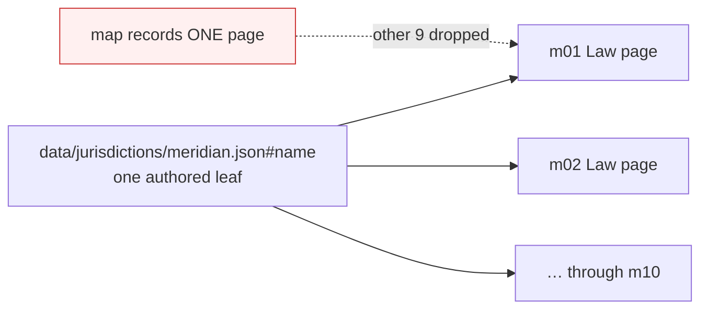

# Shared and Embedded Authored Scalars - Plan

## Goal Capsule

**Objective.** Let one piece of authored text be registered everywhere it renders,
and let an authored fragment inside a part-computed sentence be edited on its own —
so an edit states its true reach before John commits it.

**Product authority.** Damien, in the 2026-08-04 brainstorm. The roles model, the AI
Editor, and the D2/D8 editor-ceiling work are not active scope here.

**Open blockers.** None. The last one — what the editor does for a computed value
whose source has no editing surface — is settled by R12.

## Product Contract

### Summary

Teach the editor map that an authored leaf can render in more than one place, and
that an element can hold an authored fragment beside a computed one. Shared text is
marked before it is clicked, an edit names every surface it will change, and John may
apply it everywhere or to one surface only.

### Problem Frame

The map registers an editable block against exactly one JSON leaf and assumes the
rendered element contains exactly one scalar. Two shapes break that assumption: a
leaf that renders on several surfaces, and an element that mixes authored text with
values the builder computes.

Both are discarded rather than represented. `EDMAP.sources` is keyed by `source_ref`
on a first-registration-wins basis (`tools/build_site.py:232-258`), and the worker's
`BLOCK_BY_SRCREF` repeats it (`app/worker/src/editor-map.js:90-100`). A second
registration of the same leaf is dropped at build and again at serve.

The consequence is not that shared text is uneditable. It is that shared text is
editable **and silently coupled**: the map knows one surface, the rebuild changes all
of them. Commit `ca726aa` withdrew six module leaves for exactly this reason — one
home-page edit silently changed another page.

Two independent measurements disagree about how large the hazard is, and the
disagreement is itself informative.

Measured directly from the committed map: **213** registered leaves render on more
than one page — 193 Meridian canon leaves on all ten Law pages, and 20 matter
captions on two pages each. Zero registered blocks currently fail the embedded-text
hash test.

That number is a floor, not a total, because the map can only see renders that carry
an annotation. Task names are registered on the Skills page
(`tools/build_site.py:1643-1652`) and rendered again, unannotated, on the module page
(`tools/build_site.py:1460-1470`) — a genuine silent coupling that no map-based count
can detect. A wider audit put the figure near 483 by matching path shapes and
rendered text, but text equality cannot distinguish a shared leaf from two leaves
that happen to read alike, so that figure is unproven.

The honest statement: at least 213 leaves are coupled and provably so, an unknown
further set is coupled through unannotated renders, and no artifact today can
enumerate the second group. The 24 registrations withdrawn during the page-copy
migration were the cases someone noticed. R14 exists to convert this unknown into a
build failure rather than an audit.

### Key Decisions

- **Record occurrences on the existing block, rather than one block per surface.**
  Block identity is load-bearing in stored suggestions, the apply engine, and pending
  overlays; changing it on a live system risks work already in flight.
  (session-settled: user-directed — chosen over a block-per-surface group model and
  over making sharing an explicit authoring concept: least disturbance to a live map.)
  Governs R1, R2.

- **One edit reaches every occurrence by default; a single-surface edit is the
  deliberate exception.** The practicum's value is one canonical corpus, so divergence
  is opt-in rather than the default. (session-settled: user-directed — chosen over a
  canonical-surface-only model and over forking on every edit.) Governs R3, R4.

- **A recorded override is intentional and the inconsistency checker stays silent on
  it.** A checker that reports working-as-intended divergence stops being read, and
  its 16/16 signal is worth protecting. (session-settled: user-directed.) Governs R5, R6.

- **Close the silent coupling before adding new editable surface.** The invisible
  correctness bug outranks the visible win of more editable pages.
  (session-settled: user-directed.) Governs R12, R13.

- **A locked value is a doorway, not a dead end.** Selecting a computed value offers
  passage to wherever its source is edited. (session-settled: user-directed — the
  user added this to the offered option.) Governs R10, R11.

### Actors

- A1. **John** — the author. Writes and edits the practicum's prose. Sees warnings,
  chooses reach, and may override one surface.
- A2. **Damien** — approves edits into the corpus and publishes them. Needs override
  history to remain visible and auditable.
- A3. **The inconsistency checker** — reports contradictions across the corpus, and
  must distinguish a deliberate override from a mistake.
- A4. **The build** — registers blocks and is the only place a coupling violation can
  be caught before it reaches the editor.

### Requirements

**Text that renders in more than one place**

R1. A leaf's full set of render sites is available wherever an edit is authorized.
The map's page entries already carry repeated annotated occurrences; the worker
collapses them to one descriptor per `source_ref`, and an unannotated render is
absent entirely. Both gaps close.

R2. Before an edit to a multi-occurrence leaf is committed, the editor names the
other surfaces that edit will change.

R3. John can apply the edit to every occurrence or to the current surface only.

R4. A current-surface-only edit produces a surface-owned copy of that text;
later edits to the original no longer reach the copy.

R5. Each override records that it was deliberate, by whom, and when.

R6. The inconsistency checker treats a recorded override as intended and does not
report it, while continuing to report undeclared divergence.

R7. Text that renders in more than one place is visually distinguishable in the
editing view before it is selected.

R8. John can see the set of current overrides and return any one of them to the
shared text.

**Sentences that mix authored and computed text**

R9. An authored fragment inside a mixed element is editable independently of the
computed text beside it.

R10. A computed value is not editable and is visually distinguishable from authored
text.

R11. Selecting a computed value offers to open the surface where its source data is
edited, in a new browser tab.

R12. When a computed value has no such surface, the editor says so plainly and offers
no link.

**Detection and enforcement**

R13. The build fails when a registered block's rendered element contains text beyond
its authored scalar, unless that block declares itself mixed.

R14. The build fails when an authored leaf renders on more surfaces than its block
records.

**Restoring withdrawn coverage**

R15. The 10 Matter Library shape labels, the 8 home module and section leaves, and
the firm provenance line are registered under this contract.

R16. The firm provenance line's split-paragraph workaround is removed, and its
sentence renders as one element again.

### Key Flows

F1. **Editing text that appears in several places.**
**Trigger:** John selects a block marked as multi-occurrence.
**Covers R2, R3, R4, R5, R7.**
The editing view already marks the block as shared. On commit, the editor names the
other surfaces affected and offers two ways forward: change everywhere, or change
here only. Changing everywhere writes the single leaf. Changing here only writes a
surface-owned copy and records the override as deliberate.

F2. **Meeting a computed value inside a sentence.**
**Trigger:** John selects a computed value in a mixed element.
**Covers R9, R10, R11, R12.**
The authored fragment beside it is editable as an ordinary block. The computed value
is not; selecting it offers to open the surface that edits its source data in a new
tab. When no such surface exists, the editor says so and offers no link.

### Acceptance Examples

AE1. **Covers R2, R3.** A module title renders on the home page and the module cover.
John edits it on the home page. Before committing, he is told the module cover will
also change, and is offered change-everywhere or change-here-only.

AE2. **Covers R4.** John chooses change-here-only on the home page. He later edits
the same title on the module cover. The home page keeps its overridden wording.

AE3. **Covers R6.** After AE2, the inconsistency checker runs and reports nothing
about that title, while still reporting an undeclared divergence elsewhere.

AE4. **Covers R11.** John selects the computed matter name in a packet header. He is
offered passage to the surface that edits that matter's data, which opens in a new tab.

AE5. **Covers R12.** John selects a computed value whose source has no editing
surface. He is told where the value comes from and that it cannot be edited here. No
link is offered.

AE6. **Covers R13.** A block is registered against an element that also renders a
computed value, without declaring itself mixed. The build fails.

AE7. **Covers R14.** A leaf is registered on one page but renders on three. The build
fails.

### Scope Boundaries

**Deferred for later**

- Shared or embedded leaves that are unregistered beyond the 24 named in R15. Their
  number is not reliably known today; R14 is what will enumerate them. Handled once
  the contract is proven on real content.
- Making sharing an explicit authoring concept, where a shared string becomes a named
  term surfaces reference by name. The direction to drift toward, not a migration to
  start now.

**Outside this work**

- The roles model and the AI Editor. They will meet this contract, but neither is
  decided here.
- The D2 scoped-change ceiling and the D8 live UAT. Unrelated to the map contract.

### Dependencies and Assumptions

- Block identity (`source_ref`, `index`) must stay stable through this change;
  suggestions are already stored against it and pending overlays resolve by it.
- An embedded violation is already mechanically detectable: `original_hash` covers the
  element's full rendered text while `norm_hash(original_text)` covers only the
  authored scalar, so the two disagree exactly when an element holds more than its
  scalar. Only narrowly-scoped tests act on that symptom today
  (`tools/tests/test_editable_coverage.py:198-206`).
- No subrange or authored-fragment representation exists in any layer today; the
  client replaces an element's whole `textContent` (`app/editor/editor.js:265-285`,
  `:1033-1049`). R9 needs a new mechanism, not a configuration change.
- `tools/check_build_parity.py` must run after any `data/` change; it moves the spine
  id and leaves the persona and instructor bundles stale.
- Counts in the Problem Frame come from two passes that disagree. Independent
  re-derivation from the committed map confirms 5,917 block entries, 2,623
  JSON-scalar entries, 866 unique JSON-scalar refs, 213 cross-page shared refs, and
  **zero** embedded hash mismatches. A wider audit's figures — 1,158 shared-or-embedded
  leaves, 675 unregistered, 483 coupled — could not be reproduced and should not be
  planned against. Use 213 as the proven floor.
- Because no registered block currently fails the embedded-text test, the
  mixed-sentence half of this work (R9-R12) adds new capability rather than repairing
  existing violations. Only the shared half repairs a live hazard.

### Outstanding Questions

**Deferred to Planning**

- Which surface edits the source of each class of computed value — matter captions,
  jurisdiction canon, task metadata, firm KPI figures. Settled against the code, per
  R11; a class with no surface falls to R12 rather than blocking.
- Where a surface-owned override is stored in `data/`, and how it is addressed.
- How occurrences are keyed on a block so the record survives a rebuild that moves a
  block's index.
- Whether R13 and R14 fail the build outright or gate behind an allowlist while the
  213 known-coupled registrations are brought under the contract.

### Sources

- `app/worker/src/editor-map.js:90-100` — first-descriptor-wins index; the serve-side
  half of the coupling bug.
- `tools/build_site.py:232-258` — `EDMAP.sources` first-registration-wins; the
  build-side half.
- `tools/build_site.py:1643-1652` — the skills renderer moving chips outside the
  annotated element to keep one scalar per candidate; the pattern R9 generalizes.
- `tools/build_site.py:2746-2757` — the firm provenance split-paragraph workaround
  R16 removes.
- `tools/tests/test_editable_coverage.py:198-206` — the scoped test that turns the
  embedded-scalar symptom into a failure.
- Commit `ca726aa` — withdrew six module leaves because one home edit silently changed
  another page.
- Commit `e3bac64` — withdrew the ten shape labels and introduced the provenance split.
- `docs/plans/2026-07-28-002-feat-word-like-practicum-editing-plan.md` — why the
  editing design is what it is.
