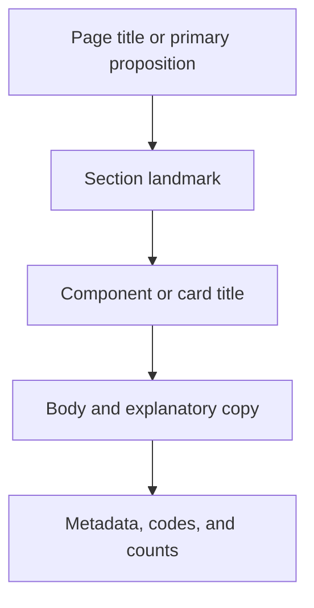
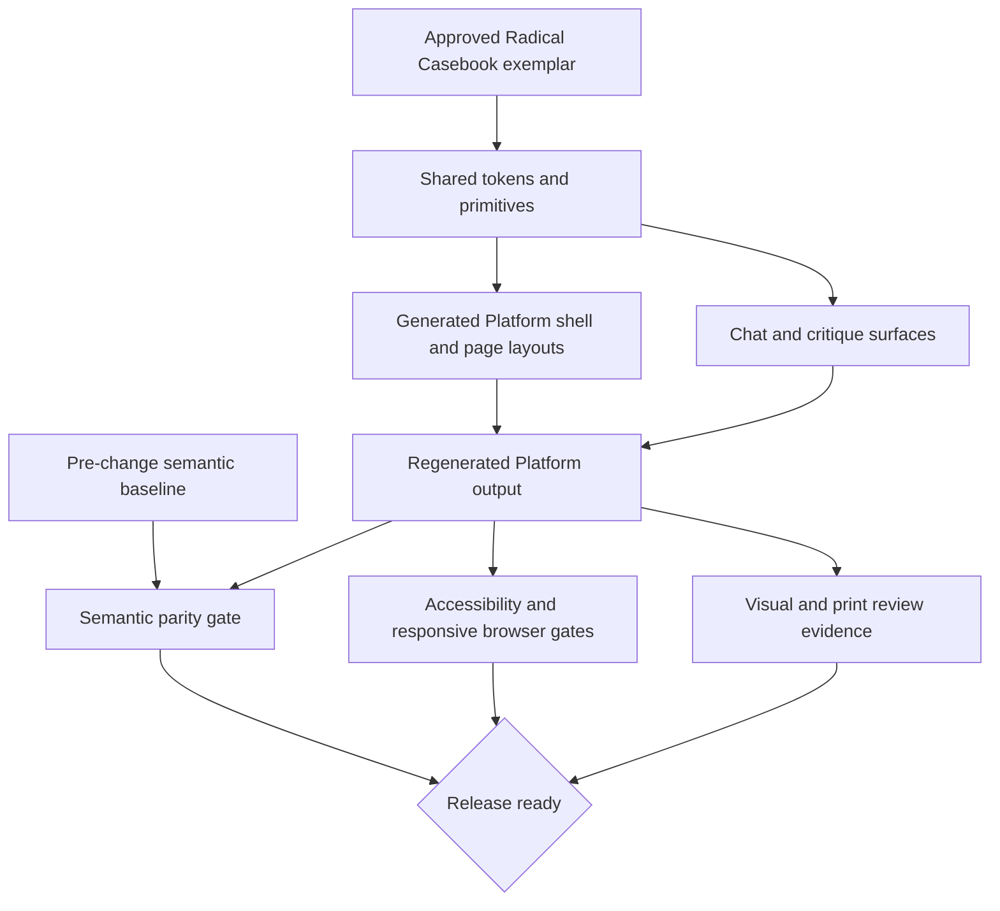

# Platform Visual Redesign - Plan

## Goal Capsule

**Objective.** Redesign every Platform surface around a bold contemporary
editorial system whose typography, layout, navigation, and components make each
page's hierarchy immediately legible.

**Product authority.** Damien, through the approved Radical Casebook visual
direction and its refined muted-claret exemplar. Existing authored words,
curriculum, data, meaning, and functionality are not active redesign material.

**Open blockers.** None. Cross-interface Large Type behavior is authorized as the sole accessibility exception to the behavior-preservation boundary.

**Execution profile.** Code work with characterization-first verification. One owner should edit the shared theme and generator during each wave.

**Stop conditions.** Stop if the redesign requires authored-text, data, destination, information-architecture, or editor-identity changes. Stop on any behavior change other than the authorized Large Type unification.

**Tail ownership.** The implementing agent owns regenerated Platform output, automated checks, browser evidence, and removal of abandoned styling experiments.

---

## Product Contract

### Summary

Apply the approved Radical Casebook direction across the full Platform: bold
editorial hierarchy, warm paper, deep muted claret, differentiated surfaces,
and restrained machine typography. The redesign may freely reshape visual
presentation while preserving substantive text and behavior.

### Problem Frame

The current Platform contains strong editorial ingredients, but their rendered
hierarchy can contradict their semantic importance. The home-page proposition
can appear smaller than its supporting paragraph, while section landmarks such
as “The Three Volumes” read like incidental metadata. Similar small mono labels
recur throughout the system.

The result feels typographically flat even though the underlying content has a
clear hierarchy. Fixing only the pictured home page would leave the same visual
language unresolved across modules, skills, matters, firm views, templates, and
document-heavy pages.

### Key Decisions

- **Adopt Radical Casebook as the system direction.** (session-settled:
  user-directed — chosen over Civic Institution and Working Atlas: its colors
  and bold editorial character best fit the Platform.) Governs R1, R2, R3.

- **Redesign the entire Platform as one system.** (session-settled:
  user-directed — chosen over landing-page-only and home-page-first scopes: the
  hierarchy should remain coherent on every surface.) Governs R4, R5.

- **Reimagine visual presentation without preserving the existing identity.**
  (session-settled: user-directed — chosen over conservative and evolutionary
  refreshes: the current identity is not a constraint.) Governs R1, R4.

- **Preserve substantive text and behavior except for Large Type unification.**
  (session-settled: user-directed — chosen over broader content revision and
  behavior changes: this work is design-only apart from the accessibility
  exception.) Governs R8, R9.

- **Keep Large Type as an additional accessibility mode.** (session-settled:
  user-directed — chosen over making it the baseline or removing the control:
  the refreshed default and enhanced mode serve distinct needs.) Governs R6,
  R7.

- **Use muted emphasis rather than alert-like red.** (session-settled:
  user-approved — chosen over the bright featured-card treatment: emphasis
  should support hierarchy without shouting.) Governs R3.

### Requirements

**Visual language and hierarchy**

- R1. The Platform must use one recognizable Radical Casebook visual language
  across typography, spacing, layout, navigation, cards, controls, and other
  recurring components.

- R2. Page titles, section headings, supporting copy, labels, metadata, and
  actions must have visibly distinct levels that match their semantic
  importance.

- R3. The palette must center warm paper, dark ink, and deep desaturated claret;
  large saturated-red surfaces must not dominate ordinary content.

**System coverage**

- R4. The redesign must cover home, module, skills, matter, firm, template, and
  document-oriented Platform pages rather than optimizing only landing pages.

- R5. Content-dense pages must retain clear reading order, scanning landmarks,
  and differentiated surfaces without becoming visually noisy.

**Accessibility and responsive behavior**

- R6. The refreshed default must be comfortably readable without relying on
  Large Type mode.

- R7. Large Type mode must remain a distinct enlargement above the refreshed
  baseline and must preserve hierarchy, usable layouts, and control access.

**Content preservation**

- R8. The redesign must make no substantive change to authored words,
  curriculum, data, meaning, functionality, or information architecture except
  for the authorized cross-interface Large Type unification.

- R9. Presentational treatment may change wrapping, grouping, casing, or visual
  placement only when the authored wording and meaning remain intact.

### Acceptance Examples

- AE1. **Covers R2.** Given a page with a primary proposition and supporting
  paragraph, when viewed at a normal desktop width, then the proposition is
  unmistakably the dominant text.

- AE2. **Covers R2, R5.** Given a content-dense matter or document page, when a
  reader scans it, then section landmarks are distinguishable from metadata and
  the reading order remains evident.

- AE3. **Covers R3.** Given an emphasized card among peer cards, when the group
  is viewed together, then the emphasized card is noticeable without resembling
  an alert or overpowering its title and neighbors.

- AE4. **Covers R6, R7.** Given any redesigned Platform page, when Large Type is
  toggled on, then text enlarges beyond the readable baseline without clipping,
  overlap, inaccessible controls, or a broken hierarchy.

- AE5. **Covers R4, R8, R9.** Given the same generated Platform corpus before
  and after the redesign, when text and behavior are compared, then no authored
  wording, meaning, destination, or capability has changed except for the
  authorized cross-interface Large Type unification.

- AE6. **Covers R4, R5.** Given desktop and narrow viewport presentations of a
  redesigned page, when the layout reflows, then the same content hierarchy and
  reading order remain understandable without horizontal scrolling.

### Scope Boundaries

- No substantive rewriting, copyediting, curriculum revision, data revision,
  or semantic relabeling.
- No new product capability, workflow, destination, or information-architecture
  change beyond making the existing Large Type capability consistent across
  generated pages, interview, and critique.
- No requirement to preserve the current Practicum Press identity, component
  shapes, or layout conventions.
- The approved exemplar is directional rather than a pixel-perfect production
  specification.

### Success Criteria

- A reader can distinguish page, section, component, body, and metadata levels
  without relying on content familiarity.
- The Radical Casebook voice remains recognizable across promotional and
  information-dense pages.
- Visual emphasis feels editorial rather than promotional or alert-like.
- The baseline and Large Type modes both remain legible and structurally sound
  across desktop and narrow viewports.
- A content comparison finds no substantive text change attributable to the
  redesign.

### Sources / Research

- `docs/research/design-direction.md` documents the existing Platform design
  contract, accessibility expectations, and typography roles.
- `site/platform/assets/theme.css` contains the shared visual tokens and Large
  Type scale used by generated pages.
- `site/platform/platform.css` contains the current Platform layout and
  hierarchy selectors.
- `tools/build_site.py` owns the generated Platform markup and shared layout
  styles.

- `docs/solutions/orchestration/2026-07-17-fleet-built-platform-in-a-day.md` records the shared-token convergence pattern and the need for one owner per shared generator file.

- `docs/solutions/editor/2026-07-28-durable-block-identity.md` defines the editor-identity invariants that layout changes must preserve.

- `docs/solutions/editor/2026-07-28-checks-that-cannot-fail.md` requires perturbation tests for absence and parity gates.

- `docs/solutions/editor/2026-07-28-headful-harness-needs-xauthority.md` records the Xwayland requirements for real-browser verification.

---

## Planning Contract

### Key Technical Decisions

- KTD1. **Keep design tokens and global primitives in the shared theme.** Extend `site/platform/assets/theme.css` for palette, type scales, surfaces, focus, contrast, motion, and print behavior. Keep page-layout rules in the generated Platform stylesheet. This preserves the existing source-of-truth boundary and governs R1-R7.

- KTD2. **Translate the exemplar into tokens and primitives instead of copying mockup CSS.** Reuse the embedded Fraunces, Spectral, and Fragment Mono assets. Introduce named Radical Casebook primitives for surface contrast, editorial labels, borders, and restrained emphasis. This governs R1-R3.

- KTD3. **Unify Large Type across generated pages, interview, and critique.** (session-settled: user-directed — chosen over preserving today's per-surface behavior: the entire Platform should receive the accessibility mode.) Use one pre-paint persistence contract and the same `html.type-lg` variable substitution on all three interfaces. Migrate the existing hyphenated and underscored storage-key states without losing a saved preference. This governs R6-R8.

- KTD4. **Characterize static and interactive parity separately before changing presentation.** Record normalized visible text, link destinations, heading order, page coverage, and durable editor block identity for generated pages. Verify JavaScript-created interview and critique content through their interaction harnesses. Include deliberate mutations that prove each gate fails. This governs R8-R9.

- KTD5. **Treat generated output as derived state.** Edit generator templates and shared assets, then regenerate the complete Platform. Do not hand-edit generated HTML, `site/platform/platform.css`, or `site/platform/platform.js`. This governs R1, R4-R5, R8-R9.

- KTD6. **Include chat, critique, and print in the system redesign.** (session-settled: user-approved — chosen over generated-content pages only: these are user-facing Platform surfaces and share the design system.) Preserve their behavior while aligning their visual hierarchy. This governs R1, R4-R9.

- KTD7. **Make browser verification a release gate.** Extend the existing headful harness to cover representative page families at desktop and narrow widths in baseline and Large Type modes. Print review is required for document-oriented pages. This governs R2-R7.

- KTD8. **Replace the binding visual contract atomically.** Update `docs/research/design-direction.md` with the shared tokens so Radical Casebook becomes authoritative. Preserve local fonts, token ownership, accessibility, editor identity, and generated-source boundaries while retiring incompatible Practicum Press palette and identity mandates. This governs R1-R7.

### High-Level Technical Design

The redesign preserves three source boundaries. `site/platform/assets/theme.css` owns semantic tokens and reusable visual primitives. `tools/build_site.py` owns generated-page chrome, page-family markup, `PLATFORM_CSS`, and `PLATFORM_JS`. `app/chat/` owns interview, critique, and BYOK-specific DOM and layout rules while consuming shared tokens and primitives. Interactive layouts do not move into generated-page CSS, and generated chrome is not assumed to exist on interactive pages. Generated files remain verification outputs rather than independent editing surfaces.

Static generated-page parity and dynamic interactive parity are separate gates. The editor map excludes chat and assets, so a green generated-corpus comparison cannot stand in for rendered interview or critique coverage.

### Implementation Constraints

- Preserve the existing no-third-party-request font and asset posture.
- Preserve saved Large Type preferences while converging the existing `sonsteng-type-lg` and `sonsteng_type_lg` states on one pre-paint contract.
- Preserve focus visibility, reduced motion, increased contrast, target-size rules, and print content safety.
- Preserve editor block IDs, source references, block kinds, page association, authored original text, and rendered block-marker exclusion. Treat positional indices as placement diagnostics rather than durable identity.
- Keep `tools/build_site.py --check` leak and link gates intact.
- Keep design changes separate from adjacent editor, data-spine, Worker, and curriculum refactors.

### Sequencing

1. Capture and prove the semantic baseline before visual source changes.
2. Replace the binding visual contract and establish Radical Casebook tokens and primitives.
3. Update the shared shell and generated page families against those primitives.
4. Align chat, critique, responsive, Large Type, and document-print surfaces.
5. Regenerate the full Platform and run semantic, structural, accessibility, browser, and visual gates.

### Risks and Mitigations

- **Generated-tree noise can hide content drift.** Use the semantic baseline from KTD4 before reviewing raw generated diffs.
- **Layout regrouping can be mistaken for editor identity drift.** Compare durable identity fields separately from positional hints, then verify the affordance remains attached to the same block.
- **A green absence check can measure nothing.** Add independent canaries that perturb each protected semantic dimension.
- **Large Type can overflow after baseline scale changes.** Exercise each representative page family in both modes at desktop and narrow widths.
- **Shared theme changes can unintentionally affect chat or print.** Include both surfaces in the same browser and print verification wave.
- **A shared token rename can break JavaScript-injected layouts.** Inventory consumers in `app/chat/chat.js`, `app/chat/critique.js`, and `app/chat/byok.js`; retain compatibility aliases or update all consumers in one wave.
- **Static parity can omit JavaScript-created content.** Report generated and interactive coverage separately and require a canary in each boundary.
- **Conflicting design authorities can restore the retired identity.** Replace the binding design-direction contract in the same wave as token changes.
- **Concurrent edits can destabilize the monolithic generator.** Keep one owner for `tools/build_site.py` and `site/platform/assets/theme.css` per implementation wave.

### Alternatives Considered

- **Hand-edit generated pages.** Rejected because regeneration would erase the work and allow page families to drift.
- **Restyle only the home and index pages.** Rejected because it would leave dense Platform surfaces in the old hierarchy.
- **Rely on screenshots and reviewer judgment for text preservation.** Rejected because visual comparison cannot prove semantic or editor-map parity.
- **Fork a separate Large Type layout.** Rejected because the existing variable-substitution model keeps both modes aligned with less drift.

---

## Implementation Units

### U1. Semantic and editor-identity baseline

- **Goal:** Create a characterization gate that proves R8-R9 before visual implementation begins.
- **Requirements:** R8, R9; AE5.
- **Dependencies:** None.
- **Files:** `tools/platform_semantic_contract.py` (new), `tools/tests/test_platform_semantic_contract.py` (new), `tools/tests/fixtures/platform-semantic-baseline.json` (new), `tools/tests/fresh_site_build.py`, `tools/stamp_block_ids.py`.
- **Approach:** Build the complete Platform through the production entry point. Normalize each generated page into visible authored text, ordered headings, link destinations, and stable page identity. Reuse the existing editor-map equivalence logic for durable block ID, source reference, block kind, page association, and authored original text. Require positional uniqueness and resolvability without freezing presentational walker indices. Exclude presentational generated glyphs from authored-text comparison. Capture the pre-redesign baseline before changing visual sources.
- **Patterns to follow:** Use the redirected fresh-build harness in `tools/tests/fresh_site_build.py`. Follow the full-corpus and perturbation guidance in `docs/solutions/editor/2026-07-28-checks-that-cannot-fail.md`.
- **Test scenarios:**
  1. An unchanged clean build matches every baseline page and editor block.
  2. A deliberate authored-text mutation fails with the page and normalized text difference.
  3. A deliberate link-target mutation fails with the changed destination.
  4. A deliberate heading-order mutation fails with the changed sequence.
  5. A deliberate block deletion, duplication, ID change, or source-reference change fails with the identity difference.
  6. A reading-order mutation fails even when durable block identities remain present.
  7. A presentational wrapper or class change passes when semantic output and block attachment remain unchanged.
- **Verification:** `python3 -m pytest tools/tests/test_platform_semantic_contract.py -q`.

### U2. Radical Casebook tokens and primitives

- **Goal:** Establish the approved visual vocabulary once for every consumer of the shared theme.
- **Requirements:** R1-R3, R6-R7; AE1, AE3, AE4.
- **Dependencies:** U1.
- **Files:** `docs/research/design-direction.md`, `site/platform/assets/theme.css`, `site/platform/assets/preview.html`, `tools/tests/test_platform_visual_contract.py` (new).
- **Approach:** Replace the current palette and type-scale contract with named warm-paper, ink, muted-claret, accent, contrasting-surface, border, and shadow tokens. Promote editorial labels above metadata size. Rework shared heading, card, action, navigation, focus, contrast, reduced-motion, and print primitives. Recalibrate the baseline and Large Type variables together.
- **Patterns to follow:** Preserve the shared token boundary in `docs/research/design-direction.md` while superseding its former palette values. Reuse the embedded font roles in `site/platform/assets/fonts.css`.
- **Test scenarios:**
  1. Required palette, surface, hierarchy, and type-scale tokens exist and shared primitives consume them.
  2. Large Type overrides every baseline type variable that affects hierarchy.
  3. Ordinary emphasis uses the muted-claret token rather than a saturated alert surface.
  4. Focus, reduced-motion, increased-contrast, and print rules remain present.
  5. The asset graph introduces no third-party font or stylesheet request.
- **Verification:** `python3 -m pytest tools/tests/test_platform_visual_contract.py -q` and `DISPLAY=:0 node tools/a11y_audit.js site/platform/assets/preview.html` when the browser is available.

### U3. Generated shell and page-family layouts

- **Goal:** Apply the new hierarchy and component system to all generated curriculum and firm surfaces.
- **Requirements:** R1-R5, R8-R9; AE1-AE3, AE5-AE6.
- **Dependencies:** U1, U2.
- **Source files:** `tools/build_site.py`, `tools/tests/test_platform_visual_contract.py`.
- **Regenerated outputs:** Generated page HTML plus `platform.css` and `platform.js` under `site/platform/` are derived and review-only; authored assets such as `site/platform/assets/preview.html` remain source files. Reject independent edits to generated outputs that do not reproduce from source.
- **Approach:** Update shared masthead, breadcrumbs, footer, hero, section landmarks, cards, controls, and page-family layout rules at their generator source. Cover home, modules, skills, matters, facts, law, firm, templates, about, catalog, packets, visualizations, and document prose. Use distinct surfaces and hierarchy without changing destinations or authored values. Regenerate the complete Platform only after source changes settle.
- **Patterns to follow:** Keep the existing `page()` shell and `PLATFORM_CSS` ownership in `tools/build_site.py`. Keep palette and font values out of page-level CSS.
- **Test scenarios:**
  1. Every generated page family uses the new shell and shared hierarchy classes.
  2. Home-page title and section landmarks outrank supporting copy and metadata.
  3. Dense matter, document, skill, and firm pages retain ordered headings and clear scan landmarks.
  4. Cards and controls use shared surface primitives without saturated-red dominance.
  5. The full semantic and editor-identity contract remains unchanged.
  6. Internal links, leak sweeps, and external-request restrictions remain green.
- **Verification:** `python3 tools/build_site.py --check`, `python3 -m pytest tools/tests/test_platform_semantic_contract.py tools/tests/test_platform_visual_contract.py -q`, and `python3 tools/check_build_parity.py` after all derived bundles are rebuilt.

### U4. Interview, critique, responsive, and print surfaces

- **Goal:** Complete the system across the remaining user-facing and alternate presentation modes.
- **Requirements:** R1-R9; AE2, AE4-AE6.
- **Dependencies:** U2, U3.
- **Files:** `app/chat/index.html`, `app/chat/critique.html`, `app/chat/chat.js`, `app/chat/critique.js`, `app/chat/byok.js`, `app/chat/test.html`, `site/platform/assets/theme.css`, `tools/tests/test_platform_visual_contract.py`.
- **Approach:** Align interview and critique layout CSS with Radical Casebook primitives while preserving interaction behavior and copy. Apply those primitives to the BYOK chip, drawer, form, warning, and actions without changing their behavior or copy. Make Large Type available through one migrated, pre-paint preference contract on both interfaces. Verify interface-specific chrome expresses the shared visual language. Update responsive rules for interactive surfaces and print rules for generated document families. Do not invent print or export behavior for interview or critique.
- **Patterns to follow:** Keep chat source under `app/chat/`; let the build copy it into generated output. Preserve text-only DOM writes and existing accessibility semantics.
- **Test scenarios:**
  1. Interview and critique pages use the same palette, typography roles, surfaces, and action hierarchy as generated pages.
  2. Existing chat and critique interactions pass without changed labels, destinations, or behavior other than the authorized Large Type unification.
  3. Desktop and narrow layouts remain usable in baseline and Large Type modes.
  4. Document print output removes navigation and decorative effects while retaining all substantive content.
  5. Chat source and generated copies remain aligned after rebuild.
- **Verification:** The dedicated chat and critique verifier, existing editor verification, and the U5 browser matrix all pass.

### U5. Browser matrix, accessibility gate, and evidence

- **Goal:** Turn responsive, accessibility, Large Type, and print acceptance into repeatable release evidence.
- **Requirements:** R2-R7; AE1-AE4, AE6.
- **Dependencies:** U3, U4.
- **Files:** `tools/platform_browser_matrix.json` (new), `tools/a11y_audit.js`, `tools/verify_platform_layout.js` (new), `tools/verify_chat_critique.js` (new), `tools/shot.js`, `tools/preflight.sh`, `docs/evidence/EP-2026-08-04-platform-visual-redesign.md` (new).
- **Approach:** Define one representative matrix for home, modules, skills, matter library, packet, facts, law, firm, templates, interview, and critique. Reuse it across accessibility, layout, screenshots, and evidence. Exercise desktop and narrow widths in baseline and Large Type modes. Check a per-family hierarchy map using computed size, weight, and spacing relationships, with named exceptions. Emulate print media for templates, packet or case file, facts, and law. Drive the interview and critique mock states through a dedicated verifier. Capture a compact screenshot and print-evidence set.
- **Patterns to follow:** Reuse the Xwayland and `XAUTHORITY` discovery in `tools/preflight.sh`. Trust process exit codes rather than hardcoded assertion totals.
- **Test scenarios:**
  1. Every representative page has one visible H1 and ordered headings.
  2. Every viewport and type mode has no document-level horizontal overflow.
  3. Masthead, navigation, cards, controls, and content remain non-overlapping.
  4. Text and UI contrast, accessible names, and target-size gates report zero failures.
  5. Print preview retains substantive content and removes interactive chrome.
  6. Hierarchy failures identify page, mode, viewport, semantic roles, and computed values.
  7. Removing a required page family from the shared matrix fails its coverage canary.
  8. Interview and critique mock states complete with unchanged copy and interaction outcomes.
  9. Print emulation hides interactive chrome while keeping representative substantive regions visible and unclipped.
  10. Desktop and narrow screenshots show the approved hierarchy and muted emphasis.
  11. Browser launch failure is reported as skipped or failed evidence, never as a passing gate.
- **Verification:** `bash tools/preflight.sh`, `DISPLAY=:0 node tools/verify_platform_layout.js`, and screenshot review through `tools/shot.js`.

---

## Verification Contract

| Gate | Command | Covers | Pass condition |
|---|---|---|---|
| Semantic and editor parity | `python3 -m pytest tools/tests/test_platform_semantic_contract.py -q` | U1, U3, U4; R8-R9 | Baseline and all perturbation tests pass. |
| Visual contract unit checks | `python3 -m pytest tools/tests/test_platform_visual_contract.py -q` | U2-U4; R1-R7 | Token, mode, source-boundary, and page-family assertions pass. |
| Spine integrity | `python3 tools/validate_spine.py` | U3-U4; R8 | All integrity checks pass without data edits. |
| Generated-site checks | `python3 tools/build_site.py --check` | U3-U4 | Build, internal links, leak sweeps, and external-request checks pass. |
| Derived bundle parity | `python3 tools/build_worker_personas.py && python3 tools/build_instructor_bundle.py && python3 tools/check_build_parity.py` | U3-U4 | Every derived bundle reports the same spine build ID. |
| Existing Python regression suite | `python3 -m pytest tools/tests/ -q` | U1-U4 | All existing and new tests pass. |
| Existing Worker regression suite | `cd app/worker && node --test test/*.test.js` | U4 | All Worker behavior tests pass unchanged. |
| Accessibility audit | `DISPLAY=:0 node tools/a11y_audit.js` | U2-U5; R2-R7 | Zero FAIL findings on the representative page set. |
| Responsive and Large Type matrix | `DISPLAY=:0 node tools/verify_platform_layout.js` | U3-U5; R2-R7 | Every viewport and mode assertion passes. |
| Interview and critique behavior | `DISPLAY=:0 node tools/verify_chat_critique.js` | U4-U5; R6-R9 | Mock states, copy, controls, and the unified Large Type preference pass. |
| Print-media matrix | `DISPLAY=:0 node tools/verify_platform_layout.js --print` | U4-U5; R4-R9 | Document-family chrome is hidden and substantive regions remain visible and unclipped. |
| Full preflight | `bash tools/preflight.sh` | U1-U5 | Every applicable gate passes; browser skips are reported explicitly. |
| Human visual and print review | Review `docs/evidence/EP-2026-08-04-platform-visual-redesign.md` | U5 | Evidence matches the approved Radical Casebook direction and contains no unresolved visual defect. |

Browser gates require a reachable X display and the active Xwayland authorization cookie. If unavailable in a worker or CI shell, the orchestrating agent must run them in a suitable headful environment before declaring the redesign done.

---

## Definition of Done

- U1 is done when the clean baseline passes and independent semantic canaries prove that text, link, heading, reading-order, and durable editor-identity drift are detected.
- U2 is done when Radical Casebook tokens and primitives govern the default, Large Type, contrast, motion, and print modes without external asset requests.
- U3 is done when every generated page family uses the redesigned shell and components and the semantic contract remains unchanged.
- U4 is done when interview, critique, responsive, and document-print surfaces share the visual system without copy changes or behavior changes beyond Large Type unification.
- U5 is done when the browser matrix, accessibility audit, screenshots, and print evidence pass in a real browser.
- The complete Verification Contract is green, with any unavailable browser gate run by the orchestrating agent before completion.
- Generated Platform output is rebuilt from source, and bundle parity is green.
- No substantive text, data, destination, information-architecture, or editor-identity change appears in the final diff, and no behavior changes beyond the authorized Large Type unification appear.
- No hand-edited generated artifact, dead-end CSS, unused token, temporary diagnostic, or abandoned styling experiment remains.
- The final diff contains only the approved redesign, its tests, regenerated outputs, and evidence.
