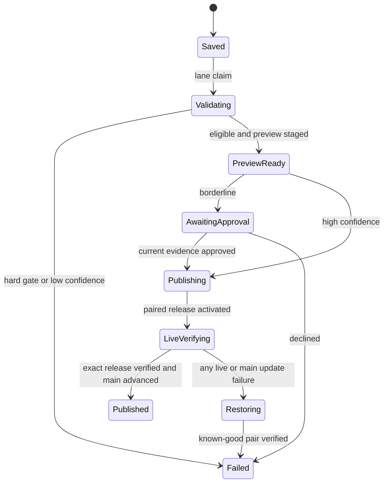
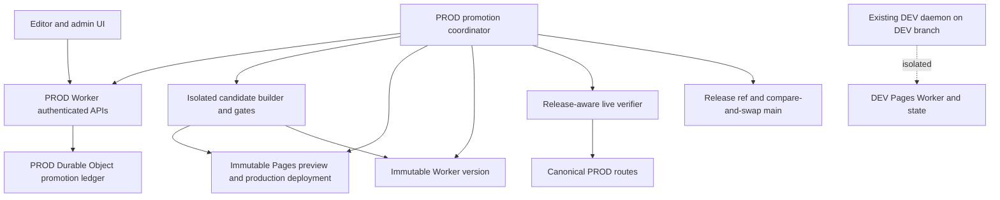
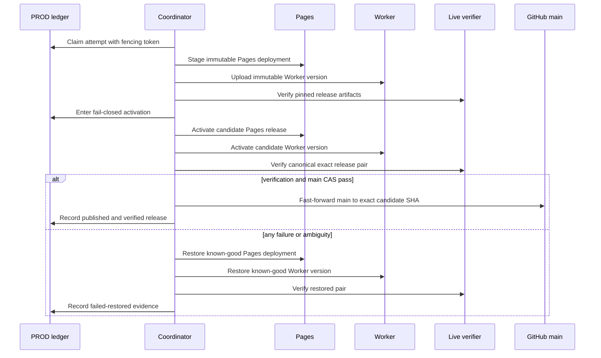
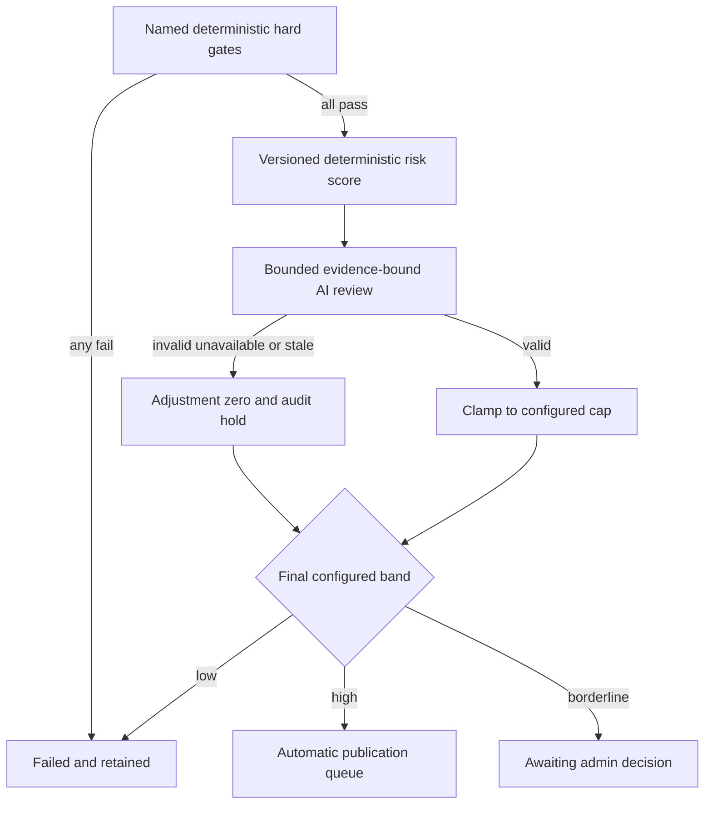

# Production Editor Promotion - Plan

## Goal Capsule

- **Objective:** Give PROD editor saves a safe, observable path from durable candidate to live-verified publication without making routine edits wait for a person.
- **Product authority:** This contract owns PROD editor promotion, conditional approval, live verification, and rollback behavior. DEV direct-apply behavior and Cockpit severity normalization remain outside its product scope.
- **Execution profile:** Deep, security-sensitive infrastructure work. Implement durable contracts and fault recovery before enabling any PROD mutation.
- **Stop conditions:** Stop if a hard gate can be bypassed, a preview cannot be access-controlled, a mixed Pages/Worker release can accept writes, or PROD work can target DEV state or credentials.
- **Tail ownership:** Implementation includes staged rollout, live verification, rollback drill, documentation, and operational handoff. Shipping code without completing those gates does not satisfy this plan.

---

## Product Contract

### Summary

PROD editor saves become serialized release candidates that move through visible validation, preview, approval, publication, and live-verification stages.
Deterministic gates remain absolute, bounded AI review may adjust eligible confidence, and failed live verification automatically initiates restoration of the last known-good release.

### Problem Frame

The production editor can authenticate and render against PROD, but its state is separate from DEV while the existing apply daemon is explicitly DEV-only.
With direct apply enabled, a production save can be accepted without any process that advances it to canonical content or reports a healthy publication heartbeat.
The existing promise that edits publish themselves therefore does not yet hold for PROD.

### Key Decisions

- **Dedicated PROD promotion lane.** Governs R1-R3, R17. (session-settled: user-approved — chosen over extending the DEV daemon or making each edit a PR: PROD needs an independent lifecycle without coupling its availability to DEV.)
- **Automatic staged promotion is the default.** Governs R2, R7, R15. (session-settled: user-directed — chosen over immediate publication or universal human approval: routine edits should remain hands-off while borderline edits may require review.)
- **Editors see explicit stages.** Governs R2. (session-settled: user-directed — chosen over a single generic status or optimistic publication wording: waiting and escalation must be legible.)
- **Any admin may approve.** Governs R7, R9. (session-settled: user-directed — chosen over Damien-only or two-person approval: authorization should follow the existing admin role without a person-specific bottleneck.)
- **Hybrid confidence has asymmetric safety boundaries.** Governs R4-R7, R19. (session-settled: user-directed — chosen over deterministic-only scoring or AI that can override hard failures: AI may make a bounded, auditable adjustment only after deterministic eligibility.)
- **Canonical content equals verified PROD.** Governs R3, R10-R12. (session-settled: user-directed — chosen over merging intended content before deployment or reverting after failure: `main` should always represent the last successfully live-verified release.)
- **Promotion is serialized and revalidated.** Governs R3. (session-settled: user-directed — chosen over batching or parallel promotion: correctness and fresh-base validation outweigh throughput.)
- **Failed live verification restores automatically.** Governs R11-R13. (session-settled: user-directed — chosen over freezing the failed release or retrying first: PROD should return immediately to known-good state.)
- **Preview visibility is narrow.** Governs R8. (session-settled: user-directed — chosen over all-editor or admin-only visibility: the originating editor must verify intent while unrelated editors need not see work in progress.)
- **The normal publication promise is five minutes.** Governs R15. (session-settled: user-directed — chosen over preserving the two-minute promise or giving no expectation: staged validation needs honest but useful timing.)

**Product Contract preservation:** Clarified R1 for pre-acceptance abuse controls and R12 for the provider-restoration failure case; no change to accepted-save durability or automatic recovery scope.

<!-- ce-section: work-relationships -->
### How This Work Fits Together

This plan owns the PROD editor promotion lifecycle.

- **Can proceed independently of:** Cockpit severity normalization, which is a separate cross-repo authoring and presentation contract.
- **Shares:** Existing editor identity, history, validation, drift, and rollback concepts, without making DEV and PROD one operational lane.
- **Enables:** A later decision about retiring fallback editor links only after real PROD saves have completed the full promotion lifecycle.
- **Does not change:** The current DEV direct-apply user promise or its dedicated daemon cadence.

### Actors

- A1. **Originating editor:** Saves a PROD change, follows its stages, and inspects the staged preview.
- A2. **Admin-scoped editor:** Reviews evidence and may approve or decline a borderline candidate.
- A3. **Promotion system:** Serializes candidates, enforces gates, publishes eligible releases, verifies live behavior, and restores known-good state when required.
- A4. **AI reviewer:** Reviews deterministically eligible candidates and records a bounded confidence adjustment with reasons.

### Requirements

**Candidate lifecycle**

- R1. Every authenticated PROD save accepted by bounded admission controls must become a durable candidate before validation begins, and no terminal outcome may discard its content or evidence.
- R2. The editor must expose distinct `saved`, `validating`, `preview ready`, `awaiting approval`, `publishing`, `published`, and `failed` stages with current timestamps.
- R3. The promotion system must process one publication at a time and fully revalidate every waiting candidate against the newly verified release before it advances.
- R4. A deterministic hard-gate failure must block promotion and cannot be offset by risk scoring, AI review, or admin approval.

**Confidence and approval**

- R5. Deterministically eligible candidates must receive a bounded risk score based on explainable signals such as scope, drift, affected surfaces, validation coverage, and conflict history.
- R6. AI review may raise, hold, or lower eligible confidence only within a configured cap, and every adjustment must preserve its reasons and evidence.
- R7. High-confidence candidates must promote automatically, borderline candidates must wait for admin approval, and low-confidence or hard-failed candidates must remain unpromoted with a clear disposition.
- R8. A staged preview and its evidence must be visible only to the originating editor and admin-scoped editors.
- R9. Any admin-scoped editor must be able to approve or decline a borderline candidate, with attribution and rationale preserved.

**Publication and recovery**

- R10. The default branch must identify the last release that passed PROD live verification; a candidate must not advance it before that verification succeeds.
- R11. Publication must include live checks that prove the expected PROD page, editor surface, and relevant generated contracts are serving coherently.
- R12. Failed live verification must automatically initiate restoration of the last known-good release, retain the candidate and evidence, alert admins, and require review before retry; if restoration cannot be proven, the lane must remain durably fenced in `restore_failed` until recovery is verified.
- R13. Candidate state, score inputs, AI adjustment, approval, publication, live verification, restoration, and terminal outcome must form one attributable audit trail.
- R14. Revert requests must enter the same serialized, staged, and live-verified promotion lifecycle rather than bypassing it.

**Operations and trust**

- R15. An automatic candidate should normally reach `published` within five minutes; a candidate awaiting approval is exempt while clearly showing that dependency.
- R16. The editor and admin surfaces must distinguish a healthy idle lane from a stalled or unavailable lane and alert without exposing edit content or credentials.
- R17. PROD promotion failures, pauses, and maintenance must not stop or redirect the existing DEV direct-apply lane.
- R18. Promotion credentials, preview access, logs, alerts, and URLs must preserve the existing no-token-leak and least-privilege expectations.
- R19. Operators must be able to reduce or disable AI upward adjustment without disabling deterministic promotion, and upward authority must remain off until calibration evidence meets an explicit launch criterion.

### Promotion Lifecycle

### Key Flows

- F1. **Automatic promotion**
  - **Trigger:** A1 saves a deterministically eligible, high-confidence change.
  - **Actors:** A1, A3, A4
  - **Steps:** The candidate is persisted, waits for its serialized turn, validates, receives bounded review, exposes a preview, publishes, and passes live verification.
  - **Outcome:** The candidate becomes `published` and the default branch advances to the verified release.
  - **Covers:** R1-R8, R10-R13, R15-R19
- F2. **Borderline approval**
  - **Trigger:** An eligible candidate remains in the borderline band after bounded AI adjustment.
  - **Actors:** A1, A2, A3, A4
  - **Steps:** The candidate exposes its preview and evidence, waits without holding the publication lease, and advances only after an attributed admin decision and fresh-base revalidation.
  - **Outcome:** Approval returns the candidate to the publication queue; decline retains the candidate with a terminal explanation.
  - **Covers:** R3, R5-R9, R13, R15
- F3. **Failed live verification**
  - **Trigger:** An activated candidate fails a required live check or the verified commit cannot fast-forward `main`.
  - **Actors:** A1, A2, A3
  - **Steps:** The system fences editor writes, restores the paired last known-good release, verifies restoration, preserves failure evidence, and alerts admins.
  - **Outcome:** PROD and the default branch again identify the last verified release, or the lane remains durably fenced in `restore_failed` until that outcome is proven; the failed attempt remains actionable but cannot retry in place.
  - **Covers:** R10-R13, R16, R18
- F4. **Concurrent saves**
  - **Trigger:** Another editor saves while a candidate is active or awaiting approval.
  - **Actors:** A1, A3
  - **Steps:** The later candidate persists immediately, then re-anchors and revalidates against the current verified release instead of reusing stale evidence.
  - **Outcome:** Publications never run concurrently or against an obsolete base.
  - **Covers:** R1, R3, R13
- F5. **Production revert**
  - **Trigger:** An authorized revert is requested from history.
  - **Actors:** A2, A3
  - **Steps:** The inverse change becomes a candidate and follows the same validation, preview, confidence, publication, and live-verification stages.
  - **Outcome:** A revert cannot create a site/Worker mismatch or bypass production safeguards.
  - **Covers:** R3-R14

### Acceptance Examples

- AE1. **Covers R4, R7.** Given a candidate with a parity or drift hard failure, when AI review is favorable or an admin attempts approval, then the candidate remains unpromoted and records the hard failure as authoritative.
- AE2. **Covers R5-R7, R19.** Given an eligible borderline candidate, when AI review raises confidence within the configured cap, then it may auto-promote only if upward adjustment is enabled and the resulting score reaches the high-confidence band.
- AE3. **Covers R8-R9.** Given a borderline candidate created by John, when Roger views PROD as a non-originating non-admin editor, then he cannot access its preview; an admin can inspect and decide it.
- AE4. **Covers R3.** Given candidate B is saved while candidate A is publishing, when A succeeds, then B revalidates against A's verified release before any confidence decision is reused.
- AE5. **Covers R10-R13.** Given publication passes preflight but fails a live editor check, when restoration completes, then PROD and the default branch identify the prior verified release and the failed candidate remains available with evidence.
- AE6. **Covers R14.** Given an admin requests a revert, when its generated editor contract would not match the restored site, then the revert cannot become terminally successful until the coherent release passes live verification.
- AE7. **Covers R15-R16.** Given an automatic candidate exceeds five minutes without a terminal result, when an editor or admin checks its status, then the lane is shown as delayed or stalled rather than healthy or published.

### Success Criteria

- Every production candidate has a durable, attributable lifecycle with no silent loss.
- No hard-gate failure, stale-base candidate, stale approval, or unauthorized preview reaches automatic promotion.
- The default branch and live PROD identify the same successfully verified release after every terminal promotion or restoration.
- No mixed Pages/Worker release accepts editor writes or becomes terminally successful.
- Automatic candidates normally publish within five minutes; approval latency is reported separately.
- Operators can quantify AI adjustments, admin agreement, false promotions, restorations, and time in each stage before increasing AI authority.
- DEV direct apply remains independently healthy throughout PROD rollout and failures.

### Scope Boundaries

- The existing DEV direct-apply product lifecycle is not redesigned or merged into the PROD promotion lane.
- Cockpit severity normalization is separate work and contributes no requirements to this plan.
- The plan does not create a general-purpose continuous-delivery platform for non-editor changes.
- Broad collaborative preview sharing, two-person approval, batched or parallel publication, adaptive scoring, and AI ensembles are excluded.
- AI never receives approval, publication, restoration, branch-write, or arbitrary lifecycle-mutation authority.
- Retirement of existing editor doors or tokens is deferred until real PROD promotions succeed through this lifecycle.

#### Deferred to Follow-Up Work

- Add a richer cross-candidate analytics dashboard after the audit schema has real production volume.
- Add an operator CLI on the same authenticated APIs if browser and service workflows prove insufficient.
- Define archival and retention policy when terminal candidate volume warrants deletion or cold storage.

### Dependencies and Assumptions

- Existing editor identity, admin scope, durable candidate state, history, drift detection, validation, and generated-contract checks remain authoritative inputs.
- PROD and DEV retain separate Workers and state namespaces.
- A last known-good PROD release can be identified and restored as one coherent site-and-editor release.
- AI review is advisory within R4-R7 and is unavailable without weakening deterministic promotion.
- Alerts remain content-light and credentials never appear in logs, rendered URLs, or durable evidence.

### Sources and Research

- `docs/prod-enable.md` — separate PROD Worker/state topology, deployment order, verification, authentication, and rollback constraints.
- `docs/direct-apply-daemon.md` — DEV-only boundary, crash safety, heartbeat behavior, history, and revert publication requirements.
- `docs/editor-guide-for-john.md` — current editor promises and visible failure behavior.
- `app/worker/wrangler.jsonc` — environment separation and current production direct-apply setting.
- `tools/direct_apply_daemon.py` and `tools/install-apply-daemon.sh` — current single-environment operational boundary.
- `tools/tests/test_direct_apply_revert.py` — coherent site-and-Worker release requirement for successful reverts.
- `docs/solutions/editor/2026-07-28-generated-artifacts-are-not-tracked-state.md` — generated artifacts and Worker code are part of one reversible release.
- `docs/solutions/editor/2026-07-28-checks-that-cannot-fail.md` — gates need adversarial catch-power proof.
- `docs/solutions/editor/2026-07-28-durable-block-identity.md` — durable identity and revalidation requirements.
- [Cloudflare Workers versions and deployments](https://developers.cloudflare.com/workers/versions-and-deployments/) — immutable Worker version identity and external-state limits.
- [Cloudflare Pages preview deployments](https://developers.cloudflare.com/pages/configuration/preview-deployments/) — immutable preview URLs are public unless Access protects them.
- [Cloudflare Pages rollbacks](https://developers.cloudflare.com/pages/configuration/rollbacks/) — rollback targets and successful-production constraints.
- [GitHub Git references API](https://docs.github.com/en/rest/git/refs) — non-forced compare-and-swap branch advancement.

---

## Planning Contract

### Key Technical Decisions

- KTD1. **PROD owns a separate durable promotion ledger.** Add candidate, attempt, append-only event, evidence, release, and singleton lane records to the PROD Durable Object. The lane owns ordering, legal transitions, approvals, leases, fencing, reconciliation, and audit. Do not overload DEV `suggestions` or `apply_batches`. This implements R1-R3, R9, R12-R13, R16-R17. (session-settled: user-approved — chosen over extending the DEV daemon or making each edit a PR: PROD needs an independent lifecycle without coupling its availability to DEV.)
- KTD2. **Candidate state is an event projection with compare-and-set transitions.** Every mutation carries candidate/attempt identity, expected state, evidence hash where applicable, and a principal-, environment-, resource-, operation-, and body-bound idempotency key. A monotonic fencing token rejects stale coordinators. Reconciliation observes provider and live state at every external-effect boundary before resuming or restoring. This implements R1-R4, R12-R13.
- KTD3. **The coherent release manifest is the publication unit.** Each immutable manifest binds candidate and base commit, candidate ref, immutable Pages preview identity, production Pages deployment ID, Worker version ID, editor-map build ID, generated-contract hashes, and schema version. Activation, verification, restoration, evidence, and audit events cite the manifest hash. This implements R3, R10-R14.
- KTD4. **Pages and Worker activation is a fail-closed saga.** Validate candidate bytes on an immutable Pages preview and upload the Worker version without traffic. Fence PROD writes, upload the same verified bytes as a new production Pages deployment, capture its distinct ID, activate the Worker, and verify the exact pair on canonical routes. Any ambiguity restores and verifies the prior successful production Pages deployment and Worker version. Ordinary Cloudflare gradual Worker deployment is not used because Durable Objects run one version at a time and preview URLs are unavailable for DO Workers. This implements R4, R10-R12, R16-R18.
- KTD5. **`main` advances only by non-forced exact-SHA update after live verification.** Publish the candidate commit to a durable release ref without changing `main`. After canonical verification, compare-and-swap `main` to that exact commit. A conflict or branch-protection failure restores PROD and retains the attempt. Pages automatic production-branch deployment must be disabled so this branch update cannot trigger an uncontrolled second release. This implements R3, R10-R13. (session-settled: user-directed — chosen over merging intended content before deployment or reverting after failure: `main` should always represent the last successfully live-verified release.)
- KTD6. **DEV keeps its product behavior but moves off `main`.** Migrate the existing DEV daemon checkout to a dedicated long-lived DEV branch using its existing `APPLY_DEPLOY_BRANCH` seam. DEV still applies and deploys on its present timer. Only PROD promotion advances `main`. This resolves the current feasibility conflict between R10 and R17 without coupling the lanes.
- KTD7. **Candidate preparation is extracted from DEV deployment.** Refactor pure patch, validation, build, parity, and commit preparation into a reusable phase that returns immutable candidate artifacts and evidence without deploying, merging, or terminally rolling back. Preserve the existing DEV wrapper behavior and tests. This implements R3-R5, R10-R14, R17.
- KTD8. **Risk policy is pure, versioned, explainable, and non-adaptive.** Named hard predicates produce machine-readable failure codes. Eligible candidates receive normalized bounded signals, configured weights, bands, cap, and policy version. Persist every input and result. AI upward cap defaults to zero. This implements R4-R7, R13, R19.
- KTD9. **AI review is an evidence-bound read-only adapter.** Send only allowlisted redacted structured fields and exclude raw candidate content unless a versioned policy proves it indispensable. Require a provider configuration that prohibits model training and bounds retention. Accept only schema-valid output bound to the evidence hash and model/prompt version. Clamp the adjustment to policy bounds. Malformed, stale, injected, timed-out, or unavailable review records `hold` and cannot bypass hard gates or block deterministic-only promotion. This implements R4-R7, R13, R18-R19. (session-settled: user-directed — chosen over deterministic-only scoring or AI that can override hard failures: AI may make a bounded, auditable adjustment only after deterministic eligibility.)
- KTD10. **Approval binds the exact attempt and evidence.** An admin decision records identity, timestamp, rationale, attempt ID, base commit, evidence hash, manifest hash, and idempotency key. An approved candidate rejoins the queue and revalidates. The approval remains valid only when the bound tuple is unchanged; any changed attempt, base, evidence, or manifest requires a fresh decision. Decline is terminal. Retry creates a linked new attempt and reruns every gate. This implements R3, R7, R9, R12-R14. (session-settled: user-directed — chosen over Damien-only or two-person approval: authorization follows the existing admin role without a person-specific bottleneck.)
- KTD11. **Preview is an authenticated, script-contained projection of the promotable artifacts.** Authorize through the existing Worker boundary, then render candidate HTML in a sandboxed iframe without `allow-same-origin`, scripts, navigation, popups, or forms. Permit only the originating editor or an admin. Use a deny-by-default content security policy, uniform unauthorized responses, `private, no-store`, safe referrer policy, escaped evidence, and no URL token. The preview binds candidate, evidence, and manifest hashes and becomes stale on revalidation. This implements R2, R8, R18. (session-settled: user-directed — chosen over all-editor or admin-only visibility: the originating editor must verify intent while unrelated editors need not see work in progress.)
- KTD12. **UI and automation share role-scoped APIs.** Editor, admin, and operator surfaces read the same candidate, event, evidence, lane-health, and release resources. The UI does not hold hidden lifecycle authority. AI has context parity only for its evidence envelope and no mutation parity. This implements R2, R7-R9, R13, R16, R18.
- KTD13. **AI authority unlocks through a measured rollout contract.** Shadow score and AI first. Enable deterministic auto-promotion only after fault recovery and live canaries pass. Enable upward AI adjustment only after a documented sample meets predeclared admin-agreement, false-promotion, hard-gate-escape, restoration, and timing thresholds. The kill switch remains independent from deterministic promotion. This implements R15-R16, R19.

### Assumptions

- The PROD coordinator initially runs as a separate systemd-managed home-box process with its own checkout, timer, lock, state path, credentials, and heartbeat. Automatic promotion remains disabled until a 14-day availability soak and power, network, clock, restart, and storage-failure drills prove the boundary; failure to meet the SLO redirects hosting to a separate planning decision.
- A candidate awaiting admin approval does not hold the publication lease. Later eligible candidates may publish; approval makes the older candidate rejoin and revalidate against the current verified release.
- The dedicated DEV branch is provisioned from the current verified source before the PROD lane is enabled, and migration proves the existing timer, deploy target, history, and revert behavior remain unchanged.
- No cancellation or implicit supersession is added. Each durable save remains a distinct candidate until it reaches a terminal state or an admin declines it.
- Terminal evidence is retained for this release. Alerts remain content-light; detailed evidence stays behind authenticated admin APIs.
- A candidate that changes Durable Object class lifecycle, bindings, or platform resources cannot use the normal five-minute path. It is hard-gated into a separately reviewed maintenance release because Cloudflare rollback cannot always cross those changes.
- Forward-only storage/schema changes or releases that break adjacent-version read/write compatibility use the same maintenance path and require a migration-specific recovery plan.
- An operational release owner role, separate from candidate approvers, owns baseline attestation, phase-transition receipts, alerts, credential rotation, post-release observation, and recovery from an unproven restoration.

### Timing Budget

The five-minute target is measured from durable `saved_at` to terminal `published` for an automatic candidate.

| Stage | Maximum normal budget |
|---|---:|
| Claim delay | 10 seconds |
| Candidate preparation and hard gates | 75 seconds |
| Preview, scoring, and AI review | 45 seconds |
| Production Pages upload and Worker activation | 75 seconds |
| Repeated canonical stabilization checks | 60 seconds |
| `main` compare-and-swap and finalization | 15 seconds |
| Contingency | 20 seconds |

Alert at four minutes and mark the lane delayed at five minutes.
Restoration starts immediately after a publication failure and has its own safety-first timeout; it never weakens verification to recover the publication SLO.

### High-Level Technical Design

#### Component topology

#### Publication and restoration sequence

#### Confidence decision flow

### Sequencing and Delivery Strategy

1. Establish durable data contracts, legal transitions, role-scoped APIs, and migration compatibility before adding a coordinator.
2. Extract candidate preparation while preserving DEV behavior and characterization coverage.
3. Implement scoring, AI review, approval binding, and preview authorization as pure or hermetic contracts.
4. Implement the PROD coordinator, immutable release manifest, provider adapters, fencing, reconciliation, activation, verification, and restoration.
5. Build the editor/admin lifecycle experience on the proven APIs and coordinator states without giving the UI hidden authority.
6. Provision lane isolation and migrate DEV to its dedicated branch before enabling PROD mutation.
7. Roll out in shadow, deterministic canary, and AI-authority phases with explicit pause and restoration drills.

### System-Wide Impact

- **Editors:** Gain honest stage and preview visibility. A short fail-closed maintenance window can temporarily reject PROD writes during paired activation or restoration.
- **Admins:** Gain evidence, decision, pause, retry-authorization, health, and audit views under existing admin scope.
- **Operations:** Own a second service/timer and separate credentials. Provider IDs, release manifests, queue age, lease age, and reconciliation outcome become operational signals.
- **Repository flow:** DEV edits no longer advance `main`; the PROD lane alone updates it after verification. Branch protection and Pages branch-build controls must permit this exact workflow without an implicit deploy.
- **Security:** Preview ACLs, AI evidence minimization, content-light alerts, CSRF, uniform unauthorized responses, and credential separation are release gates.

### Risks and Mitigations

- **Cross-product activation is not atomic.** Fence writes, require backward-compatible adjacent manifests, verify exact release IDs, and restore both sides on ambiguity.
- **No restorable baseline exists on first enablement.** Bootstrap the current canonical Pages ID, Worker ID, contract hashes, and exact `main` SHA into one manifest. Keep mutation disabled unless both provider artifacts remain queryable, restorable, and live-matching.
- **Restoration can fail or remain ambiguous.** Keep writes fenced and the lane in durable `restore_failed` health until the known-good pair is proven. Reconcile observations safely, page the operational release owner, and never convert ambiguity into success or a blind redeploy.
- **Coordinator crash after provider success.** Journal intent before each effect, query provider/live state during reconciliation, and reject stale writers with fencing tokens.
- **Out-of-band publishers can invalidate the journal.** Inventory and disable competing PROD deploy/ref writers. Reconcile provider, canonical, ledger, and GitHub identity before claim, activation, `main` update, and finalization; unexplained drift pauses instead of overwriting.
- **Branch advancement conflicts after live success.** Use non-forced exact-SHA update. Restore the prior release if the update fails so `main` remains truthful.
- **Cloudflare rollback limits.** Retain paired known-good IDs, forbid normal-path platform-resource changes, verify restoration, and drill before enabling automation.
- **AI prompt injection or provider drift.** Treat content as data, use a strict evidence-bound schema, persist model/prompt/policy versions, clamp outputs, and make invalid output a recorded hold.
- **False confidence from checks.** Give every hard gate and bounded signal an adversarial canary that proves catch power. Label unavailable checks as not checked.
- **Immediate probes can miss propagation or delayed failure.** Require repeated exact-manifest agreement during a configured pre-finalization stabilization window and observe after publication. Writes remain fenced until stabilization completes; later regression pauses new claims and uses audited recovery.
- **DEV regression during branch migration.** Characterize timer, worktree, deploy target, history, and revert behavior before migration; verify DEV independently after the cutover.
- **Untrusted content can attack authenticated surfaces.** Bound input size/depth/count, serialize canonically, escape candidate/evidence/model/provider text, minimize AI data, and test stored/reflected XSS and prompt-injection payloads across every display and log boundary.

---

## Implementation Units

### U1. Durable promotion ledger and authenticated API contract

- **Goal:** Add the authoritative PROD candidate, attempt, event, evidence, release, lane, lease, and health contracts with legal idempotent transitions.
- **Requirements:** R1-R4, R7-R9, R12-R13, R16-R18; F1-F5; KTD1-KTD2, KTD10, KTD12.
- **Dependencies:** None.
- **Files:** `app/worker/src/editor-store-core.js`, `app/worker/src/editor-store.js`, `app/worker/src/editor-status.js`, `app/worker/src/editor-endpoints.js`, `app/worker/src/editor.js`, `app/worker/src/editor-http.js`, `app/worker/test/editor-store.test.js`, `app/worker/test/editor-promotion-store.test.js`, `app/worker/test/editor-promotion-endpoints.test.js`, `app/worker/API-CONTRACTS.md`.
- **Approach:**
  1. Add dedicated PROD promotion tables and migrations without changing DEV suggestion or apply-batch semantics.
  2. Enforce request-size, per-principal rate, queue, and storage ceilings before acceptance. Return an auditable overload response without losing any already-accepted candidate.
  3. Model immutable attempts and append-only events. Derive the public stage projection from legal internal transitions.
  4. Add atomic oldest-eligible claim, renewable lease, monotonic fencing, expected-state compare-and-set, idempotency, pause, health, and reconciliation observation records.
  5. Bind idempotency receipts to principal, environment, operation, resource, request digest, and current evidence. Same-key replay returns the original receipt only for an identical request.
  6. Expose editor-own, admin, and capability-limited service resources through existing authentication, CSRF, no-store, and uniform-denial patterns.
  7. Bind approvals, declines, and retry authorization to exact attempt and evidence identity.
- **Patterns to follow:** DO-local transaction and lease patterns in `app/worker/src/editor-store-core.js`; admin routing in `app/worker/src/editor.js`; decision attribution in `app/worker/src/editor-endpoints.js`.
- **Test scenarios:**
  - Persisting a valid PROD save creates one candidate, one initial attempt, and one `saved` event before returning success; replaying the same idempotency key creates no duplicate.
  - Oversize, rate-exceeded, queue-full, and storage-full requests are rejected before acceptance with no partial candidate, while all previously accepted candidates remain durable and processable.
  - Every legal internal transition projects to the correct public R2 stage and timestamp; every illegal, stale-state, or terminal mutation is rejected without changing the ledger.
  - An expired lease can be reclaimed with a higher fencing token; a write from the prior token is rejected.
  - Two concurrent claim requests can produce only one active publication lease and preserve deterministic candidate ordering.
  - An approval with a stale evidence, manifest, base, or attempt hash is rejected; a current admin approval records identity and attribution.
  - Concurrent, cross-user, cross-environment, and changed-body replay attempts cannot reuse an idempotency receipt or revive a stale decision.
  - Approve, decline, pause, retry, and revert reject missing/invalid CSRF, unsafe content type, bad Origin/Referer, GET mutation, and freshly revoked admin scope.
  - Covers AE3. The originator and an admin can read authorized candidate resources while a different non-admin editor receives the uniform denial response.
  - A retry authorization creates a linked new attempt and cannot mutate or reuse the failed attempt's evidence.
  - PROD pause and unhealthy state never mutate DEV batches, heartbeat, or namespace records.
- **Verification:** Worker contract tests prove migrations, concurrency, idempotency, authorization, legal transitions, and immutable audit history. API contracts document every role and mutation precondition.

### U2. Candidate preparation and DEV branch isolation

- **Goal:** Produce immutable candidate commits and evidence without deployment while preserving DEV direct-apply behavior on a dedicated DEV branch.
- **Requirements:** R1, R3-R5, R10-R14, R17-R18; F1, F4-F5; KTD6-KTD7.
- **Dependencies:** U1.
- **Files:** `tools/apply_suggestions.py`, `tools/direct_apply_daemon.py`, `tools/install-apply-daemon.sh`, `tools/tests/test_apply_suggestions.py`, `tools/tests/test_direct_apply_daemon.py`, `tools/tests/test_direct_apply_revert.py`, `tools/tests/test_prod_candidate_builder.py`, `docs/direct-apply-daemon.md`, `docs/prod-enable.md`.
- **Approach:**
  1. Extract a prepare-only phase that applies one candidate in an isolated worktree, runs existing drift/path/group/validator/build/parity hard gates, and returns commit/ref plus evidence without deploy, merge, or terminal cleanup.
  2. Run candidate-controlled build and validation work in a credential-free, network-disabled, resource-bounded sandbox with a read-only toolchain, explicit writable scratch, and an artifact/hash handoff to the privileged coordinator.
  3. Keep the existing DEV `run_apply` wrapper behavior stable and cover it with characterization tests.
  4. Convert an authorized PROD revert into an inverse candidate commit through the same prepare-only path.
  5. Provision the DEV daemon checkout and `APPLY_DEPLOY_BRANCH` on a dedicated branch before PROD can own `main`.
- **Execution note:** Add characterization coverage for the current DEV apply and revert orchestration before extracting the reusable preparation seam.
- **Patterns to follow:** Injectable pipeline boundaries in `tools/apply_suggestions.py`; isolated git conflict handling in `tools/direct_apply_daemon.py`; existing revert coherence tests.
- **Test scenarios:**
  - Preparing a valid candidate yields an immutable commit/ref and complete hard-gate evidence while making no Pages, Worker, remote `main`, or terminal batch mutation.
  - Candidate-controlled input and build dependencies cannot read PROD/DEV credentials, reach the network, escape writable scratch, exceed CPU/memory/time limits, or alter the coordinator checkout.
  - Drift, unsafe path, group atomicity, validation, build, or parity failure produces a named hard failure and no promotable artifact.
  - Covers AE1. Favorable AI/admin inputs cannot change the hard-gate result emitted by preparation.
  - Covers AE6. A revert candidate rebuilds generated artifacts and cannot pass preparation when its site and editor contracts diverge.
  - Existing DEV apply and revert tests retain their current deploy, heartbeat, history, and failure semantics after extraction.
  - The DEV installer targets the dedicated branch and cannot target `main`, PROD URLs, PROD Worker environment, PROD state path, or PROD credentials.
  - A migration dry run verifies the existing DEV checkout can move branches without losing pending or in-flight recovery state.
- **Verification:** Candidate preparation is hermetic and evidence-complete; the full pre-existing DEV daemon suite remains green; installation documentation names branch ownership and rollback steps.

### U3. Deterministic risk policy and bounded AI review

- **Goal:** Compute explainable, versioned confidence and record a safe advisory AI adjustment without weakening deterministic eligibility.
- **Requirements:** R4-R7, R13, R15, R18-R19; F1-F2; KTD8-KTD9, KTD13.
- **Dependencies:** U1, U2.
- **Files:** `tools/prod_promotion.py`, `tools/editorial_pass.py`, `tools/tests/test_prod_promotion_policy.py`, `tools/tests/test_prod_promotion_ai.py`, `docs/prod-enable.md`.
- **Approach:**
  1. Implement pure table-driven hard predicates, bounded signals, normalization, weights, bands, adjustment cap, and versioned policy configuration.
  2. Use repository-native inputs for scope, affected pages, patch files, drift/conflict history, validator coverage, build, and parity.
  3. Enforce byte, depth, and item limits before durable storage or AI submission, then adapt the existing headless strict-JSON pattern to a redacted evidence envelope and evidence-bound output schema.
  4. Enforce an outbound field allowlist, prohibit raw content by default, use separate rotatable AI credentials, and require provider no-training plus bounded-retention settings.
  5. Persist raw deterministic inputs, policy version, AI model/prompt version, canonical reasons, uncertainty, clamped adjustment, and disposition.
  6. Default upward authority to off and keep its kill switch independent from deterministic auto-promotion.
- **Execution note:** Implement the policy and AI boundary test-first with adversarial fixtures before connecting either to orchestration.
- **Patterns to follow:** Strict JSON and timeout handling in `tools/editorial_pass.py`; pure scoring tests in existing tool modules; catch-power guidance in `docs/solutions/editor/2026-07-28-checks-that-cannot-fail.md`.
- **Test scenarios:**
  - Each named hard gate has a perturbation fixture that changes a known-good candidate into a failure and proves the predicate catches it.
  - Every bounded signal reaches its documented minimum and maximum without exceeding the total configured score range.
  - Covers AE2. A valid upward AI adjustment cannot cause auto-promotion while upward authority is off; after enablement it cannot exceed the configured cap.
  - Malformed JSON, prompt-injected candidate text, stale evidence hash, wrong schema/model version, excessive adjustment, timeout, and provider outage each record an auditable hold with zero adjustment.
  - AI review is never invoked for a hard-failed candidate and cannot mutate gates, approvals, releases, branches, or lane state.
  - Candidate text, filenames, validation output, AI reasons, and provider errors containing script, event-handler, SVG, URL, lifecycle-instruction, or secret-extraction payloads remain inert, bounded, redacted, and escaped.
  - Prohibited raw content, personal data, credentials, and non-allowlisted fields never leave the adapter; provider configuration lacking no-training or bounded-retention guarantees fails closed to deterministic-only review.
  - Replaying identical policy inputs produces identical deterministic score and evidence hash.
- **Verification:** Pure policy and AI-adapter suites prove determinism, bounds, catch power, stale-input rejection, graceful unavailability, and the independent upward kill switch.

### U4. Authenticated immutable preview and mutation API contract

- **Goal:** Expose exact candidate artifacts and role-scoped mutations through a script-contained preview and shared authenticated API contract.
- **Requirements:** R7-R9, R13, R18; F1-F4; KTD10-KTD12.
- **Dependencies:** U1, U3.
- **Files:** `app/worker/src/editor-map.js`, `app/worker/src/editor-admin.js`, `app/worker/src/editor-review.js`, `app/worker/src/editor-assets.js`, `app/worker/src/editor-endpoints.js`, `app/worker/test/editor-promotion-preview.test.js`, `app/worker/test/editor-admin.test.js`.
- **Approach:**
  1. Add a dedicated read-only candidate preview projection rather than exposing the existing all-active-suggestions overlay or raw Pages preview URL.
  2. Authorize every preview request for the originator identity or admin scope and bind it to current attempt, evidence, and manifest hashes.
  3. Render candidate content in a sandboxed iframe without same-origin, scripts, navigation, popup, or form authority, under a deny-by-default content security policy.
  4. Expose redacted evidence, score components, AI reasons, approve/decline, pause, and retry authorization through the same APIs used by the future UI.
- **Patterns to follow:** Existing editor cookie/CSRF/no-store controls; uniform 404 authorization; current admin/review asset injection and heartbeat projection.
- **Test scenarios:**
  - Covers AE3. The originator and any admin can view the bound preview; a different non-admin editor receives the same denial shape as an unknown resource.
  - Preview responses are `private, no-store`, contain no credential in URL/body/log fixture, use safe referrer behavior, and cannot load after evidence or base changes.
  - Active-content payloads in candidate HTML cannot read cookies, call editor APIs, access the parent DOM, exfiltrate externally, submit forms, open popups, or navigate the top-level editor.
  - An admin can inspect current evidence and submit an attributed decision; a stale page cannot authorize changed evidence.
  - An authorized automation client can discover a candidate, read the same role-permitted evidence, decide, and observe a receipt while AI credentials cannot call any mutation.
  - Every PROD save/admin mutation carries the rendered manifest epoch; missing, stale, candidate, restoring, or mismatched epochs are atomically rejected, including from a stale browser tab.
- **Verification:** Worker authorization and API tests prove preview isolation, admin mutation safety, role parity, no-cache behavior, and manifest-epoch fencing before coordinator work begins.

### U5. PROD coordinator, release manifest, and crash-safe publication saga

- **Goal:** Serialize candidates through immutable staging, exact-pair activation, live verification, `main` advancement, and automatic paired restoration.
- **Requirements:** R1-R4, R7, R10-R18; F1-F5; KTD1-KTD7, KTD10, KTD13.
- **Dependencies:** U1-U4.
- **Files:** `tools/prod_promotion.py`, `tools/prod_promotion_daemon.py`, `tools/tests/test_prod_promotion_daemon.py`, `tools/tests/test_prod_promotion_reconcile.py`, `tools/tests/test_prod_promotion_release.py`, `tools/tests/test_prod_promotion_revert.py`, `deploy/deploy-prod.sh`, `app/worker/wrangler.jsonc`.
- **Approach:**
  1. Run reconciliation before every claim and query durable/provider/live state rather than inferring success from local exit status.
  2. Persist intent, provider observation, and verification events around each candidate-ref push, Pages staging, Worker upload, activation, live check, `main` update, and restoration effect.
  3. Record the immutable Pages preview identity, upload the Worker version without traffic, and carry verified byte/hash identity into the production release manifest.
  4. Independently fetch provider metadata/artifacts by pinned ID and bind their verified hashes into the canonical manifest; coordinator observations alone cannot finalize a release.
  5. Verify the immutable preview and inactive Worker version, then enter a short fail-closed editor-maintenance state, upload the same bytes as a distinct production Pages deployment, capture its ID, and activate the Worker.
  6. Require repeated canonical agreement through the configured stabilization window before non-forced `main` update and terminal publication.
  7. On any ambiguous or failed effect, restore both known-good IDs, verify the restored pair, retain evidence, and prevent blind retry. If restoration cannot be proven, remain durably fenced in `restore_failed`.
  8. Release the publication lease while awaiting approval. Reclaim and revalidate approved or queued candidates against the current verified manifest.
- **Execution note:** Build orchestration with injected provider/git/live adapters and fault injection before allowing real provider credentials.
- **Patterns to follow:** Lease and reconciliation journal in `app/worker/src/editor-store-core.js`; injected I/O in daemon tests; coherent revert publication in `tools/direct_apply_daemon.py`; parity identity in `tools/spine_stamp.py` and `tools/check_build_parity.py`.
- **Test scenarios:**
  - Covers AE4. Candidate B saved during candidate A reanchors to A's verified commit and recomputes gates, preview, score, AI review, and approval state before publishing.
  - Fault injection after claim, validation, preview deploy, AI record, approval, release-ref push, Pages stage, Worker upload, each activation, each live check, `main` update, and each restoration step converges after restart.
  - A stale coordinator cannot activate, verify, advance `main`, restore, or finalize after losing its fencing token.
  - Every old/new Pages and Worker combination rejects editor writes until the exact candidate or known-good pair is verified.
  - Covers AE5. A live editor check failure restores both known-good components, re-verifies them, leaves `main` unchanged, retains the failed attempt, and alerts with IDs only.
  - A successful canonical live check followed by `main` compare-and-swap conflict restores the prior release and records failure rather than forcing the ref.
  - A provider success followed by client timeout is reconciled by provider ID and live manifest, not repeated blindly.
  - Tampered manifests, swapped or cross-environment deployment IDs, replayed verifier receipts, and forged coordinator observations cannot activate or finalize.
  - An unavailable known-good provider artifact or ambiguous verifier during restoration produces durable `restore_failed`, leaves writes fenced, alerts the operational owner, and cannot move `main`.
  - An out-of-band provider or ref change at any pre-effect observation point pauses the lane and is never overwritten.
  - A platform-resource or DO lifecycle change is blocked from the normal lane and cannot rely on unsupported rollback.
  - A PROD operation cannot resolve a DEV URL, Worker environment, namespace, branch, lock, state path, or credential.
- **Verification:** Hermetic orchestration and reconciliation suites prove two safe terminal outcomes—candidate manifest live with `main` at its SHA, or known-good manifest live with `main` unchanged—or a durable fenced degraded state when restoration cannot yet be proven. No mixed release accepts writes or reaches success.

### U8. Editor and admin lifecycle experience

- **Goal:** Give editors and admins operable entry points, accessible stage/status presentation, preview access, decisions, and stale-state recovery on top of the proven lifecycle APIs.
- **Requirements:** R2, R7-R9, R13, R15-R16, R18; F1-F4; KTD10-KTD12.
- **Dependencies:** U4, U5.
- **Files:** `app/editor/editor.js`, `app/editor/editor.css`, `app/editor/test-harness.html`, `app/editor/verify-editor.js`, `app/worker/src/editor-admin.js`, `app/worker/src/editor-review.js`, `app/worker/src/editor-assets.js`, `app/worker/test/editor-admin.test.js`.
- **Approach:**
  1. After save, place the originating editor in a persistent candidate-status region with stage, timestamp, dependency, preview action, and terminal return-to-editing path; restore the same region on later visits.
  2. Extend the existing admin review entry point with oldest-attention-first queue navigation, candidate detail, evidence hierarchy, decision controls, and return-to-queue behavior.
  3. Map internal substates to the settled R2 stages. Add secondary explanation, timestamp, dependency, and allowed actions for live verification, activation maintenance, restoration, verified restoration, and `restore_failed`.
  4. Preserve typed rationale on stale decisions, refresh to current evidence, focus the changed-evidence notice, and require a fresh explicit confirmation only when the bound tuple changed.
  5. Use a semantic timeline, live-region announcements, keyboard-operable controls, visible focus, accessible names/errors, focus restoration, compliant contrast, and usable touch/reflow behavior at narrow widths.
- **Patterns to follow:** Existing editor status region, admin/review asset injection, history navigation, and current accessibility attributes in `app/editor/editor.js`.
- **Test scenarios:**
  - Each R2 stage renders its current timestamp and accurate dependency; `published` appears only after verified release and `main` completion.
  - Covers AE7. A candidate beyond the configured timing boundary displays delayed/stalled state rather than healthy idle or published.
  - Live verification, maintenance, restoration, verified restoration, and `restore_failed` retain the settled primary stage vocabulary while showing honest secondary status and allowed actions.
  - The editor can resume a saved candidate from the editing surface; the admin can discover pending decisions, open details, decide, and return to the queue without a dead end.
  - A stale decision preserves its rationale, announces changed evidence, moves focus to the notice, and cannot resubmit until the admin explicitly confirms the refreshed evidence.
  - Status updates are announced at the proper urgency, every control is keyboard operable with visible focus, errors are associated, and mutation completion restores focus predictably.
  - Preview and admin flows remain usable with keyboard, touch, assistive technology, and narrow-viewport reflow.
  - During activation/restoration maintenance, editor writes fail closed with an honest recoverable status while reads and admin recovery remain available.
- **Verification:** Headful editor tests prove entry points, stage/status accuracy, stale-decision recovery, accessibility, admin flow, maintenance UX, and restored-failure behavior.

### U6. Release-aware live verification and operational installation

- **Goal:** Provision the isolated PROD service and prove release identity, health, alerts, timing, credentials, and restoration on real infrastructure.
- **Requirements:** R10-R13, R15-R19; F1, F3-F5; KTD3-KTD6, KTD11-KTD13.
- **Dependencies:** U5.
- **Files:** `tools/install-prod-promotion-daemon.sh`, `tools/prod_promotion_daemon.py`, `tools/tests/test_prod_promotion_install.py`, `tools/tests/test_prod_promotion_live.py`, `deploy/deploy-prod.sh`, `app/worker/wrangler.jsonc`, `docs/prod-enable.md`, `docs/direct-apply-daemon.md`, `docs/editor-guide-for-john.md`.
- **Approach:**
  1. Install a separate service/timer with explicit PROD API, production Wrangler environment, checkout, branch, lock, state, and credentials.
  2. Disable automatic Pages production-branch deployments and verify branch protection permits only the intended non-forced promotion path.
  3. Bootstrap and attest one currently live, provider-queryable, restorable known-good manifest before enabling any PROD mutation.
  4. Inventory and disable every competing PROD publisher or `main` writer before enabling the lane.
  5. Expose safe release markers and verify public page bytes/build identity, authenticated editor response, Worker version, editor map, generated contracts, no-store behavior, and cross-component manifest agreement.
  6. Emit health that distinguishes idle, queued, awaiting approval, AI degraded, maintenance, stalled, restoring, `restore_failed`, and unavailable states.
  7. Alert at pre-breach and breach thresholds with IDs/states only. Require acknowledgement/escalation; AI outage counts toward system delay and human-approval time is reported separately.
  8. Document least-privilege capability-separated credentials, rotation, pause/resume, retry authorization, restore drill, service recovery, and DEV independence.
- **Execution note:** Treat installation and live smoke as the primary proof; unit coverage cannot prove route, service, credential, or release identity.
- **Patterns to follow:** Existing daemon installer and systemd cadence; `docs/prod-enable.md` route/secret verification; headful harness guidance in `docs/solutions/editor/2026-07-28-headful-harness-needs-xauthority.md`.
- **Test scenarios:**
  - Installer dry run shows distinct PROD service, lock, state, checkout, API base, production Wrangler environment, and credentials without printing secrets.
  - Missing, revoked, or under-scoped PROD credentials stop only PROD and yield content-light unhealthy state; DEV remains healthy.
  - Live verification rejects an HTTP-200 response whose Pages marker, Worker version, editor-map hash, or generated-contract hash differs from the manifest.
  - Covers AE7. Pre-breach and five-minute breach states are observable, while awaiting-approval duration is labeled separately.
  - Service restart during each external stage reconciles or restores without duplicate publication or branch movement.
  - A real restoration drill proves both provider releases return to the known-good manifest and editor writes resume only after verification.
  - PROD/DEV cross-token use, credential revocation, and credential rotation fail safely without leaking secrets through subprocess arguments, environment reports, errors, health, or audit events.
  - Wrangler production dry-run targets no DEV route or namespace and uses supported v4 commands.
- **Verification:** The installed service reports a healthy idle lane, passes a no-secret health probe, survives restart/reconciliation smoke, and completes a paired restoration drill while DEV remains independently operational.

### U7. Shadow calibration, supervised canaries, and authority rollout

- **Goal:** Enable PROD promotion in measured phases and unlock AI upward authority only after evidence meets the launch contract.
- **Requirements:** R4-R7, R13, R15-R19; F1-F3; KTD8-KTD9, KTD13.
- **Dependencies:** U1-U6, U8.
- **Files:** `tools/prod_promotion.py`, `tools/tests/test_prod_promotion_policy.py`, `tools/tests/test_prod_promotion_rollout.py`, `docs/prod-enable.md`, `docs/editor-guide-for-john.md`.
- **Approach:**
  1. Replay historical edits through deterministic and AI shadow policy without publication authority.
  2. Persist a versioned default-deny launch-threshold table and assign an operational release owner before shadowing. Require at least 50 reviewed candidates across at least 14 days, at least 90% admin agreement, zero hard-gate escapes, zero false automatic promotions, successful restart/restoration drills, at least 95% of automatic candidates within five minutes, and explicit handling of every AI-unavailable sample.
  3. Run supervised real-PROD canaries with all automatic publication paused and perform a rollback drill.
  4. Enable deterministic-only auto-promotion for bounded low-risk candidates while AI upward adjustment remains off.
  5. Record sample size, admin agreement, false-promotion, hard-gate escape, restoration, timing, and AI-unavailability measurements.
  6. Enable capped upward adjustment only after the documented launch thresholds pass and the operator confirms the kill switch and rollback path.
- **Patterns to follow:** Existing digest/review audit posture; config-off defaults in deployment configuration; measurable gate guidance in `docs/solutions/editor/2026-07-28-checks-that-cannot-fail.md`.
- **Test scenarios:**
  - Shadow mode records complete scores and AI reviews but cannot deploy, approve, update branches, or alter terminal candidate state.
  - Historical replay is deterministic and identifies disagreement/restoration-risk samples without leaking content.
  - Deterministic-only rollout auto-promotes an eligible canary while AI adjustment remains zero despite a favorable review.
  - Upward enablement is rejected when sample size, agreement, false-promotion, hard-gate escape, restoration, or timing threshold is missing or failing.
  - Changing a threshold, cap, model, prompt, or evaluation window creates an attributed new policy version and cannot retroactively authorize an earlier sample.
  - A phase transition is rejected without a restorable baseline, accounted-for queue, healthy PROD and DEV lanes, no drift, tested pause/kill switches, and an assigned operator; every decision records actor, evidence window, policy version, and rationale.
  - The AI upward kill switch takes effect for the next evaluation without disabling deterministic scoring or eligible deterministic promotion.
  - A paused or rolled-back rollout leaves DEV unchanged and PROD on a verified known-good manifest.
- **Verification:** Rollout evidence records each phase transition and its measured criteria. AI upward authority remains mechanically impossible until every launch gate is satisfied.

---

## Verification Contract

| Gate | Applies to | Required proof | Done signal |
|---|---|---|---|
| Worker promotion contracts | U1, U4, U8 | `cd app/worker && node --test test/editor-store.test.js test/editor-promotion-store.test.js test/editor-promotion-endpoints.test.js test/editor-promotion-preview.test.js test/editor-admin.test.js` | State, auth, API, preview, and admin tests pass without DEV regressions. |
| Python policy and orchestration | U2, U3, U5-U7 | `python3 -m pytest tools/tests/test_prod_*.py tools/tests/test_apply_suggestions.py tools/tests/test_direct_apply_daemon.py tools/tests/test_direct_apply_revert.py -q` | Preparation, policy, AI, daemon, reconciliation, release, install, live, rollout, and legacy DEV tests pass. |
| Full non-browser preflight | U1-U8 | `bash tools/preflight.sh --no-browser` | Build, validator, parity, security, Worker, and Python gates pass by exit status. |
| Headful editor contract | U4, U6-U8 | `bash tools/preflight.sh` with the documented Xauthority/display environment | Originator/admin/non-originator, stage, accessibility, stale-decision, maintenance, failure, and restoration browser flows pass. |
| Wrangler production isolation | U5-U6 | `npx wrangler@4 deploy --env production --dry-run` from `app/worker` plus installer dry run | Output identifies only production bindings/routes; no DEV target appears and no secret is printed. |
| Hermetic crash matrix | U5 | Inject a crash or ambiguous timeout at every journaled external-effect boundary and restart reconciliation | Every case converges to a verified candidate pair, a verified known-good pair, or a durable fenced `restore_failed` state when recovery cannot be proven. |
| Known-good bootstrap | U6-U7 | Observe and bind the current Pages ID, Worker ID, canonical markers/hashes, and exact `main` SHA; prove both provider artifacts remain restorable | Ledger baseline matches provider, canonical, and GitHub identity; mutation remains disabled on any gap. |
| Exclusive-writer and drift gate | U5-U7 | Inspect branch-build controls and repo-known PROD deploy paths, then inject out-of-band provider/ref changes at each pre-effect observation point | The lane pauses and fences; it never overwrites drift, advances `main`, or finalizes. |
| Rollback compatibility | U1, U5-U6 | Exercise adjacent old/new Worker versions against migrated fixture state and classify binding/resource/schema changes | Normal lane admits only rollback-compatible changes; incompatible changes are maintenance-gated before staging. |
| Restoration failure | U5-U6 | Make each known-good provider artifact unavailable and make live verification ambiguous during restoration | Writes stay fenced, health is `restore_failed`, ownership/alert evidence exists, and reconciliation cannot falsely mark recovery. |
| Stabilization and post-publication observation | U5-U7 | Inject stale or mixed responses during configured pre-finalization and post-publication windows | Publication waits for repeated exact agreement; later regression pauses new claims and enters audited recovery. |
| Staged infrastructure smoke | U6 | Stage immutable Pages and Worker artifacts, verify pinned identities, then exercise canonical activation and paired restoration | Release markers and hashes match the manifest before writes resume; restoration re-verifies the known-good pair. |
| Live PROD canary | U7 | Run a supervised low-risk editor save through save, preview, score, publish, live verification, `main` advancement, and audit | Candidate is `published` within the stated target, PROD and `main` match its release, and DEV remains healthy. |
| AI authority launch gate | U7 | Evaluate the documented calibration sample and operational drill results | Upward adjustment stays off until every threshold passes; the independent kill switch is proven. |
| Rollout phase receipt | U7 | Evaluate each phase against its immutable threshold table and baseline, queue, DEV, drift, switch, and operator prerequisites | Missing or failing evidence blocks authority; every go/no-go has an attributed receipt. |

Behavioral gates are authoritative by exit status and asserted outcomes, not fixed test counts or optimistic log strings.
Every clean hard gate and bounded signal must include an adversarial perturbation that proves it can detect the relevant failure.

---

## Definition of Done

- U1-U8 satisfy their test scenarios and verification outcomes.
- Every R-ID, F-ID, and AE-ID that affects implementation is covered by at least one unit and an observable verification outcome.
- The PROD Durable Object is the sole authority for promotion order, lifecycle, evidence, approval, fencing, and verified-release identity.
- The existing DEV daemon runs on its dedicated branch with unchanged user behavior, timer cadence, history, revert behavior, and DEV targets.
- A production candidate cannot bypass deterministic gates, reuse stale evidence or approval, expose preview content to another editor, or grant AI mutation authority.
- A promotion or restoration cannot finalize while Pages, Worker, editor map, generated contracts, and release identity disagree.
- `main` advances only to the exact candidate commit after canonical live verification. A failed update restores PROD so the invariant remains true.
- Crash and ambiguous-timeout tests at every external-effect boundary converge without duplicate publication, mixed writable release, silent candidate loss, or blind retry.
- If restoration cannot be proven, the lane remains durably `restore_failed`, writes stay fenced, `main` is not forced, and the operational release owner has an acknowledged escalation with intended and observed identities.
- Live health distinguishes idle, queued, approval wait, AI degradation, maintenance, stall, restoration, and unavailability without exposing content or credentials.
- The five-minute normal target, approval-time exclusion, pre-breach alert, and breach state are measured from durable timestamps.
- Pages automatic production-branch deployments are disabled, branch protection supports the tested compare-and-swap path, and rollback limitations are documented.
- The current PROD release is bootstrapped as a provider-queryable and restorable known-good manifest before the first real save, and no unaccounted publisher or `main` writer remains enabled.
- Normal-lane releases prove adjacent-version read/write and rollback compatibility; forward-only schema, binding, resource, and Durable Object lifecycle changes are maintenance-gated.
- Preview and evidence rendering confine active content, escape all untrusted text, enforce resource-level authorization, and expose no ambient cookie/API authority to candidate HTML.
- Admin and service mutations enforce fresh authorization, CSRF where browser-based, capability-separated credentials, replay-safe idempotency, and cross-environment denial.
- Shadow, canary, deterministic-only, and AI-authority rollout evidence is retained. AI upward authority is still off unless the explicit launch contract passes.
- Each rollout phase has a default-deny versioned threshold table, attributed go/no-go receipt, healthy PROD and DEV prerequisites, tested switches, no unexplained drift, and an assigned operational release owner.
- A real paired restoration drill completes successfully and DEV remains independently healthy throughout it.
- Operator and editor documentation reflects the new stages, approval dependency, maintenance behavior, retry rules, and honest timing promise.
- No abandoned experiments, duplicate orchestration paths, obsolete preview exposure, dead configuration, or secret-bearing artifacts remain in the final diff.
