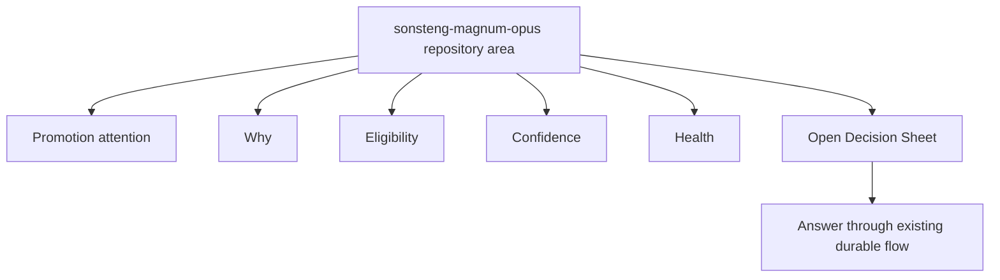
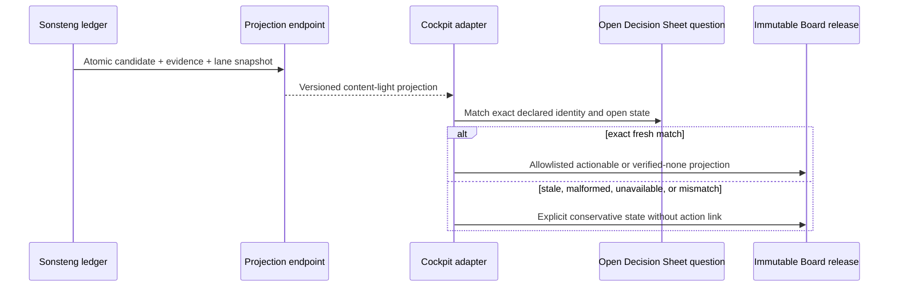
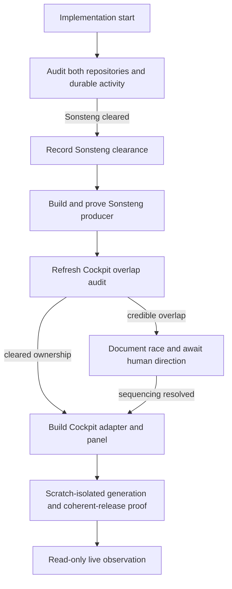

# Cockpit Sonsteng Promotion Summary - Plan

## Goal Capsule

- **Objective:** Let Damien understand the Sonsteng promotion decision currently awaiting him from the Cockpit repository area before opening its Decision Sheet.
- **Product authority:** This contract owns the Sonsteng-authored promotion projection and its read-only presentation inside the `sonsteng-magnum-opus` Cockpit area. Decision Sheets remain authoritative for answering. Global Cockpit normalization and other repository integrations are not active scope.
- **Execution profile:** Deep cross-repository contract work. Complete the initial overlap audit, implement and prove the Sonsteng producer after Sonsteng clearance, then stop at the refreshed Cockpit overlap checkpoint.
- **Stop conditions:** Stop Cockpit work if current worktrees or durable activity overlap the planned generator, schema, or test surfaces. Stop the integration if exact Decision Sheet binding, least-privilege read access, atomic projection, or fail-safe unknown behavior cannot be proven.
- **Tail ownership:** Completion includes producer and consumer contract tests, scratch-isolated board verification, coherent-release verification, and one read-only live observation. It excludes PROD rollout enablement and Decision Sheet submission.
- **Open blockers:** Sonsteng producer work has no planning blocker. Cockpit consumer work is held for human assessment because current adjacent branches overlap the generator, schema, and board tests.

---

## Product Contract

### Summary

Sonsteng will author a lossless promotion-decision projection that Cockpit displays as a compact five-field actionable summary inside the `sonsteng-magnum-opus` repository area; a fresh verified-none state instead collapses to one quiet no-decision line plus Health.
The summary prioritizes the decision currently needing Damien, explains it before he opens the existing Decision Sheet, and provides a bounded exemplar for possible later Cockpit-wide adoption.

### Problem Frame

Damien currently learns whether a Sonsteng promotion needs him by reading a Cockpit ask so he can answer its Decision Sheet.
The workflow is durable, but understanding the ask takes time because promotion lifecycle, eligibility, confidence, approval need, and operational health are distinct facts that generic ask severity does not preserve.
Cockpit also maps unrecognized ask-severity values to `input-welcome`, which can understate uncertainty and makes that generic field unsafe as the sole projection of Sonsteng promotion state.

### Key Decisions

- **Optimize for safe attention.** (session-settled: user-directed — chosen over source-first presentation or one global operational vocabulary: the summary must help Damien act without understating unknowns.) Governs R1, R4, R7, R8.
- **Use a Sonsteng-authored decision projection.** (session-settled: user-approved — chosen over deriving richer state from generic asks or independently joining live promotion state in Cockpit: Sonsteng owns the meaning while the Decision Sheet remains the durable answer surface.) Governs R2, R3, R9, R10.
- **Place a compact five-field summary in the Sonsteng repository area.** (session-settled: user-directed — chosen as a mix of the compact signal and nested detail panel: it preserves scan speed while keeping eligibility and health distinct.) Governs R5, R6.
- **Prioritize the actionable decision.** (session-settled: user-directed — chosen over the newest or most operationally urgent promotion record: the panel exists to reduce Decision Sheet comprehension time.) Governs R3, R11.
- **Apply a do-no-harm concurrency policy.** (session-settled: user-directed — chosen over treating repository cleanliness as sufficient authority to proceed: Cockpit-adjacent artifacts and worktrees may evidence overlapping agent work.) Governs R12-R14.
- **Collapse verified-none presentation.** (session-settled: user-directed — chosen over retaining five rows or hiding the panel: a fresh no-decision state should be quiet without becoming indistinguishable from unavailable.) Governs R15.

### Actors

- A1. **Damien:** Reads the Sonsteng summary, decides whether to open the linked Decision Sheet, and answers only through that sheet.
- A2. **Sonsteng promotion authority:** Owns native lifecycle, deterministic eligibility, confidence, approval binding, health, evidence identity, and the projection derived from them.
- A3. **Cockpit:** Presents the projection in the Sonsteng repository area without reinterpreting native facts or acquiring approval authority.
- A4. **Concurrent Cockpit worker:** Any human, agent, automation, or worktree whose durable activity may overlap the implementation surface.

### Requirements

**Projection authority and safety**

- R1. The projection must preserve lifecycle, deterministic eligibility, confidence, approval need, and operational health as separate concepts rather than collapse them into one severity or score.
- R2. Sonsteng must be authoritative for the projection's meanings and must retain the native value, evidence identity, provenance, freshness time, and contract version behind every human-readable field.
- R3. The projection must identify the open promotion decision currently requiring Damien and bind it to the same decision and evidence represented by its Decision Sheet.
- R4. A missing, stale, malformed, unsupported, or unknown value must render as explicit uncertainty and must never normalize to low urgency, healthy, eligible, passed, or no-action-needed.

**Cockpit presentation**

- R5. Cockpit must display the projection only inside the existing `sonsteng-magnum-opus` repository area as a compact summary with Promotion attention, Why, Eligibility, Confidence, and Health.
- R6. Cockpit must show human-readable values in the compact summary while keeping native machine values available for traceability without adding a redundant visible Source state row.
- R7. The summary must remain read-only and must link to the existing Decision Sheet when Damien has an actionable promotion decision.
- R8. The summary must not alter global Cockpit ordering, severity rollups, attention ranking, alerts, parks, wakes, automation, or other repositories' behavior.
- R15. A fresh valid projection with no decision awaiting Damien must collapse to one quiet no-decision line plus Health, while unavailable, stale, and mismatched states remain visibly distinct.

**Decision selection and freshness**

- R9. Decision Sheets must remain the authoritative surface for answering, and a panel action must never approve, decline, defer, or otherwise mutate promotion state.
- R10. If the projection and its Decision Sheet do not identify the same current evidence-bound decision, Cockpit must present a mismatch or unknown state rather than infer a join.
- R11. When several promotion records exist, the summary must foreground the one currently requiring Damien and represent other activity only through secondary context such as a count or link.

**Concurrency protection**

- R12. Before implementation begins and immediately before touching Cockpit shared surfaces, the implementer must inspect current worktrees, repository status, recent relevant artifacts, and other durable activity signals for credible overlap.
- R13. A credible overlap with another Cockpit worker must be documented as a race risk with the affected surface and evidence, then held for human assessment before conflicting work proceeds.
- R14. The overlap audit must not infer safety solely from a clean branch and must not infer an active agent or identity from a worktree or file alone.

### Presentation Shape

The panel has no generic repository-level `Progressing` label.
The five visible fields are projections of separately retained native facts, and the Decision Sheet link is the only action.

### Key Flows

- F1. **Actionable promotion decision**
  - **Trigger:** Sonsteng has a current promotion decision requiring Damien.
  - **Actors:** A1, A2, A3
  - **Steps:** Sonsteng publishes a fresh evidence-bound projection; Cockpit presents its five fields; Damien opens and answers the matching Decision Sheet.
  - **Outcome:** Damien understands why he is needed before entering the existing answer flow.
  - **Covers:** R1-R3, R5-R7, R9, R11.
- F2. **Unknown or conflicting projection**
  - **Trigger:** A required value is missing, stale, malformed, unsupported, unknown, or mismatched with the Decision Sheet.
  - **Actors:** A1, A2, A3
  - **Steps:** Cockpit preserves the uncertainty, avoids a semantic guess, and offers traceable source context without enabling a decision from the panel.
  - **Outcome:** Unreliable evidence cannot appear reassuring or acquire authority.
  - **Covers:** R2, R4, R6, R8-R10.
- F3. **Concurrent-work preflight**
  - **Trigger:** Planning advances to implementation or an implementer is about to touch a shared Cockpit surface.
  - **Actors:** A4
  - **Steps:** The implementer audits durable concurrency signals, identifies surface overlap, and records any credible race for human assessment.
  - **Outcome:** Conflicting Cockpit work does not proceed merely because one branch appears clean.
  - **Covers:** R12-R14.

### Acceptance Examples

- AE1. **Covers R1, R5, R6.** Given a current borderline promotion awaiting approval with passing hard gates and healthy lane state, when Cockpit renders Sonsteng, then the panel separately shows Action needed, Awaiting approval, Hard gates passed, Borderline confidence, and Healthy wait without a Source state row.
- AE2. **Covers R3, R7, R9.** Given the panel identifies an actionable decision, when Damien follows its action, then the matching Decision Sheet opens and the panel itself offers no approval or mutation control.
- AE3. **Covers R4, R10.** Given an unknown confidence disposition or a projection whose evidence identity differs from its Decision Sheet, when Cockpit renders it, then the affected meaning is explicitly unknown or mismatched and never becomes Input welcome or another reassuring default.
- AE4. **Covers R8.** Given the Sonsteng panel changes from no action to action needed, when Cockpit regenerates, then global ask ordering, parks, wakes, attention ranking, and other repository areas remain behaviorally unchanged.
- AE5. **Covers R11.** Given an older promotion awaits Damien while a newer candidate is publishing without requiring him, when Cockpit renders the summary, then the awaiting decision remains foregrounded and the newer activity is secondary.
- AE6. **Covers R12-R14.** Given a clean Cockpit root branch but an adjacent dirty worktree or recently written artifact on a shared surface, when implementation preflight runs, then it records the evidence and possible collision without asserting an agent identity or proceeding through the overlap without human assessment.
- AE7. **Covers R15.** Given a fresh valid projection with no decision awaiting Damien, when Cockpit renders Sonsteng, then it shows one quiet no-decision line plus Health rather than five rows or no promotion status at all.

### Success Criteria

- Damien can identify whether Sonsteng needs him, why, whether hard eligibility passed, the confidence posture, and system health from the repository area before opening the Decision Sheet.
- Every actionable summary resolves to the exact Decision Sheet and evidence-bound decision it describes.
- Unknown, stale, malformed, and conflicting projections are visible as uncertainty and never understate attention.
- Existing Cockpit behavior outside the Sonsteng repository area remains unchanged.
- A future Cockpit-wide normalization effort can evaluate this slice as an exemplar without treating its vocabulary as already canonical for other repositories.

### Scope Boundaries

- No direct approval, decline, defer, retry, or other promotion mutation from the compact panel.
- No global Cockpit severity taxonomy migration, ordering change, alert rule, attention change, park or wake change, or workflow authority.
- No integration for repositories other than `sonsteng-magnum-opus`.
- No requirement that other producers adopt Sonsteng's native lifecycle, eligibility, confidence, or health vocabulary.
- No resumption, rollout enablement, deployment, or merge of the separate PROD editor-promotion delivery.

<!-- ce-section: work-relationships -->
### How This Work Fits Together

This plan owns one Sonsteng-to-Cockpit decision-summary slice; the broader breakdown is contextual, not a committed roadmap.

- **Depends on:** The Sonsteng PROD promotion contract in `docs/plans/2026-08-05-001-feat-prod-editor-promotion-plan.md` for native semantics and evidence binding.
- **Shares:** The existing Cockpit Decision Sheet answer flow, which remains authoritative for answering.
- **Can proceed independently of:** PROD rollout enablement or PR merge because this plan defines presentation behavior without granting publication authority.
- **Enables:** A later assessment of whether the exemplar should inform wider Cockpit normalization.
  - **Still to decide:** Which concepts, if any, become canonical across producers.
  - **Still to decide:** How adoption is versioned and sequenced without colliding with Cockpit-adjacent work.

### Dependencies and Assumptions

- Sonsteng can expose the exact evidence-bound decision identity needed to match the durable Decision Sheet without granting Cockpit mutation authority.
- The existing Decision Sheet flow can remain the sole answer path while Cockpit adds a read-only repository summary.
- Concurrency evidence is volatile. During this brainstorm, Cockpit had a clean but ahead root branch, five adjacent feature worktrees, and a dirty `feat/u9-closeout` worktree; implementation must replace this snapshot with a fresh audit.

### Sources and Research

- `docs/plans/2026-08-05-001-feat-prod-editor-promotion-plan.md` defines Sonsteng lifecycle, hard-gate eligibility, bounded confidence, approval, live verification, and lane health while keeping Cockpit normalization separate.
- Cockpit repository `tools/gen-board.py` defines the three ask-severity tokens and currently maps unrecognized values to `input-welcome`.
- Cockpit repository `tools/cockpit_attention.py` models lifecycle, deadlines, importance, and attention independently from ask severity.
- Cockpit repository `docs/plans/2026-07-26-001-feat-cockpit-granular-decisions-plan.md` rejects severity-token hardening and severity-derived workflow authority because authored severity is untrusted.
- Cockpit repository `CLAUDE.md` defines asks, Decision Sheets, answers-back, and durable folding as the existing decision path.

---

## Planning Contract

**Target repositories:** `sonsteng-magnum-opus` owns the plan artifact and producer. The Cockpit repository owns the consumer and generated board.

**Product Contract preservation:** changed: R15 and AE7 add the verified-none presentation selected during planning. All other Product Contract meanings and stable IDs are unchanged.

### Key Technical Decisions

- KTD1. **Persist policy output, then project it atomically.** The Python risk evaluator writes an immutable versioned decision summary (`policy_version`, eligibility, disposition, required-gate results or digest, evidence identity, and `observed_at`) into the ledger. One synchronous, no-await Durable Object read selects the actionable candidate and returns that summary with its bound attempt and lane state under one covering ledger revision; JavaScript never re-derives policy or joins multiple reads. Unknown policy versions fail closed. Governs R1-R4, R10-R11.
- KTD2. **Expose a separate production-only service credential class.** The projection route uses a bearer-only secret/config namespace and resolver independent of browser edit/instructor/admin scopes, cookies, bookmark exchange, Access identity, and query strings. Neither credential class can satisfy the other; rotation and revocation are independent; credentials and privileged URLs never enter argv, logs, caches, artifacts, fixtures, telemetry, or diagnostics. Governs R2, R7-R9.
- KTD3. **Version, bound, and replay-protect the projection contract.** Version 1 uses a strict positive allowlist, bounded enum-derived values, an `observed_at` tied to the immutable decision revision, optional `served_at`, a 30-minute freshness ceiling, and a monotonic ledger revision. Repeated reads and unrelated lane changes cannot refresh evidence. Cockpit rejects rollback and same-revision/different-payload responses; unsupported versions, future skew, malformed values, nonfinite numbers, missing gates, and unknown enums become Unknown. Governs R1-R4, R6, R10.
- KTD4. **Author and bind the Decision Sheet declaratively.** A named handoff step writes an explicit promotion binding for canonical stem, question, candidate, attempt, base, evidence, and manifest identity after evidence is immutable and before `awaiting_approval`. Retries supersede safely without overwriting an answered question. Cockpit links only when exactly one canonical, open, same-release question matches every identifier; missing, duplicate, ambiguous, noncanonical, or stale bindings are non-actionable. Answer handling independently revalidates the tuple. Governs R3, R7, R9-R10.
- KTD5. **Select action deterministically.** The producer selects only fully evidence-bound `awaiting_approval` candidates, oldest creation time first with candidate ID as the stable tie-break, and returns a bounded count of other actionable candidates. A parked, answered, or retired question cannot appear as an active linked decision. Governs R3, R10-R11.
- KTD6. **Consume through a non-influenceable Cockpit adapter.** The generator uses one HTTPS-only read from a deploy-allowlisted origin and literal path, with redirects and proxy-environment inheritance disabled, normal CA/hostname verification, strict connect/total limits, and compressed/decompressed size plus JSON-complexity bounds. No producer, ask, or response may influence the URL. Failures degrade only the Sonsteng panel and never abort generation. Governs R4, R5, R8, R10, R15.
- KTD7. **Minimize publication through recursive allowlists.** Promotion identity, timestamps, binding detail, diagnostics, and sheet identity remain private to authenticated HTML unless field-by-field privacy review explicitly approves machine publication. Public `BOARD.json` receives only the minimum coarse safe state required for compatibility; it never receives raw Why text, native IDs, digests, precise operational times, internal URLs, or credentials. Visible text is bounded enum-to-copy output, not producer prose. Governs R2, R5-R9.
- KTD8. **Render a conservative state matrix.** An actionable projection renders five rows; verified none renders the compact R15 state; stale, unavailable, and mismatch states remain distinct. Visible Health combines source lane health with adapter integrity so stale or mismatched data cannot display as healthy. Governs R4-R6, R10, R15.
- KTD9. **Keep generated artifacts coherent and independently reversible.** Projection collection, HTML, approved public projection, and sheets complete inside one immutable Cockpit release before the stable pointer switches. Before switching, save and prove the prior immutable release remains reachable. Producer deployment, immutable upload, public switch, and live proof are separate gates; producer and consumer can roll back independently. Governs R5-R10.
- KTD10. **Make concurrency clearance a hard phase boundary.** Sonsteng units may proceed after their own clean overlap audit. Before any Cockpit file changes, record current overlapping branches and planned surfaces, obtain human sequencing or ownership direction, and re-audit immediately before integration. Governs R12-R14.

### High-Level Technical Design

### Contract State Matrix

| Source and binding state | Promotion attention | Other visible fields | Decision Sheet action |
|---|---|---|---|
| Fresh actionable match | Action needed | Why, Eligibility, Confidence, conservative Health | Exact dashboard-local sheet link |
| Fresh verified none | Quiet no-decision line | Health only | None |
| Fresh projection, parked question | Deferred | Health and safe reason | None |
| Stale projection | Status stale | Unknown except safe observed time | None |
| Unsupported or malformed projection | Status unknown | Unknown | None |
| Decision or evidence mismatch | Decision Sheet mismatch | Unknown plus safe mismatch category | None |
| Transport or authorization failure | Status unavailable | Unknown | None |

### Implementation Constraints

- Never read the coordinator's machine-local state file as promotion authority. The installed coordinator is default-off and that file is not the Durable Object ledger.
- Never run Cockpit's fixed-root generator against live state from a feature worktree. All plan verification before the final read-only live observation uses redirected scratch roots and fixtures.
- Never cache a prior projection as current. Prior data may appear only when explicitly marked stale with its safe observation time.
- Never publish raw evidence, AI reasons, principals, tokens, internal endpoint URLs, manifests, or candidate content.
- Never hand-edit generated board artifacts. Modify their producers and verify the immutable release output.

### Sequencing and Dependencies

1. Complete U3 before any implementation; it may clear Sonsteng work while holding Cockpit work.
2. Complete U1 and U2 only after U3 records Sonsteng clearance.
3. Complete U4 and U5 only in the Cockpit worktree and ownership boundary selected at U3.
4. Complete U6 after both repositories' contract suites pass.

### Risks and Mitigations

- **Cross-repository race:** Two current adjacent branches modify the intended Cockpit generator, schema, or tests. KTD10 and U3 stop consumer work until ownership is assessed.
- **False reassurance:** A valid lane health value can coexist with stale transport or mismatched evidence. KTD8 makes visible Health a conservative composite.
- **Privilege expansion:** Reusing the admin credential would couple human mutation authority to board reads. KTD2 introduces a read-only grant and tests its denial boundary.
- **Inconsistent multi-read snapshot:** Candidate and lane state can change between requests. KTD1 creates one atomic store projection.
- **Projection leakage:** New internal fields can leak through copied objects. KTD3 and KTD7 use positive allowlists with sentinel isolation tests.
- **Stale ask execution:** A once-valid Decision Sheet can become answered, parked, or evidence-stale. KTD4-KTD5 require current open-state and full tuple matching at each generation.
- **Policy drift:** Recomputing hard-gate eligibility in the Worker could diverge from Python. KTD1 persists and projects the versioned authoritative evaluation instead.
- **Credential confusion or leakage:** Browser-token reuse, redirects, caches, logs, or diagnostics could expose service authority. KTD2 and KTD6 isolate the credential class and transport path and require denial/leak sentinels.
- **Replay:** A captured projection can remain apparently fresh after an answer. KTD3 requires monotonic revision checks and never reuses prior actionable data after revalidation failure.

### Deferred to Follow-Up Work

- Generalize the exemplar into a cross-producer Cockpit vocabulary only after this slice is observed in use.
- Add panels for other repositories only through separate Product Contracts and overlap audits.
- Consider richer secondary-activity navigation after the bounded count proves insufficient.

### Sources and Research

- Sonsteng `app/worker/src/editor-status.js`, `app/worker/src/editor-store-core.js`, and `app/worker/src/editor-endpoints.js` own lifecycle, durable ledger state, evidence-bound projections, and lane health.
- Sonsteng `tools/prod_promotion.py` and `tools/prod_promotion_daemon.py` own fail-closed gate, confidence, evidence, timing, and coordinator behavior.
- Cockpit `tools/gen-board.py` owns repo collection, recursive public projection, Decision Sheet links, detail-pane rendering, and coherent board generation.
- Cockpit `briefs/qa/SCHEMA.md` owns ask/question identity, durable state, optional evidence references, public board contracts, and generated-only rules.
- Cockpit `docs/solutions/2026-07-27-what-a-worktree-does-not-isolate.md` and `docs/solutions/2026-07-27-fixed-root-scripts-and-worktrees.md` define the fixed-root and shared-live-state risks behind KTD10.
- Cockpit `docs/solutions/2026-08-02-decision-sheet-generated-only.md` and `docs/solutions/2026-08-05-stale-asks-execute-the-wrong-thing.md` support positive allowlists, generated-only sheets, and current-premise revalidation.
- Cockpit `docs/solutions/runtime-errors/nginx-403-private-coherent-release-directories.md` and `docs/solutions/2026-08-03-live-gates-beat-green-suites.md` support coherent publication and read-only live verification.

---

## Implementation Units

### U1. Atomic Sonsteng projection

- **Goal:** Add one ledger-owned projection that selects and snapshots the current actionable promotion decision with its evidence and lane state.
- **Requirements:** R1-R4, R10-R11; F1-F2; AE1, AE3, AE5.
- **Dependencies:** U3 Sonsteng clearance.
- **Files:** In `sonsteng-magnum-opus`: `app/worker/src/editor-store-core.js`, `app/worker/src/editor-store.js`, `app/worker/src/editor-status.js`, `app/worker/test/editor-promotion-store.test.js`.
- **Approach:**
  1. Add an atomic core read that applies KTD1 and KTD5 to the durable ledger.
  2. Persist the Python evaluator's immutable versioned eligibility/disposition summary, then validate and project it without re-deriving policy in JavaScript.
  3. Return verified none separately from unavailable or incomplete evidence.
  4. Keep selection deterministic and bound the remaining actionable count.
- **Execution note:** Start with failing store-level characterization and edge-case tests before adding the projection read.
- **Patterns to follow:** Promotion transitions and summary queries in `app/worker/src/editor-store-core.js`; pure gate and disposition semantics in `tools/prod_promotion.py`.
- **Test scenarios:**
  - A fully bound oldest awaiting-approval candidate is selected with its attempt, base, evidence, manifest, confidence, and lane revision.
  - Covers AE5. Two awaiting approvals select oldest creation time, then stable candidate ID, and return the bounded remaining count.
  - A candidate with a missing or failed required hard gate yields Unknown or no actionable projection rather than eligible.
  - A saved, validating, publishing, published, failed, or unbound candidate is not selected as actionable.
  - No candidate produces verified none without fabricating eligibility or confidence.
  - A concurrent transition cannot combine one candidate revision with another lane or evidence revision.
  - Every supported Python policy version survives Python-to-ledger projection unchanged; an unknown version fails closed.
  - Repeated reads and unrelated lane updates do not advance `observed_at`; the synchronous store method performs no awaited or external work.
- **Verification:** Store tests prove atomic selection, deterministic ordering, complete binding, and verified-none separation without changing existing transition behavior.

### U2. Versioned read-only Worker contract

- **Goal:** Expose the atomic projection through a production-only least-privilege endpoint with strict versioning, freshness, and allowlists.
- **Requirements:** R1-R4, R6-R10, R15; F1-F2; AE1-AE3, AE7.
- **Dependencies:** U1.
- **Files:** In `sonsteng-magnum-opus`: `app/worker/src/editor-auth.js`, `app/worker/src/editor.js`, `app/worker/src/editor-endpoints.js`, `app/worker/API-CONTRACTS.md`, `app/worker/test/editor-promotion-endpoints.test.js`, `app/worker/test/editor-auth.test.js`.
- **Approach:**
  1. Add the separate service-only credential namespace and production-only route per KTD2 without changing existing browser-token stamps or cookies.
  2. Project the store result through the KTD3 allowlist with source-bound `observed_at`, monotonic revision, no-store responses, and the 30-minute consumer freshness contract.
  3. Keep native identifiers and values sufficient for Cockpit validation while excluding content and mutation authority.
  4. Document compatibility, verified-none, and conservative failure semantics.
- **Execution note:** Build the endpoint contract test-first, including negative authorization and isolation cases.
- **Patterns to follow:** Existing constant-time token resolution and scope records in `app/worker/src/editor-auth.js`; role-filtered projections and uniform denial in `app/worker/src/editor-endpoints.js`.
- **Test scenarios:**
  - A valid read-only service credential receives the v1 actionable projection and cannot call admin mutation routes.
  - A human edit or instructor credential cannot read the service projection.
  - Missing, invalid, revoked, or under-scoped credentials receive the existing uniform denial shape.
  - DEV or missing production configuration does not expose the projection.
  - Verified none is structurally distinct from unavailable and contains no fabricated decision identity.
  - Unknown native enum, nonfinite confidence, oversized field, missing required gate, and unsupported contract version fail closed.
  - A secret sentinel, raw evidence detail, AI reason, principal, candidate content, and internal URL do not appear in the serialized response.
  - The service secret is rejected by query, cookie, browser exchange, and every mutation route; human tokens are rejected by the projection route; rotation or revocation does not invalidate browser sessions.
  - Responses and errors are non-cacheable and redact authorization, identifiers, endpoint configuration, and bodies.
- **Verification:** Worker contract and authorization tests prove least privilege, strict projection, isolation, versioning, and existing endpoint compatibility.

### U3. Initial and refreshed overlap checkpoint

- **Goal:** Establish the do-no-harm boundary before any implementation, then resolve ownership and sequencing for overlapping Cockpit surfaces before consumer work.
- **Requirements:** R12-R14; F3; AE6.
- **Dependencies:** None; this is the first implementation unit.
- **Files:** No product files. Record the assessment in the implementation handoff or review artifact, not generated Cockpit state.
- **Approach:**
  1. Before U1, refresh both repositories' worktree statuses and compare planned files against branch diffs, locks, generated/state paths, and recent durable activity; record separate Sonsteng and Cockpit clearance results.
  2. Record the current evidence for `feat/cockpit-frontend-refresh`, `feat/pr-party-dashboard`, and any newly overlapping work without inferring agent identity.
  3. Stop and obtain human direction on the owning branch, integration order, or non-overlapping partition.
  4. Re-run the audit immediately before U4 and again before release; any new overlapping write invalidates prior clearance.
- **Patterns to follow:** KTD10 and the fixed-root/worktree learnings cited in Planning Contract research.
- **Test scenarios:** Test expectation: none -- this is a human concurrency checkpoint, not product behavior.
- **Verification:** A dated assessment names exact overlapping surfaces and records human sequencing or ownership direction before any Cockpit consumer diff exists.

### U4. Bounded Cockpit adapter and binding

- **Goal:** Fetch, validate, bind, and privately attach the Sonsteng projection during board generation without affecting global Cockpit behavior.
- **Requirements:** R2-R4, R7-R11, R15; F1-F2; AE2-AE5, AE7.
- **Dependencies:** U2-U3.
- **Files:** In the Cockpit repository: `tools/gen-board.py`, `briefs/qa/SCHEMA.md`, `tests/test_sonsteng_promotion_projection.py`, `tests/test_generator_isolation.py`, `tests/test_attention.py`.
- **Approach:**
  1. Add the bounded, redirect-free, proxy-independent adapter per KTD6 and validate KTD3 replay and freshness semantics before display mapping.
  2. Add the owned binding-author handoff and extend the ask-question schema with KTD4 canonical grammar, containment, uniqueness, ownership, and same-release checks.
  3. Attach internal projection data only to the canonical Sonsteng repo record.
  4. Apply KTD7's field-by-field privacy review; keep detailed promotion and sheet data out of public `BOARD.json` unless explicitly approved, and bump only the contract actually published.
  5. Prove ranked attention, severity, parks, wakes, and non-Sonsteng repo projections are invariant.
- **Execution note:** Use fixture transport and redirected scratch roots; do not invoke the live fixed-root generator.
- **Patterns to follow:** Bounded GitHub adapters, canonical repo resolution, `_repo()` recursive projection, question identity, and `_ask_sheet_href()` in `tools/gen-board.py`.
- **Test scenarios:**
  - A valid v1 projection plus exact open question binding attaches only to `sonsteng-magnum-opus`.
  - An answered or retired question suppresses the action; a parked question renders deferred rather than action needed.
  - Candidate, attempt, base, evidence, manifest, stem, or question mismatch produces mismatch with no link.
  - Timeout, DNS/TLS error, authorization failure, non-success response, redirect, oversized body, invalid JSON, stale time, future skew, and unsupported version degrade only the Sonsteng projection.
  - Scheme, port, userinfo, path, proxy, redirect, compression, JSON-depth/item/string, Unicode-control, and same-revision/different-payload attacks fail closed without leaking the bearer.
  - Binding creation opens one exact match; a retry supersedes safely without changing an answered qid; absent, duplicate, traversal-like, confusable, or ambiguous bindings have no action link.
  - Extra source fields and secret sentinels cannot cross the public projection.
  - Covers AE4. Ranked attention, severity ordering, ask grouping, parks, wakes, and every other repo projection remain byte-equivalent for the same fixtures.
  - Covers AE7. Verified none carries the quiet state and Health without five actionable rows.
- **Verification:** Focused adapter, isolation, and invariance tests pass entirely in scratch state and prove no live Cockpit path was written.

### U5. Sonsteng repository panel

- **Goal:** Render the approved actionable, verified-none, parked, stale, mismatch, and unavailable states inside the Sonsteng repo detail pane.
- **Requirements:** R4-R11, R15; F1-F2; AE1-AE5, AE7.
- **Dependencies:** U4.
- **Files:** In the Cockpit repository: `tools/gen-board.py`, `tests/test_board_ui.py`, `tests/test_theme_contrast.py`.
- **Approach:**
  1. Insert the panel only in the Sonsteng detail pane and map states through KTD8.
  2. Render text through existing escaping and use semantic labels that do not rely on color.
  3. Construct the action from the validated dashboard-local sheet stem and optional question anchor.
  4. Reuse the existing new-tab Decision Sheet affordance and show only a bounded secondary count.
- **Execution note:** Add render-tier assertions before visual or DOM verification.
- **Patterns to follow:** `render_detail_pane()`, `_detail_answer_link()`, `_ask_sheet_href()`, existing responsive repo details, and existing contrast tests.
- **Test scenarios:**
  - Covers AE1. Actionable state renders Promotion attention, Why, Eligibility, Confidence, and Health with no Source state row or generic Progressing label.
  - Covers AE2. The only action opens the exact generated Decision Sheet in a new tab and no approval control is present.
  - Covers AE3. Unknown, stale, malformed, mismatch, and unavailable states remain visually and textually distinct from low urgency and verified none.
  - Covers AE5. One actionable decision is foregrounded while other activity is a bounded count.
  - Covers AE7. Verified none collapses to one quiet line plus Health.
  - A non-Sonsteng repo never renders the panel, even with similarly shaped fixture data.
  - Keyboard, touch, narrow viewport, light theme, dark theme, and high-contrast checks preserve label/action usability.
- **Verification:** Render and DOM tests prove approved information placement, safe navigation, accessible states, and Sonsteng-only scope.

### U6. Coherent-release and read-only live proof

- **Goal:** Prove the complete cross-repository projection ships coherently without enabling PROD promotion or mutating Decision Sheet state.
- **Requirements:** R2-R10, R12-R15; F1-F3; AE1-AE7.
- **Dependencies:** U2, U4-U5.
- **Files:** In the Cockpit repository: `tests/test_coherent_release.py`, `tests/test_sync_cockpit_release.py`, `briefs/qa/SCHEMA.md`; in `sonsteng-magnum-opus`: `app/worker/API-CONTRACTS.md`.
- **Approach:**
  1. Save a go/no-go baseline: both commit SHAs, contract versions, fresh U3 clearance, intended worktree status, current served revision, and a reachable prior immutable rollback release.
  2. Gate producer deployment, immutable Cockpit upload, stable-pointer switch, and live proof separately; verify exact immutable HTML, approved JSON, and sheet URLs before switching.
  3. Verify the stable compatibility surface and switched HTML identify the same release, then observe within five minutes, after one sync cycle, and at 24 hours.
  4. Capture a read-only evidence artifact with observer/time, SHAs, versions, URLs/status, state/link tuple, freshness/revision, and before/after answer-batch and ledger state. Do not submit an answer, call a mutation endpoint, enable promotion authority, or alter rollout configuration.
- **Execution note:** Suites and scratch generation precede the live gate; local success is not a substitute for served evidence.
- **Patterns to follow:** Coherent release tests, sync-release verification, build-revision metadata, and read-only live-gate learnings.
- **Test scenarios:**
  - One release contains matching projection, panel, Decision Sheet href, public JSON, and build revision.
  - A partial or inaccessible release cannot become the stable board target.
  - A schema-version mismatch between public JSON and HTML fails release validation.
  - A read-only live observation sees the exact approved actionable or verified-none shape and matching revision.
  - The observation produces no answer batch, promotion decision, pause, retry, deployment, or rollout mutation.
- **Rollback:** Repoint Cockpit to the saved reachable immutable release. Independently disable or rotate the producer credential/route for an auth leak. Do not restore ledger or sheet state because this slice is read-only; any observed mutation is an incident and hard stop.
- **Verification:** Cross-repository suites pass, the immutable release is reachable, served HTML and JSON revisions agree, and the read-only observation records no mutation.

---

## Verification Contract

| Gate | Units | Verification | Required outcome |
|---|---|---|---|
| Sonsteng Worker projection | U1-U2 | `cd app/worker && node --test test/editor-promotion-store.test.js test/editor-promotion-endpoints.test.js test/editor-auth.test.js` | Atomic selection, read-only auth, strict projection, and existing promotion contracts pass. |
| Sonsteng promotion policy regression | U1-U2 | `python3 -m pytest tools/tests/test_prod_promotion_policy.py tools/tests/test_prod_promotion_ai.py tools/tests/test_prod_promotion_live.py tools/tests/test_prod_promotion_daemon.py -q` | Gate, evidence, confidence, timing, and coordinator semantics remain green. |
| Cockpit focused contract | U4-U5 | `python3 -m pytest tests/test_sonsteng_promotion_projection.py tests/test_generator_isolation.py tests/test_attention.py tests/test_board_ui.py tests/test_theme_contrast.py -q` | Binding, unknown states, public isolation, invariance, panel rendering, and accessibility pass. |
| Cockpit full suite | U4-U6 | `python3 -m pytest -q` | No global board, Decision Sheet, continuity, wake, or release regression. |
| Scratch generation | U4-U6 | Generate fixtures with every Cockpit root, state path, output path, and transport redirected to private scratch; compare before/after status and hashes or mtimes for board, QA, answer, state, lock, and release-pointer surfaces | No live repository, fixed-root state, generated board, answers, lock, or release pointer changes. |
| Coherent release | U6 | `python3 -m pytest tests/test_coherent_release.py tests/test_sync_cockpit_release.py -q` | HTML, public JSON, sheets, and metadata share one reachable build revision. |
| Read-only live gate | U6 | Inspect the authenticated served Sonsteng repo area at switch +5m, +1 sync, and +24h; save the evidence tuple and before/after mutation sentinels | The approved panel state and link are present, revisions agree, no secret or unsafe public field is served, and no answer or promotion mutation occurs. |

The existing Sonsteng plan's full Worker, Python, build/parity, and offline red-team gates remain applicable when the changed files fall within their scope.
The Cockpit DOM tier must report whether a real browser ran; a skipped browser tier is not equivalent to a passing browser check.

---

## Definition of Done

- The Product Contract is preserved except for the user-approved R15 and AE7 addition.
- U1-U2 expose one atomic, production-only, least-privilege, versioned Sonsteng projection with no raw-content or authority leak.
- U3 records fresh overlap evidence before all work, clears Sonsteng separately, and records human direction before any Cockpit consumer edit begins.
- U4 validates exact open-question binding and preserves all global Cockpit behavior outside the Sonsteng projection.
- U5 renders the approved actionable and verified-none shapes plus conservative failure states in the Sonsteng repo area only.
- U6 proves one coherent immutable release and one read-only live observation without Decision Sheet or promotion mutation.
- Every requirement and acceptance example is covered by an implementation unit and a verification outcome.
- All focused and full applicable suites pass, including a non-skipped browser-backed panel check.
- Public artifacts contain only reviewed allowlisted fields and no credential, principal, raw evidence, internal URL, or candidate content.
- The final diff contains no abandoned adapter, endpoint, schema, styling, fixture, or experimental code from rejected approaches.
- PROD promotion rollout, PR merge, authority enablement, and broader Cockpit normalization remain unchanged.
