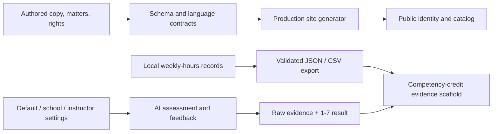

> Provenance: Authored on 2026-08-06, this plan lived only on an unmerged branch until 2026-08-17, when the plan-completion audit landed it so its obligations would no longer be invisible. Its Wave 3 (units U5, U6, and U7) was never built and is live outstanding work now being picked up.

# August 6 Decision Wave - Plan

## Goal Capsule

- **Objective:** Turn John's settled identity, rights, platform, catalog, hours, assessment, and alumni decisions into tested product contracts without inventing accounts, institutional workflows, or a human-speaker product.
- **Product authority:** The reconciled Aug 6 recording outcomes govern. `docs/TODO.md` supplies stable task IDs. Existing public/student-safe boundaries remain authoritative unless this plan explicitly labels a public source download.
- **Execution profile:** Three coherent delivery waves: identity and rights (T05-T08), platform language/catalog (T16-T19, T26), then local-first assessment (T21-T23).
- **Stop conditions:** Stop if licensing scope cannot distinguish authored content from software and third-party assets; if a download could be mistaken for a student-safe packet while exposing instructor material; or if assessment work requires durable student identity, retention, or school tenancy.
- **Tail ownership:** Each wave includes source changes, generated artifacts, contract tests, real production generation, browser coverage where visible, and a clean full preflight. PROD promotion and PR #6 merge remain held.

---

## Product Contract

### Summary

The public product presents itself consistently as **Legal Practicum**, credits Sonsteng, Riehl, and Haydock in the agreed order, distinguishes CC BY 4.0 content from MIT software, and makes no Mitchell hosting claim. Its teaching language says **assessment and feedback**, uses **Planning Guide and Checklist** as one term, treats AI as the default speaker, offers a scalable case catalog with histories and accurately labelled free downloads, and never routes assessment to alumni. Students can locally record weekly worked and billable hours, export their records, and receive assessment on a configurable seven-point scale while the repository accumulates only schemas, tools, and synthetic evidence for a later competency-credit proposal.

### Key Decisions

- **Use the Aug 6 recording outcomes as authority.** (session-settled: user-directed) No item in this plan reopens T05-T08, T16-T19, or T21-T23/T26.
- **Preserve historical attribution and stable infrastructure names.** (planning-settled: code-grounded) “Legal Practicum” governs current product identity; accurate history such as the Open Resource Tool attribution and deployment identifiers are not blind-renamed.
- **Layer rights explicitly.** (session-settled: user-directed) Content is CC BY 4.0 beside, not instead of, the MIT software license; third-party notices and not-yet-cleared originals remain outside that grant.
- **Implement AI speaker as a default contract, not a new media subsystem.** (planning-settled: code-grounded) The repo has no briefing-player or speaker registry, and human recordings remain possible but unplanned.
- **Keep source access secondary to learner materials.** (planning-settled: inferred from public-repo decision) Each card gets one primary student-safe download. One catalog-level “View complete public source repository (includes instructor materials and answer keys)” action satisfies public-source access without cluttering every card; matter-specific source links may live in packet metadata.
- **Keep learner records local-first.** (planning-settled: architecture-constrained) “Submit” initially means validate and export JSON/CSV for delivery through a school's chosen channel. No student records enter git or a new server store.
- **Keep raw rubric evidence and derive a semantic 1-7 result per rubric.** (planning-settled: architecture-constrained) Each rubric authors its own monotonic seven-band conversion, so heterogeneous raw totals are not forced through one global formula and identical evidence cannot yield different overall results on retry.
- **Make threshold configuration portable.** (session-settled: user-directed) Defaults are competence 4 and redo below 6; local school and instructor configuration files override them with instructor > school > default precedence.
- **Treat T22 as a proposal scaffold until evidence exists.** (planning-settled: evidence-constrained) Synthetic examples prove the pipeline, not the claim that students learn quickly.

### Actors

- A1. **Learner:** Browses matters, downloads materials, records hours locally, and receives assessment and feedback.
- A2. **Instructor or school:** Supplies optional portable threshold settings and receives exported learner records through an external chosen channel.
- A3. **Contributor:** Authors copy, matters, rubrics, and public content under explicit rights boundaries.
- A4. **Build and assessment services:** Generate the public site, validate contracts, run AI critique, and return results to the requesting learner flow.

### Requirements

**Identity and rights**

- R1. Current product surfaces must use “Legal Practicum” while preserving accurate historical references and stable technical identifiers.
- R2. Current bylines must order John O. Sonsteng, Damien Riehl, then “with Roger S. Haydock”; Mitchell Hamline may be described as a potential adopter, never the host.
- R3. The repository must distinguish CC BY 4.0 content, MIT software, third-party material, and separately licensed or uncleared originals with exact scope and attribution guidance.
- R4. Public license presentation must link both applicable licenses without claiming rights the authors do not hold.

**Platform language and catalog**

- R5. Student-facing educational language must say “assessment and feedback,” not educational “grading,” and must render “Planning Guide and Checklist” as one exact named term without rejecting legitimate case-domain uses such as “creamery grader.”
- R6. Product copy must state that AI is the default briefing/speaker experience without promising a human-speaker layer or mislabelling the scripted sample as live AI.
- R7. Every catalog matter must expose its own procedural and factual history, remain reachable without JavaScript, and offer a free student-safe download; the catalog must separately expose the accurately labelled complete public repository.
- R8. The catalog must remain concise by default, support search and composable structured filters, announce result counts/no-results accessibly, and avoid hardcoded corpus counts.
- R9. Catalog layout and interaction must remain usable at 390px, 480px, desktop, print, and against a synthetic 1,000-matter fixture.
- R10. Assessment, debrief, and critique flows must return to the requesting learner and contain no alumni assessor, reviewer, recipient, or notification role.

**Hours and assessment**

- R11. A learner must be able to record weekly dated entries for project/matter/activity, worked hours, billable hours, class time, and narrative; billable hours cannot exceed worked hours.
- R12. Learner records must remain browser-local unless explicitly exported as validated JSON or CSV; actual learner data must never be committed.
- R13. Assessment must retain raw rubric evidence and produce an explicit integer result from 1 through 7 with configuration provenance and explanatory presentation that does not equate 4 with a letter-grade C.
- R14. Default competence is at least 4 and redo eligibility is below 6; portable locally selected profiles labelled school and instructor may change both, with instructor > school > default precedence and thresholds within 1-7. Without identity or signatures, the UI must call these profiles user-supplied and unverified, never institutionally authoritative.
- R15. The competency-credit proposal must define a reproducible join between pseudonymous hours exports and competency attempts, distinguish observed association from causation, and make no evidence claim until real consented data exists.

### Acceptance Examples

- AE1 (R1-R4). A fresh build shows “Legal Practicum,” the agreed byline, Damien as host, and scoped CC BY/MIT links; historical Open Resource Tool attribution remains intact.
- AE2 (R5). A canary changing a public learning surface to educational “grading” or splitting the named guide term fails, while “creamery grader” passes.
- AE3 (R6). The product identifies AI as the default speaker and still labels the sample as scripted rather than live AI.
- AE4 (R7-R9). A matter card shows a bounded history summary, expands or links to full history, exposes both labelled free actions, survives no-JS use, and the 1,000-item fixture has no duplicate IDs or hardcoded total.
- AE5 (R10). A canary adding `alumni_assessor` or an alumni feedback destination fails the assessment routing contract.
- AE6 (R11-R12). A learner records 3.5 worked and 2.0 billable hours, exports equivalent JSON/CSV, reloads the JSON locally, and no record is written to repository data or server storage.
- AE7 (R13-R14). A score of 4 is shown as competent under defaults, a score of 5 is redo-eligible, and an instructor override supersedes a school override with its provenance shown.
- AE8 (R15). Synthetic joined data exercises the proposed measures but the generated proposal labels results illustrative and does not assert that the practicum caused faster learning.

### Scope Boundaries

- No T03/T04 copy decision, CD ingestion, Midstate content buildout, named syllabi, institutional outreach, or John's editor pass.
- No account system, school tenancy, durable learner-record API, retention policy, roster, gradebook, LMS integration, or submission inbox.
- No human-speaker registry, recording workflow, generated video, or briefing player.
- No claim that public repository source is student-safe or that instructor keys are secret once linked as public source.
- No relicensing of third-party assets, uncleared recordings, or future `data/midstate/` material without its own rights marker.
- No PROD promotion, daemon merge, or PR #6 merge.

### How This Work Fits Together

- Wave 1 establishes identity and rights before adding new public copy or download links.
- Wave 2 locks vocabulary before catalog copy expands, then regenerates public artifacts once.
- Wave 3 keeps private records outside the current server architecture while creating portable inputs for later institutional adoption.
- T22 follows T21 and T23 because its evidence model needs both time and competency-attempt records.

---

## Planning Contract

### Implementation Strategy

Deliver three independently reviewable PRs. Each starts from the then-current main branch; do not stack on the held PROD branch. Commit generated public `site/platform/**` and the semantic baseline when their sources change. Regenerate and parity-check editor/persona/instructor/history bundles, but commit a generated artifact only when `git ls-files` confirms that artifact is tracked by repository policy. Keep the shared-vs-computed contract explicit: authors edit canonical copy/config; histories, summaries, counts, resolved thresholds, and provenance are computed.

### Implementation Units

#### U1 — Identity contract and current-product sweep (T05-T07)

**Files:** `tools/build_site.py`, `site/index.html`, `README.md`, `data/copy/home.json`, `docs/content-style-guide.md`, `tools/tests/test_identity_rights_contract.py`, generated `site/platform/**`.

**Work:**

1. Define canonical current title, ordered byline, and hosting language in one small reusable contract rather than scattered test literals.
2. Update generator-owned meta, masthead, footer, catalog, and public copy. Update the hand-authored pitch and README deliberately.
3. Retain accurate historical Mitchell/Open Resource Tool attribution; remove only present-tense hosting claims. Preserve repository, host, route, and other stable technical identifiers.
4. Add a fresh-build contract covering title/byline/host and a focused inventory test that distinguishes current public identity from historical records.

**Verification:** Focused identity test; a focused pytest that calls `fresh_site_build.build_fresh_site()`; `python3 tools/build_site.py --check`; inspect generated title/meta/byline/footer and pitch at mobile and desktop widths.

#### U2 — Layered content licensing (T08)

**Files:** `LICENSE`, new `CONTENT-LICENSE.md`, `THIRD-PARTY.md`, `tools/build_site.py`, `site/index.html`, `README.md`, `docs/content-style-guide.md`, `tools/tests/test_identity_rights_contract.py`.

**Work:**

1. Add CC BY 4.0 terms and an exact attribution form for project-authored content while retaining MIT for software.
2. Enumerate exclusions: third-party material, uncleared recordings, separately marked John originals, and future Midstate material until its marker exists. Document joint authorship without silently changing the legal notice in `LICENSE`.
3. Render both content and code license links on current public surfaces and explain the boundary in README/content guidance.
4. Add canaries proving that CC BY does not swallow excluded directories or replace MIT.

**Verification:** Link/scope tests, fresh build, and manual review of license wording and public footer. Treat legal scope ambiguity as a stop condition, not a copy tweak.

#### U3 — Locked teaching language, AI default, and alumni exclusion (T16, T17, T26)

**Files:** `tools/build_site.py`, `data/copy/home.json`, relevant `data/curriculum/*.md`, `data/curriculum/templates/*.md`, affected `data/matters/*/exercise/exercise.json`, `docs/content-style-guide.md`, new `tools/tests/test_platform_language_contract.py`, worker contract tests.

**Work:**

1. Replace educational grading language on learner-facing authored sources and generator strings with “assessment and feedback.” Normalize the named “Planning Guide and Checklist.”
2. Implement source-aware allowlists for legitimate legal/factual uses and exclude historical decision records from enforcement.
3. State the AI-speaker default in canonical public/pedagogical copy; preserve the scripted-sample disclaimer. Define a default value only if future briefing metadata already needs one—do not create a speaker subsystem.
4. Preserve the absence of alumni routing rather than introduce a recipient abstraction. Add tests that unknown assessor/recipient request fields fail closed where current schemas are strict, plus static dependency/metadata scans proving no alumni routing or notification path exists. Modify Worker production code only if implementation discovers an existing permissive path.
5. Run mutation tests against authored inputs and fresh generated output so regeneration cannot reintroduce forbidden language.

**Verification:** New contract tests, all worker tests, fresh build, semantic baseline review, and full-text spot checks of generated learner surfaces.

#### U4 — Scalable histories and free downloads catalog (T18-T19)

**Files:** `tools/build_site.py`, new student-archive builder under `tools/`, `data/copy/matters.json`, `data/schemas/page-copy.schema.json` if new authored fields are needed, `tools/tests/test_catalog_contract.py`, `tools/platform_browser_matrix.json`, `tools/verify_platform_layout.js`, generated `site/platform/downloads/<matter-slug>-student-materials.zip`, generated `site/platform/platform.{js,css}`, generated catalog pages/data, semantic baseline.

**Work:**

1. Read each matter's history from `exercise.json`; validate presence and derive a bounded catalog summary without substituting premise text.
2. Extract one authoritative per-matter student-material manifest consumed by public data copying, packet rendering, and ZIP generation. Define allowed roots/file classes, required versus optional members, deterministic ordering/metadata, and rejection of symlinks, traversal, and any discovered member outside the allowlist. Generate one versioned ZIP per matter at `site/platform/downloads/<matter-slug>-student-materials.zip`; include public matter/exercise/rubric data and learner packet exhibits, while excluding instructor notes/keys, concealed facts, persona disclosure tiers, and server bundles. Missing optional assets yield a manifest-labelled archive; missing required inputs fail the build. Render one card action, “Download student materials (.zip).” Put one visible catalog-level external action, “View complete public source repository (includes instructor materials and answer keys),” with optional matter-specific source links inside packet metadata—not on default cards.
3. Generate paginated HTML index pages of 50 matters each so every matter and action remains reachable without JavaScript. Preserve page/filter/search state in the URL and restore focus to the results heading after navigation.
4. Add client-side cross-page search and composable filters over the compact machine index; render only the matching page-sized result slice, derive/announce total and page counts, and provide an accessible empty state. With JavaScript disabled, the generated page navigation is the fallback.
5. Generate a dedicated unfiltered print-all view rather than printing only the current interactive page.
6. Add a synthetic 1,000-item generator fixture and checks for completeness, unique IDs, dynamic counts, at most 50 rendered result cards per interactive page, correct URLs/labels, exact ZIP membership/exclusions, keyboard focus restoration, and machine-index/search agreement.
7. Regenerate committed output, semantic baselines, editor map, and any parity bundles after source settles.

**Verification:** Catalog contract tests; fresh production build; no-JS inspection; ZIP extraction/membership canaries; 390px/480px/desktop and print browser matrix; full parity/preflight. Confirm no generated server-only instructor bundle path or concealed material appears in a student ZIP.

#### U5 — Local-first weekly hours log (T21)

**Files:** new `data/schemas/weekly-hours-log.schema.json`, new `data/assessment/README.md`, new `app/hours/` static client, `tools/build_site.py` navigation, new tests under `tools/tests/`, public generated assets.

**Work:**

1. Define a versioned schema for pseudonymous learner/offering/week identity and dated entries containing project/matter/activity references, worked hours, billable hours, class-time marker, and narrative.
2. Validate nonnegative tenths, dates within the declared week, unique entry IDs, and `billable_hours <= worked_hours`; compute the worked-minus-billable gap.
3. Build an accessible browser-local weekly editor because repeated entry, worked-versus-billable validation, and portable structured evidence are not supported by the existing client-billing time-sheet template. Include empty-first-run and previous/next-week states, totals, inline validation, autosave status, JSON import/export, and spreadsheet-safe CSV export. Invalid drafts remain visible but are excluded from export until corrected.
4. Validate imports before showing a preview; reject additional properties and bound file size, nesting, collection length, and string length. Require an explicit merge-or-replace choice and reject version mismatches. Identical same-ID records deduplicate; same-ID/different-content records remain preserved as explicit preview conflicts until the learner selects a version. Wall-clock timestamps are display metadata, never merge authority. Render imported/user text only through text-node APIs under a restrictive CSP. CSV serialization must quote correctly and neutralize cells beginning with `=`, `+`, `-`, or `@`. Announce import, save, export, and validation results to assistive technology.
5. Reuse the chat client's probe-and-fallback storage pattern with a dedicated namespaced key. Treat records as sensitive educational data: default to persistent mode only after a storage disclosure, offer session-only/shared-device mode, never send contents to logs/analytics/error reports, and provide one-action export-and-clear. When storage is unavailable or full, preserve the current draft in memory and switch visibly to export-only mode; quarantine malformed stored records and offer raw export/reset. Reset requires confirmation and offers a final export first.
6. Keep a versioned storage envelope separate from the export schema. Version N migrates N-1 deterministically; unsupported future versions remain byte-preserved, are never overwritten, and offer raw export. Add rollback coverage proving an older client does not destroy newer local data.
7. Use only synthetic fixtures in git and add repository guards against committed learner exports.

**Verification:** Schema unit tests, JSON/CSV round-trip tests, browser persistence/reset tests, accessibility check, mobile layout, and proof that no network request or server persistence occurs.

#### U6 — Seven-point assessment and portable threshold settings (T23)

**Files:** new `data/schemas/assessment-config.schema.json`, new default config under `data/assessment/`, `app/worker/src/index.js`, `app/worker/src/prompts.js`, `app/worker/src/validate.js`, `app/worker/prompts/critique-template.md`, `data/schemas/critique.scorecard.schema.json`, `app/chat/critique.js`, `app/worker/API-CONTRACTS.md`, generated prompt bundle, and worker/critique UI tests.

**Work:**

1. Define versioned default/school/instructor config records with stable IDs, integer thresholds 1-7, precedence, and provenance. Defaults are competence 4 and redo below 6.
2. Strengthen server validation of rubric criterion identity, weights, and raw totals before calling the evaluator.
3. Apply the 1-7 result to the critique flow only. Extend each rubric with a complete, non-overlapping, monotonic set of seven raw-score bands and critical-failure constraints; validate this authored mapping with the rubric. Derive the integer result deterministically after raw evidence passes validation, rather than asking the model to invent it. Extend `/v1/critique` with an optional layered configuration envelope and additive response fields; old clients without configuration retain defaults. The client sends the locally selected files and the Worker validates their structure, IDs, scope labels, and precedence but presents provenance as “locally selected,” never as verified institutional authority.
4. Add a minimal local settings entry point beside assessment setup. The configuration file encodes a claimed school or instructor scope; import shows a validation preview, active source, resulting precedence, and a persistent “local/user-supplied — unverified” label before apply. Users can replace or clear each override and recover defaults without editing files; forged IDs never acquire verified-institution language.
5. Resolve settings deterministically as instructor > school > default; imported settings remain local and portable until identity/tenancy exists. Invalid configuration is rejected without displacing the last valid configuration.
6. Extend response and scorecard presentation with evaluating, success, and recoverable failure states; show scale result, provenance, competence, redo eligibility, and language explaining that 4 means competent average—not a letter-grade C. Invalid evaluator output offers retry and preserves raw evidence without inventing a score.
7. Announce configuration changes and result states to assistive technology; add keyboard coverage for import preview, replace/clear, retry, and return to defaults.
8. Validate critique output against the authoritative bundled rubric: exact criterion/subcriterion set, no duplicates or omissions, authoritative weights, earned total equal to score sum, possible total equal to weight sum, and fail-closed 502 on mismatch. Reject invalid seven-band mappings at build time; test every boundary, critical-failure override, identical-evidence repeat, and contradictory model-supplied overall score (which must be ignored or rejected, never displayed).
9. Add boundary, nil/invalid-config fallback, backward-compatible request/response, precedence, malformed-model-output, rubric-mismatch, deterministic repeat, and no-alumni-routing tests.

**Verification:** Worker unit/integration tests with real endpoint request shapes; UI/browser checks for 3/4/5/6/7, import preview, precedence changes, clear/default recovery, invalid configuration, and malformed evaluator output; keyboard/screen-reader status checks; plus full preflight.

#### U7 — Competency-credit proposal and measurement contract (T22)

**Files:** new `docs/proposals/competency-based-credit.md` with a versioned measurement/data-contract appendix and a small synthetic worked example; focused documentation contract tests.

**Work:**

1. Define the required pseudonymous join keys and future competency-attempt fields—task/rubric/result/timestamp/config provenance—against U6's actual critique export shape, without creating a parallel production schema yet.
2. Specify measures that combine attempts with weekly worked/billable time: time-to-first-competence, time-to-six, attempts-to-competence, and task-level uncertainty.
3. Include a small hand-checkable synthetic example that demonstrates the method and labels all outputs illustrative; defer a custom analysis subsystem until consented data and the actual U6 export stabilize.
4. Draft the school/ABA proposal with claims tiers, confounders, consent/privacy needs, sample-size requirements, and the explicit rule that schools set credits until evidence supports a different policy.
5. Add a future-data checklist covering consent, retention, missingness, selection bias, instructor effects, and causal limits before any public outcome claim.

**Verification:** Documentation contract checks for required measures, fields, caveats, and illustrative labels; hand-recompute the synthetic example; review that no real learner data or unsupported causal language appears.

### Verification Contract

For every wave:

1. Run all focused tests introduced or changed by the wave.
2. Run focused pytest coverage that calls `tools/tests/fresh_site_build.py` plus `python3 tools/build_site.py --check` for generator-owned changes, and review intentional semantic-baseline deltas. Do not execute the helper file directly; it has no CLI entry point.
3. Run worker tests for assessment/routing changes.
4. Run the full real-box `bash tools/preflight.sh` with the required display/browser environment; mocks alone do not close visible or editor-facing work.
5. Confirm `git diff --check`, a clean worktree, no learner exports/secrets, and no changes under excluded privileged directories.
6. Do not merge or deploy PROD. PR #6 remains independently reviewable and held for Damien.

### Delivery and Rollback

- PR A: U1-U2 identity and rights.
- PR B: U3-U4 platform contract and catalog.
- PR C: U5-U7 local-first assessment and proposal scaffold.
- Each PR may regenerate the data spine only for its own source changes and must parity-check matching bundles/build IDs in the same coherent release; generated build products remain untracked unless repository policy already tracks them.
- Roll back by reverting the affected PR; schemas and exports are versioned, so already exported local data remains interpretable. Never delete learner data because this implementation does not possess it.

### Risks and Mitigations

- **Rights overreach:** Exact include/exclude lists and canary tests prevent CC BY from silently covering third-party or uncleared work.
- **Public-source confusion:** Student-safe packet and public-source links use distinct labels and tests; no instructor-bundle URL is exposed as a packet.
- **Vocabulary false positives:** Enforcement is limited to educational meaning and production-fed surfaces, with factual-domain fixtures proving allowed uses.
- **Catalog scale:** Progressive disclosure, dynamic counts, no-JS reachability, and a 1,000-item fixture replace assumptions based on today's 20 matters.
- **Private data:** Local-only storage and explicit export avoid creating an undeclared student-record system.
- **Assessment semantics:** Direct 1-7 results avoid arbitrary normalization; raw evidence and provenance remain visible.
- **Unsupported reform claims:** T22 ships a method and evidence threshold, not a conclusion.

### Requirement Traceability

| Requirement | TODO | Unit | Primary proof |
|---|---|---|---|
| R1-R2 | T05-T07 | U1 | identity fresh-build contract |
| R3-R4 | T08 | U2 | license scope/link canaries |
| R5-R6 | T16-T17 | U3 | source mutation + generated language tests |
| R7-R9 | T18-T19 | U4 | catalog contract, 1,000 fixture, browser matrix |
| R10 | T26 | U3/U6 | role/routing negative tests |
| R11-R12 | T21 | U5 | schema, round-trip, no-network tests |
| R13-R14 | T23 | U6 | result validation, threshold boundary/precedence tests |
| R15 | T22 | U7 | reproducible synthetic analysis and claim review |
