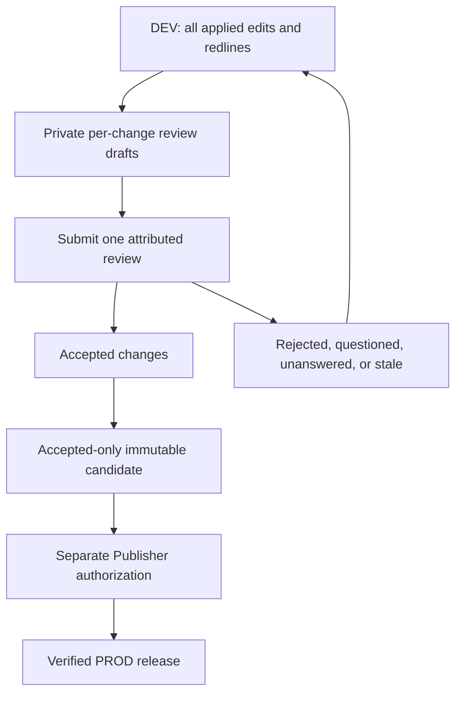
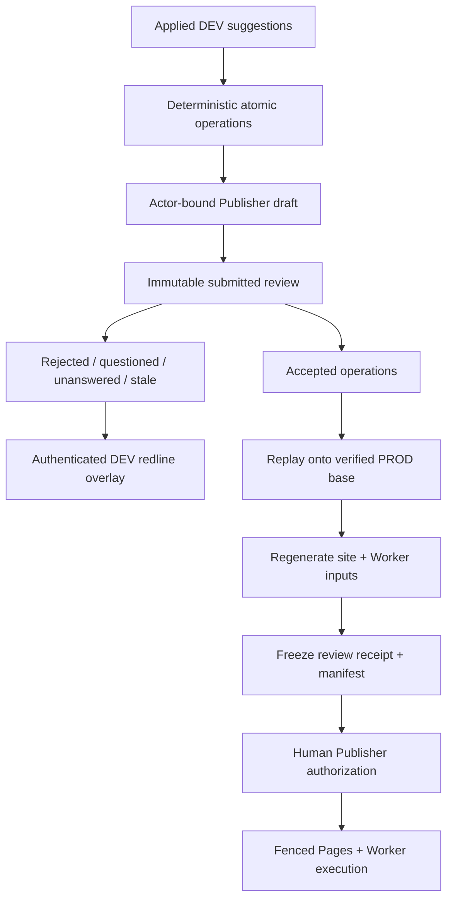

# Granular Publisher Review - Plan

## Goal Capsule

- **Objective:** Let Damien review prose edits at the smallest meaningful changed span, decide each change independently, and submit one attributable review before authorizing production.
- **Product authority:** DEV remains the complete editorial workspace. Only individually accepted changes may enter a production candidate.
- **Open blockers:** None for implementation. Production activation remains blocked until the legacy PROD Pages/Worker pair has verified provenance, recoverable provider identifiers, a recorded base, and a successful exact-pair restoration drill.
- **Stop conditions:** Stop before mutation if atomic identity, projection replay, structural grouping, or PROD recovery evidence is ambiguous.
- **Execution profile:** Test-first implementation with positive leak canaries, background/headless browser UAT, and a supervised live canary before release-lane enablement.
- **Tail ownership:** The implementing run owns code, generated artifacts, documentation, real-box verification, and a clean handoff; production activation remains a separate Publisher action.

---

## Product Contract

### Summary

Production Publisher will present readable, atomic prose redlines instead of whole-paragraph before-and-after blocks.
Each atomic change receives a private draft decision—Accept, Reject, or Ask question—and one Submit review action records the completed review.
Accepted changes alone become eligible for an immutable production release, while every edit and its review status remain visible on DEV.

### Problem Frame

The current Publisher wraps the entire old paragraph as deleted and the entire new paragraph as inserted, even when an editor changed only punctuation or a few words.
This obscures the actual editorial judgment and makes a multi-edit batch expensive to review.

The current surface also jumps from an immutable preview to whole-release authorization.
It provides no per-change accept, reject, or question affordance and no draft review that Damien can submit.
Because the current production candidate is a contiguous DEV commit frontier, merely hiding rejected rows would still publish their text.

### Actors

- **Editor:** John or another authorized editor whose applied changes remain visible on DEV.
- **Publisher-reviewer:** Damien or another human with Publisher scope who reviews atomic changes and submits an attributed review.
- **Release service:** Builds the accepted-only immutable production candidate after review submission.
- **Release executor:** Publishes only a separately authorized candidate and retains the existing provenance, fencing, verification, and recovery obligations.

### Key Decisions

- **Atomic prose review.** Review units follow the smallest meaningful changed span rather than the containing paragraph. Governs R1-R4.
- **DEV retains the full editorial record.** (session-settled: user-directed — chosen over reverting or hiding rejected work on DEV: Damien wants DEV to remain the complete redlined workspace.) Governs R6-R7.
- **Questions hold only their own change.** (session-settled: user-approved — chosen over blocking the entire review batch: unrelated accepted changes should remain publishable.) Governs R8-R9.
- **Draft first, submit once.** (session-settled: user-approved — chosen over immediate per-click submission: Damien wants to reconsider granular decisions before one attributed review.) Governs R10-R12.
- **Accepted-only production projection.** (session-settled: user-approved — chosen over the existing contiguous all-DEV frontier: rejected, questioned, and unanswered edits must stay out of PROD without disappearing from DEV.) Governs R13-R16.
- **Reuse established review conventions.** Adopt the interaction semantics of pending code reviews and intraline diffs, translated for prose and accessibility rather than copied as code-oriented UI. Governs R1-R5 and R10.

### Requirements

**Atomic redlines**

- R1. The Publisher shall show only changed words, punctuation, phrases, or sentences as marked redline, with enough unchanged context to understand each change.
- R2. Deletions shall render as red strikethrough and additions as blue underline, using semantic and textual labels so color is never the sole signal.
- R3. A replacement shall read as one reviewable change containing its paired deletion and addition rather than two unrelated decisions.
- R4. Punctuation-only edits shall remain independently visible and reviewable.
- R5. Exact moved text may render as a paired green “Moved from” strikethrough and “Moved to” underline only when move detection is conservative; uncertain or materially rewritten text shall remain a deletion and addition.

**DEV review record**

- R6. Every applied edit shall remain visible on DEV after Publisher review, including rejected and questioned edits.
- R7. DEV shall show each submitted review status and any Publisher question alongside the relevant atomic redline without changing the student-facing copy itself.
- R8. Ask question shall require a question and hold only its atomic change from production eligibility.
- R9. Reject shall hold only its atomic change from production eligibility and may include an optional explanatory note.

**Draft and submission**

- R10. Each atomic change shall offer Accept, Reject, and Ask question as a single-choice decision.
- R11. Decisions shall remain private, actor-bound drafts that survive reload until the Publisher explicitly submits the review.
- R12. Submit review shall atomically record the reviewer, timestamp, candidate revision, every decision, and every note; unanswered changes shall remain unreviewed and ineligible rather than being inferred as accepted.

**Production eligibility and safety**

- R13. Only changes accepted in a submitted review shall enter the production candidate; rejected, questioned, unanswered, or stale changes shall not.
- R14. The accepted-only candidate shall preserve the exact production base plus the selected changes without mutating or erasing the fuller canonical DEV history.
- R15. Review decisions shall bind stable change identity, source location, original value, proposed value, source revision, and verified PROD base; a later DEV edit or PROD-frontier advance affecting that source invalidates its drafts, submitted decisions, and unexecuted preview and requires a fresh cumulative review.
- R16. The immutable release manifest and Publisher authorization shall bind the submitted review receipt and accepted-only candidate, while existing release fencing, provenance, pair verification, audit, and recovery guarantees remain mandatory.
- R17. Semantically atomic groups shall remain indivisible and receive one coherent review decision; the system shall never publish a partial structural group silently.

**Usability and access**

- R18. The Publisher shall show reviewed, unreviewed, accepted, rejected, and questioned counts and make the consequences of Submit review clear before submission.
- R19. Every decision and redline shall be operable by keyboard, announced meaningfully to assistive technology, and usable at phone widths.
- R20. The UI may offer safe batch conveniences, but no bulk action may silently decide questioned, stale, or structurally grouped changes.

### Key Flows

- F1. Review atomic changes
  - **Trigger:** A Publisher opens a reviewable DEV frontier.
  - **Actors:** Publisher-reviewer.
  - **Steps:** The Publisher reads a unified atomic redline, chooses Accept, Reject, or Ask question for any change, and may revise those private draft choices.
  - **Outcome:** Draft decisions persist without creating production authority.
  - **Covered by:** R1-R5, R10-R11, R18-R20.

- F2. Submit a granular review
  - **Trigger:** The Publisher is ready to record the current draft.
  - **Actors:** Publisher-reviewer.
  - **Steps:** The system validates revision-bound identities and required question text, marks stale decisions for re-review, and records all valid decisions in one attributed review.
  - **Outcome:** Accepted changes become production-eligible; every other change remains held individually.
  - **Covered by:** R8-R13, R15, R17.

- F3. Prepare and authorize production
  - **Trigger:** At least one submitted-accepted change is eligible and no safety gate is violated.
  - **Actors:** Release service, Publisher-reviewer, release executor.
  - **Steps:** The service derives an accepted-only candidate from the verified PROD base, freezes its review receipt and manifest, and presents that exact candidate for separate human authorization and execution.
  - **Outcome:** PROD receives only authorized accepted changes while DEV retains the full editorial record.
  - **Covered by:** R6-R7, R13-R17.

### Acceptance Examples

- AE1. **Covers R1-R4.** Given one changed word and one changed comma in a paragraph, when the Publisher opens the review, then only those atomic spans are marked and each can be decided independently.
- AE2. **Covers R5.** Given a distinctive unchanged phrase moved elsewhere, when confidence is sufficient, then the old and new locations share one “Moved” decision; a common or edited phrase falls back to deletion and addition.
- AE3. **Covers R8-R12.** Given draft Accept, Reject, and Ask question choices, when the Publisher reloads, then the drafts remain private and editable; submitting records one attributed review and requires question text.
- AE4. **Covers R12-R13.** Given accepted, rejected, questioned, and unanswered siblings, when the review is submitted, then only accepted siblings become production-eligible and no unanswered item is inferred as accepted.
- AE5. **Covers R6-R7.** Given a rejected edit, when review completes, then the edited copy and redline remain visible on DEV with “Rejected,” but student-facing PROD remains unchanged.
- AE6. **Covers R14-R16.** Given an accepted change embedded in a DEV commit with rejected changes, when the release service prepares a candidate, then its tree contains the verified PROD base plus only accepted content and its manifest binds the review receipt.
- AE7. **Covers R15.** Given John changes underlying text after a draft, submitted review, or prepared preview, when the Publisher submits, reloads, or authorizes, then that source’s decisions and unexecuted preview are stale and cannot enter the candidate until the cumulative source diff is reviewed again.
- AE8. **Covers R17.** Given a semantically atomic group, when the Publisher attempts incompatible member decisions, then submission fails closed and explains that the group must be decided together.
- AE9. **Covers R18-R20.** Given a phone-width keyboard-only session with color disabled, when the Publisher reviews and submits, then every redline meaning, decision, count, validation error, and focus transition remains understandable and operable.
- AE10. **Covers R16.** Given a submitted review and later release failure, when recovery runs, then it restores or resumes the exact accepted-only manifest without adding held DEV changes.

### Scope Boundaries

**In scope**

- Atomic prose diff presentation, conservative move pairing, per-change draft decisions, questions and notes, one review submission, DEV status projection, accepted-only candidate construction, immutable review receipts, and preservation of the current release safety gates.

**Deferred for later**

- Multi-turn conversational threads beyond the initial Publisher question and a future editor response.
- Multiple simultaneous Publisher reviewers or required two-person production approval.
- Publisher-authored replacement prose; the Publisher reviews John’s changes rather than becoming a second editing surface in this work.
- Decomposing a semantically atomic group into separately publishable members.

**Outside this product's identity**

- Hiding rejected work from DEV, silently treating unanswered edits as accepted, automatically publishing on review submission, or weakening provenance and recovery to make selective publication easier.

### External Patterns

- GitHub pending reviews and review submission: https://docs.github.com/en/pull-requests/get-started/reviewing-pull-requests-quickstart
- GitLab individual and batched suggestions: https://docs.gitlab.com/user/project/merge_requests/reviews/suggestions/
- Gerrit draft inline comments and review submission: https://gerrit-review.googlesource.com/Documentation/user-review-ui.html
- Git moved-block presentation: https://git-scm.com/docs/git-diff.html
- W3C guidance that color must not be the only visual means: https://www.w3.org/WAI/WCAG20/Understanding/use-of-color.html

---

## Planning Contract

**Product Contract preservation:** Product Contract unchanged.

### Key Technical Decisions

- KTD1. **Represent each atomic edit as a revision-bound operation.** An ordinary prose change binds the durable `source_ref`, contributing suggestion and group identities, immutable display and source hashes, base range, replacement text, surrounding anchors, and a deterministic operation ID. Its review unit is the cumulative verified PROD-to-current-DEV diff for one source; historical suggestions remain attribution evidence rather than separate overlapping decisions. Structural insert, delete, split, merge, and move suggestions remain indivisible groups with their original topology operation and arguments. Display text drives review; source-patch evidence drives projection. Token offsets are placement evidence, not identity. Governs R1-R5, R15, R17.
- KTD2. **Use one shared Unicode-aware segmentation contract.** Split prose into words, whitespace, and punctuation; compute a deterministic edit script; refine changed words at character level; and group adjacent delete/insert operations into one replacement. Store safe structured segments and render them with text nodes and semantic `<del>`/`<ins>` elements. Governs R1-R4, R19.
- KTD3. **Detect moves as a conservative presentation pass.** Pair only exact, distinctive moved token runs above a tested minimum and give both locations one `move_pair_id`. Repeated, short, or materially edited text stays an ordinary delete/add pair. Governs R5.
- KTD4. **Add a production-review ledger beside the suggestion lifecycle.** Applied suggestions remain terminal in the DEV lifecycle. Publisher drafts, submitted reviews, atomic decisions, notes, stale state, and review receipts live in a separate append-only review domain. Governs R6-R13, R15.
- KTD5. **Persist actor-bound drafts server-side.** Draft writes require current human Publisher scope and CSRF protection, bind the current review revision, and are replaceable only by the same actor until submission. Debounced autosave exposes Saving, Saved, and Couldn’t save states; Submit is blocked while writes are pending or failed, retry is explicit, and navigation warns about unsaved work. One atomic submit freezes the complete valid decision set and its receipt. Governs R8-R12, R18-R20.
- KTD6. **Derive PROD from accepted operations, not DEV commit membership.** The candidate builder starts from the verified PROD base and replays submitted-accepted operations in canonical chronological order. It uses durable source identity and context anchors to project later edits across held earlier edits; any overlap, missing anchor, dependency, or ambiguity fails closed for re-review. Governs R13-R17.
- KTD7. **Keep authorization and execution downstream of review.** Review submission creates eligibility but no production authority. Preparation freezes the accepted operation set, review receipt, derived tree, generated bundles, and release manifest; the existing human authorization, fencing, provider receipts, pair verification, and exact recovery lifecycle remains intact. Governs R13-R17.
- KTD8. **Project review annotations only into authenticated DEV editing chrome.** Student-facing DEV and PROD copy remain clean prose. The editor overlay and Publisher surfaces show atomic redlines, submitted statuses, questions, and attribution from the review ledger. Governs R6-R9, R19.
- KTD9. **Regenerate and verify every derived consumer as one candidate.** Selective source projection triggers the authoritative site, editor-map, history, persona, instructor, archive, and Worker-data generators. Candidate identity covers their dependency closure and parity evidence. Governs R14-R16.
- KTD10. **Require positive canaries at each fail-closed seam.** Every exclusion gate must have a fixture that would leak a held edit, accept a stale decision, split a group, or mismatch a manifest if the gate were ineffective. Governs R13-R17.

### High-Level Technical Design

The store is authoritative for review state and immutable receipts.
The candidate builder is authoritative for turning accepted operations into a clean candidate tree.
The release ledger remains authoritative for deployment and recovery.
No browser request may supply accepted membership, candidate ancestry, hashes, or manifest authority.

### State and Identity Model

- **Draft decision:** Mutable by one Publisher and one source revision; never release-eligible.
- **Submitted decision:** Immutable `accepted`, `rejected`, or `questioned`; a question requires text.
- **Unanswered:** Absence of a submitted decision; always held.
- **Stale:** The bound original/proposed/source revision no longer matches; a later same-source edit stales drafts, submitted decisions, and any unexecuted prepared preview for that source until its fresh cumulative diff is reviewed.
- **Review receipt:** Hash-bound set of submitted decisions, actor, timestamp, verified PROD base manifest, DEV source frontier, group identities, and exact operation payloads.
- **Release member:** A submitted-accepted operation, not an entire DEV suggestion or apply batch; a move pair has one operation ID and one decision even though it renders at two locations.
- **Production frontier:** The verified PROD manifest plus the set of operation IDs already published; DEV commit ancestry remains evidence but no longer defines release membership.

### System-Wide Impact

- **Durable Object/store:** New review draft, submission, decision, operation, and receipt persistence; new read and mutation RPCs; migrations must preserve existing suggestions and releases.
- **Worker endpoints/auth:** Publisher-only draft and submit routes; read projections for Publisher and authenticated DEV overlays; no service bearer may impersonate human review.
- **Publisher UI:** Unified atomic redline, per-change radio group, conditional question field, draft summary, validation, stale state, and one Submit review action.
- **Editor overlay:** Submitted status and question annotations attached by durable source/change identity without altering student copy.
- **Candidate builder:** Accepted-operation projection onto the recorded PROD base, chronological dependency handling, authoritative regeneration, and review-receipt manifest binding.
- **Release lifecycle:** Existing preparation, authorization, claim, renewal, transition, verification, and restoration continue around the new candidate identity.
- **Generated artifacts:** Editor map and all candidate-derived bundles participate in parity and stale-artifact checks.

### Risks and Mitigations

- **Later edits depend on held earlier wording.** Replay operations chronologically and fail closed when context anchoring cannot prove a unique projection.
- **Over-fragmented diffs become harder to review.** Use semantic cleanup and merge adjacent delete/insert spans into one replacement while keeping punctuation-only edits visible.
- **False move detection misstates intent.** Require exact distinctive runs and textual moved-from/to labels; fall back to delete/add on doubt.
- **Draft races or stale review decisions.** Bind drafts and submissions to immutable source values and revision; detect drift at read and submit.
- **Held DEV text leaks through generated output.** Build from an isolated PROD-base projection and compare exact source tree, generated artifacts, manifest, and live provenance with positive leak canaries.
- **New store RPC works in core tests but not production.** Add every method to `app/worker/src/editor-store.js` and exercise the real wrapper/endpoint seam.
- **Browser UAT disrupts the desktop.** Keep Chrome DevTools verification background/headless by default; `HEADFUL=1` remains explicit opt-in.

### Sequencing

Freeze the operation and review-receipt vocabulary first.
Then implement the pure diff engine and durable ledger before UI work.
Build the accepted-only projector against fixtures before altering release preparation.
Wire the Publisher and DEV surfaces after server contracts stabilize.
Finish with migration, full parity, background browser UAT, live Worker smoke, and a supervised release canary.

---

## Implementation Units

### U1. Characterize the current Publisher and freeze contracts

- **Goal:** Pin current whole-paragraph rendering, all-DEV membership, auth, and release behavior before changing them.
- **Requirements:** R1, R10-R16.
- **Files:** `app/worker/test/editor-publisher-ui.test.js`, `app/worker/test/editor-publisher-release.test.js`, `tools/tests/test_prod_release_executor.py`, `app/worker/API-CONTRACTS.md`, `site/platform/data/api-contracts.md`.
- **Approach:** Add characterization fixtures for multiple edits inside one paragraph, punctuation-only edits, sequential edits to one source, atomic groups, and current contiguous membership. Define the review source as a cumulative verified PROD-to-current-DEV value with immutable suggestion attribution. Define separate normalized display text and immutable source-patch evidence, plus the stable operation, decision, review receipt, and accepted-only manifest vocabulary, before parallel implementation.
- **Test scenarios:**
  1. Current Publisher marks a complete paragraph for a one-word edit, proving the UX defect.
  2. Current preparation includes a rejected sibling when filtering only ledger rows, proving selective projection is necessary.
  3. Existing Publisher authorization, replay, fencing, and recovery tests remain green as baseline invariants.
- **Verification:** Focused Worker Publisher tests and Python release-executor tests pass with characterization assertions.
- **Dependencies:** None.

### U2. Build the atomic prose operation engine

- **Goal:** Produce deterministic, safe, reviewable prose operations from immutable old/new values.
- **Requirements:** R1-R5, R15, R19.
- **Files:** `app/worker/src/editor-diff.js` (new), `app/worker/test/editor-diff.test.js` (new), `app/worker/src/editor-publisher.js`, `app/worker/src/editor-assets.js`, `tools/render_diff_lib.py`, `tools/tests/test_render_diff_lib.py`.
- **Approach:** Port the repository’s `SequenceMatcher`-style word redline semantics into a dependency-reviewed JS module or adopt a small license-compatible OSS engine after an explicit dependency decision. Tokenize Unicode words, whitespace, and punctuation separately. Emit structured escaped segments, replacement groups, bounded context, and conservative move pairs. Do not retain the current longest-prefix/suffix algorithm as the production engine.
- **Test scenarios:**
  1. Word, punctuation, capitalization, whitespace, phrase, sentence, and whole-field changes yield exact expected operation spans.
  2. Two separated edits do not mark the unchanged middle as replaced.
  3. Replacements share one decision; insertions and deletions remain independently decidable when unrelated.
  4. A distinctive exact move creates one paired decision; repeated, short, or edited text does not.
  5. HTML, bidi controls, combining characters, emoji, and pathological input remain inert and bounded.
  6. Identical immutable inputs produce byte-identical operation IDs and segments.
- **Verification:** New diff unit/property tests pass and renderer tests prove no unsafe HTML path.
- **Dependencies:** U1.

### U3. Add the durable granular review ledger

- **Goal:** Persist Publisher drafts and immutable submitted decisions without reopening the DEV suggestion lifecycle.
- **Requirements:** R8-R13, R15, R17-R18.
- **Files:** `app/worker/src/editor-store-core.js`, `app/worker/src/editor-store.js`, `app/worker/src/editor-endpoints.js`, `app/worker/src/editor.js`, `app/worker/test/editor-publisher-release.test.js`, `app/worker/test/editor-publisher-review.test.js` (new).
- **Approach:** Extend apply finalization and canonical-mutation completion to record an immutable per-source applied revision with commit SHA, normalized before/after hashes, contributing suggestion/group identity, and operation evidence. Add versioned tables for review revisions, actor-bound drafts, submitted reviews, atomic decisions, notes, operation snapshots, and receipts. Expose Publisher-only read/save/submit endpoints with CSRF and identity checks. Compare every draft and submission to the latest recorded source revision; missing legacy evidence fails closed pending backfill. Submit in one transaction, require question text, keep unanswered operations absent/held, enforce indivisible groups, and reject stale or mismatched payloads. Forward every new core RPC through the Durable Object wrapper.
- **Test scenarios:**
  1. Drafts survive reload, remain private to the actor, and can be revised before submission.
  2. Another Publisher cannot overwrite or submit the draft.
  3. Submit freezes exact decisions and is idempotent only for identical bindings.
  4. Missing question text, unanswered-as-accepted, mixed atomic-group decisions, missing revision evidence, stale revision, history-revert drift, and changed operation payload all fail closed.
  5. Editor, approver, admin-only, AI, and service credentials cannot submit a human review.
  6. Wrapper-level dispatch and endpoint tests exercise every new RPC.
- **Verification:** Focused store, auth, wrapper, migration, and endpoint tests pass with fake-clock concurrency cases.
- **Dependencies:** U1-U2.

### U4. Rebuild the Publisher review experience

- **Goal:** Make granular review understandable and complete across reloads, keyboards, and narrow screens.
- **Requirements:** R1-R5, R8-R12, R18-R20.
- **Files:** `app/worker/src/editor-publisher.js`, `app/worker/src/editor-assets.js`, `app/worker/test/editor-publisher-ui.test.js`, `app/worker/test/editor-publisher-review.test.js`, `app/editor/verify-editor.js`.
- **Approach:** Replace side-by-side full paragraphs with contextual atomic redlines grouped by source and page. Group nearby operations in one bounded source excerpt while retaining separate decisions; collapse distant unchanged text behind an accessible Show more context action and never cross a semantic field boundary. Render each ordinary operation as a uniquely named `fieldset` with Accept, Reject, and Ask question. Render a move as one review card and one radio group containing linked “Moved from” and “Moved to” excerpts. Reveal a required question field for Ask question and an optional explanatory note for Reject. Debounced autosave shows pending, saved, failed, retry, and unsaved-navigation states. Make status counts filter the review, add Next unreviewed/problem navigation, and retain one Submit review control. On validation failure, focus a linked error summary, preserve valid drafts, and identify each invalid change inline. Keep later authorization visually and semantically distinct.
- **Test scenarios:**
  1. A one-word or punctuation edit highlights only that span.
  2. Draft decisions, question text, and optional rejection notes restore after reload and preserve focus predictably.
  3. Slow, failed, retried, and duplicate draft saves show truthful state; Submit waits for durable saves and navigation warns only when work is unsaved.
  4. Submit remains disabled or fails accessibly when question text is missing or a group conflicts.
  5. Color-disabled and forced-colors output still says Added, Deleted, Moved from/to, Accepted, Rejected, Questioned, and Stale with conforming text, component, and focus contrast.
  6. Keyboard-only and 480px layouts expose every control, filter, linked move location, and next-item action without overlap or horizontal loss; repeated controls announce source context and change position.
  7. Adjacent, distant, long-paragraph, and sentence-boundary fixtures preserve bounded context without merging decisions.
  8. Submit review does not authorize production and authorization cannot occur before a valid accepted-only preview exists.
- **Verification:** Worker rendering tests plus background/headless Chrome DevTools UAT pass; no foreground browser is launched by default.
- **Dependencies:** U2-U3.

### U5. Project submitted review status onto authenticated DEV

- **Goal:** Keep the complete editorial record visible to John and Damien without altering student copy.
- **Requirements:** R6-R9, R15, R19.
- **Files:** `app/worker/src/editor-store-core.js`, `app/worker/src/editor-store.js`, `app/worker/src/editor-endpoints.js`, `app/worker/src/editor-inject.js`, `app/editor/editor.js`, `app/worker/test/editor-overlay.test.js`, `app/worker/test/editor-inject.test.js`.
- **Approach:** Extend the authenticated overlay projection with revision-bound atomic segments, submitted status, reviewer attribution, and question text. Attach annotations by durable `source_ref` and operation identity. Leave anonymous student pages and canonical DEV prose unchanged.
- **Test scenarios:**
  1. Rejected and questioned edits remain in DEV copy with their correct redline and status.
  2. Accepted, unanswered, and stale states render distinctly.
  3. Anonymous student requests receive no review metadata or editing chrome.
  4. A later source edit stales old annotations instead of attaching them to a new span.
  5. Hostile question/note content remains inert.
- **Verification:** Overlay/injector tests, editor-map parity, and a background live DEV smoke pass.
- **Dependencies:** U2-U3.

### U6. Build accepted-only candidates

- **Goal:** Materialize exactly the submitted-accepted operation set from the verified PROD base.
- **Requirements:** R13-R17.
- **Files:** `tools/prod_release_executor.py`, `tools/prod_release_daemon.py`, `tools/apply_suggestions.py`, `tools/tests/test_prod_release_executor.py`, `tools/tests/test_apply_suggestions.py`, `app/worker/src/editor-store-core.js`, `app/worker/test/editor-publisher-release.test.js`.
- **Approach:** Replace DEV-tip candidate identity with an isolated projection checkout at the recorded PROD base. A pure materialization lane applies accepted prose/scalar operations in canonical chronological order to the current projected logical value and produces one synthetic whole-value patch per existing durable source. A separate structural lane replays only wholly accepted insert, delete, split, merge, and move groups through their explicit operation and argument primitives; holding a structural group holds all topology and content members. Re-anchor only with unique durable source and context evidence, preserve formatted-span evidence, and fail before filesystem writes on overlap or dependency ambiguity. Record held and dependency-blocked operations as exclusions, regenerate every authoritative artifact, and bind the source tree, review receipt, generated parity, and manifest into candidate identity.
- **Test scenarios:**
  1. Accepted and rejected atoms from one paragraph produce a candidate containing only the accepted text.
  2. Accepted punctuation amid rejected word changes projects correctly.
  3. A later accepted edit that uniquely anchors across an earlier held edit succeeds; ambiguous, overlapping, or dependent edits fail closed.
  4. Rejected, questioned, unanswered, stale, and partial-group operations each have a positive leak canary that makes the test fail if included.
  5. Candidate generation never mutates canonical DEV or ambient HEAD.
  6. Rebuilding from identical receipt/base yields the same tree and manifest; changed receipt or generator closure changes identity.
  7. Insert, delete, split, merge, and move groups each have accepted and held canaries; no structural group can project partially.
- **Verification:** Python projector/executor tests, Worker release-store tests, authoritative build/parity checks, and clean-tree comparison pass.
- **Dependencies:** U2-U3.

### U7. Bind preparation, authorization, execution, and recovery

- **Goal:** Carry the accepted-only review receipt through the existing production safety lifecycle.
- **Requirements:** R13-R17.
- **Files:** `app/worker/src/editor-store-core.js`, `app/worker/src/editor-store.js`, `app/worker/src/editor-endpoints.js`, `app/worker/src/editor-publisher.js`, `tools/prod_release_executor.py`, `tools/prod_release_daemon.py`, `app/worker/test/editor-publisher-release.test.js`, `tools/tests/test_prod_release_executor.py`, `tools/tests/test_prod_release_daemon.py`.
- **Approach:** Add a versioned release-schema migration for operation members, held exclusions, review-receipt identity, projection commit identity, and an operation-based published frontier. Preserve legacy releases read-only through a compatibility projection, and stop marking an entire suggestion published when only some operations ship. Make trusted preparation accept only the service-built candidate and submitted review receipt. Freeze accepted membership and held exclusions. Preserve human authorization as a separate event bound to the exact preview. Keep claim, lease renewal, compatibility ordering, provider receipts, provenance, verification, restoration, and attempt identity semantics unchanged.
- **Test scenarios:**
  1. Browser, Publisher, or service caller cannot enlarge accepted membership or mint candidate evidence.
  2. Changed review receipt, accepted set, base, candidate, generated artifact, or manifest invalidates authorization.
  3. Retry of an identical active attempt is idempotent; restored content requires a fresh attempt and fresh human authorization.
  4. Pages/Worker partial failure restores or resumes the exact accepted-only pair and never sweeps newly accepted DEV work.
  5. Live provenance proves the candidate SHA on both targets before completion.
  6. Legacy complete, active, restored, and partially reviewed releases migrate or project without rewriting historical receipts.
  7. A same-source edit after review submission or preparation invalidates the unexecuted preview; an edit to another source leaves unaffected reviewed operations valid.
  8. A PROD-frontier advance on the reviewed source stales and regenerates its draft, submitted review, and preview; an advance on another source preserves provably unaffected decisions.
- **Verification:** Focused release lifecycle suites pass through core, wrapper, endpoint, executor, and daemon seams.
- **Dependencies:** U6.

### U8. Migrate, document, and run real UAT

- **Goal:** Introduce granular review without corrupting existing eligible changes or disrupting John’s editing lane.
- **Requirements:** R1-R20.
- **Files:** `app/worker/API-CONTRACTS.md`, `site/platform/data/api-contracts.md`, `docs/editor-guide-for-john.md`, `docs/prod-release-operations.md`, `docs/uat/editor-publisher-matrix.md`, `tools/preflight.sh`, `app/editor/verify-editor.js`.
- **Approach:** Backfill per-source revision evidence and cumulative atomic operation snapshots for current eligible applied changes without assigning decisions. Require fresh review before those changes become production-eligible. Keep the production release service config-off during migration. Before activation, record the exact legacy PROD Pages/Worker pair, establish matching provenance and recoverable provider identifiers, set the verified bootstrap base, and drill exact-pair restoration. Rebuild and deploy DEV site plus Worker coherently, account for stale Durable Object instances, then run background/headless visual UAT and live authenticated store/overlay checks. Enable production only after the bootstrap gate and a supervised accepted/rejected/questioned canary prove exact selective publication and recovery.
- **Test scenarios:**
  1. Existing eligible changes appear as unreviewed atomic operations; none is auto-accepted.
  2. Migration replay is idempotent and preserves all existing suggestion/release audit rows.
  3. John can continue editing while Publisher review operates; later edits stale only affected drafts.
  4. Damien completes mixed granular decisions, reloads, submits, previews, authorizes, and observes only accepted content on PROD.
  5. Background/headless UAT covers desktop, 480px, keyboard-only, color-disabled, move, punctuation, question validation, stale review, and failed-release recovery.
  6. Post-build and post-deploy worktrees are clean; deployed refs and environments are printed and verified.
- **Verification:** Full preflight, Worker suite, Python suite, build parity, background browser matrix, live DEV smoke, and supervised PROD canary all pass with trusted exit codes.
- **Dependencies:** U4-U7.

---

## Verification Contract

| Gate | Command or evidence | Applies to |
|---|---|---|
| Atomic diff contract | `node --test app/worker/test/editor-diff.test.js` | U2 |
| Publisher review/store/UI | `node --test app/worker/test/editor-publisher-review.test.js app/worker/test/editor-publisher-ui.test.js app/worker/test/editor-publisher-release.test.js` | U3-U4, U7 |
| DEV overlay/injector | `node --test app/worker/test/editor-overlay.test.js app/worker/test/editor-inject.test.js app/worker/test/editor-map.test.js` | U5 |
| Projection/apply safety | `python3 -m pytest tools/tests/test_apply_suggestions.py tools/tests/test_prod_release_executor.py tools/tests/test_prod_release_daemon.py -q` | U6-U7 |
| Generated parity | `python3 tools/check_build_parity.py` and `python3 tools/build_site.py --check` | U5-U8 |
| Full repository preflight | `tools/preflight.sh` with successful, non-skipped background browser gates | U8 |
| Visual and interaction UAT | `EDITOR_HEADLESS=1 node app/editor/verify-editor.js` plus the affected browser matrix; inspect stored screenshots without foreground focus | U4-U5, U8 |
| Live DEV gate | Authenticated edit, review draft/reload/submit, status overlay, and exact Worker/store projections on the deployed DEV ref | U8 |
| Supervised PROD gate | Mixed Accept/Reject/Ask-question batch publishes only accepted text; Pages and Worker provenance match; recovery canary uses the exact recorded pair | U8 |
| Hygiene | `git diff --check` and clean status after all authoritative regeneration | All units |

Every absence assertion must include a positive canary.
Test output counts are supporting evidence; process exit status and exact values are authoritative.
Browser verification must remain background/headless unless a human explicitly opts into `HEADFUL=1`.

---

## Definition of Done

- Atomic prose redlines show only meaningful changed spans and conservatively identify exact moves.
- Every atomic change supports actor-bound draft Accept, Reject, or Ask question and one atomic Submit review.
- Rejected, questioned, unanswered, and stale edits remain visible on authenticated DEV and cannot enter a production candidate.
- Accepted-only projection is deterministic, starts from the verified PROD base, handles sequential edits safely, and fails closed on ambiguity.
- Review receipts and accepted operation membership are frozen into preparation, human authorization, execution, provenance, and recovery evidence.
- Existing Publisher separation, lease fencing, Pages/Worker pair verification, exact restoration, and no-bypass controls remain green.
- Durable Object migrations and wrapper forwarding are covered by real seam tests.
- Site, map, history, persona, instructor, archive, and Worker-derived artifacts rebuild and parity-match from the accepted-only candidate.
- Keyboard, phone-width, color-disabled, stale-review, and question-validation journeys pass in background/headless browser UAT.
- A supervised live canary proves that held DEV text stays out of PROD and that accepted text reaches both verified targets.
- Documentation explains the review vocabulary, DEV-versus-PROD behavior, and operational recovery path.
- The final tree contains no abandoned implementation attempts, debugging artifacts, stale generated files, or unrelated changes.
