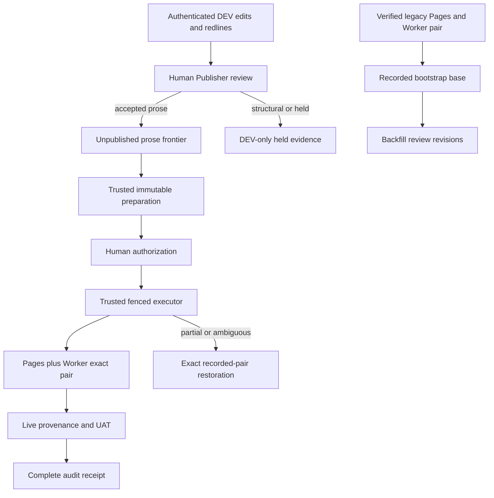

# Prose Publisher Production Rollout - Plan

## Goal Capsule

- **Objective:** Land the granular Publisher as a truthful prose-only release lane, prove the existing production pair is recoverable, and then enable Publisher-authorized production publication under supervised evidence gates.
- **Authority:** An authenticated human holding the Publisher role submits Publisher judgments and authorizes an immutable content release; Damien is the current role holder for the first rollout. Trusted services may prepare, execute, verify, fence, and restore that exact authorization but may never create or enlarge it.
- **Immediate boundary:** Structural topology operations remain visible and reviewable on authenticated DEV but are explicitly ineligible for PROD until a dedicated structural review contract ships.
- **Stop conditions:** Keep `SONSTENG_PROD_RELEASE_ENABLED=false` if the exact legacy Pages deployment, Worker version, matching SHA, provenance, reactivation, or restoration evidence is missing or ambiguous.
- **Execution profile:** Characterization-first changes, positive leak canaries, config-off engineering deployment, background/headless UAT, and one supervised production canary followed by an exact-pair restoration drill.
- **Tail ownership:** The implementation run owns code, migrations, generated artifacts, docs, config-off deployment, and evidence collection. Human Publisher authorization remains a separate deliberate act.

---

## Product Contract

### Summary

The first production-capable granular Publisher release supports atomic text changes only.
John's prose and human-readable JSON text edits remain visible on DEV with redlines and review status.
Damien may Accept, Reject, or Ask question for each prose operation, submit one attributable review, inspect an immutable accepted-only preview, and authorize that exact candidate.
Structural operations such as insert, delete, split, merge, and topology move display a truthful `Not currently publishable` state and never enter eligible counts, frozen membership, manifests, or candidate writes.

### Problem Frame

PR #13 proves the atomic prose flow, but repeated review rounds exposed that structural operations are a different semantic class.
A prose redline cannot truthfully explain a merge or move, structural staleness spans multiple durable sources, and replay requires topology-specific ordering and identity.
Shipping those operations through the prose model would let a Publisher authorize a materially different consequence from the preview.

Production also has a legacy Pages/Worker pair that predates the new release ledger.
The current operations contract correctly keeps the executor disabled until that pair has exact provider identifiers, matching provenance, a verified source SHA, and a successful restoration drill.
Backfilling review evidence before establishing that SHA would bind reviews to an unverified base.

### Actors

- **Editor:** John or another authorized editor. Saves and sees all prose and structural changes on DEV.
- **Publisher:** An authenticated human Publisher. Makes editorial judgments, submits the review, and authorizes the immutable production candidate; Damien is the current role holder for the first rollout.
- **Trusted release service:** Prepares, claims, renews, executes, verifies, fences, and restores exact ledger records through a separate bearer.
- **Operator:** Installs and enables the config-off service, records non-secret provider identifiers, supervises the first canary, and invokes emergency disable/restore procedures.
- **Student:** Sees only the exact verified production Pages artifact.

### Requirements

**Prose-only release scope**

- R1. Ordinary text replacements, insertions, deletions, punctuation changes, and conservative same-source prose move pairs may be reviewed and published, including human-readable `json_scalar` taxonomy text.
- R2. Any operation carrying a structural `op` (`insert_after`, `delete`, `split`, `merge`, or `move`) shall remain visible on DEV but be held with reason `structural_prod_deferred`.
- R3. Worker summary, preparation, Python materialization, manifest construction, and candidate filesystem writes shall independently fail closed if structural membership is supplied or leaks through.
- R4. The Publisher UI and machine context shall show the same eligible, held, stale, and frozen counts and shall explain the structural hold without representing it as rejection.
- R5. The runtime atomic diff shall enforce bounded token and matrix work and use a deterministic whole-span fallback for pathological repetitive prose.

**Bootstrap and recovery evidence**

- R6. Before any legacy backfill, the system shall identify the exact active Pages deployment ID, Worker version ID, matching candidate/source SHA, and live provenance for both targets.
- R7. Bootstrap shall use a checked-in, audited command or ledger transition to record the known-good pair; operators shall not hand-edit the recovery registry.
- R8. The bootstrap command shall re-activate the recorded pair from an isolated checkout at the recorded SHA, verify both provenance endpoints, and produce a redacted audit receipt.
- R9. A mismatched, missing, unreachable, or non-reactivatable provider ID shall stop rollout without preparing a candidate or enabling the timer.

**Review migration and publication**

- R10. Legacy applied DEV changes shall be backfilled only after the verified bootstrap base exists; backfill creates revisions and audit evidence but no decisions or implicit acceptance.
- R11. The authorized human Publisher shall review the backfilled/current prose frontier before the trusted service prepares an accepted-only candidate.
- R12. Engineering deployment of the merged Worker/UI/migrations shall occur with the executor config-off and shall not publish editorial content.
- R13. Enabling `sonsteng-prod-release.timer` and setting `SONSTENG_PROD_RELEASE_ENABLED=true` shall be an attributed operational event after every pre-enable gate passes.
- R14. One supervised canary shall prove mixed accepted, rejected, questioned, unanswered, stale, and structurally held DEV operations publish only accepted prose.
- R15. Pages and production Worker/editor-map provenance shall match the authorized candidate before the ledger records `complete`.
- R16. Partial failure or ambiguous provenance shall fence publication and restore the exact recorded base pair; it shall never fall forward to ambient `HEAD`.

**Authority and audit**

- R17. Editorial decisions, review submission, and production authorization remain human-only; no service credential or browser-exposed token may perform them.
- R18. Trusted service APIs expose machine-readable preparation, lease, provider receipt, provenance, fence, and restoration state over the same ledger the UI reads.
- R19. Any changed base, receipt, membership, evidence, generator, manifest, or candidate after failure requires a new immutable attempt and fresh human authorization.
- R20. Audit output binds actor, authority channel, attempt/fence, review receipt, accepted membership, held reasons, provider IDs, transition times, recovery target, and terminal provenance without including edited text or credentials.

### Key Flows

- F1. **Prose review and structural hold:** John edits on DEV; Damien sees atomic prose controls and structural `Not currently publishable` cards; only submitted accepted prose becomes eligible.
- F2. **Legacy bootstrap:** Operator discovers and verifies the exact live pair, records it through the audited bootstrap seam, reactivates it from its isolated SHA, and proves restoration before review migration.
- F3. **Config-off engineering deploy:** Worker/UI/schema code deploys while content publication remains impossible; live store/API smoke proves migrations and authority separation.
- F4. **First publication:** Trusted service prepares the exact accepted-only candidate; Damien authorizes it; executor deploys and verifies both targets; held DEV text remains absent from PROD.
- F5. **Recovery:** A forced partial-failure canary fences the attempt; the service claims restoration, reactivates the recorded base pair in reverse compatibility order, and verifies exact base provenance.

### Acceptance Examples

- AE1. Given one accepted punctuation edit and one accepted human-readable taxonomy label, preparation includes both even though one source is JSON-backed.
- AE2. Given an accepted `merge` beside accepted prose, the merge is held as `structural_prod_deferred`, the prose remains eligible, and neither Worker nor Python can enlarge membership to include the merge.
- AE3. Given a 16 KB repetitive edit, review revision generation completes within the bounded contract and emits a deterministic whole-span operation rather than unbounded `SequenceMatcher` work.
- AE4. Given no verified bootstrap pair, backfill, candidate preparation, timer enablement, and direct deployment all fail closed.
- AE5. Given a valid bootstrap pair, the drill reactivates those exact IDs, proves their SHA at both provenance endpoints, and leaves production unchanged.
- AE6. Given accepted, rejected, questioned, unanswered, stale, and structural edits on DEV, the supervised canary publishes only accepted prose and retains every other state on DEV.
- AE7. Given Pages success and Worker failure, the attempt becomes `failed_fenced`; a stale executor cannot continue; restoration returns both targets to the exact recorded base.

### Scope Boundaries

**Included now**

- Prose-only PROD eligibility and truthful structural holds.
- Bounded review-diff generation.
- Audited legacy-pair bootstrap and restoration proof.
- Config-off engineering deployment, migration, backfill, supervised canary, enablement, monitoring, and recovery.

**Deferred for later**

- Dedicated structural previews showing anchor, operand, destination, ordering, and resulting topology.
- Multi-source structural review identity, staleness, accepted-only materialization, and structural recovery equivalence.
- A separately reviewed structural-publication plan and supervised structural canary; `structural_prod_deferred` remains terminal behavior for this plan.
- Optional read-only MCP or natural-language wrappers over release observation APIs.

**Outside this product's identity**

- Automatic editorial approval or production authorization.
- A direct-deploy escape hatch.
- Foreground browser automation that takes over Damien's desktop.

---

## Planning Contract

### Key Technical Decisions

- KTD1. **session-settled: Structural operations are not publishable in the first granular PROD release.** Define the boundary by a non-null structural `op`, not by storage kind or `move_pair_id`, so editable taxonomy text and conservative prose moves remain supported.
- KTD2. **Worker and executor both enforce scope.** Store normalized operation classification in the review frontier, hold structural operations during projection/preparation, and repeat the prohibition in `AcceptedOnlyMaterializer` and candidate validation.
- KTD3. **The exact legacy pair precedes review backfill.** `prod_base` is authority, so provider discovery, provenance, reactivation, and restoration proof happen before revisions are migrated.
- KTD4. **Bootstrap is a first-class audited operation.** Extend the ledger/recovery registry through a bounded command or state transition that records the complete Pages/Worker pair in one compare-and-set operation keyed by SHA, never exposes a partial pair as a recovery base, and never relies on hand-edited JSON or ambient checkout state.
- KTD5. **Pages, Worker, and generated artifacts are one release/restoration unit.** The manifest binds the source SHA, generated artifact identities, Pages deployment, Worker version, and provenance evidence.
- KTD6. **Engineering deployment is not editorial publication.** Deploy code and Durable Object migrations config-off; only the later human authorization plus trusted executor changes production content.
- KTD7. **Background browser evidence is mandatory.** Use headless Chrome/DevTools or an isolated display; inability to launch is `unverified`, never PASS, and never triggers a foreground fallback.
- KTD8. **Negative gates require positive canaries.** Each leak, stale-base, mismatch, authorization, and recovery assertion includes a deliberately bad fixture that proves the gate can fail.

### High-Level Technical Design

The normalized review frontier carries an explicit production scope for each operation.
Both browser and service contexts derive counts and reasons from that one projection.
The candidate builder receives only accepted prose operations plus immutable held exclusions.
The recovery registry is populated by an audited bootstrap seam and later by successful release attempts.

### Authority Matrix

| Action | Publisher Access session | Release-service bearer | Provider principal |
|---|---|---|---|
| Save review draft / submit decisions | Allowed | Denied | Denied |
| Authorize immutable candidate | Allowed | Denied | Denied |
| Prepare / claim / renew / transition | Denied | Allowed | Denied |
| Upload or activate Pages/Worker artifact | Denied | Orchestrates | Narrow provider action only |
| Read redacted status and provenance | Allowed | Allowed | Provider-native only |
| Fence / restore exact recorded pair | Denied | Allowed | Narrow provider action only |

### Risks and Mitigations

- **Scope drift:** Structural operations accidentally re-enter through summary-only or backfill paths. Mitigate with stored classification, shared projection policy, executor defense in depth, and positive leak canaries.
- **Wrong bootstrap base:** A visually current page is mistaken for exact evidence. Require both provider IDs, SHA-bound provenance, isolated reactivation, and restoration before migration.
- **Generated-state drift:** Git revert leaves map/bundles stale. Rebuild and verify site, Worker, editor map, persona, instructor, and history artifacts as one manifest-bound pair.
- **Stale Durable Object script:** A new Worker version may not be observed immediately. Verify wrapper forwarding and live endpoint version/provenance after the documented propagation/eviction allowance.
- **Browser interference:** UAT steals desktop focus. Default all runs to headless/background and store artifacts outside the tracked tree.
- **False-green gates:** A check asserts absence without catch power. Add mutated fixtures and exact-value assertions; trust exit codes.

### Sequencing

1. Freeze the prose-only contract and fail-closed structural classification.
2. Bound atomic review generation and close the current PR review threads.
3. Implement and locally verify the audited bootstrap/restoration seam.
4. Merge and deploy the engineering lane config-off.
5. Inventory, atomically record, reactivate, and restore the legacy production pair through the deployed seam.
6. Establish the verified bootstrap base, then run legacy review backfill.
7. Complete background DEV/Publisher UAT and review the prose frontier.
8. Prepare and authorize one supervised production canary.
9. Verify the exact pair, run the recovery drill, then attribute and enable the timer.
10. Monitor the first release window and keep the emergency disable/restore path ready.

---

## Implementation Units

### U1. Enforce prose-only production scope

- **Goal:** Structural edits remain truthful on DEV but cannot enter any production membership or count.
- **Files:** `app/worker/src/editor-store-core.js`, `app/worker/src/editor-publisher.js`, `app/worker/src/editor-assets.js`, `tools/prod_release_executor.py`, `app/worker/test/editor-publisher-release.test.js`, `app/worker/test/editor-publisher-ui.test.js`, `tools/tests/test_prod_release_executor.py`, `app/worker/API-CONTRACTS.md`, `site/platform/data/api-contracts.md`.
- **Patterns:** Reuse normalized frontier lifecycle and held-exclusion vocabulary. Add an explicit operation production scope/classification rather than inferring from storage type.
- **Test scenarios:** Every structural `op` is held with `structural_prod_deferred`; text edits to Markdown and `json_scalar` remain eligible; prose `move_pair_id` remains eligible; supplied structural membership is rejected; UI/API counts match; a dedicated Held / Not publishable filter locates exactly the held cards and keeps them distinct from unanswered and rejected work; every structural card shows its reason and has no authorization control.
- **Verification:** Focused Worker Publisher suites, executor tests, API mirror parity, and background Publisher client verification.

### U2. Bound atomic evidence generation

- **Goal:** Review revision generation cannot overrun the apply lease on repetitive near-limit prose.
- **Files:** `tools/apply_suggestions.py`, `tools/tests/test_apply_suggestions.py`, `app/worker/src/editor-diff.js`, `app/worker/test/editor-diff.test.js`.
- **Patterns:** Mirror the existing JS token/matrix ceilings and deterministic whole-span fallback in the authoritative Python applied-evidence path.
- **Test scenarios:** Repetitive 16 KB prose takes the fallback; normal separated edits remain atomic; punctuation and Unicode stay exact; the fallback identity is deterministic; a mutation canary proves the matcher is bypassed above the ceiling.
- **Verification:** Focused apply/diff suites and bounded runtime assertion with generous non-flaky ceiling.

### U3. Add audited legacy-pair bootstrap and restoration

- **Goal:** Establish a provable, recoverable production base before review migration.
- **Files:** `tools/prod_release_executor.py`, `tools/prod_release_daemon.py`, `tools/tests/test_prod_release_executor.py`, `tools/tests/test_prod_release_daemon.py`, `tools/tests/test_prod_release_operations.py`, `docs/prod-release-operations.md`.
- **Patterns:** Reuse `RecoveryRegistry`, isolated exact-SHA checkouts, pinned Wrangler 4 adapters, fenced provider operations, redacted receipts, and compatibility-ordered activation.
- **Test scenarios:** The complete pair records atomically in one compare-and-set keyed by SHA and replays identically; partial existing state is never valid and can be repaired only through the audited flow; changed retry conflicts; outside-repo/symlink paths reject; missing provider IDs stop before mutation; candidate/base provenance mismatch fails; successful drill reactivates exact IDs and cleans its worktree; no secret or unbounded output reaches artifacts.
- **Verification:** Executor/daemon/operations suites prove the bootstrap seam locally. Live provider inventory and exact-pair reactivation/restoration execute only after U4 deploys that seam config-off.

### U4. Deploy and migrate the engineering lane config-off

- **Goal:** Put the prose-only review code, store migrations, and trusted APIs on the real editing environment without authorizing publication.
- **Files:** `app/worker/wrangler.jsonc`, `tools/install-prod-release-daemon.sh`, `tools/prod_release_daemon.py`, `tools/preflight.sh`, `docs/prod-enable.md`, `docs/prod-release-operations.md`, `docs/uat/editor-publisher-matrix.md`.
- **Patterns:** Preserve `PROD_RELEASE_LEDGER=true` only on the canonical editing Worker, production `DIRECT_APPLY=false`, production-target ledger false, and daemon environment `SONSTENG_PROD_RELEASE_ENABLED=false`.
- **Test scenarios:** Config-off exits before credentials/network/git; legacy direct deploy remains disabled; DO wrapper forwards every new RPC; live migration is idempotent; service credential cannot submit review or authorize; human Publisher cannot prepare/claim/transition.
- **Verification:** Full preflight, config inventory, live editing-Worker status smoke, generated parity, clean daemon checkout, and disabled timer proof.

### U5. Backfill and run background pre-enable UAT

- **Goal:** Build trustworthy review state from the verified production base and prove the real Publisher journey before activation.
- **Files:** `docs/uat/editor-publisher-matrix.md`, `tools/preflight.sh`, `app/editor/verify-editor.js`, `app/worker/test/editor-publisher-review.test.js`, `app/worker/test/editor-overlay.test.js`.
- **Patterns:** Require completed live bootstrap evidence after U4 before using the audited backfill endpoint; preserve no-decision migration semantics; run Chrome headless or on an isolated display without taking desktop focus.
- **Test scenarios:** Authenticated harmless edit reaches DEV; draft survives reload; one atomic multi-source submit works; structural cards show deferred; stale and hostile notes remain inert; accepted/rejected/questioned/unanswered/held filters persist and their counts select exactly their cards; migration replay is exact and mismatch rolls back. Run the background matrix at a narrow phone width, a wider mobile/tablet width, and the supported desktop width, asserting no overflow or control overlap. Require semantic deletion/insertion markup or accessible equivalents, non-color state labels, keyboard-operable decisions and submission/authorization, logical visible focus, associated question labels, and announced success/error states.
- **Verification:** Background editor and Publisher browser suites, live store projections, exact deployed SHA, screenshots/artifacts in temporary storage, and zero foreground focus changes.

### U6. Execute the supervised first prose release and recovery drill

- **Goal:** Publish one exact accepted-only prose candidate, prove the pair, and prove restoration before routine timer operation.
- **Files:** `tools/prod_release_executor.py`, `tools/prod_release_daemon.py`, `docs/prod-release-operations.md`, `docs/uat/editor-publisher-matrix.md`, `docs/prod-enable.md`.
- **Patterns:** Human authorization is bound to exact review receipt, membership, base, candidate, generator, evidence, and manifest. Provider work remains leased/fenced and resumable.
- **Test scenarios:** Mixed-state leak canary; Pages-first and Worker-first compatibility order; crash after first target; lease loss before second target; foreign provenance fence; identical retry; changed attempt requires reauthorization; exact base restoration and post-restore provenance.
- **Verification:** Supervised Publisher authorization, autonomous executor completion, public student copy check, authenticated Worker/editor-map check, audit reconstruction, forced partial-failure restoration drill, and explicit environment/timer enable record only after success.

---

## Verification Contract

| Gate | Command or evidence | Applies to |
|---|---|---|
| Publisher scope and release ledger | `node --test app/worker/test/editor-publisher-review.test.js app/worker/test/editor-publisher-release.test.js app/worker/test/editor-publisher-ui.test.js` | U1, U4-U6 |
| Atomic evidence bounds | `python3 -m pytest tools/tests/test_apply_suggestions.py -q` and `node --test app/worker/test/editor-diff.test.js` | U2 |
| Candidate/executor/recovery | `python3 -m pytest tools/tests/test_prod_release_executor.py tools/tests/test_prod_release_daemon.py tools/tests/test_prod_release_operations.py -q` | U1, U3, U6 |
| Publication boundary | `python3 -m pytest tools/tests/test_publication_boundary.py -q` | U4, U6 |
| Generated artifacts | `python3 tools/build_site.py --check` and `python3 tools/check_build_parity.py` | U4-U6 |
| Full repository preflight | `tools/preflight.sh` with every required gate non-skipped | U4-U6 |
| Background visual UAT | `EDITOR_HEADLESS=1 node app/editor/verify-editor.js` plus Publisher client/browser matrix | U1, U5-U6 |
| Legacy-pair bootstrap | Exact Pages ID, Worker version, SHA-bound provenance, reactivation receipt, and restoration receipt | U3 |
| Supervised prose canary | Mixed-state accepted-only publication, exact Pages/Worker provenance, audit receipt, and held-text absence | U6 |
| Recovery canary | Forced partial state, fence proof, exact recorded-base restoration, and post-restore provenance | U6 |
| Hygiene | `git diff --check`; authoritative rebuild leaves the intended tracked artifacts clean | All units |

Every negative gate includes a positive canary that demonstrably fails when the forbidden condition is injected.
Browser launch failure is `unverified`, never PASS, and never falls back to foreground Chrome without explicit human opt-in.
No PROD activation step may proceed on inferred provider state or a green unit suite alone.

---

## Definition of Done

- Structural operations remain visible on DEV, are labeled `structural_prod_deferred`, and cannot enter eligibility, preparation, manifests, candidate writes, or authorization.
- Markdown, formatted prose, punctuation, human-readable taxonomy JSON, and conservative same-source prose moves retain granular review and accepted-only publication.
- Atomic evidence generation is bounded and deterministic for worst-case permitted input.
- The exact legacy Pages deployment, Worker version, matching SHA, and provenance are recorded through an audited seam and proven reactivatable.
- The exact legacy pair has completed a restoration drill before backfill or executor enablement.
- Legacy review backfill binds the verified bootstrap base and creates no decisions or acceptance.
- Engineering code and migrations run live with the PROD executor config-off, no direct deploy bypass, and correct role separation.
- Background authenticated UAT proves John's edit-to-DEV flow and Damien's granular review flow without taking desktop focus.
- One supervised release proves accepted prose reaches both targets while rejected, questioned, unanswered, stale, and structural edits remain absent from PROD.
- Partial failure fencing and exact-pair restoration are proven against real provider identifiers.
- Pages, Worker, editor map, and generated bundles share one verified manifest identity.
- The enabling actor, time, configuration change, timer state, canary result, and recovery result are recorded without secrets.
- Structural PROD support remains deferred behind its own reviewed plan and canary rather than silently inheriting prose semantics.
