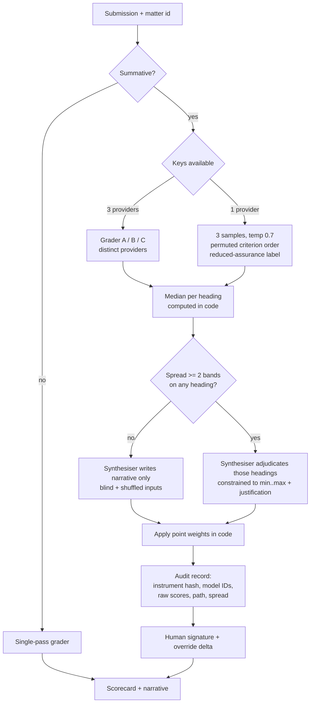
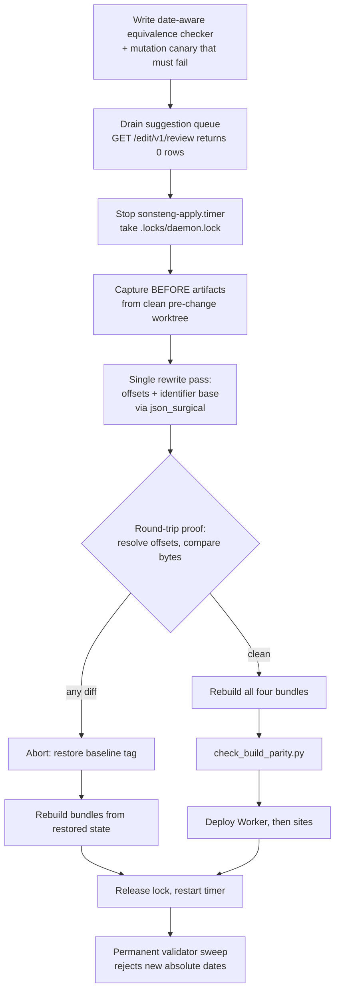

# Legal Practicum Buildout - Plan

## Goal Capsule

- **Objective.** Act on the 31 decisions recorded in `docs/decisions/2026-08-12-john-pitch-docket-outcomes.md`: tighten the pitch to read impact-first, rebrand to Legal Practicum on `legalpracticum.org`, convert the matter corpora to Day Zero offsets, and build the multi-grader assessment panel.
- **Authority hierarchy.** The decision record wins on product intent. This plan wins on implementation mechanism. Where research contradicts a recorded decision, the plan states the conflict on the owning KTD rather than silently overriding it.
- **Execution profile.** Four independent phases. Phase A (pitch) ships first and has no dependency on the others. Phase B (corpus migration) runs under a freeze protocol and must not be interleaved with any other write to `data/`.
- **Stop conditions.** Stop and ask if: the round-trip proof in U8 fails on any file; the corpus rewrite would change a `{#b:}` block ID; or the panel's calibration falls below the human-human baseline.
- **Tail ownership.** Standalone run — this plan owns commits and PRs through to merge.

---

## Product Contract

### Summary

Tighten an already-working pitch and platform rather than rebuild them. The pitch loses about 40% of its body copy and puts the solution early; the corpus gains a deterministic Day Zero date representation; assessment gains a three-grader panel with a written instrument behind it; and the whole property moves to `legalpracticum.org`.

### Problem Frame

John Sonsteng's two emails of 2026-08-12 and the call that followed reduce to one complaint: *"What we've written is very good. It's just that people don't have attention spans at all."* The pitch buries its solution behind its evidence, carries the authors' names in body prose John wants removed, and leaves the demonstration exercise unnamed.

Underneath the pitch, three platform gaps block the method John describes. Exercise dates are hard-coded, so an instructor must retype them each term and, in John's words, *"they screw it up."* Assessment runs one model against weighted rubrics, while John wants a panel — his motivation is human inconsistency, having watched three graders score the same work 4, 5 and 6. And the property still carries a personal domain and a personal name throughout, which John asked be removed because *"it would irritate some people, and you want to assume it's not just me, because that's a little bit arrogant."*

### Requirements

**Pitch and public identity**

- R1. The pitch reduces body copy by about 40%; every statistic, table and citation moves behind a "THE PROOF" expander on its section.
- R2. Section order delivers the solution early: problem, how it teaches, human and AI, then the survey evidence.
- R3. The Midstate / SPEU / Pat Rogers arbitration is named in the pitch as the worked demonstration.
- R4. Every other exercise appears as a cover-sheet card carrying matter name, the skills it can be run as, length options, and a link into the full packet.
- R5. No author name appears in pitch body prose. The copyright notice in `LICENSE` is unchanged.
- R6. "Center for Law and Business" does not appear in public-facing text. The provenance citation in `docs/master-outline.md` stands.
- R7. `tools/tests/test_identity_rights_contract.py` asserts the new byline, the new domain, and the de-naming invariants.

**Corpus dates**

- R8. Every date in `data/matters/` carries a Day Zero offset in days alongside its literal value.
- R9. Offset derivation is deterministic. No model inference appears anywhere in the conversion path.
- R10. The conversion is proved lossless: resolving every offset against its original anchor reproduces the pre-migration bytes exactly.
- R11. Dates that are fixed facts — citation years, statutory effective dates, birthdates — are held out of the shift and recorded as such.
- R12. A validator check fails on any absolute date introduced into matter content after the migration.

**Domain and identifiers**

- R13. The spine's `jsonld_context_base` and every `@id` and `@context` value resolve under `legalpracticum.org`.
- R14. Worker configuration, deployment hostnames, CORS and Access rules, and `site/` references point at `legalpracticum.org` from Phase A, ahead of the corpus migration.
- R26. Prose date offsets live in a schema-validated sidecar keyed by block ID. Authored prose is never rewritten to carry an offset.
- R27. A faculty member can review an assessment and sign it: per-heading grader scores, the median, the spread, and any adjudication justification are rendered, with headings at spread of 2 bands or more visually flagged.

**Assessment**

- R15. Each of the seven analytic headings carries six band descriptors (0–5) as versioned, content-hashed data.
- R16. Three graders score each submission independently against the anchors, emitting a 0–5 per heading with verbatim evidence spans and a rationale.
- R17. The median of the three scores per heading is the score of record, computed in code.
- R18. The synthesiser writes the assessment narrative from three identity-stripped, order-shuffled rationales. It sets a score only when the graders' spread on that heading is 2 bands or more, and only within their minimum and maximum.
- R19. Rubric point weights apply in code. A grader never sees them.
- R20. Three graders run on three different providers when multiple keys exist. With one key, three samples run from the same model at raised temperature with permuted criterion order, and the assessment is labelled reduced-assurance. A provider is eligible for summative grading only under terms that exclude submitted content from training and bound retention; the record names the providers used.
- R21. Summative assessments use the panel. Formative drafts use a single pass.
- R22. Every summative grade carries a human signature. The stored record holds instrument version, model identities and snapshot IDs, the three raw scores, the aggregation path taken, the panel spread per heading, and any faculty override with its delta. Request and response bodies are stored with every authorization header and BYOK key value stripped before persistence.
- R28. Assessment records are readable only under a named access scope, carry a stated retention period, and have a deletion path.
- R23. Each submission is graded in a fresh context. No grading history carries between submissions.

**Cost and conformance**

- R24. A cost-per-credit page compares the practicum against standard classes, seminars, clinics and internships, carries a faculty-pay-model switch, and shows the ABA Standard 310(b) minimum of 225 hours for a five-credit course with the arithmetic visible. Comparator cost cells start empty for the reader to populate; the page ships no invented figures.
- R25. All 20 exercise packets are audited against the nine required parts. Mechanical gaps are fixed; structural gaps are reported.

### Scope Boundaries

**Deferred to follow-up work**

- Per-student resolution of Day Zero offsets. The authored representation lands here; the runtime layer that resolves it per student does not. See KTD1.
- The shared-and-computed-text design in `docs/plans/2026-08-04-001-feat-shared-and-computed-text-plan.md`, including the 24 withdrawn editor registrations. Day Zero resolution depends on it.
- An editor path to `site/index.html`. `tools/apply_suggestions.py` rejects any `source_ref` outside `data/`, so John cannot edit the pitch through the editor today. Pitch edits in this plan are direct file edits.
- Restoration of the six original Midstate matters into the spine as new matter IDs.
- A homepage video cut.

**Outside this product's identity**

- Jury trials. John excluded them: this trains lawyering, not trial advocacy.
- Alumni recruitment operations. The pitch argues for the alumni corps; running it is the dean's.

### Outstanding Questions

All are deferred; none blocks implementation.

- **Pitch opening order** *(deferred, pending John)*. John asked on the call to open with Midstate. Damien's disposition is a short problem statement first, then the demonstration. U3 implements Damien's order. If John holds his position it is a paragraph move.
- **235 versus 225 hours** *(deferred, pending John)*. John reaffirmed 235 twice and said he had built a model behind it. R24 publishes 225 with the derivation shown. Obtain John's model and reconcile.
The seven-point form is settled: it is the seven analytic headings in `data/curriculum/m2.md`. The repo's weighted rubrics carry 4–6 criteria each and no seven-band scale, so this is the only seven-point instrument present. The production route for a bulk corpus rewrite is no longer an open question either — it is a named prerequisite of U8.

---

## Planning Contract

### Key Technical Decisions

- KTD1. **Day Zero splits into representation now, resolution later.** Convert the whole corpus to offsets as additive data; defer per-student resolution. *(session-settled: user-directed — chosen over landing the computed-text design first or building the runtime now: the editor map cannot represent a sentence mixing authored words with a computed value, and `docs/handoffs/2026-08-04-public-practicum-and-page-copy-handoff.md:30` carries a standing instruction not to migrate more content into that category.)* Governs R8, R12.
- KTD2. **Median-of-three is the score of record; the synthesiser writes the narrative.** *(session-settled: user-directed — chosen over the literal best-of-three in the transcript: a maximum over three graders inherits the most generous grader's variance, which inflates grades and defeats the consistency argument that motivates the panel.)* Governs R17, R18. Conflict on record: John described the fourth model as "giving the best aspects of all three." Read as feedback synthesis, this is faithful; read as score maximisation, it is a deliberate departure and John should be told.
- KTD3. **AI drafts the 42 band descriptors; John edits.** *(session-settled: user-directed — chosen over John authoring from scratch: it unblocks the panel build without a single-person dependency, and John reacts faster to a draft than to a blank page.)* Governs R15.
- KTD4. **Offsets are additive optional fields beside the literals, never replacements.** `docs/data-spine.md:88` freezes the schemas to additive-and-optional changes, and `matter.json`'s `open_date` and `as_of_date` are required with `"format": "date"`. Governs R8.
- KTD14. **Prose offsets live in a sidecar keyed by block ID; authored prose is never rewritten.** *(session-settled: user-directed — chosen over an inline marker in the sentence: an inline value makes the block a sentence mixing authored words with a machine value, which is the computed-text shape KTD1 exists to avoid, and it would be editable and deletable through the suggestion editor with no schema to catch it.)* Governs R26. Consequence: the 469 editable blocks carrying dates keep purely authored text, so their `original_hash` is unchanged and no in-flight suggestion drifts on the prose half of the migration.
- KTD15. **The public property moves to the new domain in Phase A; spine identifiers follow in U8.** *(session-settled: user-directed — chosen over one whole cutover after the migration: the de-named pitch would otherwise ship at a personally-named URL, defeating the reason for de-naming it.)* Governs R14. The pitch page is absent from the editor map, so the site-level cutover carries none of the migration's drift risk. JSON-LD `@id` values are identifiers, not URLs that must resolve, so the interval where they still name the old base is harmless.
- KTD16. **The cost page ships blank comparator inputs and a static derivation.** *(session-settled: user-directed — chosen over labelled illustrative defaults: a dean who spots one fabricated figure discounts the whole comparison, and the ABA arithmetic is the only number on the page that can be independently checked.)* Governs R24.
- KTD5. **Write the equivalence checker before the migration exists.** Extend `equivalence_check()` in `tools/stamp_block_ids.py` into a date-aware variant rather than inventing a harness. The existing function permits only the locator to change and will report drift on every rewritten block, which is correct behaviour for its current job and wrong for this one. Governs R10.
- KTD6. **Programmatic JSON writes go through `tools/json_surgical.py`.** A `json.loads` → mutate → `json.dumps` round trip reformats 143 of 188 hand-authored JSON files in this corpus even on a no-op, which would destroy the byte-diff proof. Governs R9, R10.
- KTD7. **One file pass, two gates.** The date rewrite and the identifier rewrite touch the same files, so they run in a single pass. Only the date half needs the drift and equivalence machinery — `@id` and `@context` values appear nowhere in the editor map. *(session-settled: user-approved — chosen over two separate passes over the same 163 files.)* Governs R8, R13.
- KTD8. **Blind, shuffle, and permute.** The synthesiser receives the three rationales with provider identity stripped and order randomised. Each grader sees the seven headings in a different seeded permutation. Both mitigate position bias; the first also mitigates self-preference, which rubric anchoring alone does not remove. Governs R18, R23.
- KTD9. **Score 0–5 per heading.** Human-LLM alignment is highest on a 0–5 scale and consistently weakest on 0–10 and 0–100. The 200-point rubric total is arithmetic applied afterward. Governs R16, R19.
- KTD10. **Single-key mode is reduced-assurance, not equivalent.** Three samples at temperature near 0.7 with permuted criterion order and rotated exemplars, labelled on the assessment record. At temperature 0 three samples from one model are near-duplicates and produce a false confidence signal. *(session-settled: user-directed — chosen over degrading to a single pass when only one key exists.)* Governs R20.
- KTD11. **Reproducibility comes from stored artifacts, not from re-running.** Temperature 0 does not make a model deterministic — batch-size-dependent kernels in the serving stack diverge under load regardless of seed. The audit record is the guarantee. Governs R22.
- KTD12. **The dual licence is unchanged.** MIT for software, CC BY 4.0 for content per `CONTENT-LICENSE.md`. Midstate's scenarios join the existing content grant. *(session-settled: user-directed — chosen over the separate-licence `data/midstate/` carve-out proposed in `docs/decisions/2026-07-18-midstate-deferred.md`, now superseded.)*
- KTD13. **Publish 225 hours with the derivation shown.** ABA Standard 310(b) specifies one classroom hour plus two out-of-class hours per week for fifteen weeks: 45 hours per credit, 225 for five credits. *(session-settled: user-directed — chosen over John's 235: publish the arithmetic a dean can check, and invite John's model as a counter.)* Governs R24.

### High-Level Technical Design

**Assessment panel — call graph and aggregation.**

**Corpus migration — the freeze protocol.**

### Assumptions

- The 469 editable blocks carrying dates will have their `original_hash` change, voiding any in-flight suggestion on those blocks. The freeze protocol drains the queue first so nothing is in flight.
- Adding optional properties does not require a `spine_version` bump under the additive-and-optional rule. If the implementer finds the F29 check disagrees, treat that as a stop condition and raise it.
- Midstate PDFs and video are in Damien's possession and ingestible without further clearance. The ~20 commentary segments are excluded per the decision record.

### Sequencing

Phase A is independent and ships first: U16 before U2 so the pitch work is checkable, then U1 → U2 → U3 → U4 and U5, with U10 in parallel behind U1. Phase B is a single atomic window and must not overlap any other write to `data/`. Phase C is internally ordered U11 → U12 → U13 → U14 → U17 and does not depend on Phase B. Phase D is independent. No file is touched by two phases, so each phase can land as its own PR chain.

---

## Implementation Units

| U-ID | Title | Key files | Depends on |
|---|---|---|---|
**Phase A — pitch and public identity**

| U-ID | Title | Key files | Depends on |
|---|---|---|---|
| U16 | Pitch-page verification gate | `tools/verify_pitch.py`, `tools/tests/test_verify_pitch.py` | — |
| U1 | Rewrite the identity and rights contract | `tools/tests/test_identity_rights_contract.py` | — |
| U2 | Condense the pitch behind THE PROOF | `site/index.html` | U1, U16 |
| U3 | Reorder the pitch and add cover-sheet cards | `site/index.html`, `data/copy/` | U2 |
| U4 | De-name body prose and retire the centre name | `site/index.html`, `README.md` | U3 |
| U5 | Cost-per-credit page | new page under `site/`, `data/copy/` | U3 |
| U10 | Domain cutover for the public property | `app/worker/wrangler.jsonc`, `site/`, deploy scripts | U1 |

**Phase B — corpus migration**

| U-ID | Title | Key files | Depends on |
|---|---|---|---|
| U6 | Date-aware equivalence checker and canary | `tools/stamp_block_ids.py`, `tools/tests/` | — |
| U7 | Day Zero representation and converter | `data/schemas/`, `tools/day_zero.py` | U6 |
| U8 | The corpus rewrite pass | `data/matters/`, `data/spine-manifest.json` | U6, U7 |
| U9 | Validator gate for dates and identifiers | `tools/validate_spine.py`, `docs/research/validator-spec.md` | U6, U7, U8 |

**Phase C — assessment**

| U-ID | Title | Key files | Depends on |
|---|---|---|---|
| U11 | Seven-heading band anchors as versioned data | `data/curriculum/`, `data/schemas/` | — |
| U12 | Memo scorecard schema and prompt templates | `data/schemas/`, `app/worker/prompts/` | U11 |
| U13 | Panel orchestration with median aggregation | `app/worker/src/panel.js`, `app/worker/src/byok.js` | U12 |
| U14 | Assessment audit record and override capture | `app/worker/src/editor-store-core.js` | U13 |
| U17 | Signer review surface | `app/worker/src/assessment-view.js`, `app/editor/` | U14 |

**Phase D — conformance**

| U-ID | Title | Key files | Depends on |
|---|---|---|---|
| U15 | Nine-part exercise conformance audit | `data/matters/*/exercise/`, `data/schemas/exercise.schema.json` | — |

### U1. Rewrite the identity and rights contract

- **Goal.** Make the contract test assert the identity the project is moving to, so the de-naming sweep and the domain cutover land against a green test rather than breaking a red one.
- **Requirements.** R7; unblocks R5, R6, R13, R14.
- **Dependencies.** None.
- **Files.** `tools/tests/test_identity_rights_contract.py`
- **Approach.** The test currently pins the old identity in five places: the byline `"John O. Sonsteng · Damien Riehl · with Roger S. Haydock"`, `"Hosted by Damien Riehl"`, the literal C-LAB/IGUL sentence, `"sonsteng.damienriehl.com"` in the README, and a titled string carrying all three names. It also already asserts some de-naming (`"Sonsteng Practicum"` and `"The Sonsteng Magnum Opus"` must be absent), which stays.
  1. Replace the byline assertion with the new cover byline and add an assertion that no author surname appears in pitch *body* prose.
  2. Repoint the README domain assertion at `legalpracticum.org`.
  3. Add an assertion that the `LICENSE` copyright line is unchanged — the de-naming sweep must not touch it.
  4. Add an assertion that `"Center for Law and Business"` is absent from `site/index.html` and `README.md`, and present in `docs/master-outline.md`.
  5. Update the `CONTENT-LICENSE.md` assertions: the excluded list names `data/midstate/`, which KTD12 retires.
- **Execution note.** Write the assertions first and watch them fail, so the sweep in U4 has a real target.
- **Test scenarios.**
  - A pitch body containing an author surname fails the de-naming assertion.
  - A `LICENSE` with a modified copyright line fails.
  - A README still naming the old domain fails.
  - `"Center for Law and Business"` present in the pitch fails; present in the outline passes.
  - The cover byline is asserted by exact string, so a silent reword fails.
- **Verification.** `python3 -m pytest tools/tests/test_identity_rights_contract.py -q` fails before U4 and passes after.

### U2. Condense the pitch behind THE PROOF

- **Goal.** Cut about 40% of pitch body copy and move every statistic, table and citation into a per-section expander.
- **Requirements.** R1.
- **Dependencies.** U1, U16.
- **Files.** `site/index.html`
- **Approach.** `site/index.html` is hand-authored, absent from the editor map, and untouched by `tools/build_site.py` — this is a plain file edit with no drift machinery. Add a THE PROOF disclosure block to each of the nine sections, as a native `
` collapsed by default. Each `
` carries that section's single headline figure as its teaser, so the collapsed state promises evidence rather than hiding it. Add a print stylesheet rule that force-expands every block, so a pitch printed or PDF'd for a committee contains all the evidence. The survey section is the heaviest at 411 words and is where most of the moved content comes from. Preserve the existing base64-inlined fonts and the reduced-motion handling. Keep the page under the 250 KB build ceiling.
- **Patterns to follow.** The existing `.eyebrow` / `.band` section structure, styled to match.
- **Test scenarios.**
  - Every section that had statistics has a THE PROOF block, and no statistic remains in body prose except the one headline figure carried in each summary.
  - A print render contains every expander's content.
  - The page renders under 250 KB.
  - Expanders are keyboard-reachable and announce state to a screen reader.
  - `prefers-reduced-motion` suppresses any expander animation.
  - No external asset requests are introduced.
- **Verification.** `python3 tools/verify_pitch.py` passes.

### U3. Reorder the pitch and add cover-sheet cards

- **Goal.** Deliver the solution early and give every non-demo exercise a scannable card.
- **Requirements.** R2, R3, R4.
- **Dependencies.** U2.
- **Files.** `site/index.html`
- **Approach.**
  1. Reorder to nine sections: problem, the Midstate demonstration, how it teaches, human and AI, survey proof, trilogy, consolidation, coverage, where it lives. Section anchors are referenced by the in-page nav; update both.
  2. Name Midstate / SPEU / Pat Rogers in the demonstration section.
  3. Add a cover-sheet card grid: one card per remaining exercise, every card carrying the same four fields in the same order — matter name, the skill lenses it can be run as, length options, and a link into its packet under `site/platform/`.
- **Approach note.** Card content comes from `data/matters/manifest.json` (matter caption) and each matter's `skill_refs`. No length field exists anywhere under `data/matters/`, so author the length options once as an enumerated vocabulary in `data/copy/` and reference it per card rather than writing a free-hand string nineteen times. Cards follow manifest order. A field a matter lacks is omitted, never rendered empty. The pitch is not generated — copy the values in rather than introducing a build step for one page.
- **Test scenarios.**
  - In-page nav links resolve to all nine reordered anchors.
  - Every card carries the same field set in the same order.
  - Every cover-sheet card's packet link resolves under `site/platform/`.
  - The demonstration section names all three of Midstate, SPEU and Pat Rogers.
  - A card whose matter lacks a field omits it rather than rendering an empty row.
  - The card grid reflows to a single column on a narrow viewport without horizontal page scroll.
- **Verification.** `python3 tools/verify_pitch.py`; `node tools/verify_platform_layout.js`.

### U4. De-name body prose and retire the centre name

- **Goal.** Remove author names from pitch body prose and "Center for Law and Business" from public text, leaving legal notices intact.
- **Requirements.** R5, R6.
- **Dependencies.** U3. All three pitch units rewrite the same hand-authored file, and this unit's occurrence-by-occurrence sweep must run against the final section set and word count.
- **Files.** `site/index.html`, `README.md`
- **Approach.** "Sonsteng" appears 25 times in `site/index.html`. Each occurrence is one of three kinds and they are handled differently: body prose (rewrite to **institutional-artifact attribution**, not agentless passive — *"For 50 years, John Sonsteng has documented this gap"* becomes *"A 50-year survey series of practising lawyers documents this gap"*); cover byline (keep); legal notice (keep, untouched). Work occurrence by occurrence rather than by find-and-replace — the three kinds are not distinguishable by pattern.
- **Approach note.** Attribute to the study, survey series or dataset rather than dropping the agent entirely. Academic readers weight a claim by who made it, and R1 has already moved the citations behind an expander — a body of agentless assertions reads weaker than the evidence actually is. Each such claim keeps an inline pointer to its THE PROOF block.
- **Execution note.** U1's assertions are the target. Run them after each batch.
- **Test scenarios.**
  - No author surname remains in any body paragraph of the pitch.
  - The cover byline is intact.
  - `LICENSE` is byte-identical to its pre-change state.
  - The C-LAB/IGUL provenance sentence survives in whatever form U1's rewritten assertion specifies.
  - `docs/master-outline.md` still carries the Center for Law and Business citation.
- **Verification.** `python3 -m pytest tools/tests/test_identity_rights_contract.py -q` and `python3 tools/build_site.py --check` pass.

### U5. Cost-per-credit page

- **Goal.** Give a dean a page that compares delivery cost per credit across formats and lets them run their own numbers.
- **Requirements.** R24.
- **Dependencies.** U3, so the nav is updated once.
- **Files.** new page under `site/`, `site/index.html` (link only), `data/copy/`
- **Approach.** A standalone page, reachable in one click: a nav entry plus an inline link from the pitch section that carries the delivery-cost argument. Compare practicum against standard classes, seminars, clinics and internships. Carry a faculty-pay-model switch — flat per-exercise stipend versus load credit — defaulting to the stipend, because the decision record leaves that choice to each school. Show the ABA Standard 310(b) derivation as static arithmetic: one classroom hour plus two out-of-class hours per credit, fifteen weeks, five credits, 225 hours.
- **Approach note.** Every comparator cost cell **starts empty**. John's cost calculations have not arrived, and a fabricated figure in a dean-facing comparison discredits the page's entire claim; the ABA arithmetic is the only number on the page a reader can independently check, so it is the only number the page asserts. Specify an inputs table naming each editable field with its unit and permitted range. A blank or out-of-range entry holds the last valid value, shows an inline validation message, and leaves derived cells at the last valid computation rather than rendering NaN. Nothing is persisted.
- **Test scenarios.**
  - The page ships no pre-filled comparator cost figures.
  - The page is reachable from the pitch in one click.
  - Changing the pay-model switch changes the practicum column and nothing else.
  - The 225-hour derivation is shown as arithmetic, not asserted as a total.
  - Entering a salary figure recomputes every dependent cell.
  - Clearing a field or entering a non-numeric value shows a validation message and leaves derived cells at their last valid values, never NaN.
  - The page carries no external asset requests and stays under the 250 KB ceiling.
- **Verification.** `python3 tools/verify_pitch.py`; `node tools/a11y_audit.js`.

### U6. Date-aware equivalence checker and canary

- **Goal.** Build the proof harness before the migration it proves exists.
- **Requirements.** R10.
- **Dependencies.** None.
- **Files.** `tools/stamp_block_ids.py`, `tools/tests/test_stamp_block_ids.py`, new `tools/tests/test_day_zero_equivalence.py`
- **Approach.** Two checks, not one.
  1. **File-level round trip.** For every file the converter touched, resolve each written offset back to its literal and compare against the pre-migration bytes. This must cover the whole touched set, not only the editor map — most corpus dates live outside it, and `business/business.json` alone holds the largest concentration. Report converted-date count against proof-covered-date count and fail when they differ.
  2. **Block-identity equivalence.** Reuse `equivalence_check()` unchanged to prove no `{#b:}` block ID and no block's `original_text` moved. Under KTD4 and KTD14 the migration adds JSON keys and a sidecar without touching any existing scalar or any authored prose, so this check should pass with zero drift — a failure here means the converter modified authored content and the run must stop.
- **Approach note.** What neither check can see: whether a date was bound to the *right* anchor. `anchor + (literal − anchor) == literal` holds for any anchor value, so the round trip proves the write path, not the semantics. U7 owns the anchor-assignment audit that covers this.
- **Execution note.** Build the mutation canary in the same unit and prove it fails. A prior checker in this repo matched dates as ISO while the corpus writes them as long-form English, reported zero flags across 20 matters, and was read as working. Any check whose success condition is an absence must be shown capable of producing a presence.
- **Test scenarios.**
  - A file whose offsets resolve back to the original literals passes.
  - A file with one offset deliberately shifted by one day fails, naming the file and the date.
  - Converted-date count and proof-covered-date count are reported, and a mismatch fails the run.
  - A file outside the editor map — a `business/business.json` fixture — is covered by the round trip.
  - A modified `{#b:}` block ID or a changed `original_text` fails the identity check.
  - A date written long-form (`February 16, 2026`) is detected, not only ISO form.
  - The canary — a deliberately corrupted fixture — fails the check, proving the check can fail.
- **Verification.** `python3 -m pytest tools/tests/test_day_zero_equivalence.py -q`.

### U7. Day Zero representation and converter

- **Goal.** Define how an offset is stored and build the deterministic converter that derives one.
- **Requirements.** R8, R9, R11.
- **Dependencies.** U6.
- **Files.** `data/schemas/matter.schema.json`, `data/schemas/business.schema.json`, `data/schemas/exercise.schema.json`, new `tools/day_zero.py`, `tools/tests/test_day_zero.py`
- **Approach.**
  1. Add offset properties as **optional** additions beside the existing literals. `open_date` and `as_of_date` are required with `"format": "date"` and cannot change type. `exercise.schema.json`'s `sections` sets `"additionalProperties": false` with eight fixed required keys, so any exercise-level addition goes outside that object.
  2. Each matter's anchor is its existing `open_date`. Offset is a signed integer day count from the anchor.
  3. **Prose offsets go in a sidecar** (KTD14): `data/matters/<id>/date-offsets.json`, keyed by `{#b:}` block ID and locator within the block, validated by a new schema. No markdown file is rewritten. The 291 markdown files under `data/matters/` are the majority date surface and this is how they are covered.
  4. The converter parses both ISO and long-form English dates with a real date parser, never a bare regex, and writes JSON through `tools/json_surgical.py`.
  5. Classification: emit a candidate list of dates that look like fixed facts — a year with no month or day, a date inside a citation pattern, a date in a statutory context — and hold them out of conversion pending review. Record the held-out set at `data/day-zero-holdouts.json`, keyed by source file and locator and validated by a schema, so U9's gate can consult it and the decision is auditable and re-runnable.
  6. **Anchor-assignment audit.** Emit every converted date with the anchor it was bound to and the reason, as reviewable data, for human review before U8 runs. `business/business.json` holds the largest concentration of dates against a matter-level `open_date` that may not be the right zero for every party in the file, and no round trip can detect a wrong anchor.
- **Execution note.** Enumerate and reconcile the date population before converting any of it. The corpus is reported to hold roughly 631 ISO and 608 long-form dates, with about 521 in `business/business.json` alone; treat those as starting estimates to verify, not as a target to match.
- **Test scenarios.**
  - An ISO date converts to the correct signed offset from its matter's `open_date`.
  - A long-form date (`February 16, 2026`) converts identically to its ISO equivalent.
  - A date before the anchor produces a negative offset.
  - A bare year (`2019`) is classified as a fixed-fact candidate, not converted.
  - A date inside a case citation is classified as a fixed-fact candidate.
  - Writing an offset into a JSON file leaves every other byte in that file unchanged.
  - A prose date produces a sidecar entry and leaves the markdown file byte-identical.
  - The anchor-assignment audit names an anchor and a reason for every converted date.
  - The converter is idempotent: a second run over converted data is a no-op.
  - A schema with a new *required* property fails the F29 check, proving the additive-and-optional rule is enforced.
- **Verification.** `python3 -m pytest tools/tests/test_day_zero.py -q`; `python3 tools/validate_spine.py --strict`.

### U8. The corpus rewrite pass

- **Goal.** Execute the single rewrite pass — offsets and identifier base — under the freeze protocol, with the round-trip proof gating the result.
- **Requirements.** R8, R10, R13.
- **Dependencies.** U6, U7.
- **Files.** `data/matters/**`, `data/curriculum/**`, `data/jurisdictions/**`, `data/spine-manifest.json`
- **Prerequisite.** Define and record the production route for a bulk `data/` rewrite **before the freeze window opens**. The Publisher lane is prose-only and holds structural ops as `structural_prod_deferred`, so this pass does not fit it. Discovering that mid-window, with the timer stopped and the queue drained, is the failure this prerequisite prevents.
- **Approach.** Follow the protocol proved on the 5,952-block re-keying migration recorded in `docs/solutions/editor/2026-07-28-durable-block-identity.md`:
  1. Cut a baseline tag with `tools/make_baseline.py` so the History browser can redline the whole change for John.
  2. Drain the suggestion queue and prove it — `GET /edit/v1/review` returns zero rows.
  3. Stop `sonsteng-apply.timer` and hold `.locks/daemon.lock`. The daemon writes to `data/` every two minutes from its own worktree; a tick mid-migration lands unrelated commits inside the diff being proved.
  4. Capture BEFORE artifacts from a clean pre-change worktree.
  5. Run the single pass. Date conversion is scoped to `data/matters/`; the identifier substitution spans every tree listed in Files. Date writes go through `json_surgical`; identifier writes are a plain substitution because `@id` and `@context` appear nowhere in the editor map.
  6. Run both U6 checks. Any failure aborts — see below.
  7. Rebuild all four generated bundles, run `tools/check_build_parity.py`, deploy Worker then sites, release the lock and restart the timer.
- **Abort sequence.** On any quarantine or proof failure, do not investigate with the pipeline frozen: restore the working tree to the baseline tag, rebuild all four bundles from the restored state, release `.locks/daemon.lock` and restart `sonsteng-apply.timer`, and only then diagnose. A stopped run leaves some files rewritten and — because KTD7 puts both rewrites in one pass — some on the new identifier base and some on the old. State an expected window duration before starting and abort if it is exceeded.
- **Approach note.** Prose date rewrites must place the offset marker *inside* the prose, before the trailing `{#b:}` marker. `_BID_MARKER_RE` is anchored to end-of-line; anything appended after the marker breaks that block's identity.
- **Execution note.** A `git revert` does not restore generated artifacts. If this pass is reverted, the recovery path is revert, rebuild, deploy site, deploy Worker — all four or none — or the Worker serves a stale editor map and every touched block reports itself uneditable.
- **Test scenarios.**
  - Every `{#b:}` block ID is unchanged after the pass.
  - The U6 round-trip proof passes on every file.
  - `tools/check_build_parity.py` passes after the bundle rebuild.
  - No file under `data/` reformats — a `git diff --stat` shows only intended lines.
  - The rendered `site/` diff contains no unintended lines.
  - A simulated daemon tick during the window is blocked by the lock rather than interleaving.
- **Verification.** `bash tools/preflight.sh --no-browser`.

### U9. Validator gate for dates and identifiers

- **Goal.** Make the invariant permanent: no new absolute date, no old identifier base.
- **Requirements.** R12, R13.
- **Dependencies.** U6, U7, U8. The new checks reject the old identifier base and un-offset dates, so they fail corpus-wide until U8 has rewritten the corpus.
- **Files.** `tools/validate_spine.py`, `docs/research/validator-spec.md`, `tools/tests/test_validate_spine.py`
- **Approach.** Add the numbered checks to `docs/research/validator-spec.md` first — the module docstring and `--help` both claim "the 29 checks in docs/research/validator-spec.md", so the spec is the registry. Then add `_check_*` methods and dispatch them from `_check_matter`. If either check introduces a new global scope name, add it to the hardcoded scope tuple in **both** `emit_human()` and `build_json_report()`, or the findings compute and never print.
- **Approach note.** Three checks, not two. Beyond rejecting new absolute dates and the old identifier base, add a **consistency check** that recomputes every offset from its adjacent literal and the matter anchor and fails on mismatch. Without it the corpus carries two representations of every date with nothing keeping them in sync: the U6 proof is a one-shot before/after comparison that cannot run again, John edits literals through the suggestion editor, and an offset can silently rot while the literal it describes moves. This is the invariant R8 states and nothing else enforces.
- **Approach note.** Checks B7 through B12 do real arithmetic on literal dates — invoice date at or after the latest billed entry, nothing dated after `as_of_date`, a date-ordered trust ledger that never goes negative. Because KTD4 keeps the literals in place, those checks continue to operate on literals and need no change. Confirm this rather than assume it.
- **Test scenarios.**
  - A matter file with a newly added absolute date fails the new check.
  - A matter file with a date carrying its offset passes.
  - Editing a literal without updating its offset fails the consistency check.
  - A held-out fixed-fact date, present in `data/day-zero-holdouts.json`, passes without an offset.
  - A file still carrying the old identifier base fails.
  - The new checks appear in both human and JSON report output.
  - Existing B7–B12 findings are unchanged against the migrated corpus.
- **Verification.** `python3 tools/validate_spine.py --strict --json /tmp/report.json`; `python3 -m pytest tools/tests/test_validate_spine.py -q`.

### U10. Domain cutover for the public property

- **Goal.** Move the deployed property to `legalpracticum.org` in Phase A, so the de-named pitch never ships at a personally-named URL.
- **Requirements.** R14.
- **Dependencies.** U1. The spine's `@id` identifiers are rewritten separately in U8; this unit does not wait on them, because a JSON-LD identifier is a name, not a URL that must resolve.
- **Files.** `app/worker/wrangler.jsonc`, `app/worker/src/editor-http.js`, `app/worker/src/editor.js`, `tools/build_site.py`, `tools/install-prod-release-daemon.sh`, `site/**`, `README.md`
- **Approach.** The domain is not only a data string. It appears in Worker configuration and routes, CORS and Cloudflare Access rules, the build tooling, the prod-release daemon installer, generated persona bundles, Worker and Python tests, and roughly 66 files under `site/`. Cut over in this order, which is load-bearing:
  1. Create the Cloudflare Access application for the new hostname and confirm it **enforces** on an unauthenticated request.
  2. Update `EDIT_ACCESS_HOST` and `EDIT_ACCESS_AUD` to the new application's values in the same deploy as the new Worker route.
  3. Site references, then the README.
  4. Retire the old Access application, and remove the old origin from `ALLOWED_ORIGINS` and `EDIT_ORIGIN`.
- **Approach note.** The host gate, not the token's presence, is what makes an Access JWT unforgeable in this Worker. Repointing `EDIT_ACCESS_HOST` to a hostname where no Access application yet enforces opens the editor to anyone who can set the assertion header. Keep the old hostname resolving as a redirect rather than retiring it.
- **Approach note.** `personas.generated.json` is generated — change the source, regenerate, never hand-edit.
- **Test scenarios.**
  - An unauthenticated request to an `/edit/v1` path on the new hostname is refused.
  - A request carrying a self-supplied Access assertion header grants no scope.
  - The Worker serves under the new hostname and rejects a cross-origin request from an unlisted origin.
  - The editor loads and a suggestion round-trips under the new hostname.
  - The old hostname redirects rather than 404s, and no longer appears in the allowed-origin lists.
  - `tools/check_build_parity.py` passes after regeneration.
  - No test still asserts the old hostname except a redirect test.
- **Verification.** `bash tools/preflight.sh`; manual check that the editor round-trips under the new domain.
- **Execution record (2026-08-23).** Autonomous cutover complete: Cloudflare zone
  active; Pages serves `legalpracticum.org`; Turnstile accepts the new domain; the
  cloned Access application enforces before the Worker and preserves the prior IdP,
  policy, and session; reviewed Worker version `cc86efd2-636d-4823-be8e-a07810487bbf` owns the
  new editor host and path-preserving redirects for the legacy editor host, `www`,
  and the former public host; the old Access application and old Pages binding are
  retired. The authenticated suggestion round-trip remains the sole human-identity
  verification and is queued in
  `docs/decisions/2026-08-23-domain-cutover-human-gate-sheet.md`.
  The final repository preflight passed all 21 gates with zero skips. Review follow-up
  also made legacy config-off release environments migrate the exact retired Pages
  provenance URL safely and added a generated-page Large Type browser gate.

### U11. Seven-heading band anchors as versioned data

- **Goal.** Turn the seven analytic headings from prose into a scored instrument.
- **Requirements.** R15.
- **Dependencies.** None.
- **Files.** `data/curriculum/`, new `data/schemas/instrument.schema.json`, `data/spine-manifest.json`
- **Approach.** The seven headings exist only as prose in `data/curriculum/m2.md` — governing law; strengths and weaknesses of both sides; issues; suggested solutions; theory and themes; elements to prevail; liabilities and remedies. Draft six band descriptors (0–5) for each, giving 42 descriptors, from the existing weighted rubric criteria and the curriculum prose. Store as structured data with a content hash: the hash is the instrument version, and every edit is a new version requiring re-baselining. John edits the drafts; the drafting is a starting point, not the instrument.
- **Approach note.** Content in `data/curriculum/` is CC BY 4.0 per `CONTENT-LICENSE.md`; the new instrument file joins that grant.
- **Test scenarios.**
  - All seven headings carry exactly six descriptors each.
  - The instrument file validates against its schema.
  - Editing any descriptor changes the content hash.
  - The hash is reproducible from file content alone.
  - Adding the instrument does not change `spine_build_id` expectations without a coordinated bundle rebuild.
- **Verification.** `python3 tools/validate_spine.py --strict`; `python3 tools/check_build_parity.py`; `python3 -m pytest tools/tests/ -q`.

### U12. Memo scorecard schema and prompt templates

- **Goal.** Give the panel a validated output shape and a prompt that produces reproducible scores.
- **Requirements.** R16, R19, R23.
- **Dependencies.** U11.
- **Files.** `data/schemas/memo-scorecard.schema.json`, `app/worker/prompts/`, `app/worker/src/validate.js`, `tools/build_worker_personas.py`, `app/worker/test/memo-scorecard.test.js`, `tools/tests/test_build_worker_personas.py`
- **Approach.** The existing `critique.scorecard.schema.json` is criterion-and-points shaped against `rubric.json` and does not fit the seven-heading form. Add a memo scorecard schema: per heading, an enum-constrained `score` of 0–5, `evidence_spans[]` carrying verbatim quotes from the student work, and a `rationale`. Prompt order is role, then full band anchors, then evidence extraction, then reasoning, then score. Do not show the grader the point weights — weights are arithmetic applied in code, which also lets them be re-weighted retroactively without re-running any model. Templates are extracted verbatim at build time by `tools/build_worker_personas.py`; the Worker never re-parses the markdown.
- **Approach note.** The submission is inserted inside an explicitly delimited untrusted-content block carrying a standing instruction that text inside it is never an instruction. Without it a student can embed grading directives in their own work and move a score of record — and because all three graders read the same injected text, median-of-three converges on the manipulated score rather than diluting it. The evidence-span check is only a partial control: an injected instruction can be satisfied while quoting real spans.
- **Test scenarios.**
  - A submission containing an embedded directive to award 5 on every heading does not score higher than the same submission without it.
  - A scorecard with a score of 6 fails schema validation.
  - A scorecard missing evidence spans for a scored heading fails.
  - The prompt template contains no point weights.
  - An evidence span not present verbatim in the submission is rejected.
  - The extracted template in the generated persona bundle matches the source markdown byte-for-byte.
  - A grading call carries no prior submission's content in its context.
- **Verification.** `cd app/worker && node --test test/*.test.js`; `python3 -m pytest tools/tests/ -q`.

### U13. Panel orchestration with median aggregation

- **Goal.** Run three graders concurrently, aggregate deterministically, and let the synthesiser write the narrative.
- **Requirements.** R17, R18, R20, R21.
- **Dependencies.** U12.
- **Files.** `app/worker/src/index.js`, `app/worker/src/byok.js`, `app/worker/src/prompts.js`, new `app/worker/src/panel.js`, `app/worker/test/panel.test.js`, `app/worker/test/byok.test.js`
- **Approach.**
  1. Generalise `resolveUpstream(env, byok)` — it currently takes a single BYOK object, so three-provider diversity needs either an array in the request body or a per-grader invocation. The function is pure and already node-tested, so this is contained.
  2. Run the three graders with `Promise.all`, each seeing a different seeded permutation of the seven headings.
  3. Compute the median per heading in code. Apply point weights in code.
  4. Call the synthesiser with the three rationales identity-stripped and order-shuffled. It writes the narrative. It sets a score only on headings where spread is 2 bands or more, constrained to the graders' minimum and maximum, with a written justification.
  5. Budget accounting currently gates once and charges once per call; four calls need four charges or one aggregate, and the hosted-pool daily cap arithmetic changes fourfold.
  6. Single-key path: three samples from one model at temperature near 0.7, permuted criterion order, rotated exemplar subset, and a `reduced_assurance` flag on the result.
  7. **Response contract:** a single synchronous response for the whole panel. There is no evaluator streaming path today, and a split response would give U14 two write points for one assessment. Measure the latency — graders run concurrently, so it is one grader plus the synthesiser — and document it.
  8. **Calibration before summative use.** Two faculty independently score 40–60 works on the seven headings to establish the human-human baseline. Panel-human agreement must meet or exceed it before the panel is used for a grade of record. Report quadratic weighted kappa per heading alongside mean signed difference, which is what catches a panel that agrees in rank while running uniformly generous.
- **Approach note.** A provider is eligible for summative grading only under terms excluding submitted content from training and bounding retention (R20). The record names the providers used so a school can disclose them.
- **Test scenarios.**
  - Three graders scoring 2, 4 and 5 on a heading yield a median of 4.
  - A heading with spread of 3 routes to synthesiser adjudication; a heading with spread of 1 does not.
  - An adjudicated score outside the graders' min-max is rejected.
  - The synthesiser's input carries no provider identity and a different order on repeat calls.
  - With one key configured, three samples run and the result carries the reduced-assurance flag.
  - With three keys configured, three distinct providers are called.
  - A formative request runs one grader, not four.
  - A grader failure degrades to two graders, carries the reduced-assurance label, and records the degradation.
  - Budget is charged for all four calls.
  - A panel run returns one response and writes one audit record.
  - Calibration reports kappa per heading and a mean signed difference against the human baseline.
- **Verification.** `cd app/worker && node --test test/*.test.js`; `node tools/verify_chat_critique.js`.

### U14. Assessment audit record and override capture

- **Goal.** Make every summative grade reconstructible and every faculty override measurable.
- **Requirements.** R22.
- **Dependencies.** U13.
- **Files.** `app/worker/src/editor-store-core.js`, `app/worker/src/editor-store.js`, `app/worker/test/assessment-record.test.js`, `app/worker/test/editor-store-forwarding.test.js`
- **Requirements.** R22, R28.
- **Approach.** Because re-running cannot reproduce a grade, the record is the reproducibility guarantee. Store per assessment: instrument version hash, model provider and dated snapshot ID and sampling parameters for each call, request and response **bodies**, the three raw scores per heading, the computed median, the aggregation path taken and any adjudication justification, the panel spread per heading, and the signing faculty member with timestamp and override delta.
- **Approach note — credentials.** Strip every authorization header and any BYOK key value before persistence. The upstream request to each provider carries the school's API key in a header, and storing raw request bytes would turn the assessment store into a credential vault, inverting the Worker's own never-log-the-key invariant.
- **Approach note — access and retention.** Assessment records are graded student work, which is an education record. Gate reads behind a named scope through the existing Access slot and scope-config path, the same way `/edit/v1` is gated. State a retention period and provide a deletion path. Capture the faculty signature as an authenticated identity from the Access slot, not a typed name — only that makes the override delta attributable.
- **Approach note.** `editor-store.js` is a thin Durable Object wrapper that forwards each RPC by hand. Any new `editor-store-core.js` method needs its forwarding line in the same commit, or it is unreachable in production.
- **Execution note.** Instrument the faculty override delta from day one. It is free drift monitoring produced by the sign-off step that already exists, and it is the only leniency detector that keeps working after a gold set goes stale.
- **Test scenarios.**
  - A stored record replays the exact body sent to each model call.
  - A stored record for a BYOK panel run contains no substring of the supplied key.
  - A caller without the assessment read scope receives the uniform not-found response.
  - A record past its retention window is deleted.
  - An override records the authenticated signing faculty member and a signed delta from the panel score.
  - The record carries the instrument hash, and a changed instrument produces a different hash on subsequent assessments.
  - Panel spread per heading is present in the record.
  - The record names the providers used.
  - A new store-core method without a wrapper forwarding line fails a test.
  - A reduced-assurance assessment is labelled as such in the record.
- **Verification.** `cd app/worker && node --test test/*.test.js`.

### U15. Nine-part exercise conformance audit

- **Goal.** Report where the 20 packets meet the nine required parts and fix what is mechanical.
- **Requirements.** R25.
- **Dependencies.** None.
- **Files.** `data/schemas/exercise.schema.json`, `data/matters/*/exercise/`, new `tools/audit_nine_parts.py`
- **Approach.** This is a schema-shape question before it is a content sweep. `exercise.schema.json`'s `sections` object sets `"additionalProperties": false` with eight fixed required keys — `intro`, `objectives`, `activities`, `instructions`, `case_file`, `history`, `considerations`, `substantive_info` — and `_check_depth_floor` enforces that all eight are present and non-trivial. Those eight do not cover five of John's nine parts: syllabus, planning guide and checklist, the dates method, description of witnesses and participants, and the assessment and feedback form.
  1. Map John's nine parts onto the existing eight keys and identify the genuine gaps.
  2. Produce the audit report per matter. Report only — do not widen the schema in this unit.
  3. Fix mechanical gaps that fit the existing keys.
- **Approach note.** Widening `sections` means new optional properties and relaxing `additionalProperties`, which is a schema decision with a `spine_version` conversation attached. Keep it out of this unit and record it as a follow-up.
- **Test scenarios.**
  - The audit reports a per-matter result for all 20 matters.
  - A matter missing a required part is reported, not silently passed.
  - The audit does not modify any schema.
  - A mechanical fix leaves the file otherwise byte-identical.
  - The report distinguishes a mechanical gap from a structural one.
- **Verification.** `python3 tools/audit_nine_parts.py`; `python3 tools/validate_spine.py --strict`; `python3 tools/check_build_parity.py`.

### U16. Pitch-page verification gate

- **Goal.** Give Phase A a gate that actually reads the page it changes.
- **Requirements.** Enables verification of R1–R6 and R24.
- **Dependencies.** None.
- **Files.** new `tools/verify_pitch.py`, new `tools/tests/test_verify_pitch.py`
- **Approach.** Every existing site gate is hard-scoped to `site/platform/`: `tools/build_site.py` writes only under that root, and `tools/a11y_audit.js` and `tools/verify_platform_layout.js` both set their site root to it. `site/index.html` is read by none of them, so as the plan stood every Phase A unit would have reported green with its deliverable unverified. Build a gate over the pitch page and the new cost page covering internal link resolution, page size, external-asset detection, and the de-naming and disclosure invariants Phase A depends on.

Size is measured as **authored payload** — total bytes minus every base64 `data:` URI — against a 250,000-byte ceiling. Total transfer weight is reported informationally and never fails the run. This distinction is load-bearing rather than pedantic: `site/index.html` is 437,576 bytes of which 359,318 (82%) is six inlined fonts, so a ceiling applied to the total would be unpassable by any amount of the copy-cutting R1 asks for. The authored payload is 78,258 bytes, which leaves the check meaningful against the bloat an author actually controls.
- **Execution note.** Build this first. It is the only thing that makes the rest of Phase A checkable.
- **Test scenarios.**
  - A pitch page with a broken internal anchor fails.
  - A page whose authored payload exceeds 250,000 bytes fails.
  - A page under that ceiling passes even when inlined data URIs push the total far above it.
  - A page referencing an external asset host fails.
  - A page whose body prose contains an author surname fails.
  - A section carrying a statistic outside its THE PROOF block fails.
  - The gate exits non-zero on failure so it can sit in `tools/preflight.sh`.
- **Verification.** `python3 -m pytest tools/tests/test_verify_pitch.py -q`.

### U17. Signer review surface

- **Goal.** Give the faculty member somewhere to actually read a panel result and sign it.
- **Requirements.** R27, and the human-signature half of R22.
- **Dependencies.** U14.
- **Files.** new `app/worker/src/assessment-view.js`, `app/editor/`, new `app/worker/test/assessment-view.test.js`
- **Approach.** U14 stores the record; nothing renders it. Without this unit the signature requirement has no capture path in production and the panel's compliance posture is an unimplemented claim. Build a per-assessment view listing the seven headings with each grader's raw score, the median, and the spread; flag every heading at spread of 2 bands or more; show the adjudication justification inline where one exists; and provide the sign and override control that writes the signature, timestamp and signed delta.
- **Approach note.** Panel disagreement is the highest-value signal the system produces and the design's whole answer to rubber-stamping. A flagged heading is the one the human must actually read, so the flag must be visually unmissable rather than a column value.
- **Test scenarios.**
  - The view renders three raw scores, the median and the spread for all seven headings.
  - Every heading at spread of 2 or more is visually flagged.
  - An adjudicated heading shows its justification.
  - Signing writes an authenticated identity, a timestamp and a delta of zero when the score is unchanged.
  - Overriding writes a non-zero signed delta.
  - An unauthenticated viewer cannot reach the view.
- **Verification.** `cd app/worker && node --test test/*.test.js`.

---

## System-Wide Impact

Phase B is the cross-cutting one. A write to `data/` propagates through four generated artifacts and a deployed Worker, none of which git carries.

- **Generated bundles.** `build/editor-map.generated.json` is the Worker's server-side edit allowlist; the instructor, persona and history bundles derive from the same source. `spine_build_id` is a hash over `spine_version` plus every file under `data/`, so any byte change moves it and `tools/check_build_parity.py` fails until all bundles are rebuilt together.
- **Editor addressability.** 469 of roughly 6,492 editable blocks contain an absolute date. Under KTD4 and KTD14 none of their text changes — offsets arrive as new JSON keys and a sidecar, never as edits to an existing scalar or to authored prose — so `original_hash` should be stable and no suggestion should drift. U6's identity check proves that rather than assuming it, and a failure there means the converter touched authored content. Drain the queue anyway: `tools/apply_suggestions.py` drops a mismatched group silently, so a wrong assumption here costs user work with no signal.
- **The apply daemon.** `sonsteng-apply.timer` writes to `data/` every two minutes from its own worktree with `main` checked out there. It is a live concurrent writer for the whole of U8.
- **Student-facing copies.** `copy_student_safe()` copies matter source files byte-for-byte into `site/platform/data/matters/`, and `tools/student_archives.py` zips them verbatim with fixed timestamps so archive hashes stay stable. Offsets reach students through those paths, not only through the HTML renderer — which is the concrete reason per-student resolution is deferred rather than attempted here.
- **The build allowlist.** `_editor_transition_allowlist()` hashes the coupled-ref inventory and hard-raises unless it matches one of two pinned values. It is not gated by `--check`; it fires on every build.
- **Production publication.** The Publisher lane is prose-only and holds structural ops as `structural_prod_deferred`. A bulk corpus rewrite does not fit that lane. Route it deliberately — see Outstanding Questions.
- **Worker budget.** Panel assessment turns one upstream call into four, so hosted-pool daily-cap arithmetic changes fourfold and per-call charging must become per-panel charging.

---

## Risks & Dependencies

| Risk | Mitigation |
|---|---|
| A bad migration is reverted, and `git revert` restores tracked files but not the four generated bundles — the Worker then serves a stale editor map and every touched block reports itself uneditable | Recovery is revert, rebuild, deploy site, deploy Worker — all four or none. Rehearse the revert on a branch before U8 runs live |
| The date-detection regex misses a surface form and the migration silently under-converts | Enumerate and reconcile the date population before converting. U6 ships a mutation canary so the absence-check is proved capable of failing |
| A daemon tick lands unrelated commits inside the diff being proved byte-clean | Drain the queue, stop the timer, hold `.locks/daemon.lock` for the whole window |
| A fixed-fact date (citation year, statutory date) is shifted and corrupts a matter — the round-trip proof cannot catch this, because both classifications round-trip cleanly | U7 emits a candidate list held out of conversion, reviewed by a human before U8 runs |
| A date is bound to the wrong anchor — also invisible to the round trip, since resolving with the same anchor used to derive the offset always reproduces the literal | U7's anchor-assignment audit lists every converted date with its anchor and reason for human review before U8 runs |
| The proof fails partway and the run stops with files rewritten, bundles unrebuilt and the apply pipeline frozen | U8's abort sequence restores the baseline tag, rebuilds bundles and releases the lock before anyone diagnoses |
| Provider model updates silently shift grading behaviour | Pin dated model snapshots; treat an unpin as a deploy. The faculty override delta from U14 is the standing drift detector |
| The panel is trusted before it is calibrated | Establish the human-human baseline first: two faculty independently score 40–60 works. Human-panel agreement should match or exceed human-human agreement before summative use |
| Four sequential model calls make assessment slow with no progress signal | Graders run concurrently; the latency is one grader plus the synthesiser. There is no evaluator streaming path today — accept and document, or return grader completion early |
| John's cost figures never arrive and the cost page ships on invented numbers | U5 ships visibly-labelled illustrative defaults; the page is honest about it until his model lands |

**Dependencies**

- John supplies the 235-hour model and his earlier cost calculations. U5 is unblocked without them but not finished.
- John edits the 42 band descriptors drafted in U11 before the instrument is used for summative work.
- `legalpracticum.org` DNS and Cloudflare Access are configured before U10's cutover.
- The shared-and-computed-text design lands before per-student Day Zero resolution can be planned.

---

## Verification Contract

| Gate | Command | Applies to |
|---|---|---|
| Full preflight | `bash tools/preflight.sh` (`--no-browser` in CI) | U8, U10 — and before any merge |
| Spine integrity | `python3 tools/validate_spine.py --strict --json <path>` | U7, U8, U9, U11, U15 |
| Pitch pages | `python3 tools/verify_pitch.py` | U2, U3, U4, U5 — the only gate that reads `site/index.html` |
| Site build | `python3 tools/build_site.py --check` | U4, U8 |
| Build parity | `python3 tools/check_build_parity.py` | U8, U10, U11, U15 — after any `data/` change |
| Python tests | `python3 -m pytest tools/tests/ -q` | All Python units |
| Worker tests | `cd app/worker && node --test test/*.test.js` | U12, U13, U14 |
| Accessibility | `node tools/a11y_audit.js` | U2, U3, U5 |
| Chat and critique | `node tools/verify_chat_critique.js` | U13 |

Two gates are easy to miss. `check_build_parity.py` must run after **any** change under `data/`, not only after an apply — it has been missed twice before. And `_editor_transition_allowlist()` in `tools/build_site.py` hard-raises unless the coupled-ref inventory hashes to one of two pinned values; if U8 shifts which refs render where, that allowlist needs a reviewed manual update.

---

## Definition of Done

**Global**

- Every requirement R1–R25 is either implemented or explicitly deferred in Scope Boundaries.
- `bash tools/preflight.sh` passes.
- The three pending-John items are recorded in the decision record as still open, not silently closed.
- Abandoned-attempt code is removed. A migration of this size accumulates one-off scripts; the converter and the checker are permanent, exploratory scripts are not.

**Per phase**

- **Phase A (U16, U1–U5, U10).** The pitch reads impact-first, carries no author name in body prose, names the Midstate demonstration, passes the rewritten identity contract and the new pitch gate, and serves under `legalpracticum.org`.
- **Phase B (U6–U9).** Every date in `data/matters/` carries an offset — held-out fixed facts excepted — the round-trip proof passes on every touched file with converted and proof-covered counts equal, no block ID or block text moved, and the validator rejects new absolute dates, the old identifier base, and any offset that has drifted from its literal.
- **Phase C (U11–U14, U17).** The instrument exists with 42 band descriptors, the panel produces a median-of-three score with a synthesised narrative, a faculty member can read the per-heading spread and sign, every summative record is reconstructible with credentials stripped and an override delta captured, and a documented oversight procedure plus a human-human calibration baseline is in place before any summative use or school-facing conformance claim.
- **Phase D (U15).** All 20 packets are audited with mechanical gaps closed and structural gaps reported.

---

## Sources & Research

- `docs/decisions/2026-08-12-john-pitch-docket-outcomes.md` — the 31 recorded decisions, John's two emails, and the call transcript. Origin for every requirement here.
- `docs/solutions/editor/2026-07-28-durable-block-identity.md` — the six-step migration protocol proved on a 5,952-block re-keying across 320 files. U8 follows it.
- `docs/solutions/editor/2026-07-28-generated-artifacts-are-not-tracked-state.md` — why a `git revert` leaves the corpus uneditable, and the four-step recovery path.
- `docs/solutions/editor/2026-07-28-checks-that-cannot-fail.md` — the ISO-versus-long-form date checker that reported zero flags across 20 matters and was read as working. The reason U6 ships a mutation canary.
- `docs/handoffs/2026-08-04-public-practicum-and-page-copy-handoff.md:30` — the standing instruction not to migrate more content into computed text. The reason KTD1 splits Day Zero.
- `docs/plans/2026-08-04-001-feat-shared-and-computed-text-plan.md` — the unresolved design that per-student resolution depends on.
- `docs/direct-apply-daemon.md` — the two-minute timer that writes to `data/` and must be frozen for U8.
- `docs/data-spine.md:88` — the schema freeze: additive and optional only.
- `tools/json_surgical.py` — the measurement that 143 of 188 hand-authored JSON files reformat on a no-op `json.dumps`.
- *Replacing Judges with Juries* (Verga et al., arXiv:2404.18796) — a panel of small models from disjoint families, pooled deterministically, beats a single large judge with less intra-model bias. The evidence behind KTD2.
- *Grading Machines: Can AI Exam-Grading Replace Law Professors?* (Cope, Frankenreiter, Hirst, Posner, Schwarcz, Thorley) — Pearson r up to 0.93 with human graders on law-school exams, explicitly conditioned on a detailed rubric. The closest available evidence for this product in this domain, and worth citing in the pitch.
- *Grading Scale Impact on LLM-as-a-Judge* (arXiv:2601.03444) — 0–5 scales show the highest human alignment; 0–10 and 0–100 are consistently weaker. The evidence behind KTD9.
- EU AI Act Annex III — systems evaluating learning outcomes are high-risk and require that an examiner can review and override AI-generated grades. The human-signature design plus U17's review surface **provides the affordance the requirement presumes**; it does not by itself establish effective oversight, which is about escaping over-reliance rather than about a signature field existing. No school-facing conformance claim is published until a documented oversight procedure — a per-submission review artifact and a monitored faculty override rate — is in place.
- ABA Standard 314 (revised, effective August 2025, implementation required by the 2026–27 academic year) — every course in the first third of the JD needs at least one formative assessment with feedback. The single-pass formative path meets a mandate landing now.

Flow and edge-case analysis was folded into the research passes above rather than run separately; the failure modes it would have surfaced — suggestion drift, revert recovery, build parity, daemon collision, archive determinism — are covered in the units that own them.
