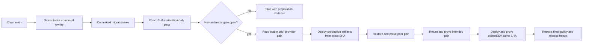
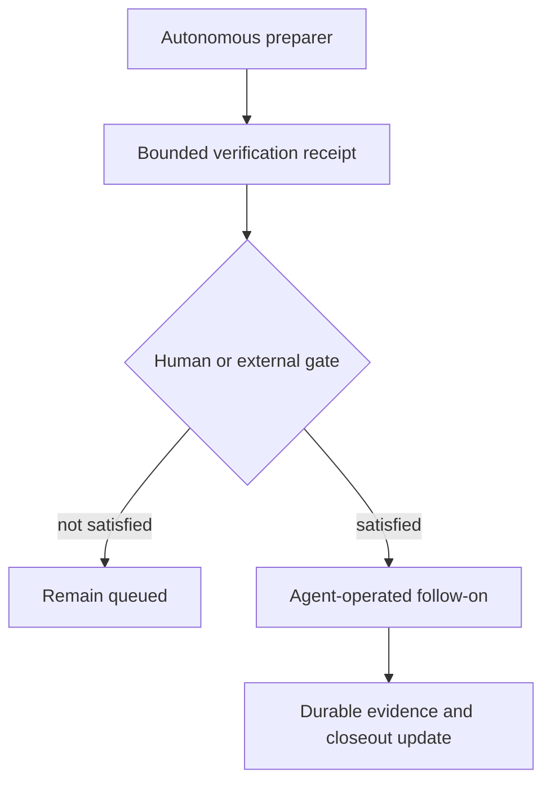

# Packet Autonomous Readiness - Plan

## Goal Capsule

**Objective:** Finish every safe repository change that reduces the six closeout packets to their irreducible human or external gates.

**Means:** Extend the existing validation, release-ledger, migration, daemon, smoke-test, and inventory patterns through focused tools and tests; do not create a second packet orchestration system. (KTD1)

**Authority hierarchy:** The August 23 decision sheet owns packet ordering and human gates. Existing repository decisions own product identity, licensing, assessment shape, and production authority. This plan owns only autonomous preparation and fail-closed verification.

**Stop conditions:** Stop before any production corpus mutation, provider upload or activation, GitHub repository rename, account purchase, credential-status test without authorization, Access-authenticated human act, authored-content judgment, rights assertion, or source ingestion without delivered material and recorded disposition.

**Execution profile:** Code work may proceed autonomously through reviewed and passing pull requests. Production, provider, and product-operational state remains unchanged; reviewed repository pull requests may be pushed and merged.

**Tail ownership:** After the code lands, `docs/decisions/2026-08-23-plan-closeout-decision-sheet.md` remains the operator surface for all remaining gates.

---

## Product Contract

### Summary

This plan completes the reversible, credential-safe preparation available across Packets A–F. It strengthens migration identity, publication readiness, assessment setup, calibration analysis, and rename inventory while preserving every human and external authorization boundary.

### Problem Frame

The six packets are queued, but none can be closed end-to-end while the user is absent. Each packet contains at least one identity-bound, judgment-bound, account-bound, rights-bound, or supervised-production gate. Several repository seams can still be made safer before those gates open. The most important seam is Packet D: a rehearsal currently mutates a disposable checkout while the production state machine still names the pre-migration commit as its candidate.

The work must reduce future operator burden without manufacturing authority. Readiness evidence is not authorization. A preparer may prove that inputs and infrastructure are ready, but it must not perform the gated act or report the packet complete.

### Key Decisions

- **Score the seven memo headings independently on the 1–7 scale.** (session-settled: user-approved — chosen over scoring another assessment structure: the recommendation maps the recording-confirmed scale to the seven memo headings.) Governs R8.
- **Retain the repository's existing dual-license treatment for Midstate content.** The August 12 decision explicitly rejects a separate-license directory and per-artifact provenance labels. Governs R10 and R11.
- **Keep production publication and Day Zero migration supervised.** Readiness automation may not bypass Publisher authorization, the freeze window, exact-pair restoration, or human verification. Governs R2, R3, R4, and R7.

### Requirements

#### Cross-packet safety

- R1. Autonomous tools must be read-only or locally reversible by default and must emit bounded, secret-free, authored-text-free evidence.
- R2. Readiness, preparation, and inspection must remain distinct from authorization and external mutation.

#### Packet D: combined migration

- R3. A migration candidate must identify a committed tree that already contains the deterministic combined rewrite and all required generated sidecars.
- R4. The supervised operator flow must deploy and verify artifacts built from that exact committed tree across production and the editor/DEV surfaces before the freeze is released.
- R5. Normal validation must automatically enable both Day Zero date-offset and identifier-base enforcement when the spine manifest carries the new representation marker.
- R6. A read-only Cloudflare inspector must identify the canonical production Pages deployment and the single active 100% Worker version, prove stable control-plane state around live provenance reads, and fail closed on ambiguity.
- R7. Direct production execution must remain unavailable until the exact-tree and exact-pair contracts are satisfied and the supervised gate opens.

#### Packets A and C: UAT and publication readiness

- R8. An assessment UAT preparer must create only a fixed disposable formative audit, score seven memo headings, and return only its audit ID and protected URL after explicit invocation.
- R9. Publisher readiness and post-publication consistency checks must reuse the existing release ledger and editor consistency checker, expose no authored text, and treat missing or unresolvable production ancestry as visible failure evidence.
- R14. Read-only release observation must use a bearer scope that cannot prepare, claim, renew, transition, authorize, or restore a production release.

#### Packets E and F: calibration and rename preparation

- R10. A local calibration tool must validate de-identified ratings for all seven memo headings, require explicit absolute kappa and bias thresholds, and report per-heading quadratic weighted kappa plus mean signed difference without identities or work text.
- R11. Source ingestion, permissions, provider-terms review, faculty ratings, and summative authorization remain outside autonomous execution.
- R12. A rename inventory must classify active operational references separately from historical evidence and prepare a bounded transition manifest without renaming the external repository.

#### Packet B: provider disposition

- R13. No new provider implementation is required before the account and credential-authority gates; the existing live smoke harness remains authoritative.

### Acceptance Examples

- AE1. Given the old JSON-LD base in the spine manifest, normal preflight preserves pre-migration compatibility; given the new base, normal preflight enforces both offset and identifier rules without extra flags. Covers R5.
- AE2. Given a newer Pages preview than production, the inspector returns the canonical production deployment; given a Worker split across versions, it refuses to produce one recovery version. Covers R6.
- AE3. Given a migration rewrite that exists only in a disposable worktree, the production plan refuses it; given a clean committed migration tree, every build and provenance claim names that commit. Covers R3 and R4.
- AE4. Given no explicit assessment-preparation invocation, no live audit is created; given an invocation with protected credentials, the output contains only the audit ID and protected URL. Covers R1 and R8.
- AE5. Given no completed production release or an invalid baseline SHA, legacy closeout task U18 (editor consistency) records a non-clean failure result; given a valid production frontier, it compares the newly applied DEV facts from that exact baseline. Covers R9.
- AE6. Given a calibration file with an identity, missing heading, or absent threshold, the tool rejects it; given 40–60 de-identified works with complete integer ratings from 1–7 and explicit thresholds, it emits aggregate metrics and a fail-closed threshold result only. Covers R10.
- AE7. Given current operational and historical repository-name references, the rename inventory requires every operational reference to be classified and leaves historical evidence unchanged. Covers R12.

### Success Criteria

- Every behavioral autonomous unit lands with regression coverage and bounded operator output; documentation-only units land with explicit verification evidence.
- The normal preflight cannot silently remain permissive after the representation marker changes.
- The Day Zero runbook cannot claim that an uncommitted migrated tree is represented by an unchanged commit SHA.
- The remaining decision sheet contains only human, external, or live-operation gates and exact follow-on actions.

### Scope Boundaries

#### In scope

- Repository code, tests, runbooks, and durable closeout updates for the autonomous portions of Packets A–F.
- Read-only provider inspection using narrowly scoped credentials already supplied at execution time.
- Local, de-identified calibration calculations and deterministic rename inventory.

#### Outside this execution

- Creating a live assessment audit before the user signals readiness.
- Testing or deleting legacy credentials without explicit authority.
- Publisher judgments, canary activation, restoration, routine enablement, or production migration.
- Source ingestion, rights disposition, faculty scoring, provider-terms judgment, or token retirement.
- The external GitHub rename and any filesystem move.

#### Deferred to Follow-Up Work

- Expose Worker runtime version metadata only if the read-only control-plane plus stable-provenance proof proves insufficient during supervised UAT.
- Execute the prepared rename transition only after Packet D evidence is accepted.

---

## Planning Contract

### Key Technical Decisions

- KTD1. **Extend existing owners instead of adding a packet controller.** The release ledger, migration state machine, validator, apply daemon, smoke harness, and decision sheet already own their respective state and authority boundaries.
- KTD2. **Use the manifest's JSON-LD base as the atomic representation marker.** When it equals the settled new base, the validator defaults both Day Zero and identifier enforcement on; explicit flags remain available for copied-corpus rehearsal. Governs R5.
- KTD3. **Materialize and merge the migration tree inside one exclusive change window, then verify without rewriting it.** The window blocks every canonical-branch writer and merge path, both apply and production daemons, direct deployment commands, and every Cloudflare deployment actor from prior-pair capture through final verification or completed recovery. The governed rewrite runs once and produces the migration commit. A verification-only phase validates its sidecars, generated artifacts, strict rules, parity, and preflight. The production pair may claim only that SHA. The editor/DEV deploy follows the same tree before the window ends. Governs R3 and R4.
- KTD4. **Inspect Cloudflare through direct read-only REST calls with allowlisted parsing.** Pages identity comes from `canonical_deployment`; Worker identity comes from the first active deployment and only a single 100% version is representable. Provider state is read twice around bounded live SHA checks. Governs R1 and R6.
- KTD5. **Use a dedicated read-only release observer for readiness and legacy U18.** The observer may call only text-free release GET endpoints. The direct apply daemon invokes the existing checker after a successful accepted batch using the completed frontier returned through that scope. Missing ancestry, checker errors, and bad revisions are visible non-clean results and alerts, not quiet success. Governs R9 and R14.
- KTD6. **Reuse the live stream harness's credential hygiene for assessment UAT.** The preparer uses fixed disposable text, approved origins, bounded timeouts, and reflection checks; it does not print assessment content or credentials. Governs R8.
- KTD7. **Keep calibration local, aggregate-only, and fail-closed on human-selected thresholds.** Input has opaque work IDs and rater roles, not names or work text. Human-human agreement is faculty rater 1 versus faculty rater 2. Panel-human results compare the panel separately with each faculty rater. Each comparison must meet the human-human baseline and an explicit absolute kappa floor, and its absolute signed difference must remain within an explicit bias ceiling. Undefined or sub-floor human-human agreement fails calibration. The tool accepts no built-in policy default. Governs R10.
- KTD8. **Prepare rename changes without activating them.** Inventory distinguishes operational references from immutable historical evidence and produces a transition checklist that can be applied inside the later rename window. Governs R12.

### Assumptions

- A new `release_observer` bearer can be provisioned through the established protected environment-file pattern after its repository authorization code lands. Until provisioning occurs, readiness and legacy U18 report a credential gate rather than borrowing the DEV apply or production mutation bearer.
- A Pages canonical deployment is the best documented production pointer. Cloudflare does not expose a live Pages deployment UUID in normal response headers, so the stable two-read proof is the strongest current read-only contract.
- A calibration sample contains both faculty ratings and one panel rating for the same 40–60 opaque work IDs. The tool rejects other shapes rather than guessing a mapping.
- The eventual repository target remains `legal-practicum`, but this plan does not activate that name.

### High-Level Technical Design

The migration lifecycle must bind source, generated artifacts, and every deployed surface to one commit:

Readiness and authority remain separate across all packets:

### System-Wide Impact

- Migration enforcement affects every normal preflight consumer after the manifest base changes.
- Exact-tree migration work spans source data, generated site artifacts, Pages, Worker, DEV/editor deployment, recovery registry, timers, and daemon locking.
- Legacy U18 joins the production release frontier to later DEV edits without moving Publisher authority into the apply daemon.
- Rename preparation touches build provenance, local systemd installers, worktrees, remotes, documentation, and public source links.

### Risks and Mitigations

- **False provider identity:** A preview or split deployment may look latest. Mitigation: canonical Pages selection, first active Worker deployment, single-version requirement, two control-plane reads, and live SHA agreement.
- **Uncommitted migration deployment:** Generated artifacts may differ from the named SHA. Mitigation: require the rewrite and sidecars in a clean commit and compare the deployed build to that commit tree.
- **Readiness mistaken for authorization:** A green preparer could be treated as permission. Mitigation: distinct output language, config-off defaults, and no mutation method in read-only tools.
- **Sensitive evidence leakage:** Provider bodies or authored text could reach logs. Mitigation: allowlisted parsing, bounded error categories, aggregate output, and reflection tests.
- **Historical damage during rename:** Global replacement could rewrite evidence. Mitigation: classify operational and historical references before producing any patch.

### Sources and Research

- `docs/decisions/2026-08-23-plan-closeout-decision-sheet.md` defines all six remaining packets and their gates.
- `docs/solutions/editor/2026-07-28-generated-artifacts-are-not-tracked-state.md` requires rebuild, deployment, and parity evidence after source-state changes.
- `docs/solutions/editor/2026-07-28-durable-block-identity.md` requires a freeze and permanent leak checks for identity migrations.
- `docs/solutions/editor/2026-07-28-checks-that-cannot-fail.md` requires absence checks to prove nonzero scope.
- Cloudflare's [Pages project API](https://developers.cloudflare.com/api/resources/pages/subresources/projects/methods/get/) defines the canonical production deployment pointer.
- Cloudflare's [Workers deployments API](https://developers.cloudflare.com/api/resources/workers/subresources/scripts/subresources/deployments/methods/list/) defines the actively serving deployment and its version allocations.
- Cloudflare's [versions and deployments guide](https://developers.cloudflare.com/workers/versions-and-deployments/) documents multi-version traffic and the need to reject an ambiguous single-version recovery claim.
- GitHub's [repository rename guidance](https://docs.github.com/en/enterprise-cloud@latest/repositories/creating-and-managing-repositories/renaming-a-repository) distinguishes redirected repository traffic from hosted Actions references that require explicit updates.

---

## Implementation Units

### U1. Make representation enforcement automatic

**Goal:** Enable both strict migration validators automatically when the manifest declares the new representation.

**Requirements:** R1, R5; AE1.

**Dependencies:** None.

**Files:**

- `tools/validate_spine.py`
- `tools/preflight.sh`
- `tools/tests/test_validate_spine.py`

**Approach:**

1. Centralize the representation-marker decision in the validator.
2. Preserve explicit enforcement flags for rehearsal and diagnostic use.
3. Make normal preflight inherit the marker-derived defaults without a second switch.

**Patterns to follow:** `tools/identifier_base.py` for the settled base constant and existing strict Day Zero validator tests.

**Test scenarios:**

- Covers AE1. The old marker accepts the pre-migration representation under normal validation.
- Covers AE1. The new marker activates both enforcement modes without CLI flags.
- A copied corpus with an explicit strict flag remains enforceable before its marker changes.
- A partially migrated corpus under the new marker fails for both old-base residue and unconverted authored dates.

**Verification:** Normal preflight derives one coherent strictness policy from the manifest and cannot enter a one-validator-only state.

### U2. Bind Day Zero deployment to a committed migration tree

**Goal:** Remove the gap between the mutated rehearsal checkout and the SHA claimed by production evidence.

**Requirements:** R2, R3, R4, R7; AE3.

**Dependencies:** U1.

**Files:**

- `tools/day_zero_migration.py`
- `tools/tests/test_day_zero_migration.py`
- `docs/day-zero-migration-operations.md`

**Approach:**

1. Add an explicit materialized-candidate contract that requires a clean commit containing the combined rewrite and generated outputs.
2. Prove the exclusive change window covers canonical merges/writes, apply and production daemons, direct deploy commands, and all provider deployment actors; remain fenced if any writer cannot be excluded.
3. Run the governed rewrite once under the freeze, commit it, then run an exact-SHA verification-only phase set that does not invoke the rewrite again.
4. Require production deployment and pair evidence to name that same commit.
5. Add editor/DEV synchronization and verification before timer restoration and freeze release.
6. If any post-merge step fails, restore the exact prior provider pair, revert the migration commit on canonical `main`, rebuild and redeploy the prior DEV/editor tree, and prove every surface is back on the prior SHA before releasing the freeze.
7. Keep direct production execution fail-closed.

**Execution note:** Start with a failing regression that proves a worktree-only rewrite cannot satisfy the candidate contract.

**Patterns to follow:** `GitRefAdapter.require_clean_candidate`, `isolated_git_copy`, the recovery-registry compare-and-set contract, and generated-artifact rebuild guidance.

**Test scenarios:**

- Covers AE3. A phase runner that mutates only a disposable checkout is rejected as a deployable candidate.
- Covers AE3. A clean commit whose tree contains the rewrite passes verification without a second write and is the SHA supplied to deployment.
- A dirty or divergent candidate tree fails before any provider callback.
- Any unexcluded canonical or provider writer keeps the operation fenced before prior-pair capture.
- DEV/editor synchronization failure keeps the freeze fenced, restores the prior provider pair, compensates canonical `main`, and restores the prior DEV/editor tree.
- A failed canonical revert or prior-tree deploy keeps all timers off and the freeze fenced for supervised recovery.
- A generated artifact that does not match the candidate tree fails parity before mutation.

**Verification:** The operator plan has no path that deploys migrated artifacts while claiming an unchanged pre-migration commit.

### U3. Inspect the exact active Cloudflare pair read-only

**Goal:** Produce stable, bounded prior-pair evidence without provider mutation or secret leakage.

**Requirements:** R1, R2, R6, R7; AE2.

**Dependencies:** U2.

**Files:**

- `tools/day_zero_migration.py`
- `tools/tests/test_day_zero_migration.py`
- `docs/day-zero-migration-operations.md`

**Approach:**

1. Add injected HTTPS readers for the Pages project and Worker deployments endpoints.
2. Parse only canonical Pages deployment fields and the first active Worker deployment allocation.
3. Require one Worker version at 100%, matching live lowercase SHA headers, and unchanged provider state across two reads.
4. Load the least-privilege Cloudflare read token only from a protected stdin credential channel; expose no token CLI option and persist no token material.
5. Construct requests only for fixed `api.cloudflare.com` endpoints with redirects disabled.
6. Emit digested IDs by default; permit exact non-secret IDs only in explicit operator-plan output.
7. Map all provider failures to bounded categories without raw response bodies.

**Patterns to follow:** `LedgerHTTP` HTTPS validation and injection, adapter timeout bounds, and `ProductionPair.redacted()`.

**Test scenarios:**

- Covers AE2. A newer preview does not replace the canonical production Pages deployment.
- Covers AE2. One Worker version at 100% passes; every split or zero-percent override shape fails closed.
- Null, skipped, preview, unsuccessful, or malformed Pages canonical deployments fail closed.
- Provider state that changes between reads fails closed.
- Missing, malformed, or mismatched live SHA headers fail closed.
- Timeout, redirect, HTTP error, invalid JSON, and `success:false` return bounded errors.
- No token-bearing request can target a non-Cloudflare host, and no CLI argument can carry the bearer.
- Secret-shaped tokens and unused provider fields never appear in receipts, exceptions, or captured output.

**Verification:** A supervised operator can capture one stable exact pair while the same tool remains incapable of activating it.

### U4. Add text-free Publisher readiness inspection

**Goal:** Make publication preparation inspectable without exposing authored text or changing release state.

**Requirements:** R1, R2, R9.

**Dependencies:** None.

**Files:**

- `tools/prod_release_executor.py`
- `tools/prod_release_daemon.py`
- `tools/prod_release_readiness.py`
- `app/worker/src/editor-auth.js`
- `app/worker/src/editor-endpoints.js`
- `tools/tests/test_prod_release_executor.py`
- `tools/tests/test_prod_release_daemon.py`
- `tools/tests/test_prod_release_readiness.py`
- `app/worker/test/editor-auth.test.js`
- `app/worker/test/editor-publisher-release.test.js`
- `docs/prod-release-operations.md`

**Approach:**

1. Add a `release_observer` bearer scope accepted only by release status, frontier, and audit GET endpoints.
2. Add a read-only readiness view around the existing preparation context, release status, and text-free audit.
3. Report invariant counts, active/prepared/authorized IDs and hashes, queue state, timer state, and config-off state without authored text.
4. Inject the observer from a separate protected environment file and keep the command incapable of review decisions, authorization, claims, transitions, or provider operations.

**Patterns to follow:** `LedgerHTTP.preparation_context()`, `LedgerHTTP.get_release()`, and `/edit/v1/prod/releases/audit`.

**Test scenarios:**

- A quiet readiness check exposes counts, identifiers, hashes, queue state, config-off state, and no authored text.
- An active or unprepared release is reported as not ready without claiming failure or authorization.
- Malformed ledger responses, unauthorized access, timeouts, and unavailable timer state return bounded non-ready results.
- The readiness client never calls a mutation endpoint or prints authored operation fields.
- Observer credentials can read the three allowlisted endpoints but receive forbidden responses from every production mutation endpoint; DEV apply and release-service credentials are never reused.

**Verification:** Publisher preparation can be checked before human review without advancing or authorizing a release.

### U5. Prepare a credential-safe assessment signer audit

**Goal:** Make Packet A2 a one-command, explicit, bounded setup step without impersonating the human signer.

**Requirements:** R1, R2, R8; AE4.

**Dependencies:** None.

**Files:**

- `app/worker/test/live-stream-smoke.mjs`
- `app/worker/test/live-stream-smoke.test.js`
- `app/worker/test/assessment-live-uat.mjs`
- `app/worker/test/assessment-live-uat.test.js`
- `app/worker/API-CONTRACTS.md`

**Approach:**

1. Reuse protected credential loading, approved-origin checks, timeouts, and reflection protection from the existing live smoke.
2. Submit fixed disposable formative memo text only after explicit operator invocation.
3. Validate the returned audit structure contains the seven independently scored memo headings.
4. Print only the audit ID and protected assessment URL.

**Patterns to follow:** The current live stream smoke's 0600/stdin credential rules and the existing memo-assessment API contract.

**Test scenarios:**

- Covers AE4. Importing or running tests creates no live audit.
- Covers AE4. A valid response prints only a bounded audit ID and approved protected URL.
- Missing headings, a non-formative response, wrong origin, timeout, or malformed JSON fails without leaking the response body.
- Credential-shaped values reflected by any response field fail the smoke and never reach output.

**Verification:** When the user later says `A2 READY`, the agent can create the short-lived audit immediately while the Access sign-in and attributed override remain human acts.

### U6. Add de-identified seven-heading calibration analysis

**Goal:** Turn delivered faculty ratings into the exact aggregate evidence required for the summative-use gate.

**Requirements:** R1, R10, R11; AE6.

**Dependencies:** None.

**Files:**

- `tools/assessment_calibration.py`
- `tools/tests/test_assessment_calibration.py`
- `docs/prod-enable.md`

**Approach:**

1. Define a local input contract with opaque work IDs, anonymous rater roles, seven heading keys, and integer 1–7 ratings.
2. Require 40–60 complete works with faculty-1, faculty-2, and panel ratings.
3. Require caller-supplied minimum kappa and maximum absolute signed-difference thresholds; provide no defaults.
4. Calculate the faculty-1/faculty-2 baseline plus panel/faculty-1 and panel/faculty-2 metrics for every heading.
5. Require both panel-human kappas to meet the human-human baseline and absolute floor; require both signed differences, measured as panel minus the anonymous faculty role, to remain within the absolute bias ceiling.
6. Treat undefined or sub-floor faculty agreement as calibration failure.
7. Emit aggregate JSON and human-readable summaries only; reject identity and free-text fields.
8. Read caller-supplied local input without copying it into the repository, persist no row-level data, and document prompt deletion after the aggregate report is secured.
9. Document that the tool computes evidence but does not select acceptable thresholds or decide whether provider terms authorize summative use.

**Patterns to follow:** Existing assessment heading constants in `app/worker/src/panel.js` and fail-closed validation tools under `tools/`.

**Test scenarios:**

- A complete 40-work fixture with perfect agreement reports kappa 1 and zero signed difference for the baseline and both panel-human comparisons per heading.
- Systematic one-point panel generosity reports positive signed difference even where rank agreement remains high.
- A panel that misses the baseline against either faculty rater fails the calibration threshold.
- Missing thresholds, sub-floor faculty agreement, excessive absolute bias, or undefined kappa fails closed.
- Samples below 40 or above 60, missing headings, out-of-range ratings, duplicate work-role rows, identities, or free text fail closed.
- Degenerate constant ratings produce an explicit undefined/not-computable result rather than a misleading agreement score.
- Output contains only headings, counts, comparison labels, and aggregate metrics.

**Verification:** Faculty can supply de-identified ratings later and receive reproducible aggregate evidence without putting roster data or student work into Git.

### U7. Build a deterministic repository rename inventory

**Goal:** Prepare Packet F's controlled cutover without changing the external repository or historical evidence.

**Requirements:** R1, R2, R12; AE7.

**Dependencies:** None.

**Files:**

- `tools/repo_rename_inventory.py`
- `tools/tests/test_repo_rename_inventory.py`
- `docs/repository-rename-operations.md`

**Approach:**

1. Parameterize current and target repository names and canonical owner.
2. Classify active operational references, external `uses:` consumers, generated URLs, local installer templates, remotes/worktrees, and historical evidence.
3. Fail on unclassified active references and emit a deterministic text-free transition manifest.
4. Document the later sequence: quiet window, external rename, active-reference patch, remote/worktree/systemd repair, daemon verification, and redirect checks.
5. Leave current operational references unchanged until the rename window.

**Patterns to follow:** Existing repository-root scanners and installer contract tests; preserve historical plans, decisions, handoffs, and evidence.

**Test scenarios:**

- Covers AE7. Known operational references are classified for change while historical documents are classified to remain.
- A new unclassified current-name reference fails the inventory check.
- Hosted Actions `uses:` references are distinguished from clone/web URLs that GitHub redirects.
- Worktree, daemon, systemd, remote, build-source, and public-link steps all appear in the transition manifest.
- The preparer does not edit files, rename directories, call GitHub, or change remotes.

**Verification:** The future rename window begins with a complete deterministic inventory rather than an ad hoc global replacement.

### U9. Wire legacy U18 to the completed production frontier

**Goal:** Run the existing editor consistency checker after successful accepted edits using the exact completed production release as its baseline.

**Requirements:** R1, R2, R9; AE5.

**Dependencies:** U4.

**Files:**

- `tools/prod_release_executor.py`
- `tools/direct_apply_daemon.py`
- `tools/editor_consistency.py`
- `tools/install-apply-daemon.sh`
- `app/worker/src/editor-auth.js`
- `app/worker/src/editor-endpoints.js`
- `tools/tests/test_prod_release_executor.py`
- `tools/tests/test_direct_apply_daemon.py`
- `tools/tests/test_editor_consistency.py`
- `app/worker/test/editor-auth.test.js`
- `app/worker/test/editor-publisher-release.test.js`
- `docs/direct-apply-daemon.md`

**Approach:**

1. Read the completed production frontier through the dedicated `release_observer` authority after a successful accepted batch.
2. Invoke the existing consistency checker against that exact baseline through an injectable daemon seam.
3. Record and alert on clean, flagged, missing-baseline, bad-revision, and checker-error results.
4. Keep checker results outside Publisher authorization and keep failures nonfatal to the already-completed DEV apply.

**Patterns to follow:** Daemon injectable callbacks, `LedgerHTTP.preparation_context()`, and current consistency result categories.

**Test scenarios:**

- Covers AE5. A successful accepted batch with a valid completed frontier invokes consistency from that SHA.
- Covers AE5. Missing or unresolvable frontier produces a visible non-clean step and notification.
- Seeded stale-value flags are filed and summarized without assessment or source text.
- Checker exceptions are bounded, nonfatal to the already-completed DEV apply, and alert the operator.
- A no-accepted tick and dry-run mode do not invoke or persist legacy U18 results.
- The observer bearer cannot call release mutation endpoints, and the direct apply bearer cannot substitute for it.

**Verification:** The first real post-publication edit produces durable legacy U18 evidence instead of relying on memory, and no result can authorize publication.

### U8. Reconcile the closeout artifacts

**Goal:** Leave one truthful queue showing completed autonomous work and the exact gates that remain.

**Requirements:** R1, R2, R7, R11, R13.

**Dependencies:** U1, U2, U3, U4, U5, U6, U7, U9.

**Files:**

- `docs/decisions/2026-08-23-plan-closeout-decision-sheet.md`
- `docs/handoffs/2026-08-23-plan-closeout-handoff.md`
- `docs/TODO.md`

**Approach:**

1. Record merged implementation evidence and the new preparer commands at their owning packets.
2. Remove claims that legacy closeout tasks U16b and U18 are wholly blocked when their automation has landed, while preserving their live acceptance gates.
3. Keep Packet B as an account/authority gate with no invented repository task.
4. Preserve Packet E's existing dual-license decision and distinguish calibration tooling from the human calibration result.
5. Keep Packet F execution after accepted Packet D evidence.

**Test scenarios:**

- Test expectation: none -- this unit reconciles durable documentation after behavioral units have their own regression coverage.

**Verification:** Every remaining checklist item requires a human identity, judgment, external material, account action, or supervised live operation; every subsequent agent action is named beside its gate.

---

## Verification Contract

- Run the focused Python suites for spine validation, Day Zero migration, release execution, daemons, consistency, calibration, and rename inventory.
- Run the focused Node suites for live-stream and assessment UAT preparation.
- Run `python3 tools/validate_spine.py`, `python3 tools/midstate_contract.py`, and `bash tools/preflight.sh` against the unchanged pre-migration corpus.
- Run the full repository Python suite and the Worker test suite before shipping each affected group.
- Run `git diff --check` on every focused branch.
- Execute credential/reflection tests with sentinel values only. Do not use live provider credentials during automated verification.
- Confirm production mutation counters remain zero and no test invokes Cloudflare, GitHub rename, Access login, provider billing, or source ingestion.
- Run `ce-code-review` against each focused diff and resolve all validated blocking findings before push or merge.

---

## Definition of Done

- U1–U9 satisfy their verification outcomes and cite passing regression evidence.
- Every new operator output is bounded, deterministic where applicable, secret-free, and authored-text-free.
- Normal preflight automatically becomes strict when the representation marker changes.
- Day Zero deployment can only claim a committed migrated tree and still cannot execute production unattended.
- Publisher readiness and legacy U18 use the existing ledger authority and fail visibly on missing ancestry.
- Assessment preparation cannot impersonate the signer or create an audit without explicit invocation.
- Calibration accepts only de-identified complete data and reports aggregate evidence.
- Rename preparation changes no external state and preserves historical evidence.
- Packet B remains correctly classified as account/credential authority work, not a missing code unit.
- Focused pull requests pass CI and review, merge cleanly, and leave `main` and the trusted daemon checkout clean and synchronized.
- Abandoned experiments, temporary files, and dead-end code are absent from the final diff.
- The durable handoff and decision sheet contain every remaining human or external gate and the exact agent follow-on.
