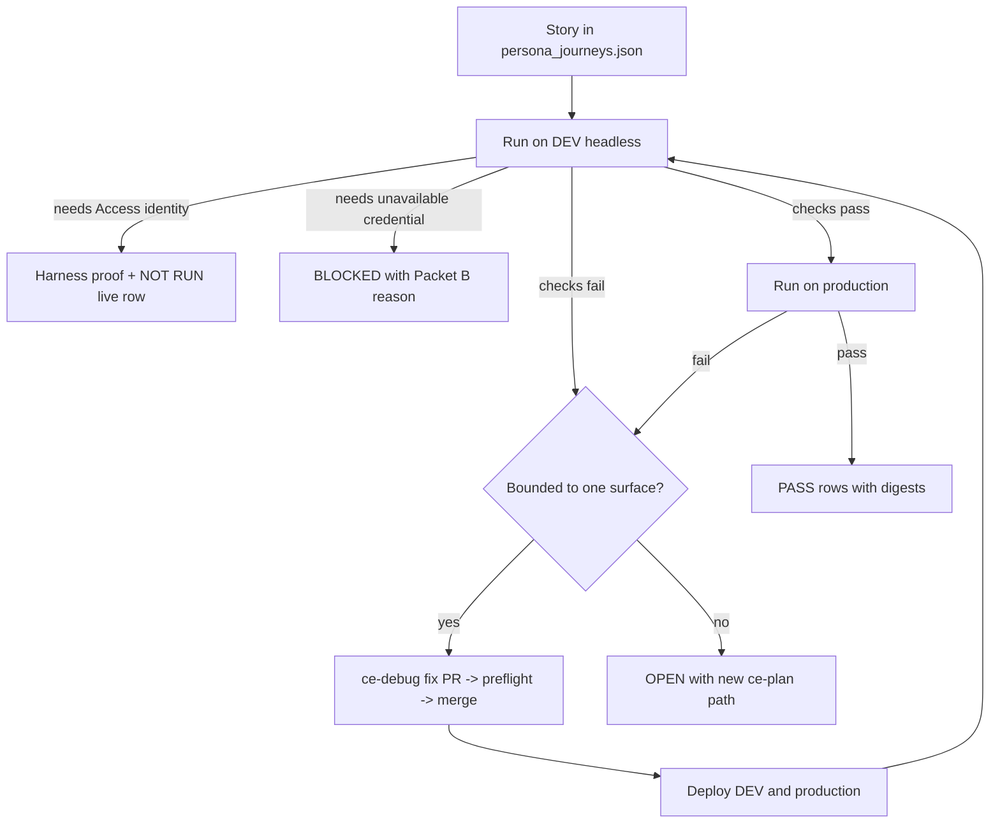
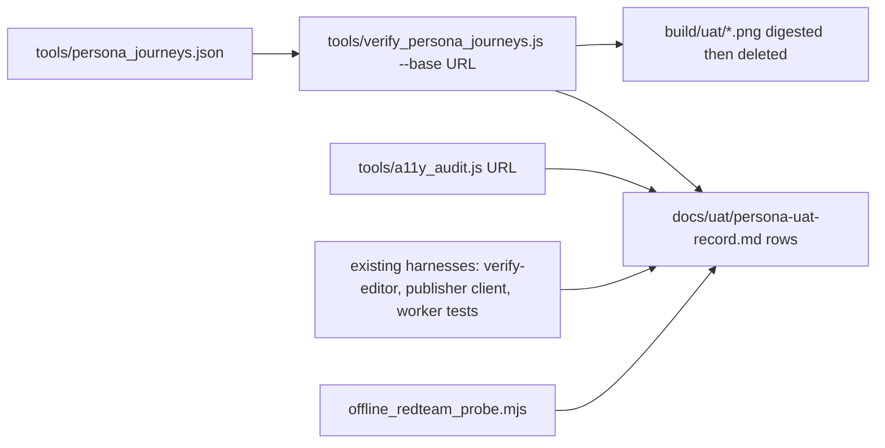

# Persona-Driven User Acceptance Testing - Plan

## Goal Capsule

**Objective.** Every kind of person the Legal Practicum serves can complete the journeys they came for on the live DEV and production surfaces, and each journey's outcome is recorded as PASS, FAIL with a shipped fix, or NOT RUN with its named human prerequisite.

**Means.** A persona catalog, user stories per persona, an executable UAT matrix run against DEV and production, `ce-debug` fixes for bounded failures, `ce-plan` documents for failures that need design, and shipment of every fix through the normal PR, preflight, merge, DEV, and production path.

**Product authority.** Damien's answers of September 2, 2026 in `docs/decisions/2026-09-02-resume-and-uat-decision-sheet.md`: all ten personas with student, author-editor, and prospective reader weighted first (Q4), and agent-operated production deployment of merged `main` during the pre-user stage (Q1). Packets A–F in `docs/decisions/2026-08-23-plan-closeout-decision-sheet.md` remain the authority for every human gate and are not reopened here.

**Open blockers.** None for planning. Journeys that need a Cloudflare Access identity, an OpenAI credit balance, or an Anthropic credential are recorded NOT RUN or BLOCKED with the packet that owns them; they do not block the program.

## Product Contract

### Summary

Write a persona catalog and user-story set for the Legal Practicum, turn the stories into an executable UAT matrix, run it against DEV and production, fix what fails, and ship the fixes to production. The record lives beside the existing editor and Publisher UAT matrix under `docs/uat/`.

### Problem Frame

The repository's verification is deep but developer-shaped: 21 preflight gates, 950 Python tests, an 89-assertion editor browser matrix, and a Publisher client contract. All of it asks whether the code does what the code intends. None of it asks whether a first-year student can find the Midstate packet, whether a dean reading the pitch on a phone reaches the proof, whether John's two-minute edit promise is visible from his side of the screen, or whether a professor self-hosting from the README gets a working interview simulator. The July demo runbook and the August editor matrix cover two journeys; the platform now has at least ten kinds of user and no record of what each one experiences. The site is pre-user, so this is the last cheap moment to find those gaps.

### Key Decisions

- **UAT runs DEV first, then production, for every public surface.** Production is a live target during the pre-user stage. (session-settled: user-directed — chosen over DEV-only with production queued behind Packet C1: Damien's Q1 answer that the site has no users yet and may be pushed to production throughout this stage.) Governs R6, R14.
- **Access-authenticated journeys run through the existing headless harnesses and their live human leg is NOT RUN.** No service token or bypass is introduced to impersonate a signer or Publisher. (session-settled: user-approved — chosen over provisioning an Access service token for automation: the August 23 sheet's finding that a service token cannot honestly substitute for the signer, and Damien's Q4 answer accepting NOT RUN rows.) Governs R8.
- **All ten personas are in scope; student, author-editor, and prospective reader are tier one.** (session-settled: user-approved.) Governs R1, R2.
- **A row is PASS only with a recorded artifact.** A screenshot digest, a command transcript, or a harness exit code; never an assertion from memory. This carries the existing matrix's rule that a skipped live step is NOT RUN, never pass. Governs R10.
- **The persona catalog, stories, and record live under `docs/uat/`.** They sit beside `docs/uat/editor-publisher-matrix.md` rather than in a new top-level directory, so one place answers "what has been proven for whom". Governs R3, R10.
- **UAT finds defects; it does not design features.** A journey that fails because the product lacks a capability becomes a proposal in Outstanding Questions or a new `ce-plan` document, not a feature built inside this program. Governs R12, R13.

<!-- ce-section: work-relationships -->
### How This Work Fits Together

This plan owns the persona UAT program. The September resume has three areas; the breakdown below is the current understanding, not a committed roadmap.

- **Resume and closeout of the July–August plans.** Complete: every handoff and CE plan is audited closed, and Damien confirmed on September 2 that no Packet A–F prerequisite changed. Enables this plan by freeing the trip for UAT. Its only remaining deliverable is a closeout handoff citing this plan's outcomes.
- **Repository hygiene.** Deleting merged branches, proving nine unmerged branches superseded, and removing their worktrees and stashes. Can proceed independently of this plan. Shares the closeout handoff.
- **Pre-user production deployment.** The operator procedure that deploys merged `main` to Cloudflare Pages and the production Worker under Damien's Q1 answer. Enables R14. Still to decide: whether the procedure is recorded as a runbook only or also as a fenced tool, given the publication-boundary tests that forbid repository scripts from deploying production directly.

### Actors

- A1. **Prospective reader.** A dean, faculty member, funder, or journalist who lands on `legalpracticum.org` from a link, usually on a phone, and decides in under a minute whether to keep reading. Wants the argument, then the proof on demand.
- A2. **Student.** A second- or third-year law student enrolled in a practicum. Works on a laptop, sometimes a phone, across a semester. Wants to find this week's matter, read the packet, interview the client, draft, get critique, log hours, and see the firm's books.
- A3. **Instructor.** Faculty running the course. Wants the rubrics, the instructor bundle, the assessment signer review at desktop and 390px, the calibration tool, and a way to explain a 4-of-7 to a student who reads it as a C.
- A4. **Author-editor (John).** Signs in through Access with an emailed code, edits paragraphs in place, expects them on the editing site within two minutes, and expects one-click undo. Comments are notes to Damien.
- A5. **Contributing editor (Roger).** Same door as John; suggestions carry the RSH attribution.
- A6. **Admin-Publisher (Damien).** Reviews, publishes, restores, operates the daemons and timers, and is the only actor who authorizes a production release once the site has users.
- A7. **Open-source adopter.** A professor or clinic technologist who clones the repository, follows the README quickstart, runs the Worker tests, and self-hosts with their own model key.
- A8. **School administrator or ABA reader.** Reads the competency-based-credit proposal and the cost-per-credit page to judge whether the credit model is defensible.
- A9. **Accessibility-dependent user.** Any of A1–A5 using a screen reader, keyboard only, a 390px viewport, or 200% zoom.
- A10. **Hostile actor.** Probes the chat, critique, and edit surfaces for prompt injection, persona-fact leaks, forged edits against locked identifiers, and bot-gate bypass.
- A11. **Orchestrating agent and Codex workers.** Write the catalog and stories, run the matrix, fix bounded failures, and ship. Damien performs no live step during this program.

### Requirements

**Persona catalog**

- R1. The catalog documents the ten personas A1–A10 with goals, context, device and assistive profile, entry points, and the surfaces each touches.
- R2. The catalog marks A1, A2, and A4 as tier one; every persona receives at least its core journeys, and tier one receives edge and failure journeys as well.

**User stories**

- R3. Each story is written as "As A<n>, I want <action> so that <outcome>", carries a stable ID `US-<n>-<k>`, and names the surface, its URL on DEV and production, preconditions, and acceptance checks.
- R4. The story set covers every reachable public surface: the pitch and its proof expanders, the platform index, modules, skills browser, matter library and packets, downloads, firm dashboard, hours log, templates, client-interview chat in sample mode, memo critique, cost-per-credit, licenses and about pages, and the editor door's unauthenticated redirect.
- R5. The story set covers every documented adopter path in `README.md`: clone, local static serve, Worker unit tests, BYOK key entry, and self-hosted Worker deploy up to the point that needs an account.

**Execution**

- R6. Every public-surface story runs against DEV and then production, and the record holds one result per environment.
- R7. Browser journeys run headless through the Chrome DevTools tooling the project already mandates, at desktop, 390px, and 200% zoom where the story calls for it; screenshots are digested and the files discarded.
- R8. Stories requiring an Access identity run through the existing headless harnesses, and their live human leg is recorded NOT RUN naming Packet A.
- R9. Live-provider stories use only credentials already in protected machine storage; Google runs, OpenAI and Anthropic are recorded BLOCKED with the reason from Packet B, and no credential value is ever printed or committed.
- R10. Results land in a UAT record under `docs/uat/` following the existing evidence-record convention: environment, build or Worker version, viewport, artifact digest, and a verdict of PASS, FAIL, BLOCKED, or NOT RUN.
- R11. The record includes an accessibility pass on every tier-one surface: keyboard-only navigation, focus visibility, 390px layout, 200% zoom, and the semantic audit the repository already provides.

**Defect handling**

- R12. Every FAIL whose cause is bounded to one surface and needs no product decision is fixed through `ce-debug` and shipped as its own PR.
- R13. A FAIL that needs design, spans surfaces, or reveals a missing capability produces a new `ce-plan` document and is recorded as OPEN with that document's path.
- R14. Every fix ships through a worktree branch, a PR, the full preflight, a merge to `main`, the automatic DEV deploy, and a production deploy, and the failed story is re-run to PASS on both environments before the record closes.

**Hostile persona**

- R15. The hostile journeys run the repository's offline red-team probe and the forged-edit and hostile-text canaries in the existing matrix, and run the live red-team probe against the DEV Worker only when a protected credential allows it.

### Key Flows

- F1. **Author the program.** **Trigger:** this plan is enriched and executed. **Steps:** write the catalog (R1, R2); derive stories per persona (R3–R5); assemble the matrix with one row per story per environment (R6, R10). **Outcome:** a matrix whose every row names the exact command or browser journey that proves it.
- F2. **Run a story.** **Trigger:** a matrix row. **Steps:** open the surface on DEV headless at the story's viewport (R7); perform the acceptance checks; digest the screenshot; record the verdict; repeat on production. **Outcome:** two verdicts with artifacts, or NOT RUN and BLOCKED rows with their named prerequisite (R8, R9).
- F3. **Fix and re-prove.** **Trigger:** a FAIL. **Steps:** classify bounded or design-level (R12, R13); for bounded, run `ce-debug`, ship the PR through preflight and merge (R14); deploy DEV and production; re-run the story on both. **Outcome:** the row moves to PASS with the PR linked, or to OPEN with a plan path.
- F4. **Close the program.** **Trigger:** every row has a verdict. **Steps:** write the summary section of the UAT record; list OPEN rows and their plans; hand the results to the closeout handoff. **Outcome:** Damien can read one document to learn what each persona can do today.

### Acceptance Examples

- AE1. **Covers R6, R10.** A student story "open the Midstate matter and download its packet" passes on DEV. It is then run on production. The record shows two PASS rows, each with the URL, build identifier, viewport, and screenshot digest.
- AE2. **Covers R8.** John's story "edit one sentence and see it on the editing site within two minutes" runs the editor harness, which reports 89 of 89 assertions passing. The live row is recorded NOT RUN, naming Packet A1, and is never recorded PASS.
- AE3. **Covers R12, R14.** A prospective-reader story fails because a proof expander does not open at 390px. The cause is one stylesheet rule. A `ce-debug` PR merges after preflight, DEV and production are deployed, and the story is re-run to PASS on both before the row closes.
- AE4. **Covers R9.** A student story "interview the client with my own OpenAI key" reaches the provider and receives a quota error. The row is recorded BLOCKED with the Packet B reason, not FAIL, and no key appears in the record.
- AE5. **Covers R13.** An instructor story "see why a student scored 4 of 7 on one heading" reveals that the student-facing view shows only the total. The row is recorded OPEN with the path of a new `ce-plan` document; no feature is built inside this program.
- AE6. **Covers R15.** The hostile story "make the client reveal a concealed fact through prompt injection" runs the offline probe; the Worker refuses every probe, and the row is PASS with the probe transcript digest.
- AE7. **Covers R11.** The pitch page is navigated keyboard-only at 200% zoom; every proof expander is reachable and focus is visible. The row is PASS with the audit output digest.

### Success Criteria

- Every matrix row carries a verdict; no row is blank or marked "pending".
- No row is PASS without an artifact reference.
- Every FAIL row links a merged PR or an OPEN plan path.
- Production serves the same build as `main` at the close of the program, proven by the release header or build identifier.
- Damien can name, from the record alone, what each of the ten personas can do today and what still waits on him.

### Scope Boundaries

- No Packet A–F human gate is performed or simulated: no Access sign-in, no credential test beyond the already-protected Google key, no Day Zero corpus mutation, no Publisher canary, no repository rename.
- No new product capability is built; missing capabilities become plans.
- No write reaches the Cockpit repository while `cockpit-freeze` is on.
- No credential is created, moved, rotated, or printed.
- The Publisher release lane is not enabled; the pre-user production deploy is an operator procedure outside the ledger and ends at the first real user.

### Dependencies and Assumptions

- DEV at `sonsteng-dev.damienriehl.com` and production at `legalpracticum.org` stay reachable; both answered HTTP 200 on September 2.
- The Chrome DevTools tooling runs headless on this machine; `docs/solutions/editor/2026-07-28-headful-harness-needs-xauthority.md` records the display constraint.
- Wrangler on this machine is authenticated to the project's Cloudflare account, which makes the Pages and production Worker deploy possible without a new credential.
- Codex workers are available for fan-out of story authoring and matrix execution.

### Outstanding Questions

**Resolve Before Planning**

- None.

**Deferred to Planning**

- How many stories each persona receives; the floor is the core journeys named in R2 and R4.
- Whether the pre-user production deploy is recorded as a runbook only or also as a fenced tool, given `tools/tests/test_publication_boundary.py`.
- Which existing harnesses map to which stories, so that a story reuses a harness rather than re-scripting it.

### Sources

- `docs/uat/editor-publisher-matrix.md` — the evidence-record convention and the John and Damien journeys already written.
- `docs/demo-runbook-2026-07-18.md` — the keyless demo path and the direct-apply story.
- `docs/editor-guide-for-john.md` — John's promised experience, in his terms.
- `README.md` — the adopter quickstart and deployment table.
- `tools/preflight.sh`, `app/editor/verify-editor.js`, `tools/verify_publisher_client.mjs`, `tools/verify_platform_layout.js`, `tools/verify_catalog_client.js`, `tools/verify_chat_critique.js`, `tools/verify_cost_per_credit.js`, `tools/a11y_audit.js`, `tools/offline_redteam_probe.mjs`, `tools/platform_browser_matrix.json` — harnesses a story can reuse.
- `docs/research/2026-09-02-uat-harness-inventory.md` — harness inventory, surface map, persona-to-harness gaps, and DEV/production differences gathered for this plan.
- `docs/decisions/2026-09-02-resume-and-uat-decision-sheet.md` — the September 2 answers.
- `docs/decisions/2026-08-23-plan-closeout-decision-sheet.md` — Packets A–F.

---

## Planning Contract

**Product Contract preservation:** unchanged.

### Key Technical Decisions

- KTD1. **Journeys are data; one headless runner executes them against any base URL.** Stories live in `tools/persona_journeys.json` (story ID, persona, path, viewport set, checks) and `tools/verify_persona_journeys.js` runs them with the repository's existing headless Puppeteer pattern against a `--base` of a local serve, DEV, or production. Chosen over driving every row by hand through the Chrome DevTools tooling: the same story must run three times (DEV, production, re-proof after a fix) and later join the preflight. The DevTools tooling stays the orchestrator's instrument for exploratory checks and visual review. The runner covers the two surfaces no existing harness opens: the pitch page and the sample-mode interview (`docs/research/2026-09-02-uat-harness-inventory.md`, section 3). Governs R6, R7.
- KTD2. **The runner emits the evidence record; screenshots are digested, never committed.** The runner writes `docs/uat/persona-uat-record.md` rows with environment, base URL, build stamp, Worker version where reachable, viewport, SHA-256 of each screenshot, and verdict. Screenshot files land under `build/uat/` (gitignored) and are removed after digesting. Instantiates the "PASS only with a recorded artifact" Key Decision. Governs R10.
- KTD3. **Access-authenticated stories bind to existing harnesses.** John, Roger, Damien-Publisher, and instructor-signer stories cite `app/editor/verify-editor.js`, `tools/verify_publisher_client.mjs`, `app/worker/test/editor-publisher-*.test.js`, and the assessment tests as their proof, and the record carries a NOT RUN live row naming Packet A. No service token, bypass token, or Access change is introduced. Instantiates the NOT RUN Key Decision. Governs R8.
- KTD4. **Pre-user production deploy is an operator runbook, not a repository script.** `docs/pre-user-prod-deploy.md` records the Worker-then-Pages procedure mirroring `tools/prod_release_executor.py`'s adapters, and `docs/uat/pre-user-prod-deploys.md` records each deploy. `deploy/deploy-prod.sh` stays a disabled tripwire and `tools/tests/test_publication_boundary.py` stays green. (session-settled: user-directed — chosen over queuing production behind Publisher Packet C1: Damien's September 2 answer that the site is pre-user and may be pushed to production throughout this stage.) Governs R14.
- KTD5. **Authoring fans out to Codex workers; live runs and deploys stay with the orchestrator.** Persona catalog, stories, runner, and record scaffolding are worker units. Running against live hosts, reading protected credentials, and deploying are credentialed actions the orchestrator performs. Governs R1–R5, R14.
- KTD6. **The adopter journey runs in a disposable clone and stops at the account boundary.** Clone from GitHub into a temporary directory, serve `site/` with the README's static server, run the Worker unit tests, and run `wrangler deploy --dry-run`; anything needing a Cloudflare account or a paid key is recorded BLOCKED with the reason. Governs R5, R9.
- KTD7. **Live provider stories use the Google path already proven on August 23, on DEV only.** The credential is read only through `app/worker/test/live-stream-smoke.mjs`'s documented environment, which rejects the production Worker by design; production live-chat rows are NOT RUN with that reason. OpenAI and Anthropic rows carry the Packet B reason. Governs R9.
- KTD8. **Every persona's journey set carries one deliberate failing canary.** A journey with a knowingly absent selector must report FAIL on every run, so a green matrix proves the checks can fail (`docs/solutions/editor/2026-07-28-checks-that-cannot-fail.md`). The canary row is excluded from persona verdict counts. Governs R10.

### High-Level Technical Design

The journey lifecycle has four decision points and a fix loop, so one flowchart carries it.

Runner and record data flow:

### Assumptions

- The story set lands between forty and seventy stories; every persona has at least three, tier-one personas at least eight.
- The Chrome DevTools tooling and headless Puppeteer both run on this machine without a display; the September 2 smoke against DEV proved the DevTools path.
- The Google credential used on August 23 is still in protected machine storage; if the smoke tooling cannot find it, the live-provider rows are BLOCKED, not FAIL.
- Live browser chat against production cannot be automated: the Worker's Turnstile gate has no automation bypass on production and the smoke tooling refuses the production host. Those rows are NOT RUN with that reason, never FAIL.
- The editor harness runs well over ten minutes; U5 budgets 1800 seconds for it.
- DEV continues to be deployed by the apply daemon on its next applied edit; when a fix merges with no editor activity, the orchestrator runs `deploy/deploy-dev.sh` explicitly.
- Codex workers can run headless Puppeteer locally while authoring the runner; they never hit production.

### Sequencing

U1 and U2 run in parallel as worker units. U3, U4, and U5 depend on U2 and run in parallel. U6 depends on any FAIL from U3–U5. U7 depends on U6's merged PRs. U8 depends on all rows having a verdict.

### Scope Boundaries

#### Deferred to Follow-Up Work

- Wiring `tools/verify_persona_journeys.js` into `tools/preflight.sh` as a standing gate against the local build; this program proves the runner first.
- Pages clean-URL redirects: production answers `308` for `…/index.html` links while DEV serves them directly. Record as an FYI; changing link forms is a separate change.
- Any missing capability a story reveals becomes its own `ce-plan` document (R13).

---

## Implementation Units

### U1. Persona catalog and user stories

**Goal:** the ten personas and their stories exist as durable documents a planner or tester can read cold.

**Requirements:** R1, R2, R3, R4, R5; A1–A10.

**Dependencies:** none.

**Files:** `docs/uat/personas.md` (create), `docs/uat/user-stories.md` (create).

**Approach:**
1. Write one section per persona: goals, context, device and assistive profile, entry points, surfaces touched, tier.
2. Derive stories per persona in the R3 form with IDs `US-<n>-<k>`; each names the DEV and production URL, preconditions (sample mode, Access identity, provider key), and two to five acceptance checks phrased as observable page facts.
3. Cover every surface in R4 and every README path in R5; cross-reference the story ID that covers each surface in a coverage table at the end of `docs/uat/user-stories.md`.
4. Mark stories that need an Access identity or an unavailable credential so U2 can classify them (per R8, R9).

**Patterns to follow:** the journey prose in `docs/uat/editor-publisher-matrix.md`; the keyless demo path in `docs/demo-runbook-2026-07-18.md`; John's vocabulary in `docs/editor-guide-for-john.md`.

**Test scenarios:**
- Every surface named in R4 appears in the coverage table with at least one story ID.
- Every README quickstart step appears as a story for A7.
- Each tier-one persona has at least eight stories, including one failure or edge journey.
- No story references a credential value, a one-time code, or private authored content.

**Verification:** a reviewer can pick any persona and find its stories, URLs, and checks without opening code.

### U2. Journey runner and evidence record

**Goal:** stories run unattended against any base URL and produce record rows with digests.

**Requirements:** R6, R7, R10, R11; KTD1, KTD2.

**Dependencies:** U1 for story IDs (may start from a draft list).

**Files:** `tools/persona_journeys.json` (create), `tools/verify_persona_journeys.js` (create), `tools/tests/test_persona_journeys_contract.py` (create), `docs/uat/persona-uat-record.md` (create, header and empty table), `.gitignore` (add `build/uat/`).

**Approach:**
1. Encode each browser-runnable story from U1 as a journey: ID, path, viewports (`desktop 1280x900`, `phone 390x844`, `zoom200` via device scale or CSS zoom), and checks (element present by selector or text, link resolves without `4xx`, no console errors, focus reaches a named control by Tab count, page fits viewport width).
2. The runner accepts `--base <url>`, `--only <id,…>`, `--out <record>`, launches headless Chromium the way `tools/verify_platform_layout.js` does, runs each journey, digests screenshots, and appends rows.
3. Rows carry: story ID, environment label derived from the base host, `spine-build` meta value, viewport, verdict, digest, and the first failing check.
4. The contract test asserts every journey ID exists in `docs/uat/user-stories.md`, every path exists under `site/`, and the JSON has no duplicate IDs.

**Execution note:** prove the runner against a local `python3 -m http.server` serve of `site/` first, then DEV; production runs are the orchestrator's. Reuse the Puppeteer launch and screenshot handling in `tools/shot.js` and `tools/verify_platform_layout.js` rather than re-deriving them.

**Patterns to follow:** `tools/verify_platform_layout.js` and `tools/platform_browser_matrix.json` for viewport handling and headless launch; `tools/a11y_audit.js` for audit output shape.

**Test scenarios:**
- Runner against the local serve with three known-good journeys writes three PASS rows with non-empty digests.
- A journey whose selector is absent yields a FAIL row naming that check, exit code non-zero.
- A `--base` that returns `404` for a path yields FAIL, not a crash.
- Contract test fails when a journey ID is missing from the stories document.
- Zoom-200 viewport produces a distinct digest from desktop for the same page.
- Covers AE7. Keyboard-only check reaches every proof expander on the pitch page.
- The deliberate failing canary journey (KTD8) reports FAIL on every run and is excluded from persona counts.

**Verification:** `node tools/verify_persona_journeys.js --base http://localhost:<port> --only <three ids>` passes; the Python contract test passes.

### U3. Tier-one public journeys on DEV and production

**Goal:** student and prospective-reader stories have verdicts on both environments.

**Requirements:** R6, R7, R10, R11; F2; AE1, AE7.

**Dependencies:** U2.

**Files:** `docs/uat/persona-uat-record.md` (append rows).

**Approach:**
1. Run the runner against DEV for all A1 and A2 journeys, then against production. A1 journeys include the nine proof expanders, the expand-all control, top navigation, the hero call to action, and the cost-page links; A2 journeys include home to module to matter to facts and law to download, the firm ledger, hours log entry and export, templates, and the sample-mode interview's play, pause, skip, and export controls.
2. Run `tools/a11y_audit.js` with explicit URL arguments against the DEV and production pitch, platform home, matter library, one packet, hours, and cost pages, since the default list omits the pitch and hours; append results.
3. Review each FAIL screenshot through the Chrome DevTools tooling before classifying it, so a flaky selector is not recorded as a product defect.
4. Record the Pages clean-URL `308` behavior as FYI, not FAIL.

**Test scenarios:**
- Covers AE1. The Midstate matter story shows PASS on DEV and on production with URL, build stamp, viewport, and digest.
- Every A1 and A2 journey has a row for both environments.
- A journey failing only on production is re-run once before it is recorded FAIL.

**Verification:** no A1 or A2 row is blank; every FAIL row names its first failing check.

### U4. Remaining personas: instructor, adopter, school reader, accessibility, hostile

**Goal:** A3, A7, A8, A9, and A10 stories have verdicts.

**Requirements:** R5, R9, R11, R15; AE4, AE6; KTD6, KTD7.

**Dependencies:** U2.

**Files:** `docs/uat/persona-uat-record.md` (append rows).

**Approach:**
1. Instructor: run the browser journeys for rubrics, templates, and the instructor bundle build; the signer-review story binds to the assessment tests and is NOT RUN live (per R8).
2. Adopter: disposable clone, static serve, `node --test test/*.test.js` in `app/worker`, `wrangler deploy --dry-run`; record BLOCKED at the account boundary (KTD6).
3. School reader: browser journeys for `docs/proposals/competency-based-credit.md` as rendered on GitHub and `site/cost-per-credit.html` on both environments, plus `tools/verify_cost_per_credit.js`.
4. Accessibility: keyboard-only and zoom journeys from the runner plus `tools/a11y_audit.js` on every tier-one surface.
5. Hostile: `node tools/offline_redteam_probe.mjs`, the forged-edit and hostile-text canaries from the existing matrix through the Worker tests, and the live red-team against the DEV Worker only if the Google credential resolves (KTD7).

**Test scenarios:**
- Covers AE4. The OpenAI BYOK story records BLOCKED with the Packet B reason and no key material.
- Covers AE6. The offline probe reports 0/8 leaks and the row is PASS with the transcript digest.
- The adopter clone's Worker tests pass in the disposable directory.
- The cost-per-credit story passes on DEV and production.

**Verification:** every A3, A7, A8, A9, A10 story has a verdict; BLOCKED and NOT RUN rows name their prerequisite.

### U5. Editor and Publisher personas through existing harnesses

**Goal:** John, Roger, and Damien-Publisher stories have harness verdicts and honest NOT RUN live rows.

**Requirements:** R8, R10; AE2; KTD3.

**Dependencies:** U2.

**Files:** `docs/uat/persona-uat-record.md` (append rows).

**Approach:**
1. Run `EDITOR_HEADLESS=1 HEADLESS=1 node app/editor/verify-editor.js`, `node tools/verify_publisher_client.mjs`, and the `editor-publisher-*` Worker tests; map each story to the assertions that prove it.
2. Verify the unauthenticated door: `edit.legalpracticum.org` redirects to Access; the workers.dev fallback serves no editor without a token.
3. Record every live leg NOT RUN naming Packet A1 or A2.

**Test scenarios:**
- Covers AE2. John's two-minute edit story shows the editor harness count and a NOT RUN live row naming Packet A1.
- Roger's RSH attribution story binds to the Worker test that asserts the label.
- The Publisher review story binds to the publisher client contract and the review Worker tests.

**Verification:** no editor or Publisher row claims PASS for a live authenticated action.

### U6. Triage and fix bounded failures

**Goal:** every FAIL row is either fixed and re-proved or recorded OPEN with a plan path.

**Requirements:** R12, R13; F3; AE3, AE5.

**Dependencies:** any FAIL from U3, U4, U5.

**Files:** determined per defect; each fix carries its own test under `tools/tests/` or `app/worker/test/`; `docs/uat/persona-uat-record.md` (update rows).

**Approach:**
1. Classify each FAIL: bounded (one surface, no product decision) or design-level.
2. Bounded: run `ce-debug` in a fresh worktree branch, ship a PR with a regression test, merge after full preflight.
3. Design-level or missing capability: write a `ce-plan` document under `docs/plans/` and set the row to OPEN with its path.
4. Update the row with the PR number or plan path.

**Test scenarios:**
- Covers AE3. A stylesheet-only failure ships as one PR and the story re-runs to PASS on both environments.
- Covers AE5. A missing-capability failure produces a plan document and an OPEN row; no feature is built.
- A FAIL caused by a flaky check is fixed in the runner, not recorded as a product defect.

**Verification:** no row remains FAIL at program close.

### U7. Deploy and re-prove

**Goal:** DEV and production serve the fixed `main`, and every fixed story passes on both.

**Requirements:** R14; KTD4.

**Dependencies:** U6.

**Files:** `docs/uat/pre-user-prod-deploys.md` (append), `docs/uat/persona-uat-record.md` (update rows).

**Approach:**
1. After each merge batch, run `deploy/deploy-dev.sh origin/main` if the daemon has not already deployed, then follow `docs/pre-user-prod-deploy.md`.
2. Re-run only the previously failed journeys with `--only`, on DEV then production.
3. Append the deploy record block.

**Test scenarios:**
- Production provenance header equals `main` after the deploy.
- Each previously failed story shows PASS on both environments with new digests.

**Verification:** the last deploy record's SHA equals `origin/main`.

### U8. Close the program

**Goal:** Damien can read one document and know what each persona can do today.

**Requirements:** F4; Success Criteria.

**Dependencies:** U3–U7.

**Files:** `docs/uat/persona-uat-record.md` (summary section), `docs/handoffs/2026-09-0X-persona-uat-closeout.md` (create).

**Approach:**
1. Add a per-persona summary table: stories, PASS, FAIL fixed, OPEN, BLOCKED, NOT RUN, with the human prerequisite for each NOT RUN and BLOCKED group.
2. Write the closeout handoff: outcomes, PRs merged, production deploys, OPEN plans, and the branch-cleanup evidence from the hygiene track.

**Test expectation: none -- documentation only.**

**Verification:** every Success Criterion in the Product Contract can be checked from the record alone.

---

## Verification Contract

| Gate | Command | Proves |
|---|---|---|
| Full preflight | `bash tools/preflight.sh` | every existing gate on any PR before merge (21 gates) |
| Python tests | `python3 -m pytest tools/tests/ -q` | contract test for journeys plus regressions from fixes |
| Worker tests | `cd app/worker && node --test test/*.test.js` | editor, Publisher, assessment, language-contract canaries |
| Journey runner (local) | `node tools/verify_persona_journeys.js --base http://localhost:<port>` | runner correctness before live runs |
| Journey runner (live) | `node tools/verify_persona_journeys.js --base https://sonsteng-dev.damienriehl.com` then `--base https://legalpracticum.org` | R6 verdicts per environment |
| Accessibility | `node tools/a11y_audit.js <url>` | R11 on tier-one surfaces |
| Hostile | `node tools/offline_redteam_probe.mjs` | R15 offline leg |
| Publication boundary | `python3 -m pytest tools/tests/test_publication_boundary.py tools/tests/test_prod_release_operations.py -q` | KTD4 leaves the boundary intact |

## Definition of Done

- Every story in `docs/uat/user-stories.md` has a row in `docs/uat/persona-uat-record.md` per applicable environment with a verdict of PASS, FAIL-fixed, OPEN, BLOCKED, or NOT RUN, and a digest or artifact reference for every PASS.
- No FAIL row remains; every OPEN row names a plan path; every BLOCKED or NOT RUN row names its prerequisite.
- Every fix merged through a PR that passed the full preflight; `main` deployed to DEV and production; the last deploy record's SHA equals `origin/main`.
- No credential value, one-time code, roster data, or private authored content appears in any committed file.
- Abandoned experiments, temporary journeys, and scratch files are removed; `build/uat/` is gitignored and empty of committed content.
- Per unit: U1 coverage table complete; U2 runner and contract test pass locally; U3–U5 rows complete; U6 no FAIL; U7 deploy record appended; U8 summary and handoff written.
