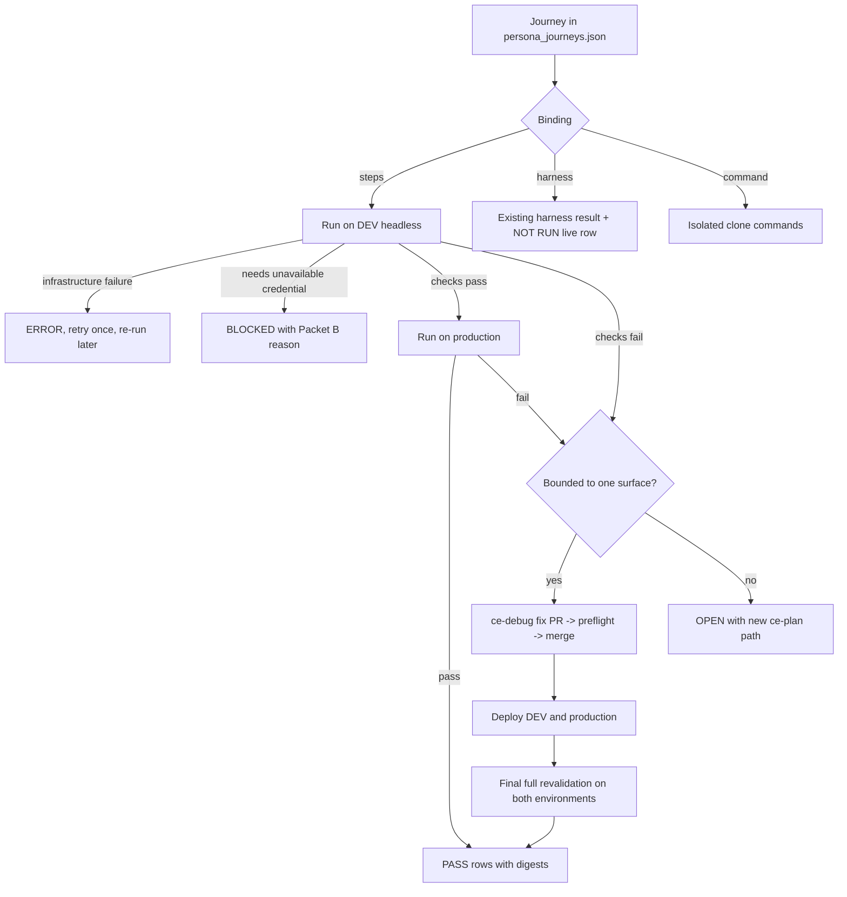
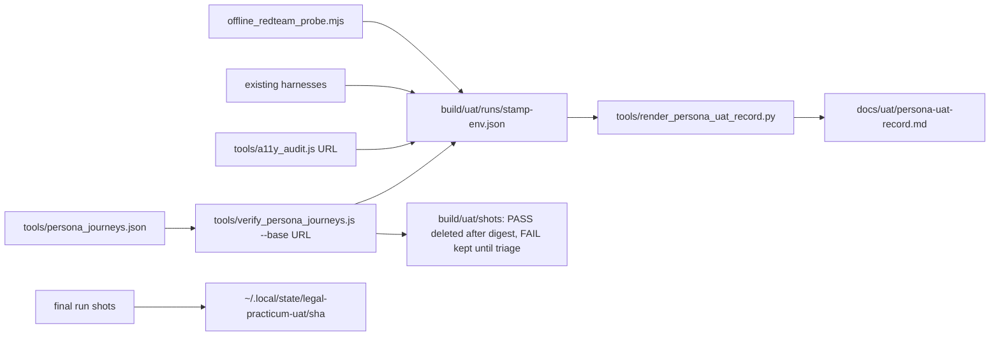

# Persona-Driven User Acceptance Testing - Plan

## Goal Capsule

**Objective.** For every kind of person the Legal Practicum serves, the program determines and records whether that person can complete each journey they came for on the live DEV and production surfaces: PASS with evidence, a bounded failure fixed and re-proved, a design-level failure recorded OPEN with a plan, or BLOCKED and NOT RUN with the named prerequisite.

**Means.** A persona catalog, user stories per persona, an executable UAT matrix run against DEV and production, `ce-debug` fixes for bounded failures, `ce-plan` documents for failures that need design, and shipment of every fix through the normal PR, preflight, merge, DEV, and production path.

**Product authority.** Damien's answers of September 2, 2026 in `docs/decisions/2026-09-02-resume-and-uat-decision-sheet.md`: all ten personas with student, author-editor, and prospective reader weighted first (Q4), and agent-operated production deployment of merged `main` during the pre-user stage (Q1). Packets A–F in `docs/decisions/2026-08-23-plan-closeout-decision-sheet.md` remain the authority for every human gate and are not reopened here.

**Open blockers.** None for planning. Journeys that need a Cloudflare Access identity, an OpenAI credit balance, or an Anthropic credential are recorded NOT RUN or BLOCKED with the packet that owns them; they do not block the program.

## Product Contract

### Summary

Write a persona catalog and user-story set for the Legal Practicum, turn the stories into an executable UAT matrix, run it against DEV and production, fix the bounded failures and ship them to production, and record design-level or missing-capability failures as OPEN plans. The record lives beside the existing editor and Publisher UAT matrix under `docs/uat/`.

### Problem Frame

The repository's verification is deep but developer-shaped: 21 preflight gates, 950 Python tests, an 89-assertion editor browser matrix, and a Publisher client contract. All of it asks whether the code does what the code intends. None of it asks whether a first-year student can find the Midstate packet, whether a dean reading the pitch on a phone reaches the proof, whether John's two-minute edit promise is visible from his side of the screen, or whether a professor self-hosting from the README gets a working interview simulator. The July demo runbook and the August editor matrix cover two journeys; the platform now has at least ten kinds of user and no record of what each one experiences. The site is pre-user, so this is the last cheap moment to find those gaps.

### Key Decisions

- **UAT runs DEV first, then production, for every public surface.** Production is a live target during the pre-user stage. The one exception is the live hostile-provider probe, which is DEV-only per R15. (session-settled: user-directed — chosen over DEV-only with production queued behind Packet C1: Damien's Q1 answer that the site has no users yet and may be pushed to production throughout this stage.) Governs R6, R14, R15.
- **Access-authenticated journeys run through the existing headless harnesses and their live human leg is NOT RUN.** No service token or bypass is introduced to impersonate a signer or Publisher. (session-settled: user-approved — chosen over provisioning an Access service token for automation: the August 23 sheet's finding that a service token cannot honestly substitute for the signer, and Damien's Q4 answer accepting NOT RUN rows.) Governs R8.
- **All ten personas are in scope; student, author-editor, and prospective reader are tier one.** (session-settled: user-approved.) Governs R1, R2.
- **A row is PASS only with a recorded artifact.** A screenshot digest, a command transcript, or a harness exit code; never an assertion from memory. This carries the existing matrix's rule that a skipped live step is NOT RUN, never pass. Governs R10.
- **The persona catalog, stories, and record live under `docs/uat/`.** They sit beside `docs/uat/editor-publisher-matrix.md` rather than in a new top-level directory, so one place answers "what has been proven for whom". Governs R3, R10.
- **UAT finds defects; it does not design features.** A journey that fails because the product lacks a capability becomes a proposal in Outstanding Questions or a new `ce-plan` document, not a feature built inside this program. Governs R12, R13.

<!-- ce-section: work-relationships -->
### How This Work Fits Together

This plan owns the persona UAT program. The September resume has three areas; the breakdown below is the current understanding, not a committed roadmap.

- **Resume and closeout of the July–August plans.** Complete: every handoff and CE plan is audited closed, and Damien confirmed on September 2 that no Packet A–F prerequisite changed. Enables this plan by freeing the trip for UAT. Its only remaining deliverable is a closeout handoff citing this plan's outcomes.
- **Repository hygiene.** Deleting merged branches, proving nine unmerged branches superseded, and removing their worktrees and stashes. Complete on September 2; its evidence is `docs/evidence/2026-09-02-branch-supersession-evidence.md`. Enables U8, which cites that evidence in the closeout handoff.
- **Pre-user production deployment.** The operator procedure that deploys merged `main` to Cloudflare Pages and the production Worker under Damien's Q1 answer. Enables R14. Resolved by KTD4: an operator runbook only, `docs/pre-user-prod-deploy.md`; no fenced repository tool is added.

### Actors

- A1. **Prospective reader.** A dean, faculty member, funder, or journalist who lands on `legalpracticum.org` from a link, usually on a phone, and decides in under a minute whether to keep reading. Wants the argument, then the proof on demand.
- A2. **Student.** A second- or third-year law student enrolled in a practicum. Works on a laptop, sometimes a phone, across a semester. Wants to find this week's matter, read the packet, interview the client, draft, get critique, log hours, and see the firm's books.
- A3. **Instructor.** Faculty running the course. Wants the rubrics, the instructor bundle, the assessment signer review at desktop and 390px, the calibration tool, and a way to explain a 4-of-7 to a student who reads it as a C.
- A4. **Author-editor (John).** Signs in through Access with an emailed code, edits paragraphs in place, expects them on the editing site within two minutes, and expects one-click undo. Comments are notes to Damien.
- A5. **Contributing editor (Roger).** Same door as John; suggestions carry the RSH attribution.
- A6. **Admin-Publisher (Damien).** Reviews, publishes, restores, operates the daemons and timers, and is the only actor who authorizes a production release once the site has users.
- A7. **Open-source adopter.** A professor or clinic technologist who clones the repository, follows the README quickstart, runs the Worker tests, and self-hosts with their own model key.
- A8. **School administrator or ABA reader.** Reads the competency-based-credit proposal and the cost-per-credit page to judge whether the credit model is defensible.
- A9. **Accessibility-dependent user.** Any of A1–A5 using a screen reader, keyboard only, a 390px viewport, or 200% zoom.
- A10. **Hostile actor.** Probes the chat, critique, and edit surfaces for prompt injection, persona-fact leaks, forged edits against locked identifiers, and bot-gate bypass.
- A11. **Orchestrating agent and Codex workers.** Write the catalog and stories, run the matrix, fix bounded failures, and ship. Damien performs no live step during this program.

### Requirements

**Persona catalog**

- R1. The catalog documents the ten personas A1–A10 with goals, context, device and assistive profile, entry points, and the surfaces each touches.
- R2. The catalog marks A1, A2, and A4 as tier one; every persona receives at least its core journeys, and tier one receives edge and failure journeys as well.

**User stories**

- R3. Each story is written as "As A<n>, I want <action> so that <outcome>", carries a stable ID `US-<n>-<k>`, names its entry surface, preconditions, and numbered acceptance checks, and names its DEV and production URL when it is a browser-surface story or its command, local target, and account boundary when it is an adopter story.
- R4. The story set covers every reachable public surface: the pitch and its proof expanders, the platform index, modules, skills browser, matter library and packets, downloads, firm dashboard, hours log, templates, client-interview chat in sample mode, memo critique, cost-per-credit, licenses and about pages, and the editor door's unauthenticated redirect.
- R5. The story set covers every documented adopter path in `README.md`: clone, local static serve, Worker unit tests, BYOK key entry, and self-hosted Worker deploy up to the point that needs an account.

**Execution**

- R6. Every runnable public-surface story runs against DEV and then production, and the record holds the current verdict per story, environment, and viewport for the latest tested build, with prior attempts kept as history; the live hostile-provider probe is the DEV-only exception stated in R15.
- R7. Browser journeys run headless through the repository's Puppeteer harness pattern at desktop, 390px, and 200% zoom where the story calls for it, with the Chrome DevTools tooling reserved for the orchestrator's manual review of failures; every screenshot is digested, interim PASS screenshots are discarded, and FAIL and final-run screenshots are retained outside the repository per KTD2.
- R8. Stories requiring an Access identity run through the existing headless harnesses, and their live human leg is recorded NOT RUN naming Packet A.
- R9. Live-provider stories use only credentials already in protected machine storage; Google runs, OpenAI and Anthropic are recorded BLOCKED with the reason from Packet B, and no credential value is ever printed or committed.
- R10. Results land in a UAT record under `docs/uat/` following the existing evidence-record convention: environment, build identifier, viewport, artifact digest, and a verdict of PASS, FAIL, OPEN, BLOCKED, NOT RUN, or ERROR, where FAIL is an intermediate verdict that F3 re-proves and ERROR marks a harness or infrastructure failure that is re-run rather than triaged as a defect.
- R11. The record includes an accessibility pass on every tier-one surface: keyboard-only navigation, focus visibility, 390px layout, 200% zoom, and the semantic audit the repository already provides.

**Defect handling**

- R12. Every FAIL whose cause is bounded to one surface and needs no product decision is fixed through `ce-debug` and shipped as its own PR.
- R13. A FAIL that needs design, spans surfaces, or reveals a missing capability produces a new `ce-plan` document and is recorded as OPEN with that document's path.
- R14. Every fix ships through a worktree branch, a PR, the full preflight, a merge to `main`, the automatic DEV deploy, and a production deploy, and the failed story is re-run to PASS on both environments before the record closes.

**Hostile persona**

- R15. The hostile journeys run the repository's offline red-team probe, the forged-edit and hostile-text canaries in the existing matrix, credential-free bot-gate checks on DEV and production proving that a missing or invalid Turnstile token and an invalid demo-bypass value are rejected, and the live red-team probe against the DEV Worker only, when a protected credential allows it.

### Key Flows

- F1. **Author the program.** **Trigger:** this plan is enriched and executed. **Steps:** write the catalog (R1, R2); derive stories per persona (R3–R5); assemble the matrix with one row per story per environment (R6, R10). **Outcome:** a matrix whose every row names the exact command or browser journey that proves it.
- F2. **Run a story.** **Trigger:** a matrix row. **Steps:** open the surface on DEV headless at the story's viewport (R7); perform the acceptance checks; digest the screenshot; record the verdict; repeat on production. **Outcome:** two verdicts with artifacts, or NOT RUN and BLOCKED rows with their named prerequisite (R8, R9).
- F3. **Fix and re-prove.** **Trigger:** a FAIL. **Steps:** classify bounded or design-level (R12, R13); for bounded, run `ce-debug`, ship the PR through preflight and merge (R14); deploy DEV and production; re-run the story on both. **Outcome:** the row moves to PASS with the PR linked, or to OPEN with a plan path.
- F4. **Close the program.** **Trigger:** every row has a verdict. **Steps:** write the summary section of the UAT record; list OPEN rows and their plans; hand the results to the closeout handoff. **Outcome:** Damien can read one document to learn what each persona can do today.

### Acceptance Examples

- AE1. **Covers R6, R10.** A student story "open the Midstate matter and download its packet" passes on DEV. It is then run on production. The record shows two PASS rows, each with the URL, build identifier, viewport, and screenshot digest.
- AE2. **Covers R8.** John's story "edit one sentence and see it on the editing site within two minutes" runs the editor harness, which reports 89 of 89 assertions passing. The live row is recorded NOT RUN, naming Packet A1, and is never recorded PASS.
- AE3. **Covers R12, R14.** A prospective-reader story fails because a proof expander does not open at 390px. The cause is one stylesheet rule. A `ce-debug` PR merges after preflight, DEV and production are deployed, and the story is re-run to PASS on both before the row closes.
- AE4. **Covers R9.** A student story "interview the client with my own OpenAI key" stops at its precondition because no OpenAI credit is available. The row is recorded BLOCKED with the Packet B reason, no provider request is made, and no key appears in the record.
- AE5. **Covers R13.** An instructor story "see why a student scored 4 of 7 on one heading" reveals that the student-facing view shows only the total. The row is recorded OPEN with the path of a new `ce-plan` document; no feature is built inside this program.
- AE6. **Covers R15.** The hostile story "make the client reveal a concealed fact through prompt injection" runs the offline probe; the Worker refuses every probe, and the row is PASS with the probe transcript digest.
- AE7. **Covers R11.** The pitch page is navigated keyboard-only at 200% zoom; every proof expander is reachable and focus is visible. The row is PASS with the audit output digest.

### Success Criteria

- Every matrix row carries a verdict; no row is blank or marked "pending".
- No row is PASS without an artifact reference.
- Every FAIL row links a merged PR or an OPEN plan path.
- Production serves the same build as `main` at the close of the program, proven by the release header or build identifier.
- Damien can name, from the record alone, what each of the ten personas can do today and what still waits on him.

### Scope Boundaries

- No Packet A–F human gate is performed or simulated: no Access sign-in, no credential test beyond the already-protected Google key, no Day Zero corpus mutation, no Publisher canary, no repository rename.
- No new product capability is built; missing capabilities become plans.
- No write reaches the Cockpit repository while `cockpit-freeze` is on.
- No credential is created, moved, rotated, or printed.
- The Publisher release lane is not enabled; the pre-user production deploy is an operator procedure outside the ledger and ends at the first real user.

### Dependencies and Assumptions

- DEV at `sonsteng-dev.damienriehl.com` and production at `legalpracticum.org` stay reachable; both answered HTTP 200 on September 2.
- The Chrome DevTools tooling runs headless on this machine; `docs/solutions/editor/2026-07-28-headful-harness-needs-xauthority.md` records the display constraint.
- Wrangler on this machine is authenticated to the project's Cloudflare account, which makes the Pages and production Worker deploy possible without a new credential.
- Codex workers are available for fan-out of story authoring and matrix execution.

### Outstanding Questions

**Resolve Before Planning**

- None.

**Deferred to Planning**

- How many stories each persona receives; the floor is the core journeys named in R2 and R4.
- Which existing harnesses map to which stories, so that a story reuses a harness rather than re-scripting it; `docs/research/2026-09-02-uat-harness-inventory.md` section 3 is the starting map.

### Sources

- `docs/uat/editor-publisher-matrix.md` — the evidence-record convention and the John and Damien journeys already written.
- `docs/demo-runbook-2026-07-18.md` — the keyless demo path and the direct-apply story.
- `docs/editor-guide-for-john.md` — John's promised experience, in his terms.
- `README.md` — the adopter quickstart and deployment table.
- `tools/preflight.sh`, `app/editor/verify-editor.js`, `tools/verify_publisher_client.mjs`, `tools/verify_platform_layout.js`, `tools/verify_catalog_client.js`, `tools/verify_chat_critique.js`, `tools/verify_cost_per_credit.js`, `tools/a11y_audit.js`, `tools/offline_redteam_probe.mjs`, `tools/platform_browser_matrix.json` — harnesses a story can reuse.
- `docs/research/2026-09-02-uat-harness-inventory.md` — harness inventory, surface map, persona-to-harness gaps, and DEV/production differences gathered for this plan.
- `docs/decisions/2026-09-02-resume-and-uat-decision-sheet.md` — the September 2 answers.
- `docs/decisions/2026-08-23-plan-closeout-decision-sheet.md` — Packets A–F.

---

## Planning Contract

**Product Contract preservation:** restructured, no scope change: R3 now scopes its URL fields to browser-surface stories and names adopter-story fields; R6 and the DEV-then-production Key Decision state the R15 DEV-only exception; R7 names the Puppeteer harness pattern as the automated path and the Chrome DevTools tooling as the manual review path; R10 adds the OPEN and ERROR verdicts; R15 adds credential-free bot-gate checks; AE4 stops before the provider call. No R-ID was split or moved.

### Key Technical Decisions

- KTD1. **Browser-runnable public-surface journeys are data; one headless runner executes them against any base URL.** `tools/persona_journeys.json` holds each journey as an ordered list of steps (`goto`, `click`, `focus`, `press`, `type`, `waitFor`, `expectDownload`, `assert`) with the story ID, persona, viewport set, and the story's acceptance-check indices each assertion proves. `tools/verify_persona_journeys.js` runs them with the repository's Puppeteer pattern against a `--base` of a local serve, DEV, or production. Harness-bound stories (KTD3) and adopter command stories (KTD6) are listed in the same file with a `harness` or `command` binding instead of steps, so one file is the coverage authority. Chosen over driving rows by hand through the Chrome DevTools tooling: the same story runs on DEV, on production, and again after a fix, and the runner later joins the preflight. Governs R6, R7.
- KTD2. **Runs write JSON; a renderer produces the record; evidence is retained, not just digested.** Each run writes `build/uat/runs/<utc-stamp>-<env>.json` (one attempt per story, environment, viewport). `tools/render_persona_uat_record.py` merges every run file into `docs/uat/persona-uat-record.md`: the current verdict per key for the latest tested build, an attempt-history section, and per-persona counts. Screenshots land under `build/uat/shots/<run>/`; PASS screenshots are deleted after digesting, FAIL and ERROR screenshots stay until the row is triaged, and the final revalidation run's screenshots are copied to `~/.local/state/legal-practicum-uat/<sha>/` with a 90-day retention note, their paths and SHA-256 digests recorded in the record. Parallel units never write the Markdown file directly. Instantiates the "PASS only with a recorded artifact" Key Decision. Governs R10.
- KTD3. **Access-authenticated stories bind to existing harnesses, plus one read-only Access-policy audit.** John, Roger, Damien-Publisher, and instructor-signer stories cite `app/editor/verify-editor.js`, `tools/verify_publisher_client.mjs`, `app/worker/test/editor-publisher-*.test.js`, `app/worker/test/editor-roger.test.js`, and the assessment tests as their proof, and the record carries a NOT RUN live row naming Packet A. One additional row reads the deployed Cloudflare Access application through the API and records only the application audience match, the allow-policy count, the count of email selectors and a hash of their sorted list, and the absence of bypass or service-token policies; it is BLOCKED if read permission is unavailable. No service token, bypass token, or Access change is introduced. Instantiates the NOT RUN Key Decision. Governs R8.
- KTD4. **Pre-user production deploy is an operator runbook, not a repository script.** `docs/pre-user-prod-deploy.md` records the Worker-then-Pages procedure mirroring `tools/prod_release_executor.py`'s adapters, and `docs/uat/pre-user-prod-deploys.md` records each deploy. `deploy/deploy-prod.sh` stays a disabled tripwire and `tools/tests/test_publication_boundary.py` stays green. (session-settled: user-directed — chosen over queuing production behind Publisher Packet C1: Damien's September 2 answer that the site is pre-user and may be pushed to production throughout this stage.) Governs R14.
- KTD5. **Authoring fans out to Codex workers; live runs and deploys stay with the orchestrator.** Persona catalog, stories, runner, renderer, and journey data are worker units. Running against live hosts, reading protected credentials, calling the Cloudflare API, and deploying are credentialed actions the orchestrator performs. Governs R1–R5, R14.
- KTD6. **The adopter journey runs in a disposable, isolated clone pinned to the reviewed commit.** Clone from GitHub into a temporary directory, verify the checkout equals the reviewed `origin/main` SHA, and run the static serve, Worker unit tests, and `wrangler deploy --dry-run` under a scrubbed environment (`env -i` with a temporary `HOME` and a minimal `PATH`) so Wrangler's OAuth state, provider credentials, and bypass tokens are unreachable; anything needing an account or a paid key is recorded BLOCKED with the reason. Governs R5, R9.
- KTD7. **Live provider stories use the Google path already proven on August 23, on DEV only.** The credential is read only through `app/worker/test/live-stream-smoke.mjs`'s documented environment, which rejects the production Worker by design; production live-chat rows are NOT RUN with that reason. OpenAI and Anthropic rows carry the Packet B reason. Governs R9.
- KTD8. **Every persona's journey set carries one deliberate failing canary.** A journey with a knowingly absent selector must report FAIL on every run, so a green matrix proves the checks can fail (`docs/solutions/editor/2026-07-28-checks-that-cannot-fail.md`). The canary row is excluded from persona verdict counts. Governs R10.
- KTD9. **200% zoom is a 640×450 CSS-pixel viewport at device scale factor 2.** Browser zoom at 200% in a 1280-pixel window yields exactly that CSS viewport and pixel density, so this reproduces the reflow condition WCAG 1.4.10 tests; CSS `zoom` and device scale alone are not accepted. Governs R11.
- KTD10. **Screen-reader acceptance is proven from the accessibility tree.** Tier-one interactive journeys assert name, role, value, and state of each control, document reading order, error-message association, and live-region announcements through Puppeteer's accessibility snapshot; the live assistive-technology usability leg is recorded NOT RUN naming a human tester as its prerequisite. Governs R11.
- KTD11. **Build provenance per row comes from the served build stamp and the release header.** The runner fetches `<base>/platform/data/.build-stamp.json` once per run and reads the `x-release-sha` header when present, and records both on every row, including root pages that carry no `spine-build` meta. Governs R10.
- KTD12. **Infrastructure failures are ERROR, retried once, and never triaged as defects.** DNS, TLS, navigation timeout, browser crash, or record-write failure marks the attempt ERROR; the runner retries that journey once in the same run, and an ERROR that survives is re-run in a later run rather than entering U6. Governs R10, R12.

### High-Level Technical Design

The journey lifecycle has five decision points and a fix loop, so one flowchart carries it.

Runner and record data flow:

### Assumptions

- The story set lands between forty and seventy stories; every persona has at least three, tier-one personas at least eight.
- Headless Puppeteer runs on this machine without a display, as the existing preflight browser gates already do; the Chrome DevTools tooling was also proven headless against DEV on September 2.
- The Google credential used on August 23 is still in protected machine storage; if the smoke tooling cannot find it, the live-provider rows are BLOCKED, not FAIL.
- Live browser chat against production cannot be automated: the Worker's Turnstile gate has no automation bypass on production and the smoke tooling refuses the production host. Those rows are NOT RUN with that reason, never FAIL.
- The editor harness runs well over ten minutes; U5 budgets 1800 seconds for it.
- The apply daemon deploys DEV only when it applies an edit; after a fix merges, the orchestrator runs `deploy/deploy-dev.sh` explicitly.
- Codex workers can run headless Puppeteer locally while authoring the runner; they never hit production.

### Sequencing

U1 and U2's runner scaffolding start in parallel. `tools/persona_journeys.json` and U2's contract test are finalized only after U1's story IDs are final. U3, U4, and U5 depend on U2 and run in parallel; each writes its own run files. U6 depends on any FAIL from U3–U5. U7 depends on U6 and ends with the full revalidation run. U8 depends on U7 and on the hygiene evidence already committed.

### Scope Boundaries

#### Deferred to Follow-Up Work

- Wiring `tools/verify_persona_journeys.js` into `tools/preflight.sh` as a standing gate against the local build; this program proves the runner first.
- Pages clean-URL redirects: production answers `308` for `…/index.html` links while DEV serves them directly. Recorded as FYI; changing link forms is a separate change.
- Any missing capability a story reveals becomes its own `ce-plan` document (R13).

---

## Implementation Units

### U1. Persona catalog and user stories

**Goal:** the ten personas and their stories exist as durable documents a planner or tester can read cold, with one entry-to-exit flow per persona and a state-coverage table for interactive surfaces.

**Requirements:** R1, R2, R3, R4, R5; A1–A10.

**Dependencies:** none.

**Files:** `docs/uat/personas.md` (create), `docs/uat/user-stories.md` (create).

**Approach:**
1. Write one section per persona: goals, context, device and assistive profile, entry points, surfaces touched, tier.
2. Derive stories per persona in the R3 form with IDs `US-<n>-<k>`; each names the entry surface, preconditions, and numbered acceptance checks phrased as observable page facts, plus its DEV and production URL for browser-surface stories or its command, local target, and account boundary for adopter stories.
3. Give every persona at least one end-to-end flow story that starts at its real entry surface (the pitch for A1, the platform home for A2, the README for A7) and reaches its outcome by navigation, with two edge branches and an exit condition; direct-URL stories cover the remaining surfaces.
4. Add a state-coverage table for the tier-one interactive surfaces (proof expanders, sample-mode interview, critique, downloads, hours log, firm dashboard): for each, the loading, empty, validation-error, provider-error, partial, success, and recovery states that apply, the trigger, the expected user-facing content, and the story ID that proves it, with unreachable states marked BLOCKED or NOT RUN and their prerequisite.
5. Cover every surface in R4 and every README path in R5; end `docs/uat/user-stories.md` with a coverage table mapping each surface to its story IDs.
6. Mark stories that need an Access identity or an unavailable credential so U2 can bind them (per R8, R9).

**Patterns to follow:** the journey prose in `docs/uat/editor-publisher-matrix.md`; the keyless demo path in `docs/demo-runbook-2026-07-18.md`; John's vocabulary in `docs/editor-guide-for-john.md`; the persona-to-harness gaps in `docs/research/2026-09-02-uat-harness-inventory.md`.

**Test scenarios:**
- Every surface named in R4 appears in the coverage table with at least one story ID.
- Every README quickstart step appears as a story for A7 with a command and account boundary.
- Each tier-one persona has at least eight stories, including at least one edge journey and at least one failure journey.
- Every persona has exactly one or more entry-to-exit flow stories with an entry surface that is not the destination.
- Every tier-one interactive surface appears in the state-coverage table with each applicable state mapped to a story ID or a named prerequisite.
- No story references a credential value, a one-time code, or private authored content.

**Verification:** a reviewer can pick any persona and find its stories, flows, URLs, checks, and states without opening code.

### U2. Journey runner, run store, and record renderer

**Goal:** browser-runnable stories execute unattended against any base URL through ordered steps, every attempt lands in a run file, and one renderer produces the record with current verdicts and history.

**Requirements:** R6, R7, R10, R11; KTD1, KTD2, KTD8, KTD9, KTD10, KTD11, KTD12.

**Dependencies:** runner scaffolding starts alongside U1; journey data and the contract test are finalized after U1.

**Files:** `tools/persona_journeys.json` (create), `tools/verify_persona_journeys.js` (create), `tools/render_persona_uat_record.py` (create), `tools/tests/test_persona_journeys_contract.py` (create), `tools/tests/test_render_persona_uat_record.py` (create), `docs/uat/persona-uat-record.md` (create, rendered), `.gitignore` (add `build/uat/`).

**Approach:**
1. Journey schema: `id`, `story`, `persona`, `viewports` (`desktop` 1280×900, `phone` 390×844, `zoom200` per KTD9), and either `steps` or a `harness` or `command` binding. Steps are ordered: `goto` (path), `click`/`focus`/`press`/`type` (selector or accessible name), `waitFor` (text, selector, or URL), `expectDownload` (filename pattern), and `assert` (selector present, text present, attribute value, URL, console clean, focus on a named control, accessibility-tree name/role/state, reading order, live-region text). Each `assert` names the story acceptance-check index it proves.
2. The runner accepts `--base`, `--only`, `--env-label`, and `--run-dir`; launches headless Chromium the way `tools/verify_platform_layout.js` does; fetches the build stamp and release header once per run (KTD11); runs each journey per viewport; classifies infrastructure failures as ERROR with one retry (KTD12); digests screenshots and disposes of them per KTD2; and writes one run file per invocation.
3. The renderer reads every run file, keeps the latest attempt per story, environment, and viewport for the latest build, writes the record with a current-verdict table, per-persona counts, an attempt-history section, and the retained-screenshot paths and digests, and exits non-zero if any story in `docs/uat/user-stories.md` lacks a journey or binding.
4. The contract test asserts two-way coverage: every journey ID maps to a story and every story ID maps to a journey or binding; every journey's assertion check indices exist on its story; paths exist under `site/`; no duplicate IDs; the KTD8 canary is present per persona.

**Execution note:** prove the runner against a local `python3 -m http.server` serve of `site/` first, then DEV; production runs are the orchestrator's. Reuse the Puppeteer launch and screenshot handling in `tools/shot.js` and `tools/verify_platform_layout.js` rather than re-deriving them.

**Patterns to follow:** `tools/verify_platform_layout.js` and `tools/platform_browser_matrix.json` for viewport handling and headless launch; `tools/a11y_audit.js` for audit output shape; `tools/todo_report.py` for a small Markdown renderer with a parser test.

**Test scenarios:**
- Runner against the local serve with three known-good journeys writes one run file with PASS attempts and non-empty digests, and no screenshot remains under `build/uat/shots/` for them.
- A journey whose selector is absent yields a FAIL attempt naming that assertion and its story check index, its screenshot is retained, and the exit code is non-zero.
- A `--base` that returns `404` for a path yields FAIL, not a crash; an unreachable host yields ERROR after one retry, not FAIL.
- A `click` step on a proof expander followed by `assert` on its revealed text passes only when the expander opened.
- An `expectDownload` step records the downloaded filename and size without committing the file.
- The `zoom200` viewport launches at 640×450 CSS pixels with device scale factor 2 and produces a distinct digest from `desktop`.
- An accessibility-tree assertion fails when a control lacks an accessible name.
- The renderer shows the latest attempt as current when a run file with FAIL is followed by a run file with PASS for the same key and build, and lists both in history.
- The renderer exits non-zero when a story has no journey or binding.
- Contract test fails when a journey's assertion cites a check index the story does not have.
- Covers AE7. Keyboard-only steps reach every proof expander on the pitch page.
- The deliberate failing canary journey (KTD8) reports FAIL on every run and is excluded from persona counts.

**Verification:** `node tools/verify_persona_journeys.js --base http://localhost:<port> --only <three ids>` passes; both Python tests pass; the rendered record lists every story.

### U3. Tier-one public journeys on DEV and production

**Goal:** student and prospective-reader stories have current verdicts on both environments.

**Requirements:** R6, R7, R10, R11; F2; AE1, AE7.

**Dependencies:** U2.

**Files:** `build/uat/runs/` (run files, gitignored), `docs/uat/persona-uat-record.md` (rendered).

**Approach:**
1. Run the runner against DEV for all A1 and A2 journeys, then against production. A1 journeys include the nine proof expanders, the expand-all control, top navigation, the hero call to action, and the cost-page links; A2 journeys include home to module to matter to facts and law to download, the firm ledger, hours log entry and export, templates, and the sample-mode interview's play, pause, skip, and export controls, each executed from its entry surface.
2. Run `tools/a11y_audit.js` with explicit URL arguments against the DEV and production pitch, platform home, matter library, one packet, hours, and cost pages, since the default list omits the pitch and hours; import results into a run file.
3. Review each FAIL screenshot through the Chrome DevTools tooling before classifying it, so a flaky selector is not recorded as a product defect; an ERROR is re-run, never triaged.
4. Record the Pages clean-URL `308` behavior as FYI, not FAIL.

**Test scenarios:**
- Covers AE1. The Midstate matter story shows PASS on DEV and on production with URL, build identifier, viewport, and digest.
- Every A1 and A2 journey has a current verdict for both environments.
- A journey failing only on production is re-run once before it is recorded FAIL.

**Verification:** no A1 or A2 row is blank; every FAIL row names its first failing assertion.

### U4. Remaining personas: instructor, adopter, school reader, accessibility, hostile

**Goal:** A3, A7, A8, A9, and A10 stories have verdicts.

**Requirements:** R5, R6, R7, R8, R9, R10, R11, R15; AE4, AE6; KTD6, KTD7.

**Dependencies:** U2.

**Files:** `build/uat/runs/` (run files), `docs/uat/persona-uat-record.md` (rendered).

**Approach:**
1. Instructor: run the browser journeys for rubrics, templates, and the instructor bundle build; the signer-review story binds to the assessment tests and is NOT RUN live (per R8).
2. Adopter: disposable isolated clone per KTD6; `node --test test/*.test.js` in `app/worker`; `wrangler deploy --dry-run`; record BLOCKED at the account boundary.
3. School reader: browser journeys for `docs/proposals/competency-based-credit.md` as rendered on GitHub and `site/cost-per-credit.html` on both environments, plus `tools/verify_cost_per_credit.js`.
4. Accessibility: keyboard-only, `zoom200`, and accessibility-tree journeys from the runner plus `tools/a11y_audit.js` on every tier-one surface; the live assistive-technology leg is NOT RUN per KTD10.
5. Hostile: `node tools/offline_redteam_probe.mjs`; the forged-edit and hostile-text canaries from the existing matrix through the Worker tests; credential-free bot-gate checks on DEV and production (session mint without a token, with an invalid token, and with an invalid bypass value each answer `403` and mint nothing); and the live red-team against the DEV Worker only if the Google credential resolves (KTD7).

**Test scenarios:**
- Covers AE4. The OpenAI BYOK story records BLOCKED with the Packet B reason, makes no provider request, and holds no key material.
- Covers AE6. The offline probe reports 0/8 leaks and the row is PASS with the transcript digest.
- The adopter clone's Worker tests pass in the isolated directory, and the clone's `HOME` holds no Wrangler configuration.
- The cost-per-credit story passes on DEV and production.
- A session-mint request without a Turnstile token answers `403` on DEV and on production.

**Verification:** every A3, A7, A8, A9, A10 story has a verdict; BLOCKED and NOT RUN rows name their prerequisite.

### U5. Editor and Publisher personas through existing harnesses

**Goal:** John, Roger, and Damien-Publisher stories have harness verdicts, one read-only Access-policy audit row, and honest NOT RUN live rows.

**Requirements:** R8, R10; AE2; KTD3.

**Dependencies:** U2.

**Files:** `build/uat/runs/` (run files), `docs/uat/persona-uat-record.md` (rendered).

**Approach:**
1. Run `EDITOR_HEADLESS=1 HEADLESS=1 node app/editor/verify-editor.js` with an 1800-second budget, `node tools/verify_publisher_client.mjs`, and the `editor-publisher-*`, `editor-roger`, and `editor-access-door` Worker tests; bind each story to the assertions that prove it.
2. Verify the unauthenticated door: `edit.legalpracticum.org` redirects to Access; the workers.dev fallback serves no editor without a token.
3. Read the deployed Access application through the Cloudflare API and record the KTD3 audit row with counts and a hash only; BLOCKED if the token lacks read permission.
4. Record every live leg NOT RUN naming Packet A1 or A2.

**Test scenarios:**
- Covers AE2. John's two-minute edit story shows the editor harness count and a NOT RUN live row naming Packet A1.
- Roger's RSH attribution story binds to the Worker test that asserts the label.
- The Publisher review story binds to the publisher client contract and the review Worker tests.
- The Access audit row contains no email address and matches the expected audience.

**Verification:** no editor or Publisher row claims PASS for a live authenticated action.

### U6. Triage and fix bounded failures

**Goal:** every FAIL row has either a merged bounded fix or an OPEN plan path.

**Requirements:** R12, R13; F3; AE3, AE5.

**Dependencies:** any FAIL from U3, U4, U5.

**Files:** determined per defect; each fix carries its own test under `tools/tests/` or `app/worker/test/`; `docs/uat/persona-uat-record.md` (rendered with the PR number or plan path).

**Approach:**
1. Classify each FAIL: bounded (one surface, no product decision) or design-level; an ERROR is never classified here.
2. Bounded: run `ce-debug` in a fresh worktree branch, ship a PR with a regression test, merge after full preflight.
3. Design-level or missing capability: write a `ce-plan` document under `docs/plans/` and set the row to OPEN with its path.
4. Annotate the row with the PR number or plan path; re-proof belongs to U7.

**Test scenarios:**
- Covers AE3. A stylesheet-only failure ships as one PR with a regression test and merges after preflight.
- Covers AE5. A missing-capability failure produces a plan document and an OPEN row; no feature is built.
- A FAIL caused by a flaky assertion is fixed in the runner or journey data, not recorded as a product defect.

**Verification:** every FAIL row carries a merged PR number or an OPEN plan path.

### U7. Deploy, re-prove, and run the final full revalidation

**Goal:** DEV and production serve the fixed `main`, every fixed story passes on both, and the whole matrix has a current verdict at the final build.

**Requirements:** R6, R14; KTD4, KTD11.

**Dependencies:** U6.

**Files:** `docs/uat/pre-user-prod-deploys.md` (append), `build/uat/runs/` (run files), `docs/uat/persona-uat-record.md` (rendered).

**Approach:**
1. After each merge batch, run `deploy/deploy-dev.sh origin/main`, then follow `docs/pre-user-prod-deploy.md`.
2. Re-run the previously failed journeys with `--only` on DEV, then production, and confirm they pass.
3. After the last merge and deploy, run every journey, harness, and audit once more on DEV and production at the final SHA; the record's current verdicts come only from that run.
4. Copy the final run's screenshots to the retention location per KTD2 and append the deploy record block.

**Test scenarios:**
- Production provenance header equals `origin/main` after the deploy.
- Each previously failed story shows PASS on both environments with new digests.
- No row remains FAIL after the final run; any ERROR is re-run until it resolves.
- Every current verdict in the record carries the final build identifier.

**Verification:** the last deploy record's SHA equals `origin/main`, and the record's build identifier equals it.

### U8. Close the program

**Goal:** Damien can read one document and know what each persona can do today.

**Requirements:** F4; Success Criteria.

**Dependencies:** U7; `docs/evidence/2026-09-02-branch-supersession-evidence.md` (already committed).

**Files:** `docs/uat/persona-uat-record.md` (rendered summary section), `docs/handoffs/2026-09-0X-persona-uat-closeout.md` (create).

**Approach:**
1. Render the per-persona summary table: stories, PASS, OPEN, BLOCKED, NOT RUN, fixes merged, with the human prerequisite for each NOT RUN and BLOCKED group.
2. Write the closeout handoff: outcomes, PRs merged, production deploys, OPEN plans, and the branch-cleanup evidence.

**Test expectation: none -- documentation only.**

**Verification:** every Success Criterion in the Product Contract can be checked from the record alone.

---

## Verification Contract

| Gate | Command | Proves |
|---|---|---|
| Full preflight | `bash tools/preflight.sh` | every existing gate on any PR before merge (21 gates) |
| Python tests | `python3 -m pytest tools/tests/ -q` | journey contract, renderer, and regressions from fixes |
| Worker tests | `cd app/worker && node --test test/*.test.js` | editor, Publisher, assessment, language-contract canaries |
| Journey runner (local) | `node tools/verify_persona_journeys.js --base http://localhost:<port> --env-label local` | runner correctness before live runs |
| Journey runner (live) | `node tools/verify_persona_journeys.js --base https://sonsteng-dev.damienriehl.com --env-label dev` then `--base https://legalpracticum.org --env-label prod` | R6 verdicts per environment |
| Record renderer | `python3 tools/render_persona_uat_record.py` | R10 record with current verdicts and history; non-zero on an orphaned story |
| Accessibility | `node tools/a11y_audit.js <url>` | R11 on tier-one surfaces |
| Hostile | `node tools/offline_redteam_probe.mjs` | R15 offline leg |
| Publication boundary | `python3 -m pytest tools/tests/test_publication_boundary.py tools/tests/test_prod_release_operations.py -q` | KTD4 leaves the boundary intact |

## Definition of Done

- Every story in `docs/uat/user-stories.md` has a current verdict in `docs/uat/persona-uat-record.md` per applicable environment and viewport at the final build: PASS, OPEN, BLOCKED, or NOT RUN, with a digest or artifact reference for every PASS.
- No FAIL or ERROR row remains; every OPEN row names a plan path; every BLOCKED or NOT RUN row names its prerequisite.
- Every fix merged through a PR that passed the full preflight; `main` deployed to DEV and production; the last deploy record's SHA equals `origin/main`; the final full revalidation run happened at that SHA.
- No credential value, one-time code, roster data, email selector, or private authored content appears in any committed file.
- Abandoned experiments, temporary journeys, and scratch files are removed; `build/uat/` is gitignored and holds no committed content.
- Per unit: U1 coverage, flow, and state tables complete; U2 runner, renderer, and both tests pass locally; U3–U5 rows current; U6 every FAIL annotated; U7 deploy record appended and final run rendered; U8 summary and handoff written.
